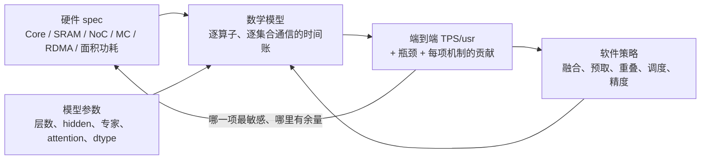
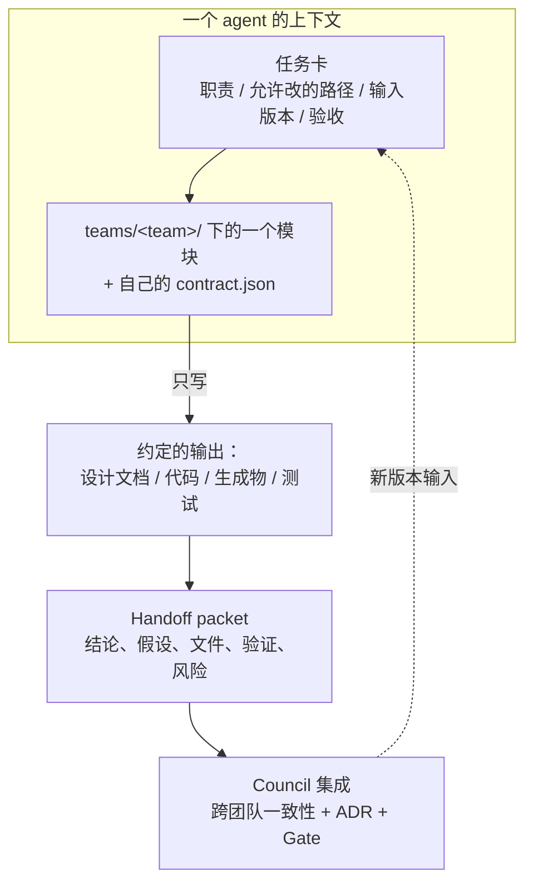
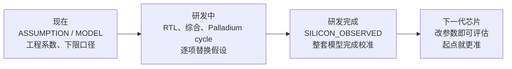

# K3 / GLM-5.2 / DeepSeek-V4-Pro 推理芯片架构模型

用一个可执行的数学模型把芯片架构与模型性能连起来：硬件 spec、软件优化策略和模型参数都是输入，端到端 TPS/usr 是算出来的结果。

> 当前目标：K3、GLM-5.2、DeepSeek-V4-Pro 的 Decode 推理，B=1、Context=1M、TP32、PP=1，目标 `1000 TPS/usr`，
> 架构冻结门槛 `1050 TPS/usr`。当前数字是 `MODEL` 等级，不是产品承诺。

## 为什么这样做

以往的芯片架构设计，常常是一群人凭经验和感觉拍板：

- 细节覆盖不全；
- 说不清哪些细节真正影响最终效果；
- 经验本身也可能把人带偏；
- 讨论容易变成观点之争，而不是看数字。

本仓库换一种做法：**架构决策由模型算出来，不靠争论。**

- 硬件在 spec 里展开各种架构参数与单元设计；
- 软件把每一项优化策略写成可开关、可回退的机制；
- 模型层集成这些参数，按模型结构逐算子计算端到端性能。

只要模型足够细、足够准，架构与性能就是连通的：**动了架构 spec，最终的 TPS/usr 就会变**，而且能追溯到是哪一项、变了多少。



当前发布点（K3，P1/MC640/TP32）的时间账（详见 [`21_TPS_DESIGN_BASELINE.md`](docs/architecture/21_TPS_DESIGN_BASELINE.md)）：

```text
raw = compute − tmaHidden + comm + wait − overlap
    = 434.62 − 106.91 + 451.95 + 22.35 − 26.27 = 775.75 µs
TPS/usr = 1e6 / (raw × 1.17) = 1101.77
```

每一项都能追溯到具体的硬件参数或软件开关。例如集合通信的单次成本 τ 从 1.15 µs 升到约 1.35 µs，
TPS/usr 就跌破 1000，所以 τ 的物理推导被列为阻塞项（B-008）。

## 多 agent 协作：每个 agent 只装自己那一块

这套东西的规模，单个人或单个 agent 的上下文是装不下的：硬件有 Core、SRAM、NoC、MC、封装，软件有编译器、
kernel、融合、调度，模型有结构、dtype、路由和场景，全塞进一个上下文只会得到似是而非的结论。

所以仓库的组织方式，就是**给每个 agent 切出一个上下文足够小的角色**：

- 一个 agent 只负责一个团队目录里的一块，只读它的任务卡和自己的目录；
- 跨团队只通过 `contract.json`、`out/` 里的生成物、ADR 和测试交互，不通过聊天传数字；
- 需要什么，按字段路径去取（例如 `k3_mc_baseline.json#computeDieCandidate`），而不是把大段上下文搬过来。

上下文边界不是靠自觉，是靠仓库结构强制的：



| 机制 | 怎么缩小上下文 |
|---|---|
| **目录即边界** | `teams/<team>/` 不 require 其他团队、`integration/` 或 `out/`，由 `tests/structure/test_project_structure.js` 强制。一个 agent 不需要读别人的目录就能完成自己的活。 |
| **contract 即接口** | 团队的对外承诺写在 `teams/<team>/contract.json`，由脚本合成到 `out/contracts/`。跨团队只读这几个文件，不读对方的全部设计。 |
| **任务卡** | 每个任务从任务卡开始，写明 Agent ID、职责、允许与禁止修改的路径、输入版本（含 baseline commit 和 schema 版本）、要求的输出、验收标准和 handoff 格式。模板见 [`AGENT_WORKSTREAM_PLAN.md`](teams/council/docs/AGENT_WORKSTREAM_PLAN.md) 第 6 节和 [`DETAIL_AGENT_TASK_CARD.md`](teams/council/docs/detailed/DETAIL_AGENT_TASK_CARD.md)。 |
| **只消费已发布版本** | agent 不读别人未提交的工作区，只读已版本化的 JSON / Markdown / 报告 / ADR，所以输入是可复现的、长度也是可控的。 |
| **Handoff packet** | 交接用一页 packet（范围、结论、假设、文件、验证、风险、下一步），下游读 packet，不读上游的完整上下文。 |
| **数字只有单一来源** | 硬件规格在 `k3_mc_baseline.json`，发布点在 `out/rdma/k3_rdma_final_tuning_results.json`，软件开关在 `OPT`，经验因子在 `GAIN`。引用字段路径即可，不必把数字抄进上下文。 |
| **Gate 由独立校验器算** | D-Gate / Q-Gate 由 `integration/governance/evaluate_gates.js` 从生成物计算，任何 runner 不得写 `PASS` 字面量。判断逻辑不在 agent 的上下文里。 |
| **测试按组跑** | `npm test` 支持 `unit` / `regression` / `governance` / `structure` 分组，改哪一块就跑哪一组，反馈快且聚焦。 |
| **文档即索引** | 顶层 `README`、各团队 `README`、`docs/architecture/README.md` 和 ADR 索引给出入口，agent 按索引找入口，不需要遍历仓库。 |

先由架构 owner 搭出一个能跑通的整体，然后每个 agent 进入一个角色，从自己的位置理解并深化自己那一块：

| 角色 | 目录 | 只负责这一块 |
|---|---|---|
| 硬件 | [`teams/hardware/`](teams/hardware/README.md) | 唯一硬件规格 P1、单元设计文档（Core、SRAM、NoC、MC、集合通信/RDMA、PPA） |
| 软件 | [`teams/software/`](teams/software/README.md) | 编译器、runtime、kernel、融合、集合通信调度、精度策略 |
| 模型 | [`teams/model/`](teams/model/README.md) | 模型形状与 manifest、workload 推导、三个模型的部署方案 |
| 架构委员会 | [`teams/council/`](teams/council/README.md) | ADR、跨团队集成、Gate 判定 |
| 独立验证 | [`teams/vv/`](teams/vv/README.md) | 验证计划；测试放在 [`tests/`](tests/) |

内容可以由 AI 生成，但要由对应角色的人审查，确保没有幻觉、设计是对的、能和落地对齐。
为此仓库有几条硬规则：

先由架构 owner 搭出一个能跑通的整体，然后每个人进入一个角色，从自己的位置理解并深化自己那一块：

| 角色 | 目录 | 负责什么 |
|---|---|---|
| 硬件 | [`teams/hardware/`](teams/hardware/README.md) | 唯一硬件规格 P1、单元设计文档（Core、SRAM、NoC、MC、集合通信/RDMA、PPA） |
| 软件 | [`teams/software/`](teams/software/README.md) | 编译器、runtime、kernel、融合、集合通信调度、精度策略 |
| 模型 | [`teams/model/`](teams/model/README.md) | 模型形状与 manifest、workload 推导、三个模型的部署方案 |
| 架构委员会 | [`teams/council/`](teams/council/README.md) | ADR、跨团队集成、Gate 判定 |
| 独立验证 | [`teams/vv/`](teams/vv/README.md) | 验证计划；测试放在 [`tests/`](tests/) |

内容可以由 AI 生成，但要由对应角色的人审查，确保没有幻觉、设计是对的、能和落地对齐。
为此仓库有几条硬规则：

- **每个数字都有来源和证据等级**（`ASSUMPTION`、`MODEL`、`PLANNING_ESTIMATE`、`MODEL_OBSERVED`、`SILICON_OBSERVED` 等，
  定义见 [`14_TPS_OBSERVATION_METRICS.md`](docs/architecture/14_TPS_OBSERVATION_METRICS.md)）；
- **单一来源**：硬件规格只在 [`k3_mc_baseline.json`](teams/hardware/inputs/k3_mc_baseline.json)，文档只引用，不另行定义数值；
- **生成物不手改**：`out/` 下的文件全部由脚本重算，测试用 sha256 把它们绑定到输入；
- **一致性由测试强制**：spec、搜索结果、规划模型、contract 和看板不一致时 `npm test` 失败；
- **不许靠口径变化宣称收益**：经验因子 `GAIN` 全部为 1，任何折扣都必须有事件/资源模型或实测证据；
- **改规格要走 ADR**：见 [`teams/council/adr/`](teams/council/adr/README.md)。

## 模型会随研发一起变准



真正进入芯片研发后，各团队做的事就是把这里的细节落实，同时不断丰富和校准这个模型：

- **拿到 Palladium 的真实 cycle 数**：直接填入对应算子与机制，替换当前的假设值。
  需要回标的项在 [`21_TPS_DESIGN_BASELINE.md`](docs/architecture/21_TPS_DESIGN_BASELINE.md) 第 7 节逐条列出，例如：
  - launch 缩放 0.45、专家预测命中率 0.8（B-003）；
  - τ = 1.15 µs（B-008）；
  - 面积、功耗、工艺折算系数（B-006）。
- **拿到综合、布局布线与 PHY 数据**：回标 [`k3_physical_basis.js`](integration/detailed/k3_physical_basis.js) 中的面积、功耗系数。
- **研发完成时**：整套模型已经对着实测校准得很精确。
- **做下一代芯片时**：改几个参数就能得到可信的性能预测，而且比这一代起点更准。

## 当前状态

| 项目 | 值 | 等级 |
|---|---|---|
| 硬件规格 | P1：8 L + 4 H Core/Die、40 MiB SRAM、1.0 GHz、373.71 mm²；8 Die + 16 MC/卡（ADR-0021） | `MODEL` |
| K3 发布点 | 1101.77 TPS/usr（MC640/TP32）；MC320 下 586.46 | `MODEL` |
| 三模型规划（TP32/MC640） | K3 1102.4、DeepSeek-V4-Pro 2299.3、GLM-5.2 2416.8 | `PLANNING_ESTIMATE` |
| D-Gate / Q-Gate | PASS（仅限规划比较）/ 阻塞（无事件时序回放） | — |

主要阻塞项：MC 带宽档位未选定（B-002）、τ 无物理推导（B-008）、卡内与 TP32 拓扑未签核（B-004、B-005）、
调度假设未经 trace 回标（B-003）、模型结构未经提供方签核（B-001）。全部见 [`OPEN_ISSUES.md`](docs/architecture/OPEN_ISSUES.md)。
汇总见 [`00_CURRENT_STATE.md`](docs/architecture/00_CURRENT_STATE.md)。

## 快速开始

需要 Node.js 18 或更高版本，没有第三方依赖。

```sh
npm test                 # 全部测试
npm run search:final     # Final Tuning 搜索，得到发布点（约 1 分钟）
npm run baseline:sync    # 把发布点写回硬件规格
npm run model:planning   # 三模型规划 token 时间、Stage A/B、contract、看板
```

改动硬件参数、软件开关或物理系数后，按顺序运行上面三个生成命令，再运行 `npm test`。各入口说明见 [`integration/pipelines/README.md`](integration/pipelines/README.md)。

## 目录

```text
teams/          各团队拥有的输入、代码、文档和对外 contract（model / hardware / software / council / vv）
integration/    跨团队代码：详细模型与搜索（detailed/）、规划模型（planning/）、Gate（governance/）、生成入口（pipelines/）
out/            生成物（JSON / HTML / 报告），不手工编辑
docs/           系统级架构文档与跨团队 contract（architecture/）
tests/          unit / regression / governance / structure 四组测试
archive/        只读历史
references/     外部资料来源说明
```

`teams/<team>/` 不依赖其他团队、`integration/` 或 `out/`，由 `npm run check:structure` 强制。

## 入口文档

- [高层架构总纲](docs/architecture/HIGH_LEVEL_ARCHITECTURE.md)
- [当前设计状态](docs/architecture/00_CURRENT_STATE.md)
- [TPS/usr 设计基线](docs/architecture/21_TPS_DESIGN_BASELINE.md)
- [架构决策记录](teams/council/adr/README.md)
- [未决问题与阻塞项](docs/architecture/OPEN_ISSUES.md)
- [设计文档索引](docs/architecture/README.md)

## 协作

1. 先读 [`AGENTS.md`](AGENTS.md) 和所在团队的 README；分支、提交与评审要求见 [`CONTRIBUTING.md`](CONTRIBUTING.md)。
2. 一个任务尽量只改一个团队目录（或 `integration/` 的一个子目录）及其测试和文档。
3. 改公共 contract 或硬件规格，先更新接口文档和 ADR。
4. 任何 TPS、带宽、面积或功耗结论都注明假设、来源和证据等级。
5. 提交前运行 `npm test`，PR 中写明测试命令、结果和对 TPS/usr 的影响。
