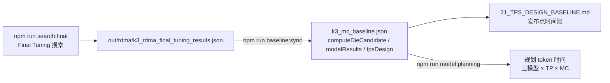
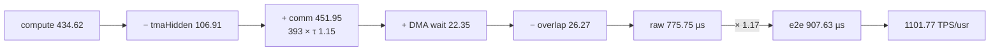

# 当前设计状态与已知结论

版本：2026-09-26。

## 0. 单芯片前提与唯一硬件规格

单芯片的物理边界是一个 7-reticle advanced package：8 颗 Compute Die + 16 颗 MC，工程 placement window
约 82×64 mm、5,248 mm²（ADR-0018）；一个 package 对软件表现为一个 TP rank，32 个 package 构成 TP32。

硬件规格只有一份：P1，权威值在
[`teams/hardware/inputs/k3_mc_baseline.json`](../../teams/hardware/inputs/k3_mc_baseline.json)
（ADR-0021）。封装面积 = 8 × Die 面积 + 16 × 100 mm²（MC 规划值）= 4589.71 mm²，在 5,248 mm² 窗口内。



## 1. 已确定的工作负载口径

| 项目 | 当前值 | 状态 |
| --- | ---: | --- |
| 目标 | 1000 TPS/usr，单用户 Decode | `FROZEN` |
| Batch | 1 | `FROZEN` |
| Context | 1,048,576 token | `BASELINE` |
| 模型 | K3 工程 preset，93 层、92 个 MoE 层 | `MODEL` |
| Hidden / latent | 7168 / 3584 | `MODEL` |
| Experts | 896，总 Top-16，2 个 shared expert | `MODEL` |
| Attention | 24 层 Softmax MLA + 69 层线性 Attention | `MODEL` |
| 并行 | TP=32 张卡，PP=1 | `BASELINE` |
| 工程裕量 | 1.17 | `BASELINE` |
| raw 时延预算 | 854.70 μs/token | 由目标推导 |

K3 preset 来自
[`teams/model/src/design_engine.js`](../../teams/model/src/design_engine.js)，属于本地工程口径，
不是已经由模型提供方签核的正式规格。模型结构、精度和层顺序在架构冻结前必须
由独立的模型清单确认。

## 2. Compute Die（P1）

> 支撑发布点的软硬件设计（逐单元规格、时间账、软件机制、逐项回退、敏感度、证据等级与变更控制）
> 汇总在 [`21_TPS_DESIGN_BASELINE.md`](21_TPS_DESIGN_BASELINE.md)（ADR-0005，`k3_mc_baseline.json#tpsDesign`）。

权威数值在 `k3_mc_baseline.json#computeDieCandidate`，由 `npm run baseline:sync` 从
[`out/rdma/k3_rdma_final_tuning_results.json`](../../out/rdma/k3_rdma_final_tuning_results.json)
生成，`tests/regression/test_design_baseline.js` 强制两者一致。

| 项目 | 当前值（字段） | 状态 |
| --- | ---: | --- |
| 工艺/频率 | 三星 SF4 级面积口径（`physicalBasis`），1.0 GHz 固定，不参与搜索 | `ASSUMPTION`（B-006） |
| 散热/功耗上限 | 液冷：Die 300 W、卡 2800 W（`physicalBasis.limits`） | `ASSUMPTION`（O-015） |
| L Core | 8 个，每 Core 8×(1×256) engine，local 1 MiB（`lCores`、`lCore`） | `MODEL` |
| H Core | 4 个，每 Core 5×(48×128) engine，local 4 MiB（`hCores`、`hCore`） | `MODEL` |
| Shared SRAM | 16 MiB，16 slices（`sharedSramMiB`） | `MODEL` |
| 总数据 SRAM | 40 MiB/Die（24 local + 16 shared） | 推导值 |
| BF16 Dense peak | 278.5 TF/Die（`bf16DenseTflops`） | 推导值 |
| 面积 | 373.71 mm²/Die（`estimatedAreaMm2`，含共享 SRAM 端口放大成本） | `MODEL` |
| 功耗 | Die 286.2 W，卡 2768.5 W | `MODEL` |

利用率、面积和功耗系数尚未由 memory compiler、标准单元、PHY 宏和综合/布线结果回标。
共享 SRAM 读写端口的放大（`localWriteRatio`、`tmaPortWriteScale`、`sharedReadScale`）按 bank 面积
和端口功耗计入 die/card 限制。

## 3. TPS/usr 的计算过程

### 3.1 详细模型发布点（K3，P1/MC640/TP32）

```text
raw = compute − tmaHidden + comm + wait − overlap
    = 434.62 − 106.91 + 451.95 + 22.35 − 26.27 = 775.75 µs
e2e = raw × 1.17 = 907.63 µs
TPS/usr = 1e6 / e2e = 1101.77
```



| 项 | 含义 |
| --- | --- |
| compute | 各算子在 L/H/向量单元上的时长（含 launch，`GAIN` 全部为 1，B-003） |
| tmaHidden | shared→local 装载在独立 TMA 通道上提前发射后被掩盖的部分（`OPT.tmaLane`） |
| comm | 每次集合通信取 max(协议模型时间, τ = 1.15 µs)；五类都低于 τ，所以 = 393 × 1.15（ADR-0004） |
| wait | 算子等待 MC→shared SRAM 的 DMA（KV 跨层预取与 DMA 抢占后的剩余） |
| overlap | shared 专家与 `Wdown + Router all-gather` 并行（`OPT.commOverlap`） |

- 离 854.70 µs 预算余 78.95 µs；τ 升到约 1.35 µs 时跌破 1000。
- MC 320 GB/s 参考点为 586.46 TPS/usr：计算与通信时间相同，差别来自 DMA 等待。
- 每项机制的单独回退、敏感度与证据等级见 [`21_TPS_DESIGN_BASELINE.md`](21_TPS_DESIGN_BASELINE.md) 第 4–6 节。
- 这是 `MODEL` 等级；超过 1050 的架构闸门，但闸门还要求可制造 MC 路线与详细 tile 模型，仍为未通过。

集合通信按参考页口径计 393 次（`OPT.countBasis='reference-393'`，B-007）；这是计数对齐，不是优化，
回退到 `repo-510` 为 941.74 TPS/usr。393 次在 τ 下的解析天花板见
`k3_mc_baseline.json#tauBasis.ceilingTpsByCount`。构成与依赖见
[`COLLECTIVE_SCHEDULE.md`](../../teams/software/docs/COLLECTIVE_SCHEDULE.md)。

### 3.2 规划 token 时间（三模型，ADR-0006、ADR-0008）

规划链路（`npm run model:planning`，`integration/planning/token_time.js`）：

```text
访存道 = kMemory × (访存 + expertReread × routed 专家访存)
串行道 = kFlop × 计算 + fixedPerLayerUs × 层数 + kTmaExposedUsPerGB × 每 rank 非集合 GB
       + 集合通信次数 × max(τ, 字节/网络带宽)
raw = max(访存道, 串行道)，e2e = raw × 1.17，TPS/usr = 1e6 / e2e
```

系数取自上面发布点的时序分解：

| 系数 | 值 |
| --- | ---: |
| expertReread | 0.20 |
| kMemory | 1.1178 |
| kFlop | 1.1529 |
| fixedPerLayerUs | 0.2987 μs |
| kTmaExposedUsPerGB | 5.793 μs/GB |

规划回放 1102.41；MC320 未参与拟合，规划 551.21，详细模型 586.46（0.94）。
数值存于 `out/workload/planning_operator_workload.json#/calibration`。

| 模型 | dtype 口径 | TP32 / MC640 | τ = 1.5 / 2.0 μs | 瓶颈 | 状态 |
| --- | --- | ---: | ---: | --- | --- |
| K3 | dense BF16、routed MXFP4、KV FP8 656 B | 1102.4 | 959.3 / 786.0 | 访存 | `PLANNING_ESTIMATE` |
| K3-FP8-dense（对照，不排名） | dense/shared FP8、router/LM head BF16 | 1149.3 | — | 集合通信 | 对照 |
| DeepSeek-V4-Pro | dense FP8、router/LM head BF16、routed FP4；expert hidden 两解区间 2299.3–2318.4 | 2299.3 | 1869.8 / 1475.9 | 集合通信（244 × 1.15 μs） | `PLANNING_ESTIMATE` |
| GLM-5.2 | dense FP8、router/LM head BF16、routed FP8（公开 config，含 MTP 总参数 753.3B 对公布 753B） | 2416.8 | 1929.8 / 1498.4 | 集合通信（255 × 1.15 μs） | `PLANNING_ESTIMATE` |

- **D-Gate：** `PASS`（范围 `PLANNING_COMPARISON_ONLY_NOT_ARCHITECTURE_FREEZE`）。
- **正式候选：** 只有三个模型都 ≥ 1000 的槽位才能入选（ADR-0008），为 `P1-compact-MC640-TP32`；
  它是 τ 条件候选（K3 规划模型 τ ≤ 1.41 μs，详细模型约 1.35 μs）。
- **非正式参考：** `P1-compact-MC320-TP32`（K3 551.2，未达目标）。
- **Stage B：** `PLANNING_QUANTIFICATION`，状态 `PERFORMANCE_MISS_OUTSIDE_SELECTED_CANDIDATES_NOT_VALIDATED`，
  18 个可比槽位中 11 个未达 1000。
- **Q-Gate：** 阻塞（无事件时序回放）。

以上均为规划估算，不是事件时序结果；把 K3 的标定系数用于其他模型是 `ASSUMPTION`（ADR-0006、ADR-0007、ADR-0008）。

## 4. 必须纠正的口径

### 4.1 SRAM 峰值不是每 Die

模拟器中的 shared SRAM 峰值和 window 是**整卡 8 个 Die 的聚合工作窗口**
（`k3_mc_baseline.json#sramAccounting`）：

- Shared SRAM 物理容量：8 × 16 = 128 MiB/卡；
- usable 0.85，再乘 window fraction（1.0）：108.8 MiB/卡；
- 模拟峰值：100.24 MiB/卡；
- Local SRAM 24 MiB/Die 由 tile-fit 约束单独检查。

不应据整卡峰值扩大单 Die SRAM。

### 4.2 “MC”存在两条不同路线

1. **本轮主线：外置 Memory Cube。** MC 只负责存储和传输，计算在
   Compute Die；对应当前 Final Tuning 模型。
2. **备选：近存计算 MC。** MC base die 内有 GEMM/vector；另行维护，不纳入本仓库基线。

两条路线的 MC 数量、带宽定义、功耗和数据流不同，后续文档不得混用。

## 5. 当前资料中的主要冲突

| 冲突 | 当前处理 |
| --- | --- |
| 卡内互联有“4×2 mesh”“双向 ring”“4+4 hierarchy”三种描述 | `BLOCKER`（B-004），统一拓扑后才可冻结 |
| 参考 MC 320 GB/s；发布点使用 640 GB/s | `BLOCKER`（B-002），档位定义见 ADR-0019，必须选定可制造档 |
| NoC 的 512 B/cycle 是分析参数，尚无可布线证明 | `OPEN`，需物理和拥塞模型 |
| τ = 1.15 µs 无链路/协议推导 | `BLOCKER`（B-008） |
| launchScale 0.45、预测命中率 0.8 为假设 | `ASSUMPTION`（B-003），需 runtime trace 回标 |
| Attention 投影参数由 residual 拟合，不是精确 Q/K/V 图 | `BLOCKER`，需模型清单和编译 trace |

## 6. 当前可以保留的设计方向

- 异构 L/H Core，分别覆盖低复用 GEMV/Skinny GEMM 和高复用
  Attention/GEMM；
- Local SRAM + Shared SRAM 分层，TMA 与计算流水重叠；
- 8 Die/卡，2 MC/Die，NUMA 本地优先；
- 远端 SRAM 可寻址、commit/ready/ACK/epoch 生命周期；
- LSE 使用 m/l/O 语义归约，不作为普通 FP32 sum；
- 以 tile 为抢占、同步和性能核算单位；
- Decode 小消息与 Prefill 大流量采用独立 QoS/VC。

这些是可继续深化的架构方向，但还不是已签核实现。
