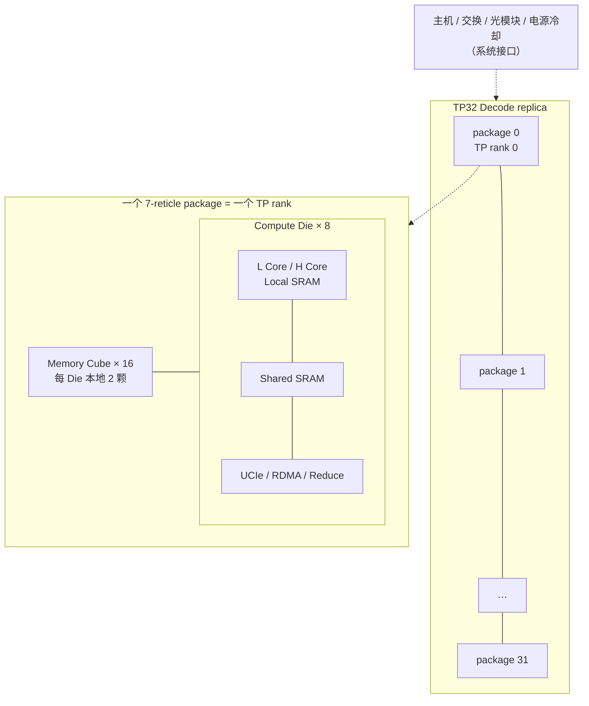
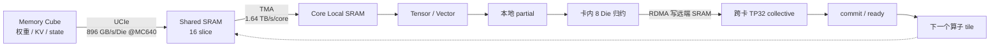
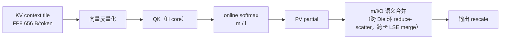
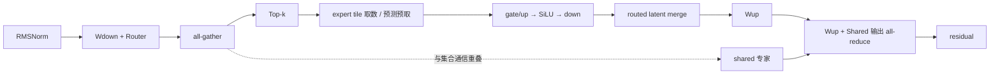

# 系统架构设计

## 0. 单芯片定义

本版本把一个 7-reticle advanced package 定义为一个“单芯片”系统边界：8 个 Compute Die、16 个集成 Memory Cube、active interposer/RDL、package-local fabric、package-level collective 和 scale-out endpoint 均属于一个 package。该 package 对软件暴露为一个 TP rank；32 个 package 构成 TP32 replica。

面积规划采用：工程 placement window 约 82×64 mm、5,248 mm²（ADR-0018）；8 × 373.71 mm² Compute Die + 16 × 100 mm² MC = 4,589.71 mm² 裸片面积，余约 658 mm² 给 placement/routing/keep-out。`k3_mc_baseline.json#package` 定义该约束，搜索对每个候选检查。

## 1. 系统边界

本轮定义的“单芯片”是一个 7-reticle advanced package，包含 8 个 Compute Die、16 个集成 Memory Cube、active interposer/RDL、package-local fabric、package-level collective 和 scale-out endpoint。32 个 package 构成一个 TP32 Decode replica。

```text
TP32 replica
  32 × K3 7-reticle package
    1 package / TP rank
      8 × Compute Die
      16 × Memory Cube (2 local MC / Compute Die)
      package-local die fabric
      800 GB/s/package scale-out payload target
```

主机、交换机、光模块和电源/冷却属于系统接口，但其实现不包含在 Compute
Die RTL 内。



## 2. 基线层级

### 2.1 Compute Die

硬件规格只有一份（ADR-0021），权威值在 `teams/hardware/inputs/k3_mc_baseline.json#computeDieCandidate`，
由 Final Tuning 搜索决定、`npm run baseline:sync` 写入。单元文档（`teams/hardware/docs/02`–`09`）按这份规格书写。

| 项（每 Compute Die，除非注明） | 当前规格 |
| --- | --- |
| L Core | 8 × 8×(1×256)，local 1 MiB/core |
| H Core | 4 × 5×(48×128)，local 4 MiB/core |
| 频率 | 1.0 GHz（固定） |
| L / H BF16 峰值 | 32.77 / 245.76 TFLOPS |
| 向量 | 12 core × 512 lane，12.29 TOPS |
| Local SRAM | 8×1 + 4×4 = 24 MiB |
| Shared SRAM | 16 slice × 1 MiB = 16 MiB |
| 数据 SRAM 合计 | 40 MiB |
| TMA | 4 × 512 B/cycle/core，1.64 TB/s/core 有效 |
| 片上 NoC | 6×6 mesh，256 B/cycle × 4 lane，7.99 TB/s |
| UCIe（Die 间） | 128 lane × 64 Gbps |
| Die 面积 | 373.71 mm²（SF4），上限 400 |
| Die / 卡功耗 | 286.22 W / 2768.47 W，液冷上限 300 W / 2800 W |
| MC | 16 × 640 GB/s（`STRETCH`，B-002），参考档 320 GB/s |

每 Die 另有单独的 collective/reduce 单元、2 个本地 MC 数据端口，以及 Die fabric、Scale-out/RDMA、管理、PMU、时钟、复位和 RAS。

### 2.2 7-Reticle Package

- 8 个 Compute Die；
- 16 个 MC，每 Die 本地绑定 2 个；
- 逻辑上每个 package 是 TP32 的一个 rank；
- package 内先完成局部归约，再进入跨 package collective；
- 权重和 KV 默认本地放置，远端 package/MC 只用于重平衡和故障降级。

### 2.3 TP32 replica

- 32 个 package 按相同 shard map 加载；
- 每 token 由所有 rank gang-scheduled；
- collective epoch 在所有 rank 上一致推进；
- 以最慢 rank 作为 step 完成条件；
- B=1 低时延 Decode 不依赖 PP。

## 3. Decode 端到端数据流



文字版：

```text
MC weight/state tile
  -> MC controller/UCIe
  -> Shared SRAM slice
  -> TMA
  -> Core Local SRAM
  -> Tensor/Vector execution
  -> local partial
  -> package-local reduce
  -> RDMA-to-remote-SRAM collective
  -> ready/commit
  -> next operator tile
```

Softmax MLA 另有：



MoE 另有（TP-only，无 expert dispatch，ADR-0020）：



## 4. 地址与一致性原则

- MC、Shared SRAM、Local SRAM 和 remote SRAM slot 采用统一物理地址描述，
  但不是 CPU cache-coherent 地址空间。
- 数据所有权由 tile descriptor 和 epoch 管理。
- Local SRAM 不参与跨 Core 硬件一致性；显式 TMA/collective 传输。
- Shared SRAM 是 Die 内共享和远端落点，使用 slice home + bank interleave。
- remote write 可见不等于 tile ready；ready 由 commit counter/flag 定义。

## 5. 端到端预算

1000 TPS/usr 对应：

```text
E2E <= 1000.00 μs/token
raw <= 1000 / 1.17 = 854.70 μs/token
```

架构冻结门槛建议不是刚好 1000，而是 tile 模型达到至少
**1050 TPS/usr**，为模型误差、PVT、ECC、重放和软件抖动留出空间。

建议 raw 预算分配：

| 类别 | 目标上限 | 说明 |
| --- | ---: | --- |
| Tensor/Vector kernel | 390 μs | 需要真实 kernel trace 回标 |
| Local TMA/SRAM | 250 μs | 包含 bank conflict |
| Collective/RDMA | 115 μs | 包含 package-local 和 scale-out |
| MC/DMA 暴露等待 | 55 μs | 参考 MC 路线当前远超预算 |
| launch/control/尾部 | 20 μs | descriptor、barrier、sampling |
| 合计 | 830 μs | 留约 25 μs raw 工程余量 |

该表是设计目标，不是当前已实现数字。当前发布点的实际时间账（21 号文档第 2 节）与目标差异很大：
通信是 393 × τ = 451.95 µs，远超 115 µs 的目标；这部分由 τ 的口径决定（ADR-0004、B-008），而 kernel 与 TMA 低于目标。

```mermaid
xychart-beta
  title "raw 时间：目标上限 vs 当前发布点（µs）"
  x-axis ["kernel", "TMA/SRAM", "Collective", "DMA 等待", "launch/尾部"]
  y-axis "µs" 0 --> 500
  bar [390, 250, 115, 55, 20]
  bar [225, 71, 452, 22, 11]
```



第一组柱是目标上限，第二组是发布点。发布点的 TMA/SRAM 取 localTma 42.87 + 暴露的 tmaFill 27.87，kernel 取 224.84，
launch 取 11.17；collective 为 393 × 1.15 µs = 451.95，未扣除 shared 专家重叠的 26.27 µs。

## 6. 系统级退出条件

- 主模型清单、精度和层顺序被冻结；
- MC 物理规格与每卡连接方式可制造；
- TP32 物理拓扑明确，最坏 hop 和故障降级可计算；
- tile 模型在无经验缩放因子的情况下达到 1050 TPS/usr；
- 单 Die 面积、功耗、package 岸线和时钟收敛；
- 所有子系统接口文档完成并通过跨团队评审。
