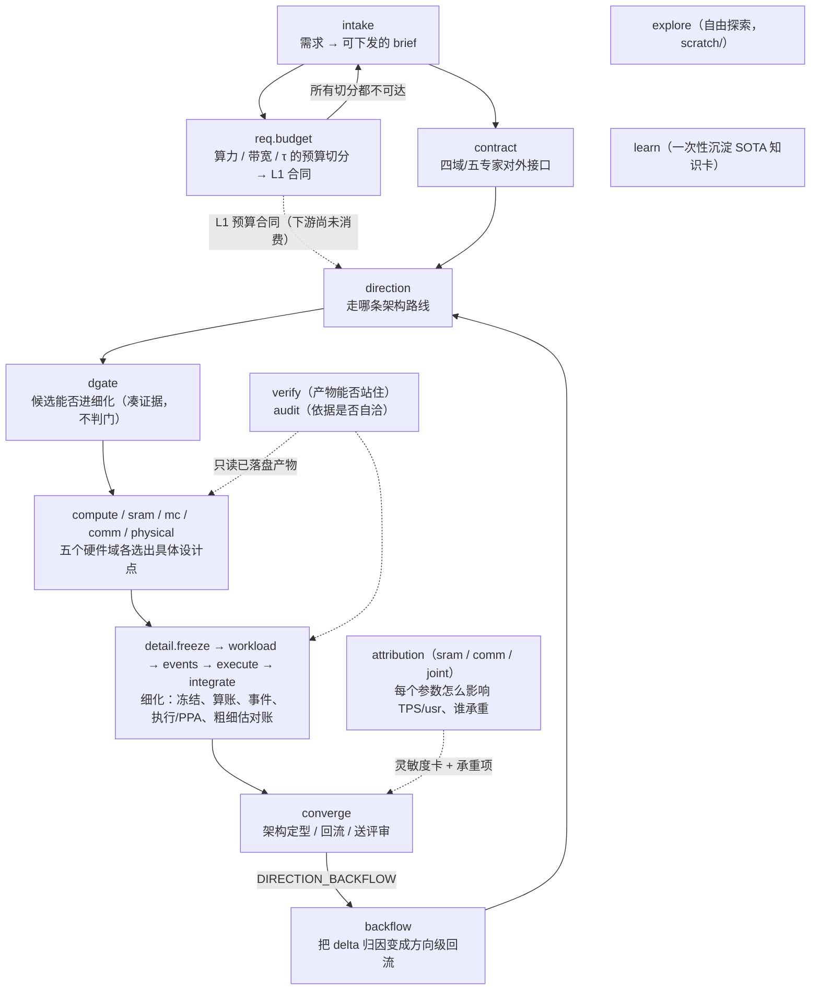

# 21 个 workflow 的业务含义

本文回答一个问题：**每个 workflow 在芯片架构设计这件事里，对应哪一个业务环节？**
它不重复实现细节（见各脚本的 `meta` 与 [`README.md`](README.md)），也不重复方法论（见
[`22_AGENT_WORKFLOW_REFACTOR_PLAN.md`](../../teams/council/docs/22_AGENT_WORKFLOW_REFACTOR_PLAN.md)）。

读法：workflow 不是"一个 agent 做一件事"，而是"设计流程的一格"——它拿到一份由主循环注入的输入，
调起若干策略实例做**判断**，由脚本做**计算**，最后把产物交给主循环落到 `out/`。
任何一格都不能宣布门控通过；门控只由 [`evaluate_gates.js`](../governance/evaluate_gates.js) 算。

## 1. 一张图：设计流程怎么走

按业务阶段归类：

| 业务阶段 | workflow | 一句话 |
|---|---|---|
| 立项与接口 | `intake`、`contract` | 把需求变成可计算输入；各域对外承诺什么接口 |
| 需求预算（L1-b） | `req.budget` | 达到目标 TPS/usr，算力、带宽、τ 各给多少，切成一份可下发的预算合同 |
| 方向级探索（Stage A） | `direction`、`dgate` | 在资源包络内比较架构路线，并凑齐"能否进细化"的证据 |
| 域内设计 | `compute`、`sram`、`mc`、`comm`、`physical` | 方向定了之后，每个硬件域在设计空间里选出一个具体设计点 |
| 参数级细化（Stage B） | `detail.freeze` → `workload` → `events` → `execute` → `integrate` | 逐层把粗估变细估，并对账 |
| 维度归因 | `attribution` | 每个设计维度的参数动一步，TPS/usr 变多少、代价多少、哪些承重 |
| 收敛 | `converge` | 这一轮到此为止、回流重来，还是送评审 |
| 回流与复核 | `backflow`、`verify`、`audit` | 不达标往回退；独立复核产物和依据 |
| 例外与准备 | `explore`、`learn` | 受控的自由探索；一次性学习外部方案 |

## 2. 逐个说明

每一格都写五件事：**要回答的业务问题 / 什么时候跑 / 产出 / 可能的结局 / 它不负责决定什么**。
"输入"都由主循环经 `args` 注入，脚本自己不读文件。

### 立项与接口

#### `design.intake` — 需求能否变成可计算输入
- **业务问题**：一段自然语言需求，加上预算，能不能变成各域都能接着干活的约束、预算和形态意图？
- **什么时候跑**：整个设计流程的第一格，需求或预算变了就重跑。
- **做法**：6 个领域专家各自提出本域硬约束 → `architect` 合并、分配预算、给出形态意图 → `framing-critic` 审查框架是否完整、口径是否一致、设计空间有没有被写窄；不通过就带缺口清单重写，**最多 2 轮**。
- **产出**：`teams/council/inputs/design_brief.intake.json`（DesignBrief + ledger 种子）。
- **不负责**：不做任何性能判断；它只决定"问题是怎么问的"。

#### `design.contract` — 接口长什么样
- **业务问题**：compute / memory / comm / physical / software 五个域，各自对外承诺什么接口、单位和守恒量？冲突和未决项登记在哪？
- **什么时候跑**：域间接口发生变化，或新增域之前。
- **做法**：5 个专家各申报接口 → `architect` 收敛成一份契约 → `verifier` **只读已落盘契约**做独立验证 → `invariant-checker` 检点。
- **产出**：`out/contracts/contract_interfaces.json`。契约文件本身由 `generate_team_contracts.js` 生成，本格只审查。
- **不负责**：不生成契约、不改 `teams/*/contract.json`。

### 需求预算（L1-b）

#### `design.req.budget` — 算力、带宽、τ 各给多少
- **业务问题**：要达到 1000 TPS/usr（raw 预算约 854.7 µs），持续带宽最少多少、有效算力最少多少、τ 最多多大；这几项之间怎么换；切成哪一份预算合同交给下游。
- **什么时候跑**：`npm run budget:frontier` 生成预算前沿之后。基线或规划算子账变了前沿即过期，`run_workflow.js` 拒收过期前沿。
- **做法**：数全部来自前沿（`integration/planning/requirement_frontier.js`：规划 token time 给每个模型 × TP 的带宽下限与"算力 ↔ τ"等 TPS 直线，K3 TP32 详细模型给单轴余量与 SRAM 下限，再枚举 4 份候选切分 `S-TAU` / `S-CMP` / `S-BW` / `S-BAL`，每份都在两个模型上复算过守得住预算）→ 每条预算条目的 owner 专家（compute / memory / comm / physical）判本域的数**物理上**是否可达（`reachable` / `unreachable` / `unknown`，附可信区间与出处）→ 有条目不可达的切分被否，记入 `ledgerPatch.rejectedOptions` → `architect` 只在剩下的切分里挑一份（只选 id，不填数）→ `framing-critic` 审预算是否把设计空间写窄 → `invariant-checker` 检点（漏审条目、选了被否切分、卡外数字由脚本机械比对）。
- **产出**：`out/budget/L1_budget.json`（所选切分的合同原样 + `selection` 记录）与 `L1_run_record.json`。落盘前主循环核对合同与前沿里那份切分逐字段一致、`selection.frontierSha256` 是读入的那份前沿，不符退出码 5；专家 `plausibleRange` 里的前沿外数字不在其 `rangeEvidence` 所引行上，退出码 7。
- **结局**：检点通过则落盘合同；所有切分都有条目不可达 → `DIRECTION_BACKFLOW`，回 `intake` 由人决定目标或场景；`physical-expert` 或 `architect` 判方向级问题 → 回 `direction`；专家缺席或输入不足 `BLOCKED_CONFIG`。
- **不负责**：不算任何数、不编新切分、不判门控。合同目前还没有下游格消费（`make_brief.js` 是下一步，见 23 号文档 §7）；前沿只覆盖 K3 的详细模型，GLM-5.2、DeepSeek-V4-Pro 只受规划模型约束。

### 方向级探索（Stage A）

#### `design.direction` — 走哪条路线
- **业务问题**：在 7-reticle 面积等资源包络内，6–12 个架构候选里哪些站得住、瓶颈是什么、最后留下哪 ≤3 个进入 Stage B？
- **什么时候跑**：`stage_a.js` 生成了方向包络和打分卡之后。
- **做法**：每个候选交给一个 `architect` 实例独立评估（互相看不见） → `integrator` 合并并登记冲突与排除依据 → `framing-critic` 对抗式审查框架 → `gate-keeper` 逐条核对门槛证据 → `invariant-checker` 检点。
- **产出**：`out/direction/direction_selected.json`。
- **不负责**：不跑搜索、不给 TPS（TPS 来自脚本）、不判门控。

#### `design.dgate` — 候选能否进细化
- **业务问题**：D-Gate 的 8 条门槛（面积守恒、预算齐全、三模型都有粗估、每个候选有瓶颈、至少一个候选达标或有替代方案、证据等级标注、top-10 敏感性、候选 ≤3）各自的证据齐不齐、缺什么？
- **什么时候跑**：`direction` 之后，`evaluate_gates.js` 已经算出门控结论之后。
- **做法**：8 条门槛各开一个独立 `gate-keeper` 实例 → `architect` 汇总成证据包 → `invariant-checker` 检点。
- **产出**：`out/governance/dgate_evidence_package.json`。
- **不负责**：**不判门**。结论由脚本给出，本格只转述；它是最容易写歪的一格。

### 域内设计（C 组，五格同构）

五格共用一套骨架：**专家提搜索策略 → 确定性脚本枚举打分 → 旁证专家对候选提侧向约束 → integrator 合并 → invariant-checker 检点后落盘**。
区别只在主策略、设计空间和旁证专家。候选数值由 `search_brief.js` 读取并核验后注入，agent 不转写数字；落盘后再用 `search_brief.js verify` 核对 winner 是产物里的一行。

| workflow | 业务问题 | 设计空间 | 旁证专家 | 产出 |
|---|---|---|---|---|
| `design.compute` | AI Core 里 L/H/Vector/Indexer/Reduce 怎么配比、算力落在 roofline 哪一侧 | matrix:vector 设计搜索（HW-02） | memory、physical | `out/compute/compute_winner.json` |
| `design.sram` | shared SRAM 容量、L/H bank、shared slice、TMA 引擎与端口扩展怎么定，满足 B-SRAM-CAP | SRAM 设计搜索（`sram_design_space.json`） | compute、mc、software | `out/sram/sram_winner.json` |
| `design.mc` | MC、HBM、TMA 的带宽怎么定，满足 B-MEM-BW | MC 设计搜索（`memory_design_space.json`） | sram、comm、physical | `out/mc/mc_winner.json` |
| `design.comm` | NoC、集合通信、Comm Core 怎么定 | Comm Core 设计搜索（HW-07） | mc、compute、physical | `out/comm/comm_winner.json` |
| `design.physical` | 封装、面积、功耗、热能不能放下前四者的选择 | 物理设计搜索 | compute、sram、mc、comm | `out/physical/physical_winner.json` |

- **什么时候跑**：方向确定后，对应的 `*:search` 已经生成候选。
- **结局**：检点通过则落盘 winner；搜索产物缺失、旁证专家缺席或检点不通过时返回 `BLOCKED_CONFIG`，**不写 winner**。
- **不负责**：不枚举候选、不算分、不给全局 TPS；一个域的 winner 不等于全局最优，要等 `physical` 与其他域对账。

### 参数级细化（Stage B，D 组严格串行）

D 组是同一条链上的前后依赖，不得并行：每一格消费上一格落盘的产物，且全部共享同一个 manifest hash。

| 顺序 | workflow | 业务问题 | 谁参与 | 产出（`out/detailed/`） |
|---|---|---|---|---|
| 1 | `design.detail.freeze` | 这一轮细化到底在算什么？候选、模型、profile、seed、输入哈希能否复现 | model、memory 专家 | `detail_freeze.json` |
| 2 | `design.detail.workload` | 逐层算子账是多少？算术强度、Roofline、sizing 三条比是否一致 | model → compute ∥ memory → integrator | `detail_workload.json` |
| 3 | `design.detail.events` | tile / 内存事务 / NoC 包 / kernel cycle 事件是什么，五条守恒（字节、FLOP、事务、buffer lifetime、credit）是否成立 | memory ∥ comm ∥ compute，脚本对账 | `detail_events.json` |
| 4 | `design.detail.execute` | 调度、软件开销与 PPA / 热 / RAS 合起来的执行账本是什么 | software ∥ physical → integrator | `detail_execute.json` |
| 5 | `design.detail.integrate` | 18 个观测位上，粗估与细估差多少、差在哪、归谁 | integrator → architect（只裁决归不了因的 delta）→ verifier | `detail_integrate.json` |

- 每一格都要通过 `invariant-checker` 才落盘；缺输入一律 `BLOCKED_CONFIG` + `nextActions`，不静默补全。
- `freeze` 没有 `integrator`：它只冻结，不合并。
- 专家裁决枚举的含义：`LOCAL_DETAIL_FIX` 是本域局部调整即可；`DIRECTION_BACKFLOW` 是问题在方向层；`PPA_DIRECTION_BACKFLOW` 是 PPA 层面的方向问题，走专属回流；`DELTA_UNEXPLAINED` 是粗细估差异无法归因。
- **不负责**：不跑 `stage_b.js`，也不改既有产物；这些格审的是"账是否站得住"，TPS 数字来自脚本。

### 维度归因（L4，按维度参数化）

#### `design.attribution` — 这个维度的每个参数怎么影响 TPS/usr，谁承重
- **业务问题**：在已发布设计点上，片上 SRAM（容量、bank、slice、TMA、KV tile、预取深度、端口扩展）、集合通信（τ、计数口径、RDMA/UCIe/NoC/Reduce、commOverlap、pvMerge）各自动一步，TPS/usr 变多少、面积功耗变多少、盈亏点在哪；未测参数一起取悲观端时缺口落在哪一维（`joint`）。
- **什么时候跑**：`npm run attribution:cards` 生成灵敏度卡之后，每个维度跑一次（`--dimension sram | comm | joint`，互相独立，可并行）。基线变了卡即过期，`run_workflow.js` 拒收过期卡。
- **做法**：数全部来自卡（`integration/detailed/tps_attribution.js` 在详细模型上逐项重放，分类是机械的）→ 每行的 owner 专家（compute / memory / comm / software）只审自己的行：同不同意分类、该参数物理上可信的区间与出处、盈亏点是否落在区间内、先测什么；`software-expert` 另判哪些承重结论依赖软件机制 → `integrator` 合并承重项、富余项、回标计划与冲突 → `invariant-checker` 检点（漏审行、漏列承重行、承重行缺回标计划由脚本机械比对，检点者不能解释掉）。
- **产出**：`out/attribution/reviews/<dimension>_review.json` 与 run record。卡本身是生成物，本格不能落到卡旁边。返回值里任何 `文件:行号` 指向没有文字的行（空行、表格边框、代码围栏）或越界，或专家 `plausibleRange` 里的卡外数字不在其 `rangeEvidence` 所引的行上，主循环不落盘（退出码 7）。审读与合并里的卡外数字由 workflow 脚本比对，修正一次仍不合规即 `INVARIANT_VIOLATED`。
- **结局**：检点通过则落盘审读；专家缺席或输入不足 `BLOCKED_CONFIG`；承重参数的可信区间整体落在预算外时 `DIRECTION_BACKFLOW`。
- **不负责**：不算任何数（卡里没有的数不得出现）、不改卡、不提设计改动（那是域设计格的事）、不判门控。目前只覆盖 K3 / TP32 的详细模型，其他模型无归因。

#### `design.converge` — 这一轮怎么收场
- **业务问题**：细化链走完后，架构是冻结、回到方向层重定，还是证据已够、送评审？
- **做法**：相关专家（1–3 个，互不可见）回报本域残余缺口 → `framing-critic` 审查"收敛问的是不是该问的" → `gate-keeper` 汇总证据完备性 → `architect` 在 `ARCH_FREEZE` / `DIRECTION_BACKFLOW` / `D_GATE_PROPOSAL` 里裁决 → `invariant-checker` 检点。
- **产出**：`out/detailed/converge_proposal.json`——是**提案**，不是门控结论。
- **不负责**：不改候选寄存器、不写既有产物，门控由脚本算。

### 回流与复核（横切）

#### `design.backflow` — 不达标，退给谁
- **业务问题**：`detail.integrate` 的 delta 归因里，哪些条目其实是方向级问题？该由哪个专家认领？要不要真的动方向？
- **做法**：`integrator` 把归因归纳成可追责条目 → 被归因专家（≤3）只认属于自己的 → `architect` 判该不该动方向，动方向必须给方向级理由 → `framing-critic` 检回流框定，可整体否决。
- **产出**：`out/governance/backflow_proposal.json`。没有归因就没有回流，直接返回 `DIRECTION_BACKFLOW_NOOP` 和 `nextActions`，不假装跑一轮。
- **不负责**：它给回流提案，不直接修改 Gate，也不改方向。

#### `design.verify` — 这份产物能不能独立站住
- **业务问题**：只看**已落盘**的产物，它能不能被一个没参与设计的人复现和接受？
- **做法**：7 类检查各一个互不可见的 `verifier` 实例（`V-SCHEMA` 单位、`V-CONSERVATION` 七类守恒、`V-PROVENANCE`、`V-PROFILE` MC320/MC640 与 peak/sustained 分离、`V-MATRIX` 回归矩阵、`V-REPLAY` 可回放、`V-SYNTHETIC` 合成数据不得签核）→ `gate-keeper` 核证据完备性 → `architect` 签署送审或回流意见。
- **产出**：`out/verification/verify_report.json`。
- **不负责**：不接收设计过程的申报、候选或草稿——读了它们就不再独立。

#### `design.audit` — 支撑它的证据链和口径是否自洽
- **业务问题**：结论的出处是否真能推出结论？同一个量在别处是否用了另一个口径？算术、覆盖度有没有漏？
- **做法**：4 个视角（证据链 / 依据一致性 / 算术 / 覆盖度）各一个 `verifier` 实例 → 1 个实例汇总，汇总不产生新结论。可选地给 `args.premises` 找一份公开资料参照系（非证据，不进 `out/` 的检查结论）。
- **产出**：`out/verification/audit_report.json`；参照系写 `references/external/`。
- **与 `verify` 的分工**：`verify` 查**个体**（这份产物对不对），`audit` 查**关系**（它和它的依据、和别处的口径对不对）。

### 例外与准备

#### `design.explore` — 受控的自由探索
- **业务问题**：走一遍正规 workflow 不值得，但确实想自由问一次"这个域通常怎么做"。
- **规则**：单实例、无并行、无检点、无门控；**只写 `scratch/explore_<runId>.md`**，不得写 `out/`、不得进 ledger、不得作为任何结论的证据。这是例外通道，不是捷径。

#### `design.learn` — 一次性沉淀外部方案
- **业务问题**：各领域的 SOTA 与经典方案是什么，让后续专家有参照系？
- **规则**：按学习单元联网调研，产出 `references/sota/` 知识卡，剔除无来源条目；知识不是证据，不进 ledger，只在领域专家实例的 prompt 里作参照。不参与常规阶段链，刷新用 `args.units`。

## 3. 容易混淆的几对

| 对比 | 区别 |
|---|---|
| `direction` vs `dgate` | `direction` 是**选**（比较候选、留下 ≤3 个）；`dgate` 是**凑证据**（8 条门槛逐条核对证据齐不齐），两者都不判门 |
| `contract` vs `converge` | `contract` 管**接口**（各域对外承诺）；`converge` 管**这一轮的结局**（冻结 / 回流 / 送评审） |
| `verify` vs `audit` | `verify` 查产物个体；`audit` 查依据与口径的关系；两者都只读已落盘产物 |
| `backflow` vs 各格的 `DIRECTION_BACKFLOW` 裁决 | 裁决是某一格里专家或架构师说"这是方向问题"；`backflow` 是把 delta 归因整体转成方向级回流提案的独立一格 |
| C 组 winner vs D 组细化 | C 组在**设计空间**里选点（确定性搜索）；D 组对选定的点做**逐算子、逐事件**的细估与对账 |
| `intake` vs `explore` | `intake` 产出会被下游引用的 brief，必须过 `framing-critic`；`explore` 的产物没有人可以引用 |

## 4. 怎么选：我该跑哪一格

| 我想知道 / 想做 | 跑这一格 |
|---|---|
| 需求或预算变了，要重新下发约束 | `intake` |
| 达到目标要多少带宽、多少算力、τ 最多多大，选一份预算切分 | `npm run budget:frontier`，再 `req.budget` |
| 域间接口要改 | `contract` |
| 要重新比较架构路线 | `direction`，然后 `dgate` |
| 想看某个硬件域的设计点怎么选 | 对应的 `compute` / `sram` / `mc` / `comm` / `physical` |
| SRAM、集合通信等某个维度怎么影响 TPS/usr，哪些参数承重 | `npm run attribution:cards`，再 `attribution --dimension sram`（或 `comm` / `joint`） |
| 方向已定，想验证细估能不能站住 | D 组从 `detail.freeze` 起依次跑到 `integrate`，再 `converge` |
| 细估和粗估对不上 | 先 `integrate` 的 delta 归因，再 `backflow` |
| 想让外人复核结论 | `verify`，再 `audit` |
| 只是想自己问一下 | `explore` |

## 5. 在哪里运行、现状

在 Claude Code 里原生运行；在 Cursor 或终端里用 `npm run workflow:run -- <workflow> --backend claude|cursor|mock`（默认 dry run，加 `--land` 才落盘），
详见 [`README.md`](README.md) 的“在哪里运行”。

这 21 个 workflow 目前经过结构测试、C 组的 mock runtime 行为测试，以及运行时与驱动器的单元/回归测试（后端用假 CLI、假 SDK）；
**尚未用真实模型端到端运行过**。产出路径以脚本里的 `path:` 为准；本文与脚本冲突时以脚本为准。
