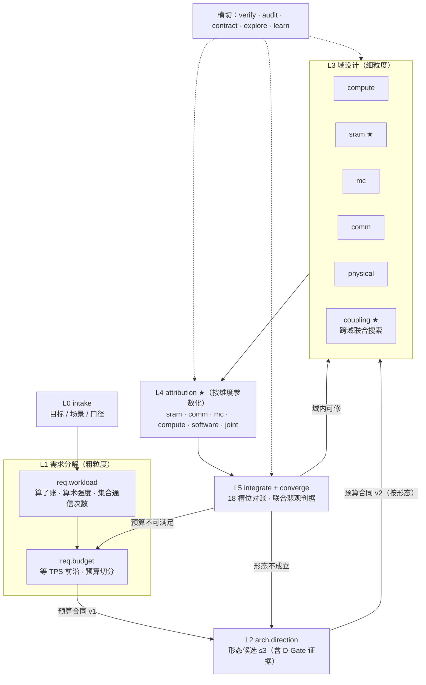

# 按设计问题组织的 Workflow 设计（建议稿）

版本：2026-10-08
状态：`PROPOSAL`，未实现；不改动 22 号文档已落地的任何机制

前置文档：[`22_AGENT_WORKFLOW_REFACTOR_PLAN.md`](22_AGENT_WORKFLOW_REFACTOR_PLAN.md)、
[`21_TPS_DESIGN_BASELINE.md`](../../../docs/architecture/21_TPS_DESIGN_BASELINE.md)、
[`integration/orchestration/WORKFLOWS.md`](../../../integration/orchestration/WORKFLOWS.md)

## 0. 要解决的问题

现有 19 个 workflow 是按**治理流程**切的（立项、契约、门控、域选点、Q1–Q8 细化步骤、复核）。
推理芯片架构设计真正要回答的是一串**设计问题**，前一个的答案是后一个的输入：

```text
目标 TPS/usr
  → 每 token 要做多少计算、搬多少字节、做多少次集合通信（算术强度）
  → 由此需要多少算力、多少持续带宽、多大的 τ 余量（需求 / 预算）
  → 哪种架构形态能同时满足（粗架构）
  → 每个硬件域在预算内怎么实现最省（细架构）
  → 每个维度（SRAM、集合通信、MC、算力、软件机制）动一下，TPS/usr 变多少、余量多少（维度归因）
  → 余量在联合悲观下是否还在（收敛）
```

现状与这条链的错位（详见评审结论）：

| 设计问题 | 现状 | 缺口 |
|---|---|---|
| 算术强度 → 算力 | 在 `detail.workload`，排在 C 组之后，agent 只转抄 | 顺序倒置；没有产出"预算" |
| 带宽 ↔ 集合通信 | 无 | `memory` 的旁证专家里没有 comm；没有一格回答 854.70 µs 怎么分 |
| 粗架构 | `direction` 只比 P1 × MC320/640 × TP8/16/32 共 6 点 | 比的是档位，不是形态 |
| 细架构 | C 组四域，可行条件是"保持已发布 TPS 不变" | 只回答"同 TPS 下谁最省"；**片上 SRAM 不在任何一个 C 组设计空间里** |
| 维度 → TPS/usr | 内核已有（`k3_tps_design_baseline.js`、`die_area_reallocation.js`），无 workflow 消费 | 需要一格把它变成每个维度的"灵敏度卡" |
| 收敛 | `converge` 不看联合悲观点 | 21 号 §6.1.1：设计指标应是联合悲观点 ≥ 1000（当前 906.51） |
| 层间串联 | 各 stage brief 无生成者；ledger 未经 `args` 传递；C 组 winner 无人消费 | 链是断的 |

## 1. 原则

**保留**（22 号文档的全部硬边界不动）：

- 策略无状态，上下文由 workflow 注入；12 个策略、四条硬边界、结构测试不变；
- 决定性数字只来自 `integration/detailed/*`、`integration/planning/*`、`integration/pipelines/*`；
- 门控只由 `evaluate_gates.js` 算；每格末尾 `invariant-checker` 检点；
- 数字单一来源、证据等级、`out/` 只放生成物。

**改变**：

1. **一格 = 一个设计问题**，不是一个流程步骤或一个角色。
2. **层间只传"预算合同"**（§3）。上层给下层的是"你必须满足的数"，下层回给上层的是"满足 / 不满足、差多少、代价多少"。
3. **每格都配一个确定性内核**，先由主循环跑出 `out/` 产物，再由 workflow 让专家解释。没有内核的格不建。
4. **维度归因是一等公民**：每个维度有自己的灵敏度卡，收敛依据的是这些卡，而不是粗细估 delta（当前粗细同源，delta 构造上为 0）。
5. **不新增裁决枚举**。回流到哪一层由 workflow 按"哪条预算没满足"决定（路由是数据），不交给 agent 判断。

## 2. 总图



★ 为新增。主链 10 格（L0 1、L1 2、L2 1、L3 6、L4 1 参数化、L5 2 → 合计 13 个脚本，`attribution` 一个脚本跑多个维度），横切 5 格，总数从 19（不含 P1 已加入的 `attribution`；加上后现有 20 个）降到 18，但**设计问题格从 6 个增加到 11 个，治理格从 13 个降到 7 个**。

## 3. 层间契约：预算合同

每一层产出一份 `out/budget/<layer>_budget.json`，下一层的 brief 由脚本从它派生（解决"各 stage brief 无生成者"）。

```json
{
  "schemaVersion": "budget-contract-v0.1",
  "layer": "L1",
  "sourceArtifacts": [{"path": "out/requirements/budget_frontier.json", "sha256": "..."}],
  "target": {"tpsPerUser": 1000, "architectureGate": 1050, "rawBudgetUs": 854.70, "engineeringMargin": 1.17},
  "split": [
    {"id": "B-MEM-BW",   "lane": "memory", "quantity": "sustainedBytesPerSecondPerRank", "min": null, "owner": "mc"},
    {"id": "B-SERIAL-CMP","lane": "serial", "quantity": "serialComputeUs",              "max": null, "owner": "compute"},
    {"id": "B-TAU",      "lane": "serial", "quantity": "tauUs",                         "max": null, "owner": "comm"},
    {"id": "B-SRAM-CAP", "lane": "memory", "quantity": "sharedWindowMiBPerCard",        "min": null, "owner": "sram"},
    {"id": "B-AREA",     "lane": "physical","quantity": "dieAreaMm2",                   "max": null, "owner": "physical"}
  ],
  "coupling": [{"between": ["B-SRAM-CAP", "B-MEM-BW"], "via": "prefetch depth / DMA wait", "source": "..."}],
  "evidenceLevel": "MODEL"
}
```

规则：

- `min` / `max` 由内核算出，agent 不填数，只能在 `split` 的**切法**之间选（例如"算力宽、τ 紧"与"算力紧、τ 宽"）。
- 下层格的可行条件**从"保持已发布 TPS"改为"满足本合同的每一条"**；排名仍按面积、功耗、风险。
- 下层无法满足某条时，返回该条 `id` 与差额；workflow 按 `owner` 和 `layer` 决定回流目标（§6）。

## 4. 逐格设计

每格写五件事：设计问题 / 确定性内核 / 策略实例 / 产出 / 回流。

### L0 `design.intake`（保留）

不变。补一处：产出的 brief 里要有 `target`（目标、门槛、margin）和 `scenarios`（模型 × B × context × TP 集合），供 L1 内核读取。

### L1-a `design.req.workload` — 每 token 的工作量与算术强度

- **设计问题**：三模型每 token 在每类算子上要做多少 FLOP、搬多少字节（dense 权重 / 路由专家 / KV）、做多少次集合通信、每次多少字节；每个算子的算术强度落在 roofline 哪一侧；哪些算子决定"要多少算力"，哪些决定"要多少带宽"。
- **内核**：`generate_planning_operator_workload.js`（已有）。新增一个只读汇总 `requirement_workload.js`，按模型 × TP 输出：FLOP/byte 按 core class 拆分、强度分布直方、集合通信次数与字节（`reference-393` / `repo-510` 两种口径并列，ADR-0004）。
- **策略实例**：`model-expert`（manifest 与未知字段，未知即 `BLOCKED_CONFIG`）→ `compute-expert` ∥ `memory-expert` ∥ `comm-expert`（各自认领"由本域资源决定的算子"，给出 bound 判断的出处）→ `integrator` → `invariant-checker`。
- **产出**：`out/requirements/workload_requirements.json`。
- **与现状的关系**：吸收 `design.detail.workload` 的内容，并把它**前移**到域设计之前。

### L1-b `design.req.budget` — 算力、带宽、集合通信的预算切分

- **设计问题**：要达到 1000 TPS/usr（raw 预算 854.70 µs），最低需要多少持续带宽，多少有效算力，τ 最多多大；算力和 τ 之间怎么换；TP 和 SRAM 怎么把带宽和集合通信耦合起来。
- **为什么能算**：规划 token time（`integration/planning/token_time.js`）是两条 lane 取 max：
  - memory lane 只依赖带宽 → 直接给出 `BW_min`；
  - serial lane = 算力项 + 固定项 + 暴露 TMA + 次数 × τ → 给定算力即得 `τ_max`（`maxTauForTarget` 已实现），反之亦然，是一条等 TPS 直线；
  - 带宽与 τ 在这个公式里**不直接互换**（两条 lane 并行），它们的耦合来自 TP（每 rank 字节随 TP 下降、集合通信不降）和 SRAM / 重叠（预取深度、commOverlap 改变 DMA wait 与 overlap，这部分只有详细模型能算）。
- **内核**：新增 `requirement_frontier.js`：
  1. 规划模型上，每个模型 × TP 给出 `BW_min`、`(effective compute, τ_max)` 前沿与集合通信带宽下限（`bytes/count/netBW ≤ τ`）；
  2. 详细模型（K3 TP32）上，在 `sharedMiB × depth × mcGBs` 小网格上重放，给出带宽 ↔ SRAM 的替代率；
  3. 枚举 2–4 种预算切法（算力 / τ / 带宽各自留多少余量），每种切法对应一份候选合同。
- **策略实例**：`architect` 提出切法意图（只选切法，不填数）→ `compute-expert` ∥ `memory-expert` ∥ `comm-expert` ∥ `physical-expert` 各自判断本域预算是否**物理上**可达（例如 τ ≤ 1.2 µs 是否有通路级依据，B-008）→ `framing-critic`（预算是否把设计空间写窄了）→ `invariant-checker`。
- **产出**：`out/requirements/budget_frontier.json`（内核）、`out/budget/L1_budget.json`（选定切法的合同）。
- **回流**：所有切法都有专家判"不可达" → 回 L0（目标或场景不可实现，交人决策）。

### L2 `design.arch.direction` — 粗架构形态（合并 `direction` 与 `dgate`）

- **设计问题**：哪几种架构形态能满足 L1 合同？瓶颈各在哪？留 ≤3 个。
- **内核**：扩展 `stage_a.js` 的候选空间，从"P1 × MC × TP"扩到**形态宏参数**：L/H 算力配比、片上 SRAM 总量与 local/shared 切分、MC 档位、die 数、TP。每个形态用 `A.physical(x)` 给面积 / 功耗，用 token time 给 TPS，并对照 L1 合同逐条标"满足 / 差多少"。D-Gate 仍由 `evaluate_gates.js` 计算。
- **策略实例**：每个候选一个 `architect` 实例（互不可见）→ `integrator` → `framing-critic` → `gate-keeper` ×1（一次核 8 条门槛，输出逐条数组；原 `dgate` 的 8 个独立实例收成 1 个，门控本来就由脚本算）→ `invariant-checker`。
- **产出**：`out/direction/direction_selected.json`、`out/budget/L2_budget.json`（按选定形态细化的合同，例如把 `B-SRAM-CAP` 拆成 local / shared）。

### L3 域设计（细粒度架构）

五个域共用 C 组现有骨架（策略 → 确定性搜索 → 旁证约束 → integrator → 检点），改两处：

1. **可行条件改为满足 L2 合同**，不再锚定已发布 TPS；
2. **旁证专家按耦合关系配**，见下表。

| workflow | 设计问题 | 设计空间 | 旁证专家 | 合同条目 |
|---|---|---|---|---|
| `design.compute` | L/H/Vector/Reduce 配比、低精度输入、SFU | `matrix_vector_design_space.json`（已有） | memory、physical | `B-SERIAL-CMP` |
| `design.sram` ★ | local / shared SRAM 容量、bank、slice、端口、TMA 通道 | 新增 `sram_design_space.json`，维度取自 `A.SPACE` 的 `lMiB/hMiB/sharedMiB/lBanks/hBanks/sharedSlices/tmaEngines` 与 `sharedPortScaling` | compute、**mc**、software | `B-SRAM-CAP` 及其与带宽的替代率 |
| `design.mc` | MC 档位、颗数、容量、路由、ECC | `memory_design_space.json`（已有，即现在的 `design.memory`） | **sram**、**comm**、physical | `B-MEM-BW` |
| `design.comm` | 拓扑、集合通信算法、RDMA lanes、Comm Core 控制路径 | `comm_core_design_space.json` + 新增拓扑 / RDMA 维度 | **mc**、compute、physical | `B-TAU` |
| `design.physical` | 封装、面积、功耗、热 | `physical_design_space.json`（已有） | compute、sram、mc、comm | `B-AREA` 等 |

`design.memory` 拆成 `design.sram` 与 `design.mc`：片上 SRAM 是本项目 TPS 的主要杠杆之一（KV tile 可行性、预取深度、H local tile 81% 占用），目前不在任何 C 组空间里。

#### L3 `design.coupling` ★ — 跨域联合

- **设计问题**：各域单独选出的点合在一起是否仍满足合同？耦合维度上有没有比"各自最优"更好的组合？
- **内核**：在各域 winner 邻域做小网格联合重放（详细模型 `O.evaluate`），固定三组耦合：
  - SRAM 容量 × 预取深度 × MC 带宽（带宽能否用 SRAM 换）；
  - τ × commOverlap × 算力（集合通信能否用重叠藏进算力）；
  - 面积再分配：SRAM ↔ 矩阵 ↔ Reduce/TMA/RDMA（复用 `die_area_reallocation.js`）。
- **策略实例**：耦合两侧的域专家 → `integrator`（取 Pareto，记录被否组合）→ `invariant-checker`。
- **产出**：`out/coupling/joint_point.json`：唯一一份"全局设计点" `x`，供 L4、L5 使用。**这也接上了现在"C 组 winner 无人消费"的断口。**

### L4 `design.attribution` ★ — 维度归因（按 `args.dimension` 参数化）

这是"SRAM、集合通信怎么影响最终 TPS/usr"的直接回答。一个脚本，按维度各跑一次。

- **内核**：新增 `tps_attribution.js <dimension>`，在 `joint_point.json` 的设计点上：
  1. **一阶灵敏度**：本维度每个参数 ±1 步（软件开关同时重调，避免把可调的损失算进硬件），输出 ΔTPS、Δraw µs；
  2. **性价比**：ΔTPS / Δmm²、ΔTPS / ΔW（`A.physical(x)`）。例如 `sharedPortScaling` 0.06 TPS 换 7.78 mm²（21 号 §5），这类项一眼可见；
  3. **盈亏点**：二分到 raw 预算（复用 `breakEven`）；
  4. **关键路径占比**：本维度在时间账中的份额（`ledger.opTimeUsByCategory`、`collectives`）；
  5. **维度内联合悲观**：本维度的未测参数同时取悲观端；
  6. **证据等级**：每个参数来自 spec / MODEL / ASSUMPTION，缺回标数据的列出要什么数据（Palladium cycle、PHY、trace）。
- **维度与参数**：

  | dimension | 参数 | 已有素材 |
  |---|---|---|
  | `sram` | `lMiB/hMiB/sharedMiB`、`banks/slices`、`kvTile`、`layoutImbalance`、`sharedPortScaling`、`depth` | `sensitivity.depth/kvTile16384`、`layoutImbalance` 扫描 |
  | `comm` | `τ`、计数口径、`commOverlap`、`pvMerge`、`rdmaLanes`、拓扑 | `tauBreakEvenUs`、`countBasis`、逐项回退 |
  | `mc` | `mcGBs`、`mcUtil`、预测命中率、`dmaPreempt`、`kvPrefetch` | `sensitivity.mcGBs`、`mcUtil` 扫描 |
  | `compute` | `nL/nH`、engine 形状、`vectorLanes`、`matrixUtil/vectorUtil`、unpack 速率 | `ASSUMPTION_SWEEPS` |
  | `software` | 10 个机制的单项 / 联合回退 | `software.mechanisms`、`jointAblation` |
  | `joint` | 跨维度联合悲观（`JOINT_PESSIMISTIC.allUnmeasured`） | `jointPessimistic` |

- **策略实例**：本维度域专家（解释哪些参数是承重的、哪些是富余的、先拿哪个实测）∥ `software-expert`（判断哪些收益依赖软件机制成立）→ `integrator` → `invariant-checker`。`joint` 维度由 `architect` 代替域专家。
- **产出**：`out/attribution/<dimension>_card.json`（灵敏度卡），字段：`parameters[]{name, value, evidence, dTps, dRawUs, dTpsPerMm2, dTpsPerW, breakEven, criticalShare, measurementNeeded}`、`jointPessimistic`、`loadBearing[]`、`slack[]`。
- **回流**：某参数的盈亏点落在其物理可信区间内（由专家依策略判断，比如 τ 盈亏点 1.35 µs 而通路估计 ≥ 1.3 µs）→ 标成 `loadBearing`，交给 L5。

#### P1 实现状态（`sram` / `comm` / `joint` 已实现，与上文的出入）

实现在 `integration/detailed/tps_attribution.js`（内核）、`integration/pipelines/generate_tps_attribution.js`（`npm run attribution:cards`）、`integration/orchestration/design.attribution.workflow.js`，测试 `tests/regression/test_tps_attribution.js`。与上面设计稿不同的地方：

1. **设计点**：`joint_point.json` 还不存在（L3 `coupling` 未做），P1 用发布点 `out/rdma/k3_rdma_final_tuning_results.json` 的 `search.best.x`，卡的 `inputs.pointSource` 写明这一点。
2. **软件开关不随移动重调**：每一步只换一个量、其余（含 `OPT`）不变，是回放不是重搜。所以硬件行的 ΔTPS 是"软件不跟着调"时的上界损失；重调留到有 `coupling` 之后。
3. **行结构**：每个参数一行，`moves[]` 列出每一步（`dTps`、`dRawUs`、`dDieAreaMm2`、`dDiePowerW`、`dTpsPerMm2`、`dTpsPerW`、`withinBudget`，以及联合悲观点上的同一步），外加 `breakEven`、`evidence`、`measurementNeeded`、`owner`。分类是机械的枚举：`loadBearing` / `graded` / `slack` / `insensitive` / `basis` / `untested`，判据写在卡的 `classes` 里；计数口径（`countBasis`）恒为 `basis`，不能记为性能收益或损失。承重行另带 `bearsBy`：`budget`（某个可行的不利移动超出 raw 预算）或 `feasibility`（只撞上硬约束）。映射变量（`kvTile`、`depth`、`headTile`）的不可行邻点、以及模型算不了的输入（报 `model error`）都不计入分类。卡的 `bindingConstraints` 按约束汇总所有不可行移动：同一条约束挡住多行，说明设计点正贴着这面墙。
4. **关键路径占比**放在维度级 `criticalPath`（本维度服务项在时间账中的份额），不是逐参数字段；`joint` 卡没有这一项。
5. **`joint` 由 owner 专家审**，不由 `architect`：每一行（`JOINT_PESSIMISTIC.allUnmeasured` 的一个键）交给它所属维度的 owner；卡里的 `jointPessimistic.routing` 机械给出"补回最多的维度及其 owner"。`architect` 的方向裁决留给 L5 / §6。
6. **审读落盘位置**：卡是生成物，在 `out/attribution/<dimension>_card.json`；workflow 的审读与 run record 落 `out/attribution/reviews/`（`LANDING_POLICY` 只放行这个目录），不能写到卡旁边。`run_workflow.js attribution --dimension <d>` 读卡、核对 `baselineSha256`，过期卡拒收。
7. **未做的维度**：`mc`、`compute`、`software` 未实现；`comm` 维度没有声明悲观端，维度内联合悲观只对 `sram` 有意义，`comm` 卡写明了这一点。
8. 任何 Gate 都不读卡（测试强制 `out/governance/` 不引用 `out/attribution`）；§4 L5-b 的新判据仍是建议，未进 `evaluate_gates.js`。
9. **耦合移动**（首次真实运行 `sram` 后补，见 `out/attribution/reviews/attribution_sram_outcome.json`）：专家反复问"两个参数一起动会怎样"，而单行回放答不了。卡里新增 `couplings[]`：每对因子各自单动、一起动，`interactionTps = both − a − b`（在平移参照点 `at` 上时再加回参照点的 ΔTPS），以及 `breaksOnlyTogether`（各自都在预算内、一起就超）。耦合只报告、不参与分类。`sram` 现有 29 对：kvTile × kvCache、{sharedPortScaling, kvPrefetch, tmaLane, kvCache} × layoutImbalance、kvPrefetch × dmaPreempt、kvCache × softmaxFusion（kvCache 的几对在 kvTile=16384 上做，发布点上关 FP8 KV 直接撞 H local tile）；第二次真实运行后按专家要求补了 hMiB × {kvTile, layoutImbalance, kvCache}、hBanks × layoutImbalance、tmaLane × {kvPrefetch, commOverlap}、headTile × kvCache、sharedSlices × sharedPortScaling。`comm` 暂无。
10. **占用率由模型算**：H / L local tile 占用写在 `criticalPath.occupancy.localTile`，同时给 `shareOfUsable`（分母 = 容量 × `LIMITS.usable`，即 `A.mappedPlan` 的可行判据）与 `shareOfCapacity`；evidence 字段不再手写百分比。
11. **引用核对**：返回值里的 `文件:行号` 在落盘前由 `integration/pipelines/check_citations.js` 机械核对（文件存在、不越界、所引行有文字——空行、表格边框、代码围栏、单独的括号都不算），不过即不落盘（`run_workflow.js` 退出码 7）。`attribution` 另核对专家 `plausibleRange` 里的卡外数字（带小数点或至少三位）必须出现在其 `rangeEvidence` 所引的某一行上，同样退出码 7；出处只有 ADR / blocker 编号的计为 unchecked。行内容是否支持论断仍由 `invariant-checker` 判断。
12. **第二次真实运行后的修改**（`sram`，INVARIANT_VIOLATED，五条违规都是引用偏了几行或理由里写了卡外数字）：
    - **卡外数字在 workflow 内机械比对**：审读的 `reason` 只许出现卡里的数或本行 `plausibleRange` 里的数，`note` / `softwareDependence` 与合并结果只许出现卡里的数或任一专家 `plausibleRange` 里的数。不合规的回到同一个 agent 修正一次（`repair:<agentId>`），仍不合规即记入 `mechanicalChecks.looseNumbers`，检点者说 OK 也不落盘。规则与 `check_citations.js` 的 `numberTokens` 相同，单测核对两份实现一致。
    - **`breakEvenBy`**：每个有数值盈亏点的行注明盈亏点由什么决定——越过一点后仍可行的是 `budget`，越过即不可行的是 `feasibility`（带不可行原因）。`layoutImbalance` 的 1.42 是 H local tile 放不下（`feasibility`），不是 raw 预算；它的 `measurementNeeded` 分写容量（宏形状不均衡）与时间（逐 bank 直方图）两个角色。
    - **`headTile` 行**（映射变量，48 / 96）。发布点上 bf16 KV 不可行是 H local tile 放不下（KV slab 字节翻倍），`headTile=48 x kvCache off`、`hMiB=8 x kvCache off` 两对都能让 bf16 可行；`teams/software/docs/TUNING_CONTRACT.md` §2 第 4 条原先把原因写成 dequant 代价，已改正。

### L5-a `design.integrate`（合并 D 组五格）

- **设计问题**：同一设计点、同一 manifest 下，18 个槽位（3 模型 × TP8/16/32 × MC320/640）规划值与详细值是否一致；哪些槽位只是 K3 因子的外推（`UNCORROBORATED`）。
- **为什么合并**：现在规划与详细在 K3 TP32 上同源，粗细 delta 构造上为 0（21 号 §6.2）。拆成 freeze → workload → events → execute → integrate 五格串行，审的是同一份账。等有了事件级回放或 Palladium 数据，再把 events / execute 拆回独立格。
- **策略实例**：`model-expert`（冻结项可复现）∥ `memory-expert` ∥ `comm-expert`（守恒）→ `integrator`（逐槽位对账）→ `verifier` → `invariant-checker`。
- **产出**：`out/detailed/detail_integrate.json`（含 freeze 清单）。

### L5-b `design.converge`（保留，换判据）

- **新判据**（由脚本算，写进 `evaluate_gates.js` 的 Q-Gate 扩展，不由 agent 判）：
  1. `joint` 灵敏度卡的联合悲观 TPS ≥ 目标；
  2. 每个 `loadBearing` 参数都有 owner、证据等级与回标计划；
  3. 18 槽位都有值或终止性 blocker。
- **策略实例**：不变（相关专家 1–3 → `framing-critic` → `gate-keeper` → `architect` → `invariant-checker`）。
- **产出**：`converge_proposal.json`；裁决仍是 `ARCH_FREEZE` / `DIRECTION_BACKFLOW` / `D_GATE_PROPOSAL`。

### 横切（不进主链）

| workflow | 处理 |
|---|---|
| `design.verify`、`design.audit` | 保留。复核对象增加预算合同与灵敏度卡 |
| `design.backflow` | 保留，但输入从"粗细 delta 归因"改为"未满足的合同条目 + 灵敏度卡"，见 §6 |
| `design.contract` | 保留为按需格，不在主链 |
| `design.explore`、`design.learn` | 不变 |

## 5. 新旧对照

| 现有 | 去向 |
|---|---|
| `intake` | L0 `intake` |
| `detail.workload` | 前移并入 L1-a `req.workload` |
| —— | 新增 L1-b `req.budget` |
| `direction` + `dgate` | 合并为 L2 `arch.direction` |
| `compute` / `comm` / `physical` | L3，可行条件改为合同 |
| `memory` | 拆为 L3 `sram` ★ 与 `mc` |
| —— | 新增 L3 `coupling` |
| —— | 新增 L4 `attribution` |
| `detail.freeze` / `events` / `execute` / `integrate` | 合并为 L5-a `integrate`（有事件级数据后再拆） |
| `converge` | L5-b，换判据 |
| `verify` / `audit` / `backflow` / `contract` / `explore` / `learn` | 横切 |

## 6. 回流路由（数据，不是行为）

回流目标由 workflow 按"哪条合同没满足"查表决定，agent 只报裁决枚举与合同条目 id：

| 触发 | 回到 |
|---|---|
| L3 某域无候选满足 `B-*`，且 `coupling` 也换不出来 | L1-b，带"差额 + 该域最好点" → 重新切分预算 |
| L1-b 所有切法都不可达 | L0，交人决定目标或场景 |
| L2 无形态满足合同 | L1-b（先看预算切法），再 L0 |
| L4 `loadBearing` 参数的盈亏点落在物理可信区间内 | L3 对应域（加余量）或 L1-b（改切法），二选一由 `architect` 裁决 |
| L5 联合悲观 < 目标 | 按 `joint` 卡里贡献最大的维度回到对应 L3 域 |

每次回流写入 `design_ledger.rejectedOptions`，被否的切法 / 形态 / 域候选不会在下一轮被重新发明。

## 7. 串联修复（落地前提）

1. **brief 派生脚本** `integration/pipelines/make_brief.js <stage>`：从 intake brief + 上一层 `out/budget/*_budget.json` 确定性地生成本层 brief；`run_workflow.js` 默认调用它，不再只有 compute 有默认 brief。
2. **ledger 注入**：`run_workflow.js` 读 `out/governance/design_ledger.json` 作为 `args.ledger` 注入；落盘时合并 `ledgerPatch`。
3. **设计点单一来源**：L3 之后所有格读 `out/coupling/joint_point.json`，它和 `k3_mc_baseline.json` 不一致时需走 ADR 同步（沿用 `baseline:sync`）。

## 8. 实施顺序

按"对设计问题的回答价值 / 新代码量"排序：

| 步骤 | 内容 | 新增代码 | 理由 |
|---|---|---|---|
| P1（已实现，见 §4 L4 的实现状态） | L4 `attribution` + `tps_attribution.js`，先做 `sram`、`comm`、`joint` 三个维度 | 内核约 70% 可复用 `k3_tps_design_baseline.js` / `die_area_reallocation.js` | 直接回答"SRAM、集合通信怎么影响 TPS/usr"；不依赖其他格 |
| P2 | L1-b `req.budget` + `requirement_frontier.js` | 规划部分基本是 `maxTauForTarget` 的推广；详细部分是小网格重放 | 把"算力 / 带宽 / τ"的关系变成可下发的合同 |
| P3 | 预算合同 schema + `make_brief.js` + ledger 注入 | 中 | 接通层间链 |
| P4 | L3 改可行条件；拆 `sram` / `mc`；补旁证专家 | `sram_design_space.json` + 搜索脚本 | 依赖 P2 的合同 |
| P5 | L3 `coupling` | 中 | 依赖 P4 |
| P6 | L1-a 前移、L2 合并、L5 合并、converge 新判据 | 以删改为主 | 收口 |

**P1 之后停一次**：如果灵敏度卡在真实设计点上读不出"哪些参数承重"，说明维度切法或参数清单不对，应先调整再往下做。

成本：主链单轮约 L1 ≈ 12、L2 ≈ 6+N、L3 ≈ 5×(4+N) + 4、L4 ≈ 4×6、L5 ≈ 12 个策略实例；N 取 4 时约 110 个，低于现有全量的 300 多个。L4 各维度互相独立，可以并行跑。

## 9. 不做的

- 不让 agent 产出预算数值或灵敏度数值：切法由 `architect` 选，数由内核算。
- 不新增裁决枚举、不新增策略：12 个策略足够覆盖，回流层级由 workflow 查表。
- 不为每个参数建一格：维度是格，参数是卡里的行。
- 在详细模型只覆盖 K3 TP32 时，不宣称 GLM-5.2、DeepSeek-V4-Pro 有维度归因：它们的卡标 `UNCORROBORATED`，只给规划口径的灵敏度。
