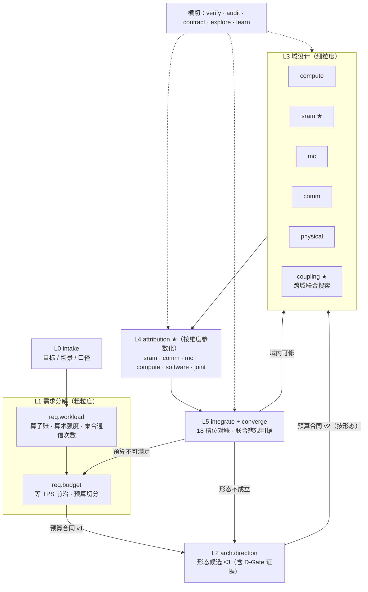

# 按设计问题组织的 Workflow 设计（建议稿）

版本：2026-10-08
状态：`PROPOSAL`，未实现；不改动 22 号文档已落地的任何机制

前置文档：[`22_AGENT_WORKFLOW_REFACTOR_PLAN.md`](22_AGENT_WORKFLOW_REFACTOR_PLAN.md)、
[`21_TPS_DESIGN_BASELINE.md`](../../../docs/architecture/21_TPS_DESIGN_BASELINE.md)、
[`integration/orchestration/WORKFLOWS.md`](../../../integration/orchestration/WORKFLOWS.md)

## 0. 要解决的问题

现有 19 个 workflow 是按**治理流程**切的（立项、契约、门控、域选点、Q1–Q8 细化步骤、复核）。
推理芯片架构设计真正要回答的是一串**设计问题**，前一个的答案是后一个的输入：

```text
目标 TPS/usr
  → 每 token 要做多少计算、搬多少字节、做多少次集合通信（算术强度）
  → 由此需要多少算力、多少持续带宽、多大的 τ 余量（需求 / 预算）
  → 哪种架构形态能同时满足（粗架构）
  → 每个硬件域在预算内怎么实现最省（细架构）
  → 每个维度（SRAM、集合通信、MC、算力、软件机制）动一下，TPS/usr 变多少、余量多少（维度归因）
  → 余量在联合悲观下是否还在（收敛）
```

现状与这条链的错位（详见评审结论）：

| 设计问题 | 现状 | 缺口 |
|---|---|---|
| 算术强度 → 算力 | 在 `detail.workload`，排在 C 组之后，agent 只转抄 | 顺序倒置；没有产出"预算" |
| 带宽 ↔ 集合通信 | 无 | `memory` 的旁证专家里没有 comm；没有一格回答 854.70 µs 怎么分 |
| 粗架构 | `direction` 只比 P1 × MC320/640 × TP8/16/32 共 6 点 | 比的是档位，不是形态 |
| 细架构 | C 组四域，可行条件是"保持已发布 TPS 不变" | 只回答"同 TPS 下谁最省"；**片上 SRAM 不在任何一个 C 组设计空间里** |
| 维度 → TPS/usr | 内核已有（`k3_tps_design_baseline.js`、`die_area_reallocation.js`），无 workflow 消费 | 需要一格把它变成每个维度的"灵敏度卡" |
| 收敛 | `converge` 不看联合悲观点 | 21 号 §6.1.1：设计指标应是联合悲观点 ≥ 1000（当前 906.51） |
| 层间串联 | 各 stage brief 无生成者；ledger 未经 `args` 传递；C 组 winner 无人消费 | 链是断的 |

## 1. 原则

**保留**（22 号文档的全部硬边界不动）：

- 策略无状态，上下文由 workflow 注入；12 个策略、四条硬边界、结构测试不变；
- 决定性数字只来自 `integration/detailed/*`、`integration/planning/*`、`integration/pipelines/*`；
- 门控只由 `evaluate_gates.js` 算；每格末尾 `invariant-checker` 检点；
- 数字单一来源、证据等级、`out/` 只放生成物。

**改变**：

1. **一格 = 一个设计问题**，不是一个流程步骤或一个角色。
2. **层间只传"预算合同"**（§3）。上层给下层的是"你必须满足的数"，下层回给上层的是"满足 / 不满足、差多少、代价多少"。
3. **每格都配一个确定性内核**，先由主循环跑出 `out/` 产物，再由 workflow 让专家解释。没有内核的格不建。
4. **维度归因是一等公民**：每个维度有自己的灵敏度卡，收敛依据的是这些卡，而不是粗细估 delta（当前粗细同源，delta 构造上为 0）。
5. **不新增裁决枚举**。回流到哪一层由 workflow 按"哪条预算没满足"决定（路由是数据），不交给 agent 判断。

## 2. 总图



★ 为新增。主链 10 格（L0 1、L1 2、L2 1、L3 6、L4 1 参数化、L5 2 → 合计 13 个脚本，`attribution` 一个脚本跑多个维度），横切 5 格，总数从 19（不含 P1 已加入的 `attribution`；加上后现有 20 个）降到 18，但**设计问题格从 6 个增加到 11 个，治理格从 13 个降到 7 个**。

## 3. 层间契约：预算合同

每一层产出一份 `out/budget/<layer>_budget.json`，下一层的 brief 由脚本从它派生（解决"各 stage brief 无生成者"）。

```json
{
  "schemaVersion": "budget-contract-v0.1",
  "layer": "L1",
  "sourceArtifacts": [{"path": "out/requirements/budget_frontier.json", "sha256": "..."}],
  "target": {"tpsPerUser": 1000, "architectureGate": 1050, "rawBudgetUs": 854.70, "engineeringMargin": 1.17},
  "split": [
    {"id": "B-MEM-BW",    "lane": "memory",  "quantity": "mcPayloadGBsPerCube", "min": null, "owner": "mc",       "ownerAgent": "memory-expert"},
    {"id": "B-SERIAL-CMP","lane": "serial",  "quantity": "computeScale",        "min": null, "owner": "compute",  "ownerAgent": "compute-expert"},
    {"id": "B-TAU",       "lane": "serial",  "quantity": "tauUs",               "max": null, "owner": "comm",     "ownerAgent": "comm-expert"},
    {"id": "B-SRAM-CAP",  "lane": "memory",  "quantity": "sharedMiBPerDie",     "min": null, "owner": "sram",     "ownerAgent": "memory-expert"},
    {"id": "B-AREA",      "lane": "physical","quantity": "dieAreaMm2",          "max": null, "owner": "physical", "ownerAgent": "physical-expert"}
  ],
  "coupling": [{"between": ["B-SRAM-CAP", "B-MEM-BW"], "via": "prefetch depth / DMA wait", "source": "..."}],
  "evidenceLevel": "MODEL"
}
```

规则：

- `min` / `max` 由内核算出，agent 不填数，只能在 `split` 的**切法**之间选（例如"算力宽、τ 紧"与"算力紧、τ 宽"）。
- 下层格的可行条件**从"保持已发布 TPS"改为"满足本合同的每一条"**；排名仍按面积、功耗、风险。
- 下层无法满足某条时，返回该条 `id` 与差额；workflow 按 `owner` 和 `layer` 决定回流目标（§6）。

## 4. 逐格设计

每格写五件事：设计问题 / 确定性内核 / 策略实例 / 产出 / 回流。

### L0 `design.intake`（保留）

不变。补一处：产出的 brief 里要有 `target`（目标、门槛、margin）和 `scenarios`（模型 × B × context × TP 集合），供 L1 内核读取。

### L1-a `design.req.workload` — 每 token 的工作量与算术强度

- **设计问题**：三模型每 token 在每类算子上要做多少 FLOP、搬多少字节（dense 权重 / 路由专家 / KV）、做多少次集合通信、每次多少字节；每个算子的算术强度落在 roofline 哪一侧；哪些算子决定"要多少算力"，哪些决定"要多少带宽"。
- **内核**：`generate_planning_operator_workload.js`（已有）。新增一个只读汇总 `requirement_workload.js`，按模型 × TP 输出：FLOP/byte 按 core class 拆分、强度分布直方、集合通信次数与字节（`reference-393` / `repo-510` 两种口径并列，ADR-0004）。
- **策略实例**：`model-expert`（manifest 与未知字段，未知即 `BLOCKED_CONFIG`）→ `compute-expert` ∥ `memory-expert` ∥ `comm-expert`（各自认领"由本域资源决定的算子"，给出 bound 判断的出处）→ `integrator` → `invariant-checker`。
- **产出**：`out/requirements/workload_requirements.json`。
- **与现状的关系**：吸收 `design.detail.workload` 的内容，并把它**前移**到域设计之前。

#### P6 之 L1-a 实现状态（已实现，与上文的出入）

实现在 `integration/planning/requirement_workload.js`（内核）、`integration/pipelines/generate_workload_requirements.js`（`npm run workload:requirements`）、`integration/orchestration/design.req.workload.workflow.js`，结构测试 `tests/structure/test_req_workload_structure.js`（原 D 组的 B1 验收判据整段搬进来，一条未删）。与上面的设计稿不同：

1. **落盘分两处，不并排**。内核写 `out/requirements/workload_requirements.json`（与前沿同级，生成物）；workflow 落 `out/requirements/workload/req_workload.json` 与 run record。同一目录里既有生成器产物又有 workflow 产物，清理与复现都说不清哪一个是谁写的，所以 `land.js` 只给 `req.workload` 放行子目录。
2. **三条 sizing 比在内核里重定义**。原 `detail.workload` 的三条比（算力 / 带宽 / 网络）在详细模型上是逐算子的，前移到规划层后改为需求侧口径：所需/可用算力、带宽与网络。名字沿用（`requiredToAvailableRatio` / `…BandwidthRatio` / `…NetworkRatio`），算子账本里每个算子仍逐条带这三项，但值来自内核，本格与任何 agent 都不产生这些数——agent 一旦"自己算一遍"，这一格就又有了一套与内核不同的强度。
3. **集合通信是并列的第三位申报人**（`comm-expert`），不是由内存侧兼管；次数与字节按 `reference-393` / `repo-510` 两口径并列陈述（ADR-0004）。
4. **顺序接线**：`make_brief.js` 从 `brief_intents.json#stages` 的键派生覆盖，因此加 `req.workload` 段即覆盖；两份 schema 的 `stage` 枚举随之加 `req.workload`。排在 `intake` 之后、`req.budget` 之前——工作量是预算切分的输入。`design.detail.workload.workflow.js` 随之删除，`runtime/land.js` 的 `LANDING_POLICY` 去掉该键、补上 `req.workload`（键数不变）。
5. **`run_workflow.js` 拒收过期汇总**：读入 `workload_requirements.json` 后核对 `inputs.sourceArtifacts`（基线、规划算子账、`resource_profiles.js`）的 sha256，任一变化即停——汇总过期就是"谁都不在设计的那份模型"的视图，不能等算完再比数。

### L1-b `design.req.budget` — 算力、带宽、集合通信的预算切分

- **设计问题**：要达到 1000 TPS/usr（raw 预算 854.70 µs），最低需要多少持续带宽，多少有效算力，τ 最多多大；算力和 τ 之间怎么换；TP 和 SRAM 怎么把带宽和集合通信耦合起来。
- **为什么能算**：规划 token time（`integration/planning/token_time.js`）是两条 lane 取 max：
  - memory lane 只依赖带宽 → 直接给出 `BW_min`；
  - serial lane = 算力项 + 固定项 + 暴露 TMA + 次数 × τ → 给定算力即得 `τ_max`（`maxTauForTarget` 已实现），反之亦然，是一条等 TPS 直线；
  - 带宽与 τ 在这个公式里**不直接互换**（两条 lane 并行），它们的耦合来自 TP（每 rank 字节随 TP 下降、集合通信不降）和 SRAM / 重叠（预取深度、commOverlap 改变 DMA wait 与 overlap，这部分只有详细模型能算）。
- **内核**：新增 `requirement_frontier.js`：
  1. 规划模型上，每个模型 × TP 给出 `BW_min`、`(effective compute, τ_max)` 前沿与集合通信带宽下限（`bytes/count/netBW ≤ τ`）；
  2. 详细模型（K3 TP32）上，在 `sharedMiB × depth × mcGBs` 小网格上重放，给出带宽 ↔ SRAM 的替代率；
  3. 枚举 2–4 种预算切法（算力 / τ / 带宽各自留多少余量），每种切法对应一份候选合同。
- **策略实例**：`architect` 提出切法意图（只选切法，不填数）→ `compute-expert` ∥ `memory-expert` ∥ `comm-expert` ∥ `physical-expert` 各自判断本域预算是否**物理上**可达（例如 τ ≤ 1.2 µs 是否有通路级依据，B-008）→ `framing-critic`（预算是否把设计空间写窄了）→ `invariant-checker`。
- **产出**：`out/requirements/budget_frontier.json`（内核）、`out/budget/L1_budget.json`（选定切法的合同）。
- **回流**：所有切法都有专家判"不可达" → 回 L0（目标或场景不可实现，交人决策）。

#### P2 实现状态（已实现，与上文的出入）

实现在 `integration/planning/requirement_frontier.js`（内核）、`integration/pipelines/generate_budget_frontier.js`（`npm run budget:frontier`，写 `out/requirements/budget_frontier.json`）、`integration/orchestration/design.req.budget.workflow.js`，测试 `tests/regression/test_budget_frontier.js`（存盘前沿 = 重算；规划直线与 `token_time.maxTauForTarget` 一致；每份合同在自己的点上用两个模型复算守得住预算）与 `tests/regression/test_workflow_driver.js`。与上面设计稿不同的地方：

1. **量的口径**（§3 的示例已按实现改）：带宽用 `mcPayloadGBsPerCube`（每颗 MC 的有效载荷带宽，规划与详细模型共用的旋钮），算力用 `computeScale`（相对 P1 引擎峰值 × `A.TECH` 达成率的倍数，1 = 发布点；合同另附各模型的 `serialComputeUsMax` 作参考），SRAM 用 `sharedMiBPerDie`。每条带 `ownerAgent`（审读它的专家），`owner` 仍是域名。
2. **切法是内核枚举的，不由 `architect` 先提**：内核固定给 4 份候选切分——`S-TAU`（只放宽 τ）、`S-CMP`（只放宽算力）、`S-BW`（只放宽带宽）、`S-BAL`（三轴各让出单轴余量的同一比例）。单轴余量取规划（TP32 上每个未阻断模型）与详细（K3 TP32）中更紧的一个。当前前沿：τ 最多 1.355 µs（详细 K3 卡住，规划 1.408），算力最低 0.744（详细 K3），MC 载荷最低 580.5 GB/s/cube（规划 K3 卡住，介于 MC320 与 MC640 之间）。`S-BAL` 的比例约 0.533。
3. **先审可达性，再选**：四个 owner 专家并行审**所有**切分里本域的条目（`reachable` / `unreachable` / `unknown`，附可信区间与出处）；有条目被判不可达的切分被否，记入 `ledgerPatch.rejectedOptions`（`rejectedBy` 为该专家）；`architect` 只在剩下的切分里选 id（schema 的 `enum` 就是剩下的那几份），不填数。这样 `architect` 不会选中一份专家已否的切分，被否切分也不靠 `architect` 转述。选中切分里判 `unknown` 的条目记为开放 blocker（`REACH-REQ-BUDGET-*`，owner 为该专家），`framing-critic` 的缺口记为 `FRAMING-REQ-BUDGET-*`。
4. **落盘核对**：`out/budget/L1_budget.json` 是所选切分的合同原样加 `selection`（`chosenBy`、`reachable`、`ruledOut`、`openBlockers`、`frontierSha256`）；`run_workflow.js` 落盘前逐字段比对前沿里那份切分，并核对 `frontierSha256` 是读入的那份前沿（`verifyLandedBudget`，不符退出码 5）。专家 `plausibleRange` 里的前沿外数字要出现在其 `rangeEvidence` 所引的行上（与 `attribution` 共用 `check_citations.js`，退出码 7）；理由里的前沿外数字由 workflow 比对，修正一次仍不合规即 `INVARIANT_VIOLATED`。
5. **`B-AREA` 的限值**：用详细模型实际执行的 `k3_physical_basis.BASIS.limits`（SF4、液冷：die 400 mm²、die 300 W、卡 2800 W），不是 `A.LIMITS` 的风冷功耗口径；合同同时给发布点与 SRAM 下限处的面积 / 功耗。
6. **覆盖范围**：规划部分覆盖三个模型 × TP8/16/32，合同只在 TP32 上切（`scope.tp`）；`B-SRAM-CAP` 与所有详细界只有 K3（规划模型没有 SRAM 项），其他模型 `UNCORROBORATED`。软件开关全程保持发布点的 `OPT`，不重调。带宽搜索止于 MC640，需要超过 MC640 的切分不提供。
7. **回流**：所有切分都被否（或内核一份都给不出）→ `DIRECTION_BACKFLOW`，`routeTo: design.intake`（L0，交人决定目标或场景），落结果记录 `out/budget/req_budget_outcome.json`；`physical-expert` 的 `PPA_DIRECTION_BACKFLOW` 或 `architect` 判方向回退 → `routeTo: design.arch.direction`。
8. **合同的下游消费者在 P3 接上**：`direction` / `compute` / `memory` / `comm` / `physical` 的 brief 由 `make_brief.js` 从合同派生（见 §8 的 P3 实现状态）。L2 / L3 的搜索脚本本身仍按"保持已发布 TPS"判可行——合同进的是题面（预算与硬约束），不是搜索的可行判据。任何 Gate 都不读前沿或合同。

### L2 `design.arch.direction` — 粗架构形态（合并 `direction` 与 `dgate`）

- **设计问题**：哪几种架构形态能满足 L1 合同？瓶颈各在哪？留 ≤3 个。
- **内核**：扩展 `stage_a.js` 的候选空间，从"P1 × MC × TP"扩到**形态宏参数**：L/H 算力配比、片上 SRAM 总量与 local/shared 切分、MC 档位、die 数、TP。每个形态用 `A.physical(x)` 给面积 / 功耗，用 token time 给 TPS，并对照 L1 合同逐条标"满足 / 差多少"。D-Gate 仍由 `evaluate_gates.js` 计算。
- **策略实例**：每个候选一个 `architect` 实例（互不可见）→ `integrator` → `framing-critic` → `gate-keeper` ×1（一次核 8 条门槛，输出逐条数组；原 `dgate` 的 8 个独立实例收成 1 个，门控本来就由脚本算）→ `invariant-checker`。
- **产出**：`out/direction/direction_selected.json`、`out/budget/L2_budget.json`（按选定形态细化的合同，例如把 `B-SRAM-CAP` 拆成 local / shared）。

#### P6 之 L2 实现状态（已实现，与上文的出入）

实现在 `integration/planning/morphology.js`（内核，新增）、`integration/pipelines/stage_a.js`（扩展候选空间）、`integration/orchestration/design.arch.direction.workflow.js`（原 `design.direction` + `design.dgate` 合并，两文件已删），测试 `tests/governance/test_stage_a_directional_run.js`（扩写）。与上面的设计稿不同：

1. **形态空间与打分卡是两块，不是一块**。形态宏参数不并入 Stage A 的 18 行候选打分卡，而是作为独立的 `direction.morphology` 块挂在同一份 `out/direction/directional_tps_scorecard.json` 上。理由是 `candidateCountLe3` 数的必须是**被提交的**候选：25 个形态行混进排名，D-Gate 的第 8 条就成了计数错误，而且是"把还没选的形态当成了已选"。所以 D-Gate 仍只读那 18 行网格，形态表喂的是 L2 的合同判定与 L2 预算。`tests/stage_a` 里有一条断言钉住这一点：形态 id 一个都不得出现在 `score.resourceProfiles` 里。

2. **形态 id 夹在 profile 与 MC 档位之间**。`P1-compact-N8x4-L1H4S16-MC640-TP32`。`teams/hardware/src/resource_profiles.js` 的三个解析器（`physicalProfileOf` 用 `startsWith`、`mcProfileOf` 用 `includes('MC640')`、`tpOf` 用 `/TP(\d+)$/`）都从这个位置读，`stage_b.js` 三处都调；tag 插在中间，三者全不受影响，而未偏离发布点的一行保持它原来的名字 `P1-compact-MC640-TP32`。

3. **锚在发布点上，且加载时就核**。整张形态表的原点取 `out/rdma/k3_rdma_final_tuning_results.json#/search/best/x`（`token_time.js` 的标定也引它），不另存一份。模块加载时先算一遍该点的 `peakByCore` 与 MC 带宽，若不等于 `RES.coreProfiles.P1.peakByCore` / `RES.mcProfiles.MC640.effectiveBytesPerSecond` 即抛错——发布点漂了就必须大声失败，而不是从错误的原点量出 25 组数。

4. **面积 / 功耗走已有权威，不新写模型**。`A.physical(x, dies)`（`dies` 参数是本次为它加的，默认 `LIMITS.dies`）给 per-die 面积 / 功耗，再经 `P.resize(physical, P.BASIS, dies)` 归到 L1 合同 `B-AREA` 所写的 SF4 / 液冷基准（die 400 mm²、die 300 W、卡 2800 W）；tier 依赖的项（`rdmaCardGB` / `cardPower` / `packageArea`）随 `dies` 走，`cubes = dies × LIMITS.mcCountPerDie`。测试里拿合同自己的 `B-AREA.atPublishedSram` 三个数反查发布点那一行，两者必须一致。

5. **TPS 走 slot，不注册新 profile**。每个形态把 `peakByCore` 与 `memoryBytesPerSecond` **背在 slot 上**（ADR-0021：一套硬件规格，规格没枚举的形态不配 `coreProfiles` 条目，它只为一次评估随 slot 走）。这样 `score.resourceProfiles` 与 `coreProfiles` 的投影仍然逐字节相同。

6. **空间是"星"不是笛卡尔积**：发布形态（MC 档位 × TP）+ 每次只动一个轴（L/H 配比 6 点、sharedMiB 5 点、local SRAM 4 点、die 数 2 点、MC 档位 × sharedMiB 2 点），共 25 个形态。L2 的问题是"哪种形态守得住合同、每种差多少"，星形能按轴回答且有界；L1 合同唯一亲手点名的耦合（SRAM 窗口 ↔ MC 带宽）给了两个非对角点，让替代率可见而不是假设。tensor 形态、bank、lane 数、tile 尺寸、预取深度一律不动——那些是 L3 的自由度，让它们在这里动，L2 的比较就变成把整个设计空间重推一遍。

7. **合同条目逐条对照**：`B-MEM-BW`（取 `mcGBsPerCube`）、`B-SERIAL-CMP`（取形态相对 P1 的算力倍率，合同给的是**下限**，所以取各模型里最紧的一个）、`B-TAU`（不是形态轴，原样携带）、`B-SRAM-CAP`（取 `sharedMiB`，同时报出 local 侧）、`B-AREA`（取 `P.resize` 后的 die 面积）。每条带 `requirement`（从合同**抄**的上下限，不新造数）、`value`、`satisfied`、`shortfall`、`note`（把 cubes × GB/s × 保持率这类推导写在旁边，读者不必回查两个文件）。

8. **L2 预算是细化，不是重写**：`out/budget/L2_budget.json` 把 L1 的 `B-SRAM-CAP` 拆成 `L2-SRAM-LOCAL` / `L2-SRAM-SHARED`（后者 `refines: 'B-SRAM-CAP'`，`min` / `depth` / `holdsBySharedMiB` 原样继承），其余条目原样标 `layer: 'L1'`、`relationship: 'INHERITED'`。**这个路径有两个写者**：`stage_a.js` 写骨架（全部数值），`design.arch.direction` 落盘时读同一份再补 `stage` / `runId` / `formalCandidateIds` / `evidenceLevelByThreshold`（数值一个不改）。这是刻意的分工——数字由内核给，归属由那一格给；但改这份文件时要知道两处都碰它。

9. **接线**：`run_workflow.js` 的 `arch.direction` 分支准备 `brief` / `envelopeArtifact` / `scorecardArtifact` / `gateStatusArtifact` / `l2BudgetArtifact` 并读入 `l2Budget`，缺任一份产物即拒跑；`stage_a.js` 的 `sourceInputs` 加 `l1Contract`（`budget_frontier.json` 的 sha256）与 `morphologyModel`（`morphology.js` 的 sha256），`direction` 对象加 `morphology` 块并顺手把 `stage` 从 `'direction'` 改成 `'arch.direction'`。形态表依赖前沿，所以 `npm run budget:frontier` 现在是 `stage_a.js` 的前置。

### L3 域设计（细粒度架构）

五个域共用 C 组现有骨架（策略 → 确定性搜索 → 旁证约束 → integrator → 检点），改两处：

1. **可行条件改为满足 L2 合同**，不再锚定已发布 TPS；
2. **旁证专家按耦合关系配**，见下表。

| workflow | 设计问题 | 设计空间 | 旁证专家 | 合同条目 |
|---|---|---|---|---|
| `design.compute` | L/H/Vector/Reduce 配比、低精度输入、SFU | `matrix_vector_design_space.json`（已有） | memory、physical | `B-SERIAL-CMP` |
| `design.sram` ★ | local / shared SRAM 容量、bank、slice、端口、TMA 通道 | 新增 `sram_design_space.json`，维度取自 `A.SPACE` 的 `lMiB/hMiB/sharedMiB/lBanks/hBanks/sharedSlices/tmaEngines` 与 `sharedPortScaling` | compute、**mc**、software | `B-SRAM-CAP` 及其与带宽的替代率 |
| `design.mc` | MC 档位、颗数、容量、路由、ECC | `memory_design_space.json`（已有，即现在的 `design.memory`） | **sram**、**comm**、physical | `B-MEM-BW` |
| `design.comm` | 拓扑、集合通信算法、RDMA lanes、Comm Core 控制路径 | `comm_core_design_space.json` + 新增拓扑 / RDMA 维度 | **mc**、compute、physical | `B-TAU` |
| `design.physical` | 封装、面积、功耗、热 | `physical_design_space.json`（已有） | compute、sram、mc、comm | `B-AREA` 等 |

`design.memory` 拆成 `design.sram` 与 `design.mc`：片上 SRAM 是本项目 TPS 的主要杠杆之一（KV tile 可行性、预取深度、H local tile 81% 占用），目前不在任何 C 组空间里。

> **实施状态（P4）**：已拆分。`design.sram.workflow.js` 读 `teams/hardware/inputs/sram_design_space.json` 与 `integration/detailed/sram_search.js` 的产物 `out/detailed/sram_candidates.json`；`design.mc.workflow.js` 即原 `design.memory`，设计空间与产物文件名保持 `memory_*` 不变。两格主策略都是 `memory-expert`，分坐 SRAM / MC 席位；作为旁证时在 `absentLateral` 里记作 `memory-expert/sram` / `memory-expert/mc`。上表旁证专家已按列配齐（compute 不变）。与上表的出入：`lMiB` / `hMiB` 未进入搜索维度——local 容量由 local tile 可行性单独决定，在 winner 处用 `localSweep` 逐档重放给出数字，理由记在设计空间的 `ruled.localCapacity`；预取深度留给 L3 `design.coupling`。可行条件是满足 `B-SRAM-CAP`（不再锚定已发布 TPS）：486 个候选、298 个可行，winner `sharedMiB 16 / lBanks 16 / hBanks 32 / sharedSlices 8 / tmaEngines 1 / port scaling off`，313.219 mm²、1009.57 TPS/usr；已发布组合（365.341 mm²）按"可行优先、再比含端口代价的 die 面积"排第 216。

#### L3 `design.coupling` ★ — 跨域联合

- **设计问题**：各域单独选出的点合在一起是否仍满足合同？耦合维度上有没有比"各自最优"更好的组合？
- **内核**：在各域 winner 邻域做小网格联合重放（详细模型 `O.evaluate`），固定三组耦合：
  - SRAM 容量 × 预取深度 × MC 带宽（带宽能否用 SRAM 换）；
  - τ × commOverlap × 算力（集合通信能否用重叠藏进算力）；
  - 面积再分配：SRAM ↔ 矩阵 ↔ Reduce/TMA/RDMA（复用 `die_area_reallocation.js`）。
- **策略实例**：耦合两侧的域专家 → `integrator`（取 Pareto，记录被否组合）→ `invariant-checker`。
- **产出**：`out/coupling/joint_point.json`：唯一一份"全局设计点" `x`，供 L4、L5 使用。**这也接上了现在"C 组 winner 无人消费"的断口。**

> **实施状态（P5）**：已实现，见 §8 的 P5 实现状态。设计空间 `teams/hardware/inputs/coupling_design_space.json`，内核 `integration/detailed/coupling_search.js`（产物 `out/detailed/coupling_candidates.json` 与 `coupling_design.json`，`npm run coupling:search`），workflow `design.coupling.workflow.js`。当前结果：五个 winner 原样拼合的点 992.57 TPS/usr，低于合同目标 1000——每个域单独换上自己的 winner 都过线（sram 1009.57 最紧），合在一起不过；76 行里 8 行可行、4 行在 Pareto 集上，联合点 `areaReallocation:hEngines=4|lBanks=32`：1004.04 TPS/usr、301.388 mm²、die 242.614 W、整卡 2419.63 W，五个合同条目逐条成立。与上表的出入：τ 不是自由度（按 `B-TAU` 上限回放，τ 扫描只作灵敏度），所以第二组耦合实际是"向量 lanes × commOverlap"加一条 τ 扫描。

### L4 `design.attribution` ★ — 维度归因（按 `args.dimension` 参数化）

这是"SRAM、集合通信怎么影响最终 TPS/usr"的直接回答。一个脚本，按维度各跑一次。

- **内核**：新增 `tps_attribution.js <dimension>`，在 `joint_point.json` 的设计点上：
  1. **一阶灵敏度**：本维度每个参数 ±1 步（软件开关同时重调，避免把可调的损失算进硬件），输出 ΔTPS、Δraw µs；
  2. **性价比**：ΔTPS / Δmm²、ΔTPS / ΔW（`A.physical(x)`）。例如 `sharedPortScaling` 0.06 TPS 换 7.78 mm²（21 号 §5），这类项一眼可见；
  3. **盈亏点**：二分到 raw 预算（复用 `breakEven`）；
  4. **关键路径占比**：本维度在时间账中的份额（`ledger.opTimeUsByCategory`、`collectives`）；
  5. **维度内联合悲观**：本维度的未测参数同时取悲观端；
  6. **证据等级**：每个参数来自 spec / MODEL / ASSUMPTION，缺回标数据的列出要什么数据（Palladium cycle、PHY、trace）。
- **维度与参数**：

  | dimension | 参数 | 已有素材 |
  |---|---|---|
  | `sram` | `lMiB/hMiB/sharedMiB`、`banks/slices`、`kvTile`、`layoutImbalance`、`sharedPortScaling`、`depth` | `sensitivity.depth/kvTile16384`、`layoutImbalance` 扫描 |
  | `comm` | `τ`、计数口径、`commOverlap`、`pvMerge`、`rdmaLanes`、拓扑 | `tauBreakEvenUs`、`countBasis`、逐项回退 |
  | `mc` | `mcGBs`、`mcUtil`、预测命中率、`dmaPreempt`、`kvPrefetch` | `sensitivity.mcGBs`、`mcUtil` 扫描 |
  | `compute` | `nL/nH`、engine 形状、`vectorLanes`、`matrixUtil/vectorUtil`、unpack 速率 | `ASSUMPTION_SWEEPS` |
  | `software` | 10 个机制的单项 / 联合回退 | `software.mechanisms`、`jointAblation` |
  | `joint` | 跨维度联合悲观（`JOINT_PESSIMISTIC.allUnmeasured`） | `jointPessimistic` |

- **策略实例**：本维度域专家（解释哪些参数是承重的、哪些是富余的、先拿哪个实测）∥ `software-expert`（判断哪些收益依赖软件机制成立）→ `integrator` → `invariant-checker`。`joint` 维度由 `architect` 代替域专家。
- **产出**：`out/attribution/<dimension>_card.json`（灵敏度卡），字段：`parameters[]{name, value, evidence, dTps, dRawUs, dTpsPerMm2, dTpsPerW, breakEven, criticalShare, measurementNeeded}`、`jointPessimistic`、`loadBearing[]`、`slack[]`。
- **回流**：某参数的盈亏点落在其物理可信区间内（由专家依策略判断，比如 τ 盈亏点 1.35 µs 而通路估计 ≥ 1.3 µs）→ 标成 `loadBearing`，交给 L5。

#### P1 实现状态（`sram` / `comm` / `joint` 已实现，与上文的出入）

实现在 `integration/detailed/tps_attribution.js`（内核）、`integration/pipelines/generate_tps_attribution.js`（`npm run attribution:cards`）、`integration/orchestration/design.attribution.workflow.js`，测试 `tests/regression/test_tps_attribution.js`。与上面设计稿不同的地方：

1. **设计点**：P1 实现时 `joint_point.json` 还不存在（L3 `coupling` 未做），P1 用发布点 `out/rdma/k3_rdma_final_tuning_results.json` 的 `search.best.x`，卡的 `inputs.pointSource` 写明这一点。P5 之后 `design.coupling` 能落盘 `out/coupling/joint_point.json`（带 `x` / `opt` / `model`）；卡现在由 `design_point.js` 解析设计点，联合点落盘后即在联合点上生成，`inputs.point` 记下是哪个点（见 §8 的"设计点接线"）。
2. **软件开关不随移动重调**：每一步只换一个量、其余（含 `OPT`）不变，是回放不是重搜。所以硬件行的 ΔTPS 是"软件不跟着调"时的上界损失；重调留到有 `coupling` 之后。
3. **行结构**：每个参数一行，`moves[]` 列出每一步（`dTps`、`dRawUs`、`dDieAreaMm2`、`dDiePowerW`、`dTpsPerMm2`、`dTpsPerW`、`withinBudget`，以及联合悲观点上的同一步），外加 `breakEven`、`evidence`、`measurementNeeded`、`owner`。分类是机械的枚举：`loadBearing` / `graded` / `slack` / `insensitive` / `basis` / `untested`，判据写在卡的 `classes` 里；计数口径（`countBasis`）恒为 `basis`，不能记为性能收益或损失。承重行另带 `bearsBy`：`budget`（某个可行的不利移动超出 raw 预算）或 `feasibility`（只撞上硬约束）。映射变量（`kvTile`、`depth`、`headTile`）的不可行邻点、以及模型算不了的输入（报 `model error`）都不计入分类。卡的 `bindingConstraints` 按约束汇总所有不可行移动：同一条约束挡住多行，说明设计点正贴着这面墙。
4. **关键路径占比**放在维度级 `criticalPath`（本维度服务项在时间账中的份额），不是逐参数字段；`joint` 卡没有这一项。
5. **`joint` 由 owner 专家审**，不由 `architect`：每一行（`JOINT_PESSIMISTIC.allUnmeasured` 的一个键）交给它所属维度的 owner；卡里的 `jointPessimistic.routing` 机械给出"补回最多的维度及其 owner"。`architect` 的方向裁决留给 L5 / §6。
6. **审读落盘位置**：卡是生成物，在 `out/attribution/<dimension>_card.json`；workflow 的审读与 run record 落 `out/attribution/reviews/`（`LANDING_POLICY` 只放行这个目录），不能写到卡旁边。`run_workflow.js attribution --dimension <d>` 读卡、核对 `baselineSha256`，过期卡拒收。
7. **未做的维度**：`mc`、`compute`、`software` 未实现；`comm` 维度没有声明悲观端，维度内联合悲观只对 `sram` 有意义，`comm` 卡写明了这一点。
8. D-Gate 不读卡；P6 之后只有 Q-Gate 读卡，取联合悲观 TPS 与承重行做 §4 L5-b 的两条判据（测试强制 `out/governance/` 下只有 `gate_status.json` 引用 `out/attribution`，且其 `directionGate` 不引用；见 L5-b 的实现状态）。
9. **耦合移动**（首次真实运行 `sram` 后补，见 `out/attribution/reviews/attribution_sram_outcome.json`）：专家反复问"两个参数一起动会怎样"，而单行回放答不了。卡里新增 `couplings[]`：每对因子各自单动、一起动，`interactionTps = both − a − b`（在平移参照点 `at` 上时再加回参照点的 ΔTPS），以及 `breaksOnlyTogether`（各自都在预算内、一起就超）。耦合只报告、不参与分类。`sram` 现有 29 对：kvTile × kvCache、{sharedPortScaling, kvPrefetch, tmaLane, kvCache} × layoutImbalance、kvPrefetch × dmaPreempt、kvCache × softmaxFusion（kvCache 的几对在 kvTile=16384 上做，发布点上关 FP8 KV 直接撞 H local tile）；第二次真实运行后按专家要求补了 hMiB × {kvTile, layoutImbalance, kvCache}、hBanks × layoutImbalance、tmaLane × {kvPrefetch, commOverlap}、headTile × kvCache、sharedSlices × sharedPortScaling。`comm` 暂无。
10. **占用率由模型算**：H / L local tile 占用写在 `criticalPath.occupancy.localTile`，同时给 `shareOfUsable`（分母 = 容量 × `LIMITS.usable`，即 `A.mappedPlan` 的可行判据）与 `shareOfCapacity`；evidence 字段不再手写百分比。
11. **引用核对**：返回值里的 `文件:行号` 在落盘前由 `integration/pipelines/check_citations.js` 机械核对（文件存在、不越界、所引行有文字——空行、表格边框、代码围栏、单独的括号都不算），不过即不落盘（`run_workflow.js` 退出码 7）。`attribution` 另核对专家 `plausibleRange` 里的卡外数字（带小数点或至少三位）必须出现在其 `rangeEvidence` 所引的某一行上，同样退出码 7；出处只有 ADR / blocker 编号的计为 unchecked。行内容是否支持论断仍由 `invariant-checker` 判断。
12. **第二次真实运行后的修改**（`sram`，INVARIANT_VIOLATED，五条违规都是引用偏了几行或理由里写了卡外数字）：
    - **卡外数字在 workflow 内机械比对**：审读的 `reason` 只许出现卡里的数或本行 `plausibleRange` 里的数，`note` / `softwareDependence` 与合并结果只许出现卡里的数或任一专家 `plausibleRange` 里的数。不合规的回到同一个 agent 修正一次（`repair:<agentId>`），仍不合规即记入 `mechanicalChecks.looseNumbers`，检点者说 OK 也不落盘。规则与 `check_citations.js` 的 `numberTokens` 相同，单测核对两份实现一致。
    - **`breakEvenBy`**：每个有数值盈亏点的行注明盈亏点由什么决定——越过一点后仍可行的是 `budget`，越过即不可行的是 `feasibility`（带不可行原因）。`layoutImbalance` 的 1.42 是 H local tile 放不下（`feasibility`），不是 raw 预算；它的 `measurementNeeded` 分写容量（宏形状不均衡）与时间（逐 bank 直方图）两个角色。
    - **`headTile` 行**（映射变量，48 / 96）。发布点上 bf16 KV 不可行是 H local tile 放不下（KV slab 字节翻倍），`headTile=48 x kvCache off`、`hMiB=8 x kvCache off` 两对都能让 bf16 可行；`teams/software/docs/TUNING_CONTRACT.md` §2 第 4 条原先把原因写成 dequant 代价，已改正。

### L5-a `design.integrate`（合并 D 组五格）

- **设计问题**：同一设计点、同一 manifest 下，18 个槽位（3 模型 × TP8/16/32 × MC320/640）规划值与详细值是否一致；哪些槽位只是 K3 因子的外推（`UNCORROBORATED`）。
- **为什么合并**：现在规划与详细在 K3 TP32 上同源，粗细 delta 构造上为 0（21 号 §6.2）。拆成 freeze → workload → events → execute → integrate 五格串行，审的是同一份账。等有了事件级回放或 Palladium 数据，再把 events / execute 拆回独立格。
- **策略实例**：`model-expert`（冻结项可复现）∥ `memory-expert` ∥ `comm-expert`（守恒）→ `integrator`（逐槽位对账）→ `verifier` → `invariant-checker`。
- **产出**：`out/detailed/detail_integrate.json`（含 freeze 清单）。

#### P6 之 L5-a 实现状态（已实现，与上文的出入）

实现在 `integration/orchestration/design.integrate.workflow.js`（原 `design.detail.freeze` / `events` / `execute` / `integrate` 四个脚本已删），结构测试 `tests/structure/test_s6_workflow_structure.js`（原四格的验收判据整段迁到这一格，一条没删）。

1. **合并的是四格，不是五格**：B1 `detail.workload` 已先一步前移为 L1-a，这里合的是 B0 / B2 / B3 / B4。
2. **合并不是摊平**。四格各自的阶段块原样保留为内部 phase：`Freeze declaration → Freeze assembly`（B0）、`Event declaration → Conservation`（B2）、`Software and PPA declaration → Execute merge`（B3）、`Slot merge → Delta attribution`（B4），之后 `Independent verification → Invariant check`。每块的脚本侧对账与终止分支保留：任一块不成立就以 `BLOCKED_CONFIG` / `DIRECTION_BACKFLOW` / `PPA_DIRECTION_BACKFLOW` / `DELTA_UNEXPLAINED` 收场，不进下一块。
3. **策略实例比设计稿多**：B3 的 `software-expert` ∥ `physical-expert` 与 B4 的 `architect`（只裁决归不了因的 delta）保留，B2 的 `compute-expert` 也在。设计稿只列了 model / memory / comm，是因为它把"规划与详细同源、delta 为 0"当成了不需要执行账本的理由；但 PPA 的方向级发现（`PPA_DIRECTION_BACKFLOW`）只有 B3 能报，删掉就没人报。
4. **中间四次检点收成末尾一次**。块与块之间的对账（同一 manifest hash、守恒、面积 / peak-sustained / 功耗口径）由脚本做；`invariant-checker` 看整份产物，找"每块都合规、合起来不成立"的违规。
5. **接线**：`runtime/land.js` 的 `LANDING_POLICY` 只剩 `integrate: ['out/detailed/']`；两份 schema 的 `stage` 枚举、`agent_roster.json` 的 `consumers` 随之改为 `design.integrate`；`design.converge` 的 `REQUIRED_STAGES` 收成 `['integrate']`。主循环不为它派生 brief（`--brief` 必给，`stage: integrate`），五个产物路径经 `--args` 给出。

### L5-b `design.converge`（保留，换判据）

- **新判据**（由脚本算，写进 `evaluate_gates.js` 的 Q-Gate 扩展，不由 agent 判）：
  1. `joint` 灵敏度卡的联合悲观 TPS ≥ 目标；
  2. 每个 `loadBearing` 参数都有 owner、证据等级与回标计划；
  3. 18 槽位都有值或终止性 blocker。
- **策略实例**：不变（相关专家 1–3 → `framing-critic` → `gate-keeper` → `architect` → `invariant-checker`）。
- **产出**：`converge_proposal.json`；裁决仍是 `ARCH_FREEZE` / `DIRECTION_BACKFLOW` / `D_GATE_PROPOSAL`。

#### P6 之 L5-b 实现状态（已实现，与上文的出入）

实现在 `integration/governance/evaluate_gates.js`（`attributionChecks`、`readAttributionCards`、`evaluateQuantificationGate` 的第五个参数）、`integration/pipelines/run_workflow.js`（注入）与 `design.converge.workflow.js`（消费）；测试 `tests/governance/test_architecture_gate_governance.js`（判据）与 `tests/regression/test_converge_design_point.js`（收敛格）。

1. **三条判据的算法**：
   - `jointPessimisticMeetsTarget`：`out/attribution/joint_card.json` 的 `jointPessimistic.allUnmeasured.tpsPerUser` 有限且 ≥ `detail.sizing.targetTpsPerUser`（等于目标算达标）；
   - `loadBearingAccounted`：至少读到一张卡，且每张卡 `loadBearing` 列出的每一行都有非空 `owner`、`evidence` 与 `measurementNeeded`（"证据等级"取卡行的 `evidence`，"回标计划"取 `measurementNeeded`）；缺的行以 `维度/参数名` 列进 `loadBearingUnaccounted`；
   - `observationMatrixCompleteOrBlocked`：沿用 Q-Gate 已有的"18 槽位都有值或终止性 blocker"判定，不另算一遍。
2. **进 Q-Gate，不另起一个门**。原来的大合取改写成 `checks` 对象，三条与旧判据并列；`failedChecks` 列出不成立的键，`pass` 等价于它为空。决策字面量不变。卡缺失时前两条失败而不是跳过（fail closed）。
3. **D-Gate 仍不读卡**。原 L4 第 8 条"任何 Gate 都不读卡"相应收窄成"只有 Q-Gate 读卡"：`tests/regression/test_tps_attribution.js` 断言 `out/governance/` 下只有 `gate_status.json` 引用 `out/attribution`，且其 `directionGate` 不引用。
4. **收敛格不重判**。`run_workflow.js converge` 从 `out/governance/gate_status.json#quantificationGate` 原样取这三条注入 `args.convergeCriteria`（缺文件即报错，要先 `npm run model:planning`）；收敛格缺这一项不启动。`gate-keeper` 只把它们照抄成 complete / blocked，`architect` 必须引用，任一条为 false 时判 `ARCH_FREEZE` 被脚本记为路线矛盾 → `BLOCKED_CONFIG`、不落盘；判 `D_GATE_PROPOSAL` 并把不成立的判据列进 `openItems` 是允许的。run record 与提案都带上 `convergeCriteria`。
5. **当前值**：联合悲观 906.51 TPS/usr < 1000（不成立）；承重参数 6 行全部有 owner / 证据 / 回标计划（成立）；观测矩阵不完整（不成立）。所以当前即便 agent 想冻结，收敛格也只能给提案或回流。
6. **再生成链**：`stage_b.js` 的 `inputHashes` 含 `evaluate_gates.js`，改了判据就要重跑 `npm run model:planning`；判据读卡，所以 `attribution:cards` 要先于它。

### 横切（不进主链）

| workflow | 处理 |
|---|---|
| `design.verify`、`design.audit` | 保留。复核对象增加预算合同与灵敏度卡 |
| `design.backflow` | 保留，但输入从"粗细 delta 归因"改为"未满足的合同条目 + 灵敏度卡"，见 §6 |
| `design.contract` | 保留为按需格，不在主链 |
| `design.explore`、`design.learn` | 不变 |

## 5. 新旧对照

| 现有 | 去向 |
|---|---|
| `intake` | L0 `intake` |
| `detail.workload` | 前移并入 L1-a `req.workload` |
| —— | 新增 L1-b `req.budget` |
| `direction` + `dgate` | 合并为 L2 `arch.direction` |
| `compute` / `comm` / `physical` | L3，可行条件改为合同 |
| `memory` | 拆为 L3 `sram` ★ 与 `mc` |
| —— | 新增 L3 `coupling` |
| —— | 新增 L4 `attribution` |
| `detail.freeze` / `events` / `execute` / `integrate` | 合并为 L5-a `integrate`（有事件级数据后再拆） |
| `converge` | L5-b，换判据 |
| `verify` / `audit` / `backflow` / `contract` / `explore` / `learn` | 横切 |

## 6. 回流路由（数据，不是行为）

回流目标由 workflow 按"哪条合同没满足"查表决定，agent 只报裁决枚举与合同条目 id：

| 触发 | 回到 |
|---|---|
| L3 某域无候选满足 `B-*`，且 `coupling` 也换不出来 | L1-b，带"差额 + 该域最好点" → 重新切分预算 |
| L1-b 所有切法都不可达 | L0，交人决定目标或场景 |
| L2 无形态满足合同 | L1-b（先看预算切法），再 L0 |
| L4 `loadBearing` 参数的盈亏点落在物理可信区间内 | L3 对应域（加余量）或 L1-b（改切法），二选一由 `architect` 裁决 |
| L5 联合悲观 < 目标 | 按 `joint` 卡里贡献最大的维度回到对应 L3 域 |

每次回流写入 `design_ledger.rejectedOptions`，被否的切法 / 形态 / 域候选不会在下一轮被重新发明。

## 7. 串联修复（落地前提）

1. **brief 派生脚本** `integration/pipelines/make_brief.js <stage>`：从 intake brief + 上一层 `out/budget/*_budget.json` 确定性地生成本层 brief；`run_workflow.js` 默认调用它，不再只有 compute 有默认 brief。
2. **ledger 注入**：`run_workflow.js` 读 `out/governance/design_ledger.json` 作为 `args.ledger` 注入；落盘时合并 `ledgerPatch`。
3. **设计点单一来源**：L3 之后所有格读 `out/coupling/joint_point.json`，它和 `k3_mc_baseline.json` 不一致时需走 ADR 同步（沿用 `baseline:sync`）。（已接线：`design_point.js`，L4 读它、`converge` 在它与基线不一致时拦下，见 §8 的"设计点接线"。）

## 8. 实施顺序

按"对设计问题的回答价值 / 新代码量"排序：

| 步骤 | 内容 | 新增代码 | 理由 |
|---|---|---|---|
| P1（已实现，见 §4 L4 的实现状态） | L4 `attribution` + `tps_attribution.js`，先做 `sram`、`comm`、`joint` 三个维度 | 内核约 70% 可复用 `k3_tps_design_baseline.js` / `die_area_reallocation.js` | 直接回答"SRAM、集合通信怎么影响 TPS/usr"；不依赖其他格 |
| P2（已实现，见 §4 L1-b 的实现状态） | L1-b `req.budget` + `requirement_frontier.js` | 规划部分基本是 `maxTauForTarget` 的推广；详细部分是小网格重放 | 把"算力 / 带宽 / τ"的关系变成可下发的合同 |
| P3（已实现，见下） | 预算合同 schema + `make_brief.js` + ledger 注入 | 中 | 接通层间链 |
| P4（已实现，见下） | L3 改可行条件；拆 `sram` / `mc`；补旁证专家 | `sram_design_space.json` + 搜索脚本 | 依赖 P2 的合同 |
| P5（已实现，见下） | L3 `coupling` | `coupling_design_space.json` + `coupling_search.js` + workflow | 依赖 P4 |
| P6（已实现，见下） | L1-a 前移、L2 合并、L5 合并、converge 新判据 | 以删改为主 | 收口 |

**P1 之后停一次**：如果灵敏度卡在真实设计点上读不出"哪些参数承重"，说明维度切法或参数清单不对，应先调整再往下做。

#### P3 实现状态（已实现，与上文的出入）

`integration/pipelines/make_brief.js`、`integration/pipelines/design_ledger.js`，主循环接在 `run_workflow.js`，回归测试 `tests/regression/test_brief_and_ledger.js`。与上表那一行的出入：

1. **没有单独的"预算合同 schema 文件"**。合同的形状由产它的内核（`requirement_frontier.js`）固定，由消费它的 `make_brief.js` 在读的时候校验（`layer`、`schemaVersion`、六个必需 split 条目都在），不合即拒。再写一份 JSON Schema 等于给同一个形状立第二份定义，两份会漂。L1 合同已经被 `run_workflow.js` 的 `verifyLandedBudget` 逐字段核对过它等于前沿里那一条切分——真正的"合同对不对"由那里判，schema 文件补不出新的保证。
2. **brief 是现派生的，不落盘**。`make_brief.js` 把散文（`teams/council/inputs/brief_intents.json`：题目、形态、禁止项、退出条件、设计空间、profile 绑定）与合同里的数拼成一份 `DesignBrief`：面积/功耗/带宽预算与七条硬约束全部派生，每条的 `source` 是指回合同文件里那个 split 条目的 JSON Pointer。仓库里因此没有第二份合同数字可以陈旧。本轮覆盖合同的直接消费者：`direction`、`compute`、`memory`、`comm`、`physical`；其余各格仍需 `--brief`。（P4 起 `memory` 拆为 `sram` 与 `mc`，覆盖六个 stage。）
3. **带宽是合同自己的数乘封装基数**，不是基线发布点：`B-MEM-BW.min`（每 cube）× `k3_mc_baseline.json` 的 `card.memoryCubesPerComputeDie`。
4. **`profileBinding.mcProfile` 手写，不从合同的 `point.mcGBs` 推**。ADR-0021 下 MC320 是唯一可制造默认值、MC640 只能是 stretch，而当前默认切分 `S-CMP` 要求的每 cube 带宽正好高于 MC320 参照——按 point 推会让一个 stretch 档位自称可制造默认值。这条由测试钉住。
5. **ledger 由主循环写，不走 `land.js`**。`out/governance/` 是 `arch.direction`（原 `dgate`）与 `backflow` 的落盘前缀，ledger 不是任何一格的产物。`--land` 且文件全部落盘后才并入，并完校验 `design_ledger.schema.json`；不合格则文件已落、ledger 不动（退出码 8）。合并只增不减：被否方案、未决阻塞、证据索引按自然键合并，同一个 ADR 给出不同结论是错误而不是合并结果。
6. **顺带补了校验器的 `minProperties` / `maxProperties`**：`design_ledger.schema.json` 早就写了 `minProperties: 1`（没有策略版本的 ledger 不是 ledger），而 `runtime/schema.js` 一直静默忽略它。
7. **`stage` 枚举补了 `req.budget`**（`design_brief.schema.json` 与 `design_ledger.schema.json`），P2 那一格此前不在枚举里。
8. **Gate 仍然不读 brief 或 ledger**。接通的是层间的输入链，不是判据链。

#### P4 实现状态（已实现，与上文的出入）

1. **可行条件改为满足合同条目**。`integration/detailed/design_contract.js` 读生效的 L1 合同（显式文件 → `out/budget/L1_budget.json` → 前沿里的默认切分 `S-CMP`），一张 `OWNS` 表规定每个域只答自己的条目：compute → `B-SERIAL-CMP`、sram → `B-SRAM-CAP`、mc → `B-MEM-BW`、comm → `B-TAU`、physical → `B-AREA`。候选可行 = 满足本域条目且不把系统拉到合同目标之下；别的域的条目是旁证专家的事，联合问题留给 P5 的 `coupling`。每份产物记录打分所依据的合同（`provenance`）与所用条款（`clause`）。
2. **拆 `sram` / `mc`**。新增 `teams/hardware/inputs/sram_design_space.json`、`integration/detailed/sram_search.js`（产物 `out/detailed/sram_candidates.json`，回归测试 `tests/regression/test_sram_design.js`）与 `design.sram.workflow.js`；原 `design.memory` 改名 `design.mc`，设计空间与产物文件名保持 `memory_*`。`brief_intents.json`、两份 schema 的 `stage` 枚举、`make_brief.js`、`search_brief.js`、`runtime/land.js`（`out/sram/`、`out/mc/`）随之改。与 §4 表格的出入见该节的实施状态（`lMiB` / `hMiB` 不搜、预取深度留给 coupling）。
3. **旁证专家按 §4 表配齐**。两格的主策略都是 `memory-expert`，按 SRAM / MC 两个席位区分；它作为旁证时 `absentLateral` 记 `memory-expert/sram` 或 `memory-expert/mc`，其余专家记 agentId。`agent_roster.json` 的 `consumers` 与各 workflow 实际调用的 `head()` 一一对应（`tools/check_agent_strategy.js` 核对）。`tests/regression/test_c_group_workflow_behavior.js` 对五个域逐个丢掉每一路旁证，断言退回 `BLOCKED_CONFIG` 且点名正确的席位。
4. **SRAM 产物声明字段口径**（`fieldCaliber`：面积含端口代价、功耗口径、`sharedMiB` 的口径），`search_brief.js` 因而不再把这几项记为 `UNVERIFIED`；目前声明了口径的是 comm 与 sram。

#### P5 实现状态（已实现，与上文的出入）

`teams/hardware/inputs/coupling_design_space.json`、`integration/detailed/coupling_search.js`、`integration/pipelines/generate_coupling_design.js`（`npm run coupling:search`）与 `integration/orchestration/design.coupling.workflow.js`；回归测试 `tests/regression/test_coupling_design.js`（内核）与 `tests/regression/test_coupling_workflow_behavior.js`（workflow）。

1. **合成点是一行候选，不是默认答案**。内核读五个域的设计产物（不是搜索结果的前几行），把 sram winner 的 `x`、compute winner 的 lanes / 解包 / exp 单元、mc winner 的档位、comm winner 的信号投递与控制路径拼成一个点，在 physical winner 的基准与预留上回放，并对**全部五个**合同条目逐条判定——coupling 不拥有任何条目，它是五条第一次同时成立的地方（`requirements.contractEntries` 因此与合同条目全集比对，而不走 `design_contract.js` 的 `declared()`）。各域产物先与它自己的候选集核对；`out/<domain>/<domain>_winner.json` 已落盘且点名的不是搜索 winner 时直接报错，不静默换掉。
2. **网格由设计空间定死，没有搜索策略这一步**。三组耦合：`sramDepthMc`（`sharedMiB` × 预取深度 × `mcGBs`，全积）、`tauOverlapCompute`（`vectorLanes` × `commOverlap`，全积）、`areaReallocation`（从合成点出发，每个字段走一步，外加"一组降一步、另一组升一步"的成对移动；步长是 `die_area_reallocation.js` 的 `MOVES`，合成点的取值不在表里时插入）。同一个点从两组耦合都能到达时只算一行，共 76 行。
3. **τ 不是自由度**。每行按 `B-TAU` 上限回放；`tauOverlapCompute` 的行另带 `tauSweep`（1.0 / 1.15 / 1.3 / 1.5 µs 各自的 TPS/usr）与最慢集合通信距上限的 `tauHeadroomUs`，只作灵敏度。合成点在 τ = 1.0 µs 时是 1066.79 TPS/usr——差额是合同的 τ 给出来的，不是哪个域设计错了。
4. **低于条款的行照样回放、保留**，违反项写明条款（`clause:B-SRAM-CAP`、`clause:B-MEM-BW`、`clause:B-TAU`），即 integrator 要登记的被否组合，也是没有可行行时 L1-b 重新切分要用的数。另外两条可行判据：compute winner 要求的 H-core kernel 在该行的 lanes 与矩阵形态下仍然藏得住向量时间；封装放置窗口（扣 physical winner 的预留）与 PHY 岸线放得下。comm core 的面积作为单独一项加进 die 面积（`A.physical()` 不计它），功耗未建模。
5. **排序**：可行优先，再看是否在 (TPS/usr ↑, die 面积 ↓, 整卡功耗 ↓) 的 Pareto 集上，再按 die 面积、整卡功耗。当前 8 行可行、4 行 Pareto；4 行 Pareto 都把 `lBanks` 从 sram winner 的 16 退回 32；联合点再把 compute winner 的 `hEngines` 从 5 降到 4，省回面积（`departsFrom` = sram: lBanks，compute: hEngines）。
6. **workflow 的席位**：耦合两侧的域专家五席并行审行（`compute-expert`、`memory-expert/sram`、`memory-expert/mc`、`comm-expert`、`physical-expert`，与设计空间 `couplings.*.seats` 一致，由行为测试核对），每席只对 `departsFrom` 含本域的行发言；缺任何一席即 `BLOCKED_CONFIG`。integrator 取联合点之后有一道**不经 agent 的机械核对**：必须是交给它的候选里的一行、`values` 逐字相同、可行且在 Pareto 集上，否则 `INVARIANT_VIOLATED`、不落盘、不再问检点者。落盘的 `joint_point.json` 除 `optionId` / `values` / `provenance` 外带 `x` / `opt` / `model`，这三项取自产物原行；`search_brief.js verify coupling` 与主循环的落盘前核对因此新增一条：winner 里任何额外字段都必须等于原行的同名字段。
7. **回流**：没有可行行时不进合并，返回 `DIRECTION_BACKFLOW`、`routeTo: design.req.budget`，原样转交产物的 `backflow`（差额、最接近的行、TPS 最高的行、各域单独的最好点），并在 ledger 记一条 `BACKFLOW-COUPLING-L1B` 阻塞。
8. **接线**：`search_brief.js` 新增 `STAGES`（五个域加 coupling）与 `landedFiles()`（coupling 的落盘文件名是 `joint_point.json` / `coupling_run_record.json`），`run_workflow.js` 按它准备 `args.searchBrief` 并在落盘前核对；`land.js` 放行 `out/coupling/`；`brief_intents.json` 加 `coupling`，两份 schema 的 `stage` 枚举加 `coupling`，`make_brief.js` 因此覆盖七个 stage；`agent_roster.json` 的 `consumers` 补上 `design.coupling`。
9. **模型覆盖**：联合回放只有 K3 TP32 详细模型；GLM-5.2 与 DeepSeek-V4-Pro 只经由 compute winner 的 kernel 检查覆盖（联合点上起约束作用的是 GLM-5.2 的 DSA indexer）。brief 的禁止项与退出条件要求如实陈述这一点。
10. **下游接线**：P5 本身没有让 L4、L5 改读联合点，这一步随后单独做了，见下面的"设计点接线"。`joint_point.json` 要等真实跑一次 `design.coupling` 并 `--land` 后才存在。

#### 设计点接线（§7 第 3 条，已实现，与上文的出入）

`integration/pipelines/design_point.js`（`npm run workflow:design-point`）；回归测试 `tests/regression/test_tps_attribution.js`（联合点上的卡）、`tests/regression/test_converge_design_point.js`（收敛格的守卫）与 `tests/regression/test_workflow_driver.js`（主循环拒收旧卡）。

1. **一个解析点，不是两份数**。`design_point.js resolve()` 在 `out/coupling/joint_point.json` 已落盘时取联合点，否则取基线发布点；联合点先经 `search_brief.verifyLandedWinner('coupling', …)` 与 `coupling_candidates.json` 核对，核不过即报错，不静默退回发布点。点的身份是它自己的 `{x, opt, model}` 的 sha256，与文件排版无关。
2. **联合点带着它的整个回放范围**。`coupling_search.js` 的行 `model` 补上了 comm winner 的控制路径（`controlUs`，按集合通信名），并导出 `withPoint({opt, model}, fn)`——联合回放用的就是它。L4 的卡在同一个范围里重放，所以卡上的名义点与联合行逐位相同（当前 Pareto 首行：1004.0378 TPS/usr、raw 851.2637 µs）；范围结束后 `O.OPT` 与模型状态还原，由测试核对。
3. **L4 读解析点**。`npm run attribution:cards` 默认 `--point auto`，卡的 `inputs.point` 记下点的种类、出处、`optionId`、sha256 与 OPT / 模型补丁；`run_workflow.js attribution` 除基线指纹外再核对这个 sha256，联合点落盘后旧卡被拒收（退出码 1），要重新生成。两处口径写进卡的 `caveats`：软件配置是该点的 OPT（发布 OPT 加联合点的补丁）；卡的 die 面积是详细模型的口径，不含 Comm Core 面积，而联合行的 die 面积含（差 `inputs.point.model.commCoreAreaMm2`，当前 0.104 mm²）。联合点的 `tmaEngines` 是 1，不在原来的步长表里，表里插入该值后再取相邻步。
4. **L5 不偷换点，而是拦**。Stage B 与 D 组仍由 `stage_b.js` 在 `k3_mc_baseline.json` 上计算；把它们改成直接读联合点等于绕开基线另立一份，这是 ADR 的事，不是接线的事。所以 `design.converge` 现在必须拿到 `args.designPoint`（主循环注入），联合点与基线在任何字段上不同（`departures` 按 `x` / `opt` / `model` 列出，模型补丁对照的是发布回放的默认：向量解包、SFU 的 softmax 8 op、无选项面积、无控制路径）时，**不召集任何 agent** 即返回 `BLOCKED_CONFIG`，`nextActions` 指向 ADR + `baseline:sync`、重跑 `model:planning` 与 D 组。当前 Pareto 首行与基线差 x 6 项、opt 3 项、model 3 项，所以联合点一旦落盘，收敛格就会停在这里，直到基线同步。
5. **基线同步支持联合点**（本文档写完时还没做，随后补上）。`sync_baseline_spec.js` 的 `--point published`（默认）与从前逐字节相同，只同步终调搜索派生的字段；新增 `--point joint --adr <ADR 文件>` 把联合点搬进基线：`main` 里才 `require('./design_point.js')` 取联合点（顶层 require 会先加载各域搜索，而它们读的正是这个脚本要改写的基线），ADR 文件必须落在 `teams/council/adr/` 且正文同时出现点的 `optionId` 与 sha256——搬基线是决定，不是落盘文件的副作用。此后 `computeDieCandidate`、`modelResults`、`collectiveCount`、`tauBasis`、`sramAccounting`、`acceptance`、`tpsDesign` 与方向基线的 K3 标定块都在 `coupling_search.withPoint({opt, model})` 里重放，die 面积按联合回放的口径加上选项开销与 Comm Core（`optionAreaMm2` 单列），`tpsDesign.hardware.x` 就是这个点的 `x`，并写下一块 `designPoint`（种类、出处、`optionId`、sha256、ADR、`opt`、`model`）。`design_point.js` 的 `baselinePoint()` 因此把这块当作基线自己的点，同步之后 `departures` 为空、`converge` 不再拦。`build()` 不写盘，测试注入联合点即可验。
6. **补丁盲区由机械守卫兜住**。基线一带 `designPoint`，凡是按模型自身 OPT / 模型回放 `tpsDesign.hardware.x` 的模块就地报错（`integration/detailed/baseline_point.js` 的 `publishedX`，文案点名点与 ADR）：`sram_search.js`、`memory_search.js`、`matrix_vector_search.js`、`physical_search.js`、`comm_core_search.js`、`die_area_reallocation.js`、`mtp_exploration.js`、`requirement_frontier.js`、`tps_attribution.js` 九处都改走它；今天没有基线带这块，`publishedX` 是恒等函数，`out/` 逐字节不变。把守门放在读点上而不是逐处加补丁，是因为这些搜索全都在模块默认的 OPT / 模型下取 `x`，要它们各自理解补丁等于把同一件事写十一遍。没有基线时 `publishedX` 什么都不拦，所以这一条不改变任何路径的验收结论。
7. **D 组前五格不单独设守卫**，由收官的 `converge` 一处统一拦——D 组的产物本来就是 `stage_b.js` 在基线上算的，五个格各拦一次只会重复同一句话。ADR 落定、`baseline:sync --point joint` 跑过之后，D 组重跑即在新基线上计算。

#### P6 实现状态（已实现，与上文的出入）

四件子项都已做完：**L1-a 前移**（§4 L1-a 的实现状态）、**L2 合并**（§4 L2 的实现状态）、**L5-a** D 组四格合一的 `design.integrate`（§4 L5-a 的实现状态）、**L5-b** `converge` 的三条判据进 `evaluateQuantificationGate`（§4 L5-b 的实现状态）。workflow 从 23 个收成 19 个：删了 `design.direction`、`design.dgate`、`design.detail.freeze` / `workload` / `events` / `execute` / `integrate`，加了 `design.arch.direction`、`design.integrate`、`design.req.workload`（`detail.workload` 前移改名）。

L2 的 workflow 层在本节收口：`design.direction.workflow.js` 与 `design.dgate.workflow.js` 已删，`design.arch.direction.workflow.js` 是唯一一格，phase 序列为 `Candidate evaluation → Convergence → Framing review → Gate evidence → Evidence assembly → Invariant check`。`runtime/land.js` 的 `LANDING_POLICY` 与 `GATE_KEYS` 早已按 `arch.direction` 改好（`out/direction/`、`out/budget/`、`out/governance/`；`directionGate`），S5 结构测试随之从三格收成两格，并把"每条门槛各起一个独立 `gate-keeper`"这条断言**反转**成"恰好一个实例、逐条输出"——旧断言守的独立性，现在由"逐条给 status / evidenceLevel / evidence / blocker"守。候选由 `run_workflow.js` 从打分卡的 `morphology.rows` 注入 `args.candidates`（满足全部 L1 条目的排前；`--args` 可覆盖），此前 mock 运行会因候选为空停在第一步。

收口时的其余改动：

1. **策略头与 roster**：11 份策略正文的"适用 stage"与 `agent_roster.json` 的 `consumers` 改成新名（`direction` / `dgate` → `arch.direction`，`detail.*` → `integrate`）；`comm-expert` 补上 `design.req.workload`。
2. **回流目标**：`req.budget` 的方向级回流 `routeTo: design.arch.direction`（§4 L1-b 第 7 条随之改）。
3. **再生成**：`out/` 按固定 `K3_SOURCE_COMMIT` 重跑（`budget:frontier` → 五域搜索 → `coupling:search` → `model:planning`），`gate_status.json` 带上新的 Q-Gate 字段；`test_regeneration_reproducible.js` 确认逐字节可复现。
4. **mock 冒烟**：`arch.direction`、`req.workload`、`integrate`、`converge` 四格用 mock 后端 dry run 均走通到预期的终止分支（mock 回复填不出真实证据，结局都是 `BLOCKED_CONFIG`；`converge` 的那一次正是 mock architect 判 `ARCH_FREEZE` 而两条真实判据不成立被脚本拦下），dry run 不写盘。

成本：主链单轮约 L1 ≈ 12、L2 ≈ 6+N、L3 ≈ 5×(4+N) + 4、L4 ≈ 4×6、L5 ≈ 12 个策略实例；N 取 4 时约 110 个，低于现有全量的 300 多个。L4 各维度互相独立，可以并行跑。

## 9. 不做的

- 不让 agent 产出预算数值或灵敏度数值：切法由 `architect` 选，数由内核算。
- 不新增裁决枚举、不新增策略：12 个策略足够覆盖，回流层级由 workflow 查表。
- 不为每个参数建一格：维度是格，参数是卡里的行。
- 在详细模型只覆盖 K3 TP32 时，不宣称 GLM-5.2、DeepSeek-V4-Pro 有维度归因：它们的卡标 `UNCORROBORATED`，只给规划口径的灵敏度。
