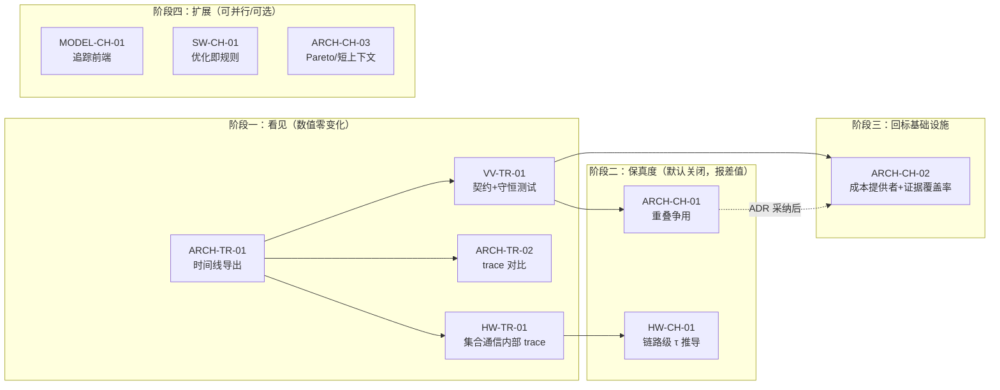

# 执行 Trace 导出与 Charon 方法借鉴（建议稿）

版本：2026-10-10
状态（2026-10-10）：阶段一已实现（§2.1）；ARCH-CH-01 已实现，差值为零（§2.2）；HW-CH-01 已用自选的 5 个拓扑候选（`ASSUMPTION`）实现，名义参数下只有直连全互联达标（§2.3）；
ARCH-CH-02 已实现，实测表为空（§2.4）；D2 已批准（[ADR-0025](../adr/ADR-0025-offline-python-tools.md)）；MODEL-CH-01 已实现，GLM-5.2 账本已生成，对账无 `MISMATCH`（§2.5）；ARCH-CH-03 已实现，作为附加视角，不改目标（§2.7）；SW-CH-01 已实现，`out/` 数值不变，另列出 4 项映射器的合法性发现（§2.8）。不改动已落地的任何机制，也不改变发布点 1101.77 TPS/usr

前置文档：[`21_TPS_DESIGN_BASELINE.md`](../../../docs/architecture/21_TPS_DESIGN_BASELINE.md)、
[`10_TILE_SIMULATION.md`](../../../docs/architecture/10_TILE_SIMULATION.md)、
[`OPEN_ISSUES.md`](../../../docs/architecture/OPEN_ISSUES.md)、
[`03_Q3_TILE_MEMORY_EVENT_SPEC.md`](detailed/03_Q3_TILE_MEMORY_EVENT_SPEC.md)、
[`04_Q4_NOC_COLLECTIVE_EVENT_SPEC.md`](detailed/04_Q4_NOC_COLLECTIVE_EVENT_SPEC.md)

外部参考：Charon（MLSys 2026 Oral，arXiv:2605.17164），分析见
[`references/Charon_论文分析.html`](../../../references/Charon_论文分析.html)。该参考**不是证据**，
只提供方法；任何数字都不得从它进入本仓库的基线。

## 0. 要解决的问题

1. **时间线看不见。** 详细模拟器（`integration/detailed/k3_operator_sram_sim.js#simulate`）早已能输出事件流：
   `{trace:true}` 时返回 `events` 和 `occupancy`。但没有任何 pipeline 打开它，`out/` 里也没有时间线文件。
   发布点的 775.75 µs 只能以汇总形式出现在时间账里，没有人能看到哪一段 DMA 卡住了哪个算子。
   `out/detailed/formal_event_replay.json` 是规划模型合成的 360 条事件，状态是 `SYNTHETIC_PLANNING_EVENTS_NOT_TIMING_REPLAY`，不是时间线。
2. **通信是最大也最虚的一项。** 393 × τ = 451.95 µs，占 raw 预算的 53%。τ = 1.15 µs 却没有物理推导（B-008）；
   卡内和 TP32 拓扑都没签核（B-004、B-005）。
3. **重叠只记收益，不记代价。** 前台算子和集合通信在发起时就定死了结束时间（`end = t + duration`），
   只有后台 DMA/TMA 让带宽（`fillSpeeds()`、`dmaRate()`）。shared 专家和集合通信重叠时，
   两者对共享 SRAM 读端口和 fabric 的总需求可能超过上限，但哪一方都不会变慢。
   这与 `GAIN` 一律取 1 的纪律方向不一致：收益计入了，代价没有。
4. **研发阶段的回标没有落点。** 每个算子的时长都来自解析式（`mappedPlan`）。将来拿到 Palladium 或 RTL 周期数后，
   没有接口能逐算子替换，也没有指标说明"raw 里有多少比例有实测支撑"。

Charon 在第 2–4 点上各有现成方法：按链路分层的通信模型、带宽感知的拥塞模型、
实测 → 预测 → 解析的引擎回退链。它在第 1 点上的产物形态是 PyTorch Profiler 风格的 trace，也可以直接借鉴。

## 1. 原则与非目标

**原则**

- **先看见，再改模型。** 阶段一只做导出，数值零变化；之后每次模型变化都要能在 trace 上对比前后差异。
- **新机制默认关闭。** 改变数值的机制以选项进入，默认值复现发布点。只报告与发布点的差值，是否采纳由 ADR 决定。
- **不引入经验因子。** Charon 用实测标定降速因子，本项目没有硅片，标定出来只能是 `ASSUMPTION`。
  因此争用必须由资源模型推导（按带宽需求比例分配），不能填系数。
- **证据等级跟着每个算子走。** trace 和报告里的每个时长都带证据等级，不能只在汇总处标一次。

**非目标**

- 不做 Charon 的单 block 抽取：跨层 KV 预取和 SRAM 驻留状态必须全 93 层模拟。
- 不做训练、反向图、liveness 显存分析：本项目只做 decode 推理，片上 SRAM 已由事件模拟精确记账。
- trace 不改变任何 Gate 结论。它的证据等级是 `MODEL`，不能当作 `VALIDATED_EVENT_TIMING`
  （`evaluate_gates.js` 中 `validatedEventTiming` 的判据）。

## 2. 工作包

编号遵守 AGENTS.md 的规定，使用 `HW-*`/`SW-*`/`MODEL-*`/`ARCH-*`/`VV-*` 前缀。
为避免和评审台账里已有的序号冲突，统一加 `TR`（trace）或 `CH`（Charon）中缀。

### ARCH-TR-01 发布点单 rank 时间线导出

| 项 | 内容 |
|---|---|
| 要回答的问题 | 发布点的 775.75 µs 在时间轴上怎么排布？哪里是等待，哪里被掩盖？ |
| 做法 | 新增 `integration/pipelines/generate_execution_trace.js`（`npm run trace:published`）：用 `baseline_point.publishedX` 取发布点，跑 `F.mapped` 和 `simulate(..., {trace:true})`，转成 Chrome Trace Event JSON，可用 Perfetto 或 `chrome://tracing` 打开 |
| 轨道 | 计算槽（unit ≠ COMM 的算子）、集合通信、DMA（含 park/resume）、TMA-L、TMA-H、SRAM 占用（allocated/live 两条 counter 轨道）、逐层标记 |
| 每个切片的 args | layer、unit、flops、read/write bytes、`timing` 拆解（kernel/launch/tmaFill/tauFloor…）、证据等级、detail（如 weight tile 3/8） |
| 元数据 | `sourceCommit`、规格文件 hash、`OPT` 摘要、x 指纹、`evidenceClass: MODEL`；格式与现有产物的 provenance 字段一致 |
| 模拟器改动 | 只扩充 `trace` 分支的事件内容：补上算子的 unit、timing，以及 COMM 的起点。不改任何计时路径 |
| 产物 | `out/trace/k3_published_point.trace.json`，加上 `out/trace/README.md` |
| 规模 | 实测：模拟约 77 ms；原始事件 9079 条加占用曲线 7151 点，约 1.6 MB。Chrome 格式预计 2–3 MB（见决策点 D1） |
| 验收 | 各轨道切片时长之和与 `computeUs`/`commUs`/`waitUs`/`overlapUs`/`tmaHiddenUs` 逐项对账，误差 < 1e-6 µs；时间线结束时刻等于 `rawUs`；发布点数值不变 |

### VV-TR-01 Trace 契约与守恒测试

| 项 | 内容 |
|---|---|
| 做法 | 新增 `docs/architecture/contracts/EXECUTION_TRACE.md`：定义轨道、事件类型、必填 args 和单位。该契约就是 `TILE_IR.md` 第 33 行提到的"golden trace 格式"的模型侧版本 |
| 测试 | `tests/regression/test_execution_trace.js`，检查四项：(1) 守恒对账；(2) 事件全部绑定 `operator_id` / `layer`；(3) sha256 钉住产物；(4) 加入 `test_regeneration_reproducible.js` 的 `REGENERATE_SCRIPTS`（耗时短，可以纳入） |
| 依赖 | ARCH-TR-01 |

### ARCH-TR-02 Trace 对比与逐项回退可视化

| 项 | 内容 |
|---|---|
| 要回答的问题 | 21 号文档 §5 的逐项回退里，"关掉 `tmaLane` 损失 X µs"具体损失在哪几层、哪几个算子？ |
| 做法 | `generate_execution_trace.js --diff <OPT 补丁>`：同一 x 下跑两次，按 `operator_id` 对齐，输出逐算子的开始时刻偏移和时长差，并可生成两份 trace 并排查看 |
| 产物 | 默认写到 `scratch/`。只有被 ADR 或 attribution 卡引用时，才由 pipeline 落进 `out/trace/` |
| 依赖 | ARCH-TR-01 |

### HW-TR-01 集合通信内部协议 trace

| 项 | 内容 |
|---|---|
| 要回答的问题 | 一次集合通信的 1.15 µs 里，发射、上线、可见、ACK 各占多少？五类协议时间为什么都低于 τ？ |
| 做法 | `k3_sram_memory_rdma_model.js#phase` 已支持 `{trace}`，会逐 peer 输出 issue/sendStart/sendEnd/visible/ack。对每类集合通信抽样一层，作为嵌套切片挂在对应 COMM 切片下，并单独画出 `tauFloor` 补齐的那一段 |
| 产物 | 并入 `k3_published_point.trace.json` 的子轨道 |
| 依赖 | ARCH-TR-01；为 HW-CH-01 提供基线视图 |

### HW-CH-01 链路分层的 τ 推导（借鉴 Charon §5，对应 B-008 / B-004 / B-005 / O-018）

| 项 | 内容 |
|---|---|
| 要回答的问题 | 在给定的卡内拓扑和 TP32 scale-out 拓扑下，一次集合通信的物理下限是多少？τ = 1.15 µs 成立的条件是什么？ |
| 做法 | 新增 `integration/detailed/collective_topology.js`，把一次集合通信拆成链路级传输，按"每跳延迟 × 跳数 + 字节数 / 有效带宽 + 同步开销"计算。拓扑：卡内 8 Die 环（与 `dieCutGB` 口径一致）；scale-out 至少三种候选：直连全互联、单层交换、环。算法：ring、tree、one-shot direct（与现有 31-peer 写入模型一致）。控制路径接 Comm Core 周期模型（`comm_core_design.json`） |
| 参数来源 | 每跳延迟、SerDes/PHY、交换机延迟逐项标证据等级；没有出处的一律记 `ASSUMPTION` 并给出敏感区间 |
| 产物 | `out/detailed/tau_derivation.json`：拓扑 × 算法 × 集合通信类别的 τ 拆解表，以及每个格子的 TPS/usr。后者复用规划链路已有的 τ 敏感度列 |
| 不做 | 不改 `OPT.tauUs`。若推导结果支持更换 τ 口径，走 ADR 修订 ADR-0004 |
| 依赖 | 需要硬件团队给出 B-005 的候选拓扑；HW-TR-01 先行能大幅降低核对成本 |

### ARCH-CH-01 重叠争用模型（借鉴 Charon §6）

| 项 | 内容 |
|---|---|
| 要回答的问题 | shared 专家和集合通信重叠时，前台两方对共享 SRAM 读端口和 fabric 的总需求是否超限？超限会吃掉多少 `commOverlap` 收益？ |
| 做法 | `simulate` 增加选项 `contention: 'none' \| 'proportional'`，默认 `'none'`，复现发布点。`'proportional'` 时把前台算子和集合通信也改成"剩余工作量 + 速率"推进：总需求超过端口或 fabric 上限时，按各自的请求带宽比例分配，这是 Charon 带宽重分配的资源模型版本，不含标定因子。被拉长的时间单独记为一项服务 `contention`，保持 `raw = compute − tmaHidden + comm + wait − overlap + contention` 的守恒检查 |
| 规模预估 | 发布点的 `commOverlap` 收益为 26.27 µs，有 552 个算子标记了 `overlapComm`，争用损失的上界是这 26.27 µs。实际值以实现后的报告为准 |
| 产物 | `out/detailed/contention_delta.json`：发布点和各域联合点在两种模式下的 TPS/usr 差值，逐层列出 |
| 采纳 | 差值不为零时，由 ADR 决定是否把默认值改成 `'proportional'`，并同步 21 号文档的时间账 |
| 依赖 | ARCH-TR-01（用 trace 核对重叠段）；`simulate` 的事件循环改动较大，需要 VV 逐项审查守恒式 |

### ARCH-CH-02 算子成本提供者与证据覆盖率（借鉴 Charon §5 的 fused engine）

| 项 | 内容 |
|---|---|
| 要回答的问题 | 研发中拿到 Palladium 或 RTL 周期数后，如何逐算子替换解析值？raw 里有多少比例有实测支撑？ |
| 做法 | 在 `mappedPlan` 给算子定时长的位置加一层"成本提供者"，按优先级查找：(1) 实测表，键为算子类型 + shape + 硬件点指纹，证据等级 `SILICON_OBSERVED`、`EMULATION_OBSERVED` 等；(2) 拟合预测器，只在实测样本覆盖的 shape 区间内插值，越界即回退；(3) 解析式，即现状。每个算子带 `costSource` 和证据等级 |
| 当前效果 | 实测表为空，所有算子走解析式，数值不变。交付物是接口、空表的 schema、trace 中的证据着色，以及"raw 按证据等级分解"的报告行 |
| 回标顺序 | 先 attention 路径（MLA QK/PV、online softmax、FP8 解量化、LSE merge），再 Linear 和 Expert。理由：Charon 的消融实验中，解析模型在 Linear/RMSNorm 上误差约 6%，在 FlashAttention-3 上达 31.84%（外部数字，仅作排序依据） |
| 依赖 | ARCH-TR-01；与 `10_TILE_SIMULATION.md` §8 的校准顺序对齐 |

### MODEL-CH-01 工作负载追踪前端（借鉴 Charon §4）

| 项 | 内容 |
|---|---|
| 要回答的问题 | GLM-5.2 和 DeepSeek-V4-Pro 能不能拥有与 K3 同级的详细 DAG，而不是只有规划行？K3 手写 DAG 的算子清单有没有遗漏？ |
| 做法 | 写一个离线工具：用 `torch.fx` 或 meta device 在 HF 模型定义上追踪一个 decoder block，导出算子账本 JSON，内容包括算子、shape、dtype、FLOP、字节。Node 侧只读这份 JSON，并和 `design_engine.js` 以及规划行对账 |
| 首个目标 | GLM-5.2（形状取自公开 HF `config.json`，ADR-0007）：用追踪出的账本与现有规划行逐项对账 |
| 约束 | 仓库约定 Node.js、零第三方依赖，Python 工具因此只能作为离线生成器，产物按 `references/` 或 `teams/model/inputs/` 的规则入库（D2，已由 ADR-0025 批准） |
| 依赖 | 独立于其他工作包，可以并行 |

### SW-CH-01 优化开关改写为图变换规则（借鉴 Charon §4(b)）

| 项 | 内容 |
|---|---|
| 要回答的问题 | `OPT` 里每个融合或调度开关的合法性前提是什么？能否被单独验证？ |
| 做法 | 把 `attentionFusion`、`epilogueFusion`、`softmaxFusion`、`pvMerge`、`countBasis`（shared 专家合并）这类开关，从 mapper 内的分支改写成声明式规则：匹配模式、变换动作、合法性前提。合法性前提对应 contract 中的"fusion legality"，B-007 这类问题因此有固定落点 |
| 验收 | 重构前后 `out/` 逐字节一致 |
| 优先级 | 低。属于纯重构，风险集中在 mapper，收益是可审查性 |

### ARCH-CH-03 负载形态扩展（可选）

| 项 | 内容 |
|---|---|
| 内容 | (1) 用现有 `mapped(x, {tokens, seqs})` 扫出 TPS/usr 与 TPS/卡 的 Pareto 前沿，回答"为 B=1 优化的设计在 batch 场景下损失多少"；(2) 短上下文扫描（如 8K / 128K），回答 24 次 LSE 归约和按上下文切分在短序列下是否划算，对应 Charon 的动态 SP 案例 |
| 约束 | 只作附加视角，不改 ADR-0009 的目标 |

### 2.1 阶段一实现记录（2026-10-10）

| 工作包 | 落点 |
|---|---|
| ARCH-TR-01 | `integration/detailed/execution_trace.js`（构建与对账）、`integration/pipelines/generate_execution_trace.js`（`npm run trace:published`）→ `out/trace/k3_published_point.trace.json`、`out/trace/README.md` |
| VV-TR-01 | 契约 [`EXECUTION_TRACE.md`](../../../docs/architecture/contracts/EXECUTION_TRACE.md)；`tests/regression/test_execution_trace.js`；`trace:published` 已加入 `REGENERATE_SCRIPTS` |
| ARCH-TR-02 | `npm run trace:published -- --diff <机制 \| JSON 补丁> [--traces]` → `scratch/trace/` |
| HW-TR-01 | 5 类集合通信各抽样一次，嵌套在 COMM 切片下 |

与上文的差异：

- **provenance 不记 `sourceCommit`**，改记基线文件和 6 个模拟器源文件的 sha256。trace 因此只随输入变化，再生成测试不必钉提交。
- **模拟器改动**：只在 `if(trace)` 分支给 `op` 事件补了 `unit`、`async`、`filled`，并新增 `wait`、`TMA exposed` 两类事件（守恒对账需要逐段的等待和暴露 fill）。COMM 的起点原本就在 `op` 事件里；算子的 timing 拆解在构建 trace 时从 plan 读取，不进事件。测试比较了 `{trace:true}` 与默认调用的全部标量结果。
- **计算槽的口径**：模拟器把完整服务时间计入 `computeUs`，计算槽上实际占用的是 `computeUs − tmaHiddenUs`（kernel 本体 + 暴露的 fill）。守恒表按这个口径写，见契约 §5。
- **体积**：13229 个事件，约 3.35 MB，高于预估的 2–3 MB，主要来自逐算子的 timing 拆解和逐 peer 异步切片。按 D1 只提交发布点这一份明文 JSON；仓库里已有 7.6 MB 的 `out/rdma/` 结果文件，暂不压缩。
- **对比的归因口径**：每个算子拥有从它发出到下一个算子发出的 advance，advance 之和恰为 `rawUs`，所以逐算子、逐层的差值之和等于总差值。`tmaLane` 回退的差值 +92.67 µs 与 `tpsDesign.software.mechanisms` 的记录一致。

### 2.2 ARCH-CH-01 实现记录（2026-10-10）

| 项 | 落点 |
|---|---|
| 选项 | `simulate(plan, sramMiB, {contention})`，`CONTENTION = ['none', 'proportional']`。它是 `simulate` 的参数，不是 `OPT` 键：`O.evaluate` 和所有既有产物不变，`k3_rdma_final_tuning_model.js` 未改（它的 sha256 绑定在规划 workload 和 Stage B 里） |
| 产物 | `integration/detailed/contention_delta.js`、`integration/pipelines/generate_contention_delta.js`（`npm run contention:delta`）→ `out/detailed/contention_delta.json`；已加入 `REGENERATE_SCRIPTS` |
| 测试 | `tests/regression/test_contention_delta.js`：默认与 `'none'` 逐个标量相同、不出现 contention 字段；`'proportional'` 守恒；把 shared 专家与 all-gather 的需求人为抬到上限的 0.8 + 0.8 时，被拉长并记账（+11.50 µs）；产物与重建一致 |

模型口径：

- 运行中的算子和在途集合通信改为"剩余工作量 + 速率"推进。对 shared 读口、shared 写口、fabric 三项资源，各自把两方需求（各自先截到上限）求和，超限时每方得 `上限 / 总和`，推进速度取三项中最慢的一项。
- DMA 和 TMA fill 保持原优先级，只拿前台实际消耗之后剩下的带宽；前台被拉慢时，它们看到的前台消耗也按速度缩小。
- 被拉长的时间记为 `contentionUs`，守恒式为 `raw = compute − tmaHidden + comm + wait − overlap + contention`，逐层另记。
- 单独运行时自身需求就超过某项上限的算子不计入争用：它进入分配时按上限计，时长仍按映射值，另在 `overCap` 里列出并给出"按上限运行需多出的时间"。

结果：

| 设计点 | 重叠收益 | 前台需求峰值 / 上限（读、写、fabric） | 差值 |
|---|---|---|---|
| 发布点 | 26.27 µs | 0.21、0.18、0.31（Shared SiLU × up 与 Wdown + Router all-gather） | 0 |
| 8 个可行联合点 | 41.27–48.98 µs | 最高 0.88 | 0 |

- **结论**：在现有映射时长下，重叠的两方离任何上限都有余量，前台争用不吃掉 `commOverlap` 收益。D3 不需要启动：默认值保持 `'none'`，21 号文档 §4.3 已注明复算结果。
- **附带发现，不属于争用**：有些 epilogue 算子单独运行就超过端口上限，说明映射时长低于"字节数 / 端口带宽"。
  - 发布点：`KV append source`（24 个，fabric 3.69×）、`Dispatch local pack`（92 个，写口 2.24×）。按上限计合计约多 0.15 µs。
  - 联合点：另有 `RoPE`（写口 1.74×），合计约 0.70 µs。
  - 量级可以忽略，但它是映射器的不一致，应交给 SW-CH-01 或 mapper 负责人处理，不应记在争用名下。
- **局限**：争用只覆盖 shared 侧的三项资源。local SRAM 写口仍只约束 TMA fill（`fillSpeeds()`），MC 带宽只约束 DMA。若将来让更多算子标记 `overlapComm`，需要重跑本报告。

### 2.3 HW-CH-01 实现记录（2026-10-10）

D4 原定由硬件团队给候选。2026-10-10 按用户指示，由架构 agent 先选 5 个常见的 scale-out 拓扑开工。
候选文件状态为 `ASSUMPTION`，等 Collective/RDMA、NoC 负责人评审；替换或增加候选只需改输入文件并重跑。

| 项 | 落点 |
|---|---|
| 候选与参数 | `teams/hardware/inputs/scaleout_topology_candidates.json`。拓扑：直连全互联 `fullMesh`（31 端口 × 4 lane）、单层 rail 交换 `singleSwitch`（每 Die 一个交换平面）、两级 leaf-spine `leafSpine`、`torus4x8`、32 卡双向环 `ring32`。参数：MAC、PHY、FEC、交换、中继、UCIe 每跳、线缆长度、控制路径倍数，全部 `ASSUMPTION`，带名义值和区间 |
| 模块 | `integration/detailed/collective_topology.js`：逐拓扑给出路由（链路、交换、中继卡、卡内 Die 跳数），逐算法拆成若干步，每步沿用 `phase()` 的发出、窗口、串行化链 |
| 报告 | `npm run tau:derivation` → `out/detailed/tau_derivation.json`，已加入 `REGENERATE_SCRIPTS` |
| 测试 | `tests/regression/test_tau_derivation.js`：各拓扑最坏跳数与 lane 预算；锚点；τ 各项之和；延迟越大 TPS 越低；报告与重新生成一致并绑定源文件 |

**τ 的构成**：

- 公式：τ = memoryTransport + tpReduce + cardLocal + portTail + controlPath。
- memoryTransport：用路径单程延迟替换模型里固定的 `oneWayUs`，再加一个链路下限。
  - 路径单程延迟 = MAC + 每条链路（PHY + FEC + 线缆传播）+ 交换 + 中继 + 卡内 Die 跳。
  - 链路下限：32 个 rank 同时执行一步时，最忙的有向链路必须按其 lane 带宽送完。
- 其余各项：
  - tpReduce 沿用模型。
  - cardLocal 沿用模型，其中卡内环上的 8 跳 Die 时延（ADR-0016 2026-10-10 口径）按 `ucieHopUs` 重算。
  - portTail 按模型的端口下限重算。
  - controlPath 取 `comm_core_design.json` 的逐类值。
- 算法：
  - `oneShot`：现模型的 31 peer 直写。
  - `halvingDoubling`：5 + 5 步，代表树类算法。
  - `ring`：31 + 31 步。
- ACK 语义：
  - `phase`：每步等最后一个 ACK 返回，即现模型的口径。
  - `deferred`：数据可见就进入下一步，ACK 交给 epoch 双缓冲槽回收。
- **锚点**：抽象线 + `oneShot` + `phase` + 无控制路径时，5 类集合通信的 memoryTransport 与模型逐位相等，TPS/usr 等于发布点。

**结果**：名义参数，无 τ 下限（`bottomUp`），各拓扑取最好的算法，三种算法中都是 `oneShot` 最好。

| 拓扑 | 名义单程 µs（最近 / 最远） | ACK `phase`：max τ µs / TPS/usr | ACK `deferred`：max τ µs / TPS/usr | 区间两端 TPS/usr（`phase`） |
|---|---|---|---|---|
| fullMesh | 0.115 / 0.215 | 1.410 / **1049.12** | 1.156 / **1104.78** | 1104.78 – 623.49 |
| singleSwitch | 0.400 / 0.400 | 2.261 / 710.87 | 1.453 / **1035.30** | 1101.79 – 407.67 |
| leafSpine | 0.400 / 0.990 | 4.621 / 427.00 | 2.633 / 644.11 | 741.36 – 205.45 |
| torus4x8 | 0.118 / 0.955 | 4.050 / 470.13 | 2.282 / 702.64 | 830.08 – 212.02 |
| ring32 | 0.118 / 2.455 | 10.139 / 221.32 | 5.321 / 380.25 | 473.01 – 86.69 |

发现：

1. **模型的 `oneWayUs = 0.05 µs` 在任何候选上都达不到**。
   - 名义参数下，直连最近一跳的单程也要 0.115 µs，单层交换要 0.40 µs。
   - 在抽象线上反解，满足 1000 TPS/usr 的单程预算是 0.220 µs（含控制路径，无下限）。
   - 全互联的最远路径 0.215 µs 在预算内，单层交换不在。
2. **按现模型的 ACK 口径，只有全互联在名义值下达标**：1049.12 TPS/usr。
   - 两类 all-reduce 的 τ 为 1.410 µs、LSE 为 1.362 µs，都高于统一 τ 的盈亏点 1.355 µs；靠 Wdown + Router（0.807 µs）和 Routed latent（1.355 µs）较低才达标。
   - 需同时满足：`ucieHopUs` ≤ 0.030、`fecUs` ≤ 0.080、`macUs` ≤ 0.070、`phyUs` ≤ 0.050 µs，这 4 个参数的区间跨过 1000。
   - 区间悲观端只有 623.49。
3. **单层交换需要改 ACK 语义才达标**：
   - ACK 推迟到 epoch 槽回收时，名义 1035.30 TPS/usr；τ 取规格下限时为 998.34，已低于 1000。条件为 `switchUs` ≤ 0.244、`fecUs` ≤ 0.072、`ucieHopUs` ≤ 0.034、`macUs` ≤ 0.084、`phyUs` ≤ 0.042 µs。
   - 按现模型的 `phase` 口径只有 710.87。
   - `deferred` 要求一个 epoch 槽在下一次复用前 ACK 已经收齐，需 HW-07 确认 Mailbox 语义允许。
4. **leaf-spine、torus、环在名义值下任何算法都不达标**。
   - 只有参数全部取乐观端加上 `deferred`，torus 才回到约 1101，leaf-spine 为 1085.19。
   - 06 号文档 §6 的担心（"跳数 × 每跳时延直接压 τ"）在这里定量成立：torus 最远 6 跳，单程约 0.96 µs。
5. **ring 和 halving-doubling 算法总是输给 one-shot**。
   - 发布点的消息只有 0.3–6 KB，属于时延主导，带宽不是瓶颈。
   - 31 步或 10 步串行，每步付一次单程时延，代价远大于省下的带宽。
6. **TPS 对 τ 高度非线性**（统一 τ 扫描，报告 `published.uniformTauSweep`）：

   | 统一 τ（µs） | 0 | 1.15 | 1.35 | 1.5 |
   |---|---|---|---|---|
   | TPS/usr | 1107.65 | 1101.77 | 1002.19 | 843.48 |

   - τ 低于 1.15 时 DMA 等待接替成为瓶颈，τ 再降收益很小。
   - τ 高于约 1.35 后，集合通信不再掩盖 DMA，TPS 急剧下降。
   - 因此 τ 的物理推导只要落在 1.35 µs 以内就够，不必追求更低。

**局限**：

- 链路无损、无重传，一条消息即一个包。
- 卡内 Die 跳数按 8 Die 双向环计（`A.dieRing`，ADR-0016 2026-10-10 的计算口径，B-004 待硬件评审）。
- 链路下限把最忙链路的时间平摊到经过它的消息上，没有逐包仲裁。
- `ring` 算法只走单向。
- 光模块、8 卡 pod 方案（06 §6 候选 4）未建模。

**不改 `OPT.tauUs`**。若要按某个拓扑把 τ 从规格值换成推导值，走 ADR 修订 ADR-0004。

### 2.4 ARCH-CH-02 实现记录（2026-10-10）

| 项 | 落点 |
|---|---|
| 成本提供者 | `integration/detailed/cost_provider.js`。`mappedPlan` 计算出解析 kernel 后交给 `kernelCost(op, shape, hardware, analytic)`，返回值替换 `timing.kernel`；softmax 融合隐藏、staging、flush、launch 和 `O.mapped` 的 GAIN 都在其后照旧作用 |
| 实测表 | `teams/vv/inputs/operator_cost_observations.json`（空表，含 schema）。每条：`op`、`shape`{flops, readBytes, writeBytes}、`hardware`（`HW_KEYS` 的 19 个字段：核阵列、频率、向量 lane、local SRAM、TMA、kvTile/headTile）、`kernelUs`、`evidence`、`source`、`environment`、`repeats`、`errorUs` |
| 报告 | `integration/detailed/cost_coverage.js`、`npm run cost:coverage` → `out/detailed/cost_coverage.json`；已加入 `REGENERATE_SCRIPTS` |
| trace | `op` / `comm` 切片带 `costSource`、`costEvidence`（契约 §4.1）；trace 与 contention 报告的 provenance 加入提供者和实测表的 sha256 |
| 测试 | `tests/regression/test_cost_provider.js`：空表下全部 `analytical` / `MODEL`、发布点不变；与解析值相等的实测只改标签；QK 实测取 2 倍时 kernel 行精确替换、raw +76.74 µs 且守恒；两点插值、越界 / 偏离连线 / 换硬件 / 换算子均回退；schema 拒绝缺环境、缺误差、`MODEL` 等证据等级和重复条目 |

查找规则：

- **实测**：算子名、shape、硬件三者都一致。
- **拟合**：同一算子、同一硬件的两条实测，其 shape 连线经过查询点（0 ≤ λ ≤ 1），线性插值；证据取两者中较弱的一级。不外推，也不跨硬件点。
- **解析**：其余情况，即现状。集合通信不进这张表，它的回标是 HW-CH-01 的 τ 推导。
- 计划原稿写的"拟合预测器"收窄为两点插值：在样本积累之前，任何更复杂的拟合都需要先定义误差判据，否则就是新的经验因子。

结果（实测表为空）：

| 项 | µs | 占 raw |
|---|---|---|
| kernel，实测 / 拟合 | 0 | 0 |
| kernel，解析 | 224.84 | 29.0% |
| 非 kernel（staging、launch、集合通信、τ 下限、等待，减去隐藏项） | 550.91 | 71.0% |

- 待测队列共 30 个算子名、34 个 shape。attention 路径 4 个算子（QK、PV、Linear recurrent 状态更新、online softmax）占 kernel 的 166.35 µs，
  其中 QK 78.27 µs、PV 69.57 µs，各只有 1 个 shape：两条实测就能把约 19% 的 raw 从解析换成实测。Linear 9 个算子、13 个 shape，30.48 µs；Expert 2 个，26.66 µs。
- 占比按毛值计：被集合通信掩盖的 kernel 也全额计入，因此是"raw 里有多少时长的来源是实测"，不是"实测改变 raw 多少"。后者用 `--diff` 或重跑报告看。
- raw 的 71% 不是 kernel，实测表覆盖不到。其中最大的一块是 451.95 µs 的集合通信，归 HW-CH-01。

### 2.5 MODEL-CH-01 实现记录（2026-10-10）

| 项 | 落点 |
|---|---|
| 追踪工具 | `tools/trace_operator_ledger.py`（ADR-0025 的离线生成器）。输入钉在 `zai-org/GLM-5.2@cf457fa7` 与 `zai-org/GLM-5.2-FP8@f33c6dc5` 的 `config.json`，模型代码为 transformers 5.19.x 的 `glm_moe_dsa`；也可用 `--config-file` / `--quant-config-file` 离线运行 |
| 账本 | `teams/model/inputs/glm_5_2_traced_operator_ledger.json`（约 40 KB）。2026-10-10 生成，环境为 Python 3.14.2、torch 2.14.1+cpu、transformers 5.19.0，用的是钉住 revision 的本地 `config.json`，耗时约 8 s。78 层归为 3 类：dense / full 3 层、MoE / shared 57 层、MoE / full 18 层；`unmatchedNotConvert` 为空。第一次运行未改工具代码 |
| 对账 | `teams/model/src/traced_ledger.js#reconcileGlm`，`node teams/model/src/traced_ledger.js` 打印逐项结果 |
| 测试 | `tests/regression/test_traced_operator_ledger.js`：合成账本对账无 `MISMATCH`，且已知差异的状态和大小精确；9 种扰动（形状、缺层、indexer 层、专家数、缓存宽度、未匹配的 not-convert 项、多余 FLOP 等）都报 `MISMATCH`；provenance 缺项被拒；工具与对账的输出路径、格式一致。对入库账本还检查：provenance 齐全、工具 sha256 与当前文件一致（否则报过期）、revision 是工具里钉住的那个、对账无 `MISMATCH` |

追踪口径：

- 用 meta device，不分配权重。逐层构建 `GlmMoeDsaDecoderLayer` 并按顺序运行 78 层，`prev_topk_indices` 在层间传递，shared 层复用前一个 full 层的 top-k。
- 场景是一个 decode token，已缓存 1048575 个 token。缓存是鸭子类型的替身，只返回形状正确的 meta 张量，并记录读写的 token 数和元素宽度。
- FLOP 来自 `torch.utils.flop_counter` 的注册表，只覆盖矩阵类算子。每个算子挂到发出它的最内层模块上；其余算子只计次数。
- 参数清单记录 checkpoint 的存储精度：默认 FP8，`modules_to_not_convert` 中列出的模块记 BF16。
  - checkpoint 名 `self_attn.indexers_proj` 按 ASSUMPTION 映射为模型代码的 `self_attn.indexer.weights_proj`，映射写进账本。
  - 映射不上的条目列在 `unmatchedNotConvert`，对账时视为 `MISMATCH`。
- 专家用 `batched_mm` 实现：eager 实现里的 `nonzero` 在 meta device 上无法运行。attention 用 eager 实现。
- 不追踪：embedding 查表、MTP 层、集合通信。

对账口径：每项给一个状态，含义见 `traced_ledger.js` 文件头。只有 `MISMATCH` 让测试失败。参考实现与部署 kernel 的差异（kv_b_proj 解压整个缓存、全上下文稠密 attention）按参考公式核对后记为 `REFERENCE_FORM`，不用来修改规划行。

首次追踪结果（19 项 `MATCH`、1 项 `STORAGE_DIFFERENCE`、3 项 `REFERENCE_FORM`、2 项 `NOT_IN_PLAN`、1 项 `NOT_TRACED`、0 项 `MISMATCH`），见 [`OPERATOR_LEDGER.md`](../../model/docs/deployment/OPERATOR_LEDGER.md) §3.1：

1. **FP8 checkpoint 把 21 个 full 层的 `indexers_proj` 存为 BF16**，`deriveGlm` 按 FP8 计。dense_projection 字节因此少计 4.13 MB / token，占该行 0.02%。
2. **indexer 行漏掉按头加权求和这一步**，每个 full 层 2 × 32 × context FLOP，合计 1.41 GFLOP / token，占该行 0.78%。
3. 其余参数数和 FLOP 与规划行逐位一致：总参数 743.38 B（不含 MTP）、dense_projection 35.30 GFLOP、routed_moe 45.30 GFLOP / 22.65 GB、index key 元素数，以及层结构（full indexer 层、dense 层、top-k 2048、每层 8 个专家）。
4. 参考实现与部署的差距有多大：kv_b_proj 每 token 解压整个缓存，78 层合计约 2.4 PFLOP；稠密 attention 约 5.36 TFLOP，规划行（top-k 稀疏）是 22.25 GFLOP。这正是部署必须用吸收形式和 top-k 稀疏的原因，不是规划误差。

第 1、2 项已并入 `deriveGlm`：indexer 头权重投影按 BF16 计，indexer 行计入按头加权求和。现在对账为 21 项 `MATCH`、3 项 `REFERENCE_FORM`、1 项 `NOT_IN_PLAN`（范数参数）、1 项 `NOT_TRACED`、0 项 `MISMATCH`。GLM 规划 TPS/usr 变化在 0.02% 以内（TP32 / MC640 由 1927.72 变为 1927.49），`out/` 已重新生成（`npm run model:planning` 及依赖它的各 domain search、`budget:frontier`）。

### 2.6 运行追踪工具

```sh
python -m venv scratch/.venv
scratch/.venv/bin/pip install torch==2.14.1 transformers==5.19.0      # Windows: scratch\.venv\Scripts\pip
scratch/.venv/bin/python tools/trace_operator_ledger.py --model GLM-5.2
node teams/model/src/traced_ledger.js
npm test
```

改了 `tools/trace_operator_ledger.py` 就要重跑工具，否则 `test_traced_operator_ledger.js` 报账本过期。

### 2.7 ARCH-CH-03 实现记录（2026-10-10）

| 项 | 落点 |
|---|---|
| 模型改动 | `k3_architecture_search.js` 的 `SIM_KEYS` 增加 `context`，默认 `LIMITS.context`（1M）。上下文短于 TP × kvTile 时，`mappedPlan` 里 KV 类算子的 H 填充、H 本地 tile 和 softmax 融合改按有效 tile `min(kvTile, context / TP)` 计。`k3_rdma_final_tuning_model.js` 的 `mapped` / `evaluate` 透传 `context`。默认上下文下仍按 `x.kvTile` 计，即使它超过 context / TP（归因报告的压力项 kvTile 65536 因此仍按 65536 核算，并被 H 本地 tile 拒绝）。发布点和全部 search 产物的数值都不变，只有绑定源文件 sha256 的产物重新生成 |
| 生成器 | `integration/detailed/workload_shape.js`、`integration/pipelines/generate_workload_shape.js`（`npm run shape:explore`，约 1 分钟）→ `out/detailed/workload_shape.json`。证据等级 `MODEL`，head-parallel 列为 `PLANNING_ESTIMATE` |
| 测试 | `tests/regression/test_workload_shape.js`：`context` 默认值不改变任何标量；短上下文只缩短 KV tile 和 KV 存储，Linear recurrent 算子不变；Pareto 前沿；入库报告绑定当前源文件（否则报过期），抽样回放（全部 B = 1 行、全部 8K 行、短上下文扫描点和 1M 点），摘要与行一致。完整重建不在再生成测试里，与 `search:final` 同理 |

做法：硬件固定为 `tpsDesign.hardware.x`。batch 扫描取 B 条独立序列（tokens = seqs = B），每个 (context, B) 在 `mappingGrid` 的 120 个映射（kvTile × headTile × weightTileMiB × depth，发布映射在其中）里取 TPS/usr 最高者。发布映射按 B = 1 选定，B ≥ 2 时多数情况放不进 H 本地 tile 或共享窗口，所以要重选。TPS/卡 = B × TPS/usr / TP，一张卡即一个 TP rank。专家并集用两种口径：worst 为 min(E, B·K)，是模拟器默认；expected 为 E·(1 − (1 − K/E)^B)。

batch 结果（worst 并集，括号内是 expected 并集）：

| context | B = 1 TPS/usr / 卡 | TPS/卡 最高点 | 卡效率倍数 | 此时 TPS/usr 为 B = 1 的 | 每多一条序列的 µs | B = 32 可行映射 |
|---|---|---|---|---|---|---|
| 1M | 1101.77 / 34.43 | B = 16：162.08 / 81.04（169.61 / 84.81） | 2.35×（2.46×） | 14.7% | 238–426 | 10 / 120 |
| 128K | 1201.91 / 37.56 | B = 16：276.66 / 138.33（299.82 / 149.91） | 3.68×（3.99×） | 23.0% | 138–208 | 10 / 120 |
| 8K | 1218.99 / 38.09 | B = 16：305.91 / 152.95（334.36 / 167.18） | 4.02×（4.39×） | 25.1% | 124–178 | 60 / 120 |

- 回答"为 B = 1 优化的设计在 batch 场景下损失多少"：1M 下 batch 能把单卡吞吐提到 2.4 倍，代价是 TPS/usr 降到约 1/7。B = 32 时 TPS/卡 反而下降，三种上下文都在 B = 16 处见顶。
- 1M 下限制 batch 的是 attention：每条序列的 KV 都要单独读，无法摊薄。B = 1 / 2 / 16 时 attention 为 194.5 / 373.0 / 2694.7 µs，routed 专家为 55.4 / 106.8 / 1039.4 µs，集合通信为 451.9 / 464.5 / 856.2 µs。1M 下专家并集口径对 TPS/卡 最高点的影响在 5% 以内。
- 1M 的 B = 1 最优映射就是发布映射；128K、8K 的 B = 1 重选映射比发布映射略高（1201.91 对 1200.69，1218.99 对 1215.32），所选映射为更小的 kvTile（2048 / 1024）配 headTile 48、depth 2。

短上下文扫描（B = 1，发布映射）：

| context | TPS/usr | raw µs | 24 次 LSE µs（占 raw） | attention 占 raw | head-parallel TPS/usr（KV 全暴露 .. 全隐藏） |
|---|---|---|---|---|---|
| 2K | 1216.06 | 702.84 | 27.60（3.9%） | 5.5% | 1256.61 .. 1265.77 |
| 8K | 1215.32 | 703.27 | 27.60（3.9%） | 5.6% | 1229.15 .. 1264.96 |
| 16K | 1214.33 | 703.84 | 27.60（3.9%） | 5.8% | 1194.35 .. 1263.89 |
| 128K | 1200.69 | 711.84 | 27.60（3.9%） | 7.9% | 855.70 .. 1249.12 |
| 1M | 1101.77 | 775.75 | 27.60（3.6%） | 25.1% | 263.64 .. 1142.42 |

- 短上下文的 TPS/usr 在约 1216 处见顶，此时 raw 主要是 451.9 µs 的集合通信和权重读取。每次 LSE 归约是 1.15 µs，即 τ 下限，与上下文无关。
- head-parallel（96 个头分到 32 个 rank，不再按上下文切分）是 `PLANNING_ESTIMATE`，没有模拟。它省掉 24 次 LSE 归约，但每个 rank 要多读、多存 (TP − 1) 倍的 KV。全暴露时的盈亏平衡点约 11.5K；1M 下每 rank 多存 15.99 GB。结论：1M 下按上下文切分是对的；只有在约 8–11K 以下，head-parallel 最多能多出约 4%。这与 Charon 的动态 SP 结论方向一致，只在短序列下值得切换。卡内 PV 的部分归约两种切分都有，不计入节省。
- 不建模：head 切分后 H core 的形状变化，以及复制的 KV append。

发现（交 SW-CH-01 / mapper 负责人）：

- **Linear recurrent 算子的 H 填充取自 `kvTile`**。`mappedPlan` 用 `tokensPerCore = ceil(SQ · kvTile / NH)` 同时给 KV 算子和 Linear recurrent 状态更新定 H 填充，而后者不读 KV。实现 `context` 时若全局改用有效 tile，2K 上下文下这个算子会涨到约 700 µs。所以这里只让 KV 算子用有效 tile，Linear 算子保持原状。修正会改变 search 产物的数值，因此没有修，交给 mapper 负责人（§2.8 发现 4）。

### 2.8 SW-CH-01 实现记录（2026-10-10）

| 项 | 落点 |
|---|---|
| 规则表 | `k3_architecture_search.js` 的 `RULES`（`epilogueFusion`、`softmaxFusion`、`pvMerge`、`countBasis`），`k3_rdma_final_tuning_model.js` 的 `GAIN_RULES`（`attentionFusion`、`moeTokenPacking`、`wupRouterFusion`）。规则表放在原文件里，没有另建模块：这两个文件的 sha256 已经被各产物的 provenance 绑定，新文件则要改动所有源文件清单 |
| 规则的字段 | `match`：可改写哪些算子；`legal`：mapper 强制的前提，只看 plan 的结构，不看成本；`effect`：选中后 `mappedPlan` 做什么；`assumes`：mapper **不**强制的前提，每条带一个对映射后 plan 的检验 |
| 接口 | `selectRules(key, ops, value)` 返回规则改写的算子集合，`mappedPlan` 只改写这个集合。`checkRules(plan, basis)` 是 software contract 输出里的 "fusion legality report"：对每个开启的开关，给出匹配、应用、拒绝（匹配但前提不满足）的算子数，以及每条未满足的 `assumes`。`checkGainRules()` 报告不为 1 的 GAIN 因子（B-003） |
| countBasis | 由 `build()` 应用，因为两种口径的 DAG 不同；它的规则只检验 `build()` 的结果：合并的 all-reduce 必须在本层每个 Shared down 之后（B-007） |
| 验收 | 重构前后逐算子比较 mapper 和模拟器的输出：8 种开关组合，每种覆盖 3 种 step 形态和 4 组 tile，另加 BASE。结果完全一致。唯一的差别是第 0 个算子的 `mapping.fused` 从 `undefined` 变为 `false`，这个字段不进入任何产物。重新生成后，`out/` 的变更行只有 sha256 |
| 测试 | `tests/regression/test_mapping_rules.js`：每条规则在发布点、repo-510、小 tile 和 BASE 上选中的算子与原来的内联条件逐个相同；`legal` 能拒绝破坏前提的算子，`assumes` 能标出违例；锁定发布点的报告 |

发布点的报告：

| 规则 | 匹配 / 应用 | 拒绝 | 未满足的 assumes |
|---|---|---|---|
| epilogueFusion | 693 / 692 | `Attention RMSNorm` 1 个（step 的第一个算子，前面没有 kernel 可以并入） | 融合后（只剩 kernel 时间）shared 字节超过端口上限：`KV append source` 24 个、`Dispatch local pack` 92 个。与 §2.2 争用报告的 over-cap 发现相同 |
| softmaxFusion | 24 / 24 | 无 | 无 |
| pvMerge（layer） | 24 / 24 | 无 | 无 |
| countBasis（reference-393） | 92 / 92 | 无 | 无 |

repo-510 口径下，`Q / new-KV all-gather` 是集合通信，所以 24 个 `RoPE` 被 `epilogueFusion` 拒绝。

发现（未修，修正会改变 search 产物的数值；交 mapper 负责人）：

1. **pvMerge 'layer' 只为一个 head tile 预留了累加器**。一层的 PV 按"上下文 tile 在外、head tile 在内"的顺序发出，所以 headTile < 96 时，H core 要同时持有 96 / headTile 个 head tile 的 m/l/O 累加器，而 `hLocalBytes` 只预留 `headTile × 512 × 4` 字节。每个 core 少计 (96 − headTile) × 2 KiB × 1.15：headTile 16 少计约 188 KB，headTile 48 少计约 113 KB。发布点 headTile 为 96，满足前提；`out/rdma/` 的搜索结果里有 headTile 16 / 32 / 48 的设计，它们的 H 本地 tile 检查偏松。
2. **epilogue 融合不检查端口上限**（见上表）。量级约 0.15 µs（§2.2）。
3. **epilogue 融合不检查数据依赖**：`legal` 只要求前一个算子不是集合通信，不要求它产生本算子读的数据。plan 里这两个算子之间没有数据边，所以无法检验。`Dispatch local pack` 前面是 `Top-k / route resolve`，读的却是 `Wdown + Router all-gather` 之后的 latent。
4. **Linear recurrent 的 H 填充取自 `kvTile`**（§2.7）。这是映射公式的问题，不是开关，所以没有写成规则。

## 3. 阶段与顺序



| 阶段 | 工作包 | 规模 | 数值影响 | 需要 ADR | 退出条件 |
|---|---|---|---|---|---|
| 一 | ARCH-TR-01、VV-TR-01、ARCH-TR-02、HW-TR-01 | S–M | 无 | 否（新增产物和契约文档，由 Council 评审） | trace 可在 Perfetto 打开；守恒测试、再生成测试通过；发布点不变 |
| 二 | ARCH-CH-01 | M–L | 可能下降，上界 26.27 µs | 改默认值时需要 | `contention_delta.json` 落盘并入评审 |
| 二 | HW-CH-01 | L | 不改基线 | 改 τ 口径时需要（修订 ADR-0004） | `tau_derivation.json` 落盘；B-008 关闭证据栏可引用 |
| 三 | ARCH-CH-02 | M | 无（实测表为空） | 否 | 算子带 `costSource`；报告给出 raw 按证据等级的分解 |
| 四 | MODEL-CH-01 / SW-CH-01 / ARCH-CH-03 | M / M / S | 无或仅附加视角 | 视结论而定 | 各自的对账报告（MODEL-CH-01：GLM-5.2 账本已入库，对账无 `MISMATCH`，§2.5；ARCH-CH-03：`workload_shape.json` 已入库，§2.7；SW-CH-01：fusion legality report 由 `checkRules` 给出，§2.8） |

规模口径：S 约一个工作日以内，M 约数个工作日，L 需要跨团队输入（拓扑候选、Comm Core 周期）。

## 4. 与现有治理的衔接

- **产物**：新产物都放在 `out/trace/` 或 `out/detailed/`，由 npm 脚本生成，用 sha256 钉住，并纳入再生成测试；不手改。
- **证据等级**：trace 的 metadata 和每个切片都标 `MODEL`；ARCH-CH-02 之后改为逐算子标注。
- **Gate**：本计划的任何产物都不改变 D-Gate / Q-Gate 的结论。
  若要让模型 trace 替代 `stage_b.js` 里 Q3/Q6 的 `SYNTHETIC_PLACEHOLDER`，需要 Council 另立 ADR，
  而且只能作为 `MODEL` 等级的事件回放，不能满足 `validatedEventTiming`。
- **文档同步**：阶段一完成后更新 `10_TILE_SIMULATION.md` §2（已有能力）和 `out/README.md`；
  阶段二的结论进入 `OPEN_ISSUES.md` 的 B-008、B-004、B-005、O-018 证据栏。
- **参考资料登记**：在 `references/README.md` 的清单中补上 Charon 分析页的来源与用途，注明"方法参考，不是证据"。

## 5. 待决策点

| 编号 | 问题 | 建议 |
|---|---|---|
| D1 | 时间线 trace（约 2–3 MB）是否提交进 `out/`？ | 提交发布点这一份，作为默认可视化；diff 和其他设计点的 trace 只写到 `scratch/`。若嫌体积大，可只提交 `.gz`，测试解压后核对 |
| D2 | 是否允许离线 Python 工具（MODEL-CH-01）进入仓库？ | **已决定（2026-10-10，[ADR-0025](../adr/ADR-0025-offline-python-tools.md)）**：允许，放在 `tools/`，不进 `npm test`；产物 JSON 带 provenance 入库，由 Node 侧对账 |
| D3 | ARCH-CH-01 的差值若不为零，是否改默认值？ | 由 ADR 决定；在此之前 21 号文档的时间账注明"未计前台争用，上界 26.27 µs" |
| D4 | HW-CH-01 的拓扑候选由谁提供？ | 硬件团队（Collective/RDMA、NoC 负责人）先给出 B-005 的 2–3 个候选，没有候选不开工。2026-10-10 按用户指示改为架构 agent 先选 5 个常见候选开工（`ASSUMPTION`），待硬件团队评审替换（§2.3） |

## 6. 风险

| 风险 | 缓解 |
|---|---|
| 扩充 trace 事件时误改计时路径，发布点漂移 | 只改 `if(trace)` 分支；`test_tps_design_baseline.js` 和 `test_k3_rdma_final_tuning.js` 兜底 |
| 争用模型改写事件循环，引入守恒错误或死锁 | 选项默认关闭；新增守恒项单独记账；VV 审查；用 trace 逐段核对 |
| τ 推导参数大多仍是 `ASSUMPTION`，结论看似更细、其实一样虚 | 每个参数标等级和敏感区间；报告给出"τ ≤ 1.35 µs 需要哪些参数同时成立"，而不是一个点值 |
| trace 被当作实测证据引用 | metadata 写死 `evidenceClass: MODEL`；契约文档和 Gate 说明里明确它不构成 `VALIDATED_EVENT_TIMING` |
| 借鉴外部论文的数字进入基线 | 本文和 `references/README.md` 均声明 Charon 只提供方法；`design.audit` / `design.verify` 的 intake 只接受 `out/` 下的路径，`references/` 下的内容进不了复核对象（`references/README.md` 的 `external/` 一节） |
