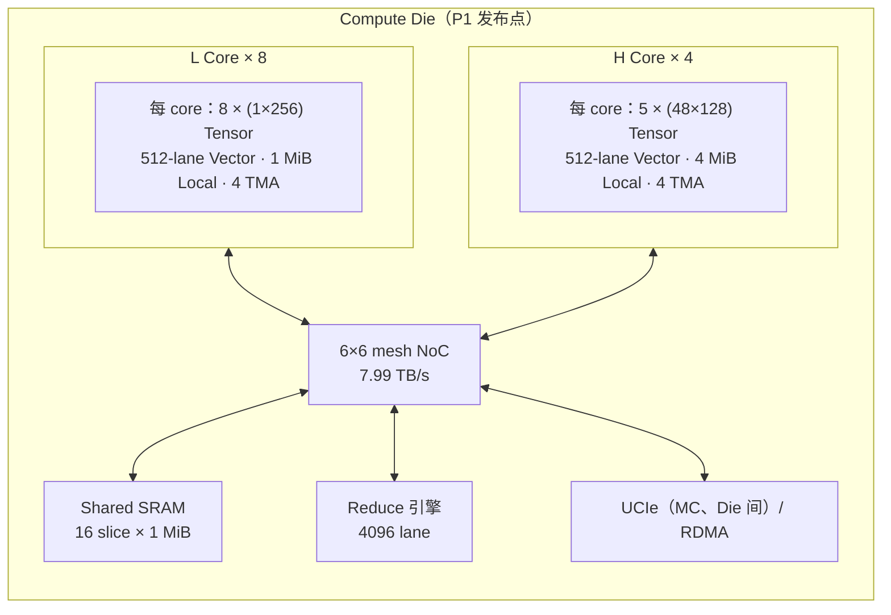
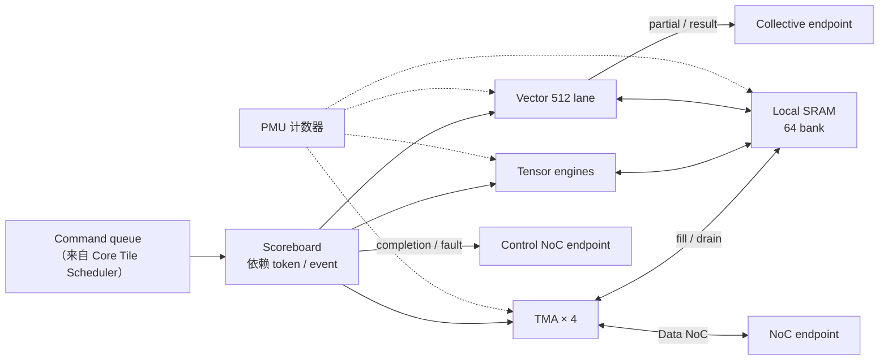
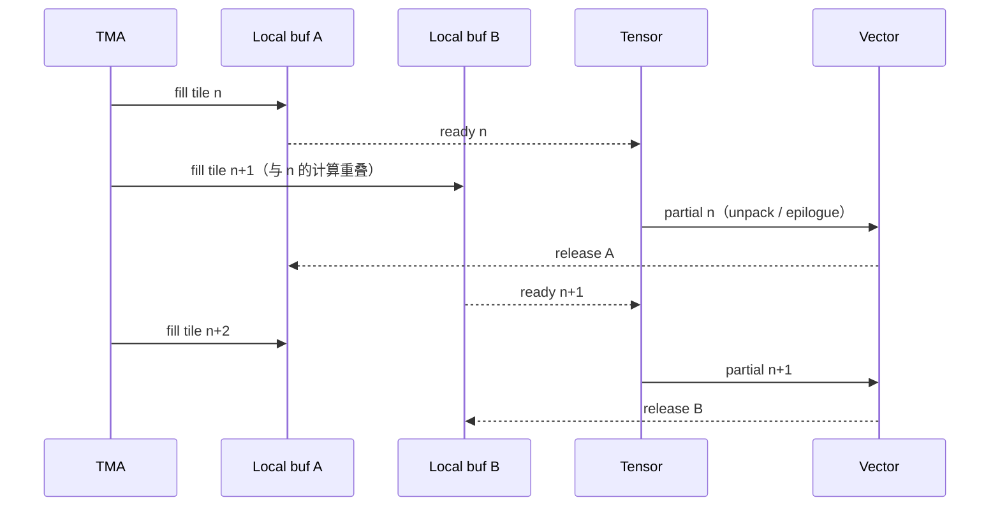
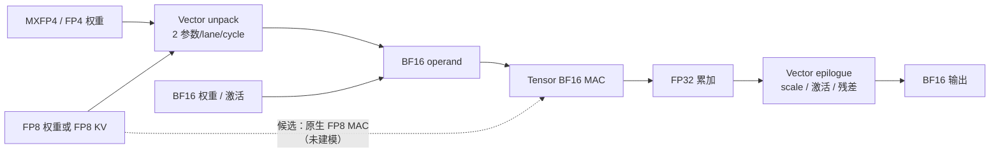
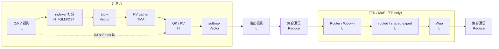
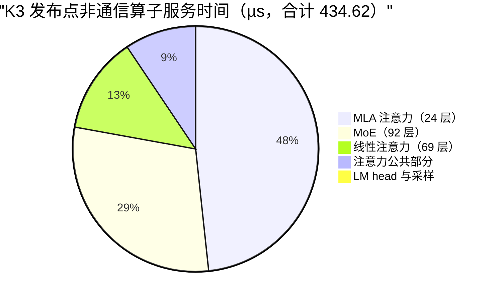

# AI Core 子系统设计

- 所有者：Hardware（AI Core）；共签：Software SW-03（kernel）
- 状态：`BASELINE`（单元规格来自模型推导，未经 RTL/综合回标，见 B-006）
- 数字口径：**唯一硬件规格 P1 的发布点**（8 L + 4 H、1.0 GHz，ADR-0021），权威值在
  `teams/hardware/inputs/k3_mc_baseline.json#tpsDesign.hardware`；Die 级汇总见
  [`01_SYSTEM_ARCHITECTURE.md`](../../../docs/architecture/01_SYSTEM_ARCHITECTURE.md) 第 2.1 节。
  本文数字与 [`21_TPS_DESIGN_BASELINE.md`](../../../docs/architecture/21_TPS_DESIGN_BASELINE.md) 第 3.2 节冲突时，以 21 号文档为准。

## 1. 目标与边界

AI Core 负责 Tensor、Vector 和局部数据编排。本文冻结到单元级，不展开
Tensor PE 内部、乘法器实现、寄存器文件 bitcell 或具体流水级。

当前采用异构 Core：

- L Core：面向 GEMV、Skinny GEMM、Decode FFN 和低复用投影；
- H Core：面向 Attention QK/PV、线性注意力 state、indexer 打分等高复用矩阵；
- Vector：RMSNorm、RoPE、Softmax、SiLU、Top-k、权重 unpack、FP8 KV 反量化；
- TMA：Shared SRAM 与 Local SRAM 之间的 tile 搬运（见 [03](03_TMA_AND_SRAM.md)）。



## 2. 单 Die 基线

| 单元 | 数量 | 频率 | 主要规格 | 峰值 / Die | 状态 |
| --- | ---: | ---: | --- | ---: | --- |
| L Core | 8 | 1.0 GHz | 每 Core 8 × (1×256) Tensor engine | 32.77 TFLOPS BF16 | `BASELINE` |
| H Core | 4 | 1.0 GHz | 每 Core 5 × (48×128) Tensor engine | 245.76 TFLOPS BF16 | `BASELINE` |
| Vector | 12 | 1.0 GHz | 每 Core 512 lane | 12.29 TOPS | `MODEL` |
| TMA | 12 组 | 1.0 GHz | 每 Core 4 engine × 512 B/cycle | 1.64 TB/s/core（有效） | `MODEL`（O-007） |
| Reduce | 1 | 1.0 GHz | 4096 lane | 2.66 TOPS | `MODEL` |

频率固定 1.0 GHz，不参与搜索（21 号文档第 1.1 节）：算力只能通过 core 数、engine 数和阵列形状调整。

### 2.1 L Core

每 Core：

- 8 个逻辑 Tensor engine，每 engine 每周期 1×256 个 BF16 MAC，合计 2048 MAC/cycle；
- 1 MiB Local SRAM，64 bank × 64 B，读 3.07 TB/s（bank 利用率 0.75）；
- 512-lane Vector，承担 MXFP4 unpack（每 lane 每周期 2 个参数）；
- 4 个 TMA engine。

```text
8 core × 8 engine × 1 × 256 MAC × 2 FLOP × 1.0 GHz = 32.768 TFLOPS/Die
```

### 2.2 H Core

每 Core：

- 5 个逻辑 Tensor engine，每 engine 每周期 48×128 个 BF16 MAC，合计 30720 MAC/cycle；
- 4 MiB Local SRAM，64 bank × 64 B，读 3.07 TB/s；
- 512-lane Vector，承担 online softmax、FP8 KV 反量化；
- 4 个 TMA engine。

```text
4 core × 5 engine × 48 × 128 MAC × 2 FLOP × 1.0 GHz = 245.76 TFLOPS/Die
```

单 Die BF16 Dense 峰值合计 278.53 TFLOPS。这是数学峰值，不是可持续性能。

### 2.3 峰值与模型可持续值

模型对所有矩阵算子乘矩阵利用率 0.65，对向量算子乘 0.35，另乘 layout imbalance 1.15（`A.TECH`，固定假设，不是可调旋钮）。

```mermaid
xychart-beta
  title "每 Die 峰值与模型可持续值（TFLOPS / TOPS）"
  x-axis ["L Tensor", "H Tensor", "Vector", "Reduce"]
  y-axis "T/s" 0 --> 260
  bar [32.77, 245.76, 12.29, 2.66]
  bar [21.30, 159.74, 4.30, 1.73]
```



第一组为峰值，第二组为乘利用率后的值（L/H × 0.65，Vector × 0.35，Reduce × 0.65）。

**关于 88%：** 早期 Final Tuning 在 `OPT.matrixUtil` 登载过 0.88，但 `mappedPlan()` 用 `TECH.matrixUtil = 0.65`
算完时长后不再重算，0.88 从未生效；2026-09-25 起 `OPT` 中已删除两个利用率键，由测试断言（`tests/regression/test_k3_rdma_final_tuning.js`）。
若要提高到 0.88，需 SW-03 在 [`KERNEL_SPEC.md`](../../software/docs/KERNEL_SPEC.md) 中给出 kernel 级证据。

### 2.4 关键时延参数（模型值）

| 参数 | 值 | 含义 | 来源 |
| --- | ---: | --- | --- |
| `tmaSetupCycles` | 16 cycle | 每次 TMA 装载的固定建立时间 | `A.TECH` |
| `routerCycles` | 2 cycle/hop | NoC 每跳时延；6×6 mesh 按 6 跳计 12 cycle | `A.TECH` |
| `launchUs` × `launchScale` | 0.015 µs × 0.45 | 每个未融合算子的发射开销 | `A.TECH`、`OPT`（B-003） |
| `unpackParamsPerLaneCycle` | 2 | MXFP4/FP8 → BF16 的向量解包速率 | `A.TECH` |
| `ucieHopUs` | 0.025 µs | 每次跨 Die 跳 | `A.TECH` |

## 3. 单元级结构与接口



每个 Core 至少具有：

| 接口 | 方向 | 最低语义 | 位宽（候选） |
| --- | --- | --- | --- |
| Command queue | 入 | tile opcode、shape、dtype、地址、依赖 token（Tile IR） | 256 bit descriptor 槽，`OPEN` |
| TMA descriptor | 双向 | 2D/3D stride、gather/scatter、padding、convert | 见 [03](03_TMA_AND_SRAM.md) 第 4 节 |
| Local SRAM ports | 双向 | Tensor、Vector、TMA 独立仲裁类 | 64 bank × 64 B/cycle |
| Data NoC endpoint | 双向 | Shared SRAM / 其他 Core tile 传输 | 256 B/cycle × 4 lane |
| Control NoC endpoint | 双向 | command、completion、fault、barrier | 256 bit flit 候选，`OPEN`（O-004） |
| Collective endpoint | 双向 | partial/result、epoch、ready/ACK | 见 [07](07_COLLECTIVE_RDMA.md) |
| PMU/debug | 出 | cycle、stall、bank conflict、utilization、ECC | 见 [08](08_ON_DIE_SCHEDULER_AND_PMU.md) 第 5 节 |

Tensor、Vector、TMA 可并行，但必须由 scoreboard 保证：

- producer tile 写完后 consumer 才能读；
- TMA 不覆盖仍被 Tensor/Vector 使用的 buffer；
- collective 未 release 的 mailbox 不得复用；
- fault/poison 必须沿 tile dependency 传播。

一个权重 tile 在 Core 内的并发时序（双缓冲，TMA 通道提前装载下一 tile）：



## 4. 数据类型

### 4.1 三个模型的精度需求

| 模型 | Dense / attention 权重 | Routed expert | Router / LM head | KV cache | 计算 |
| --- | --- | --- | --- | --- | --- |
| K3 | BF16 | MXFP4（0.53125 B/参数） | BF16 | FP8 FlashMLA，656 B/token/layer | BF16 MAC，FP32 累加 |
| GLM-5.2 | FP8 E4M3，128×128 block scale | FP8 E4M3 | BF16 | FP8 FlashMLA（`ASSUMPTION`） | 同上 |
| DeepSeek-V4-Pro | FP8（`ASSUMPTION`） | FP4，每 32 权重 8-bit scale（`ASSUMPTION`） | BF16 | FP8 FlashMLA（`ASSUMPTION`） | 同上 |

来源：`out/workload/planning_operator_workload.json#dtypePolicy`；模型侧定义见
[`teams/model/docs/deployment/`](../../model/docs/deployment/README.md)，软件侧策略见
[`PRECISION_POLICY.md`](../../software/docs/PRECISION_POLICY.md)。

### 4.2 硬件数据通路



架构需要支持：

- BF16 Tensor 和 Vector；FP32 accumulation；
- FP8 E4M3 权重和 KV 的解包/反量化（当前发布点经由 Vector unpack，时间已计入）；
- MXFP4/FP4 权重解包和 block scale；
- INT32/INT16 地址、计数、top-k 下标；
- FP16 可选兼容。

当前性能模型按 BF16 峰值计所有矩阵算子，包括 GLM-5.2 / DeepSeek-V4-Pro 的 FP8 算子。
是否增加原生 FP8 MAC（理论上吞吐翻倍、省去 unpack）是开放的设计选项（O-012），在 B=1 decode 下多数 L 算子受带宽限制，收益主要落在 H 侧。

## 5. 算子映射

### 5.1 映射表

| 算子/tile | 首选单元 | 模型 | 关键限制 |
| --- | --- | --- | --- |
| Attention Q/KV/输出投影 | L Core | 全部 | 低 batch、权重流式 |
| QK / PV（吸收式 MLA） | H Core | K3（24 层）、GLM / DS（每层 top-k 2048） | KV tile 32768、head tile 96、局部累加 |
| Online softmax、m/l/O | H Core 的 Vector | 全部 | m/l/O 生命周期与 FP32 精度 |
| FP8 KV 反量化 | H Core 的 Vector | 全部 | 与 QK 流水，从 softmax 可掩盖预算中扣除 |
| Linear attention state | H + Vector | K3（69 层 KDA） | state read-modify-write |
| Indexer 打分 | H Core（`INDEXER` 核类） | GLM（21 full 层）、DS（61 层） | 读全部已缓存 index key |
| Indexer top-k 选择 | Vector | GLM、DS | 局部 top-2048，再跨 rank 合并（[07](07_COLLECTIVE_RDMA.md) 第 2.2 节） |
| Sparse KV gather | TMA gather | GLM、DS | 656 B 粒度随机读 |
| Wdown / Router / Wup | L Core | K3 | 小矩阵与 collective 边界 |
| Expert gate/up/down | L Core | 全部（TP-only） | 权重按 TP rank 切分，无 dispatch |
| Shared experts | L Core | 全部 | 与集合通信重叠（K3 `commOverlap`） |
| RMSNorm / RoPE / SiLU | Vector | 全部 | 融合进相邻 kernel（`epilogueFusion`） |
| LM head | L Core | 全部 | 最后一层大权重流 |

### 5.2 一层内的单元占用



### 5.3 当前时间分布（K3 发布点）

非通信算子的服务时间（21 号文档第 2.1 节）：



MLA 注意力占近一半，几乎全部在 H Core 上，是 H 算力的主要用户。

### 5.4 三个模型的 H 侧负载（规划口径）

| 模型 | H 侧算子 | 全局 FLOP/token | 每 rank（TP32） | 按 H 可持续值 1278 TFLOPS/rank |
| --- | --- | ---: | ---: | ---: |
| K3 | 吸收式 MLA（24 层 × 1M context） | 5.26 T | 164 G | 约 129 µs |
| GLM-5.2 | indexer（21 层）+ sparse attention | 0.180 T + 0.022 T | 6.3 G | 约 5 µs |
| DeepSeek-V4-Pro | indexer（61 层）+ sparse attention | 1.05 T + 0.035 T | 33.9 G | 约 27 µs |

来源：`out/workload/planning_operator_workload.json#operators`（全局值，TP 前）。H 可持续值 = 159.74 × 8 Die。
GLM / DeepSeek 的 H 负载远低于 K3，瓶颈转到权重字节和集合通信。

## 6. 单 Core PPA（按比例分摊的初算）

21 号文档只给 Die 级面积和功耗。下表把 Die 级数字按 MAC 数（矩阵）、实例数（向量、core 开销、TMA）和容量（SRAM 阵列）分摊到单 Core，
**未含** bank 外设 32.70 mm²、NoC、Reduce、PHY 和控制。它是冻结前的预算分配，不是综合结果。

| 项（SF4 面积） | L Core | H Core | Die 合计 |
| --- | ---: | ---: | ---: |
| 矩阵面积 | 1.64 mm² | 24.53 mm² | 111.18 mm² |
| 矩阵功耗 | 1.97 W | 29.49 W | 133.69 W |
| 向量面积 / 功耗 | 0.98 mm² / 0.67 W | 0.98 mm² / 0.67 W | 11.77 mm² / 7.99 W |
| Local SRAM 阵列 | 0.99 mm² | 3.96 mm² | 23.76 mm²（local 部分） |
| Core 开销 | 1.02 mm² | 1.02 mm² | 12.26 mm² |
| TMA | 1.79 mm² | 1.79 mm² | 21.46 mm² |
| **小计** | **约 6.4 mm²** | **约 32.3 mm²** | — |

8 个 L Core 合计约 51 mm²，4 个 H Core 合计约 129 mm²，两者占 Die 373.71 mm² 的 48%。

## 7. 当前模型风险

1. 矩阵利用率 0.65 是固定假设，不是由阵列波形推导；H 的 48×128 阵列在 head tile 96 下的填充率未验证。
2. “attention fusion”“token packing”等经验缩放因子已全部置 1（B-003）；对应的融合必须以具体 kernel 表达（[`KERNEL_SPEC.md`](../../software/docs/KERNEL_SPEC.md)）。
3. 1×256 和 48×128 是逻辑阵列形状，物理子阵列划分尚未定义（O-005）。
4. Vector lane 的操作集合、SFU 数量、跨 lane reduction 和寄存器容量未定（O-006）；下面是建议的最小集合：
   - 逐元素：add/mul/fma、max/min、select、convert（FP8/FP4/BF16/FP32）；
   - SFU：exp、rsqrt、reciprocal、SiLU；
   - 跨 lane：sum/max reduction、prefix、compare-select top-k；
   - 内存：gather/scatter 下标生成。
5. 1.0 GHz 尚无 PVT、线长和 SRAM macro 时序证明（B-006）。
6. FP8 权重目前经 unpack 按 BF16 计算，原生 FP8 MAC 是否值得面积未评估（O-012）。

## 8. AI Core 冻结交付物

- Core 单元框图和端口表（本文第 3 节为初版）；
- Tensor/Vector ISA 与 tile descriptor（[`TILE_IR.md`](../../../docs/architecture/contracts/TILE_IR.md)）；
- 支持 shape/dtype 列表（本文第 4 节为初版）；
- Tensor/Vector/TMA 并发状态机；
- 每类 kernel 的 cycle 模型和 golden trace（[`KERNEL_SPEC.md`](../../software/docs/KERNEL_SPEC.md)）；
- Local SRAM bank 映射；
- 面积/功耗初算（本文第 6 节）与时钟约束；
- 关键算子仿真：MLA、Linear Attention、MoE、LM Head、indexer。
