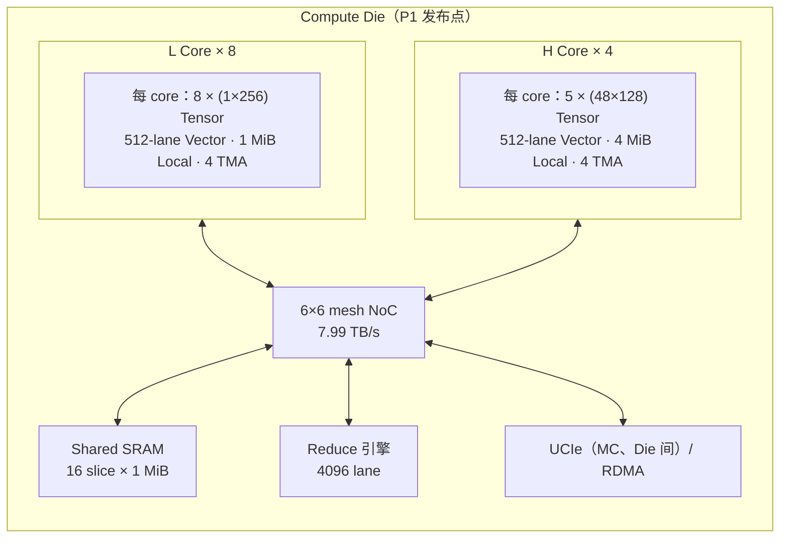
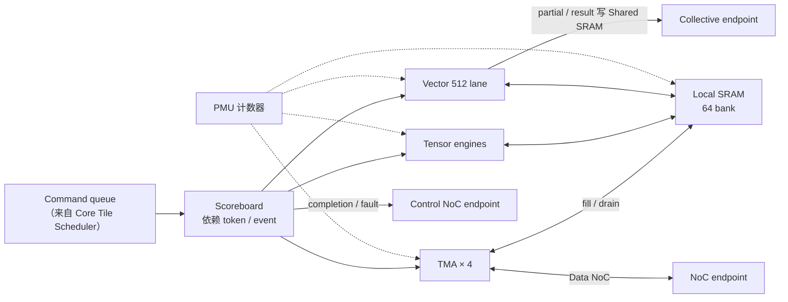
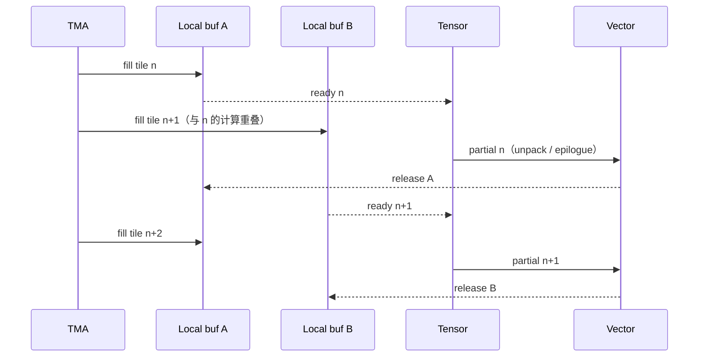
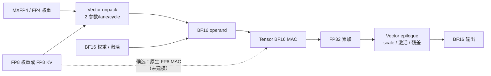
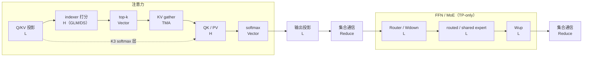
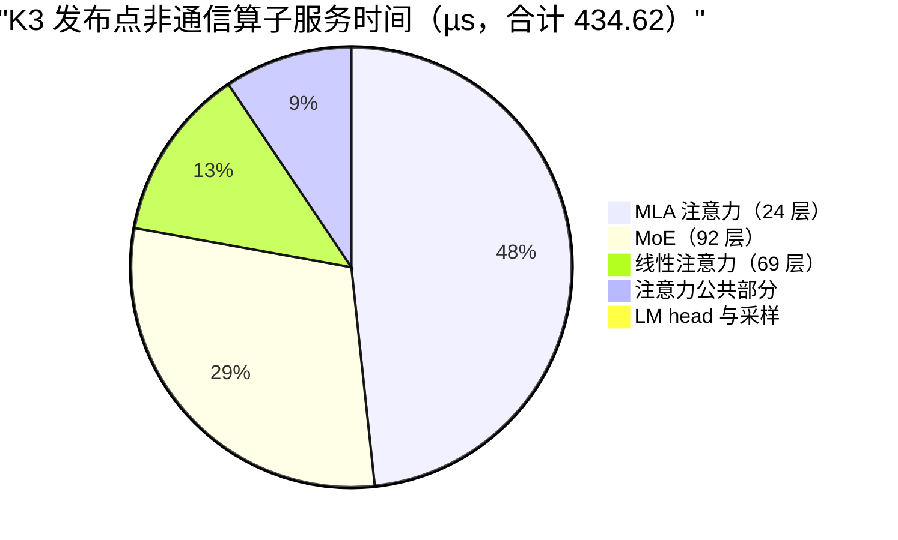

# AI Core 子系统设计

- 所有者：Hardware（AI Core）；共签：Software SW-03（kernel）
- 状态：`BASELINE`（单元规格来自模型推导，未经 RTL/综合回标，见 B-006）
- 数字口径：**唯一硬件规格 P1 的发布点**（8 L + 4 H、1.0 GHz，ADR-0021），权威值在
  `teams/hardware/inputs/k3_mc_baseline.json#tpsDesign.hardware`；Die 级汇总见
  [`01_SYSTEM_ARCHITECTURE.md`](../../../docs/architecture/01_SYSTEM_ARCHITECTURE.md) 第 2.1 节。
  本文数字与 [`21_TPS_DESIGN_BASELINE.md`](../../../docs/architecture/21_TPS_DESIGN_BASELINE.md) 第 3.2 节冲突时，以 21 号文档为准。

## 1. 目标与边界

AI Core 负责 Tensor、Vector 和局部数据编排。本文冻结到单元级，不展开
Tensor PE 内部、乘法器实现、寄存器文件 bitcell 或具体流水级。

当前采用异构 Core：

- L Core：面向 GEMV、Skinny GEMM、Decode FFN 和低复用投影；
- H Core：面向 Attention QK/PV、线性注意力 state、indexer 打分等高复用矩阵；
- Vector：RMSNorm、RoPE、Softmax、SiLU、Top-k、权重 unpack、FP8 KV 反量化；
- TMA：Shared SRAM 与 Local SRAM 之间的 tile 搬运（见 [03](03_TMA_AND_SRAM.md)）。


```mermaid
flowchart TB
  subgraph DIE["Compute Die（P1 发布点）"]
    direction TB
    subgraph LG["L Core × 8"]
      L["每 core：8 × (1×256) Tensor<br/>512-lane Vector · 1 MiB Local · 4 TMA"]
    end
    subgraph HG["H Core × 4"]
      H["每 core：5 × (48×128) Tensor<br/>512-lane Vector · 4 MiB Local · 4 TMA"]
    end
    NOC["6×6 mesh NoC<br/>7.99 TB/s"]
    SH["Shared SRAM<br/>16 slice × 1 MiB"]
    RED["Reduce 引擎<br/>4096 lane"]
    IO["UCIe（MC、Die 间）/ RDMA"]
    LG <--> NOC
    HG <--> NOC
    NOC <--> SH
    NOC <--> RED
    NOC <--> IO
  end
```

## 2. 单 Die 基线

| 单元 | 数量 | 频率 | 主要规格 | 峰值 / Die | 状态 |
| --- | ---: | ---: | --- | ---: | --- |
| L Core | 8 | 1.0 GHz | 每 Core 8 × (1×256) Tensor engine | 32.77 TFLOPS BF16 | `BASELINE` |
| H Core | 4 | 1.0 GHz | 每 Core 5 × (48×128) Tensor engine | 245.76 TFLOPS BF16 | `BASELINE` |
| Vector | 12 | 1.0 GHz | 每 Core 512 lane | 12.29 TOPS | `MODEL` |
| TMA | 12 组 | 1.0 GHz | 每 Core 4 engine × 512 B/cycle | 1.64 TB/s/core（有效） | `MODEL`（O-007） |
| Reduce | 1 | 1.0 GHz | 4096 lane | 2.66 TOPS | `MODEL` |

频率固定 1.0 GHz，不参与搜索（21 号文档第 1.1 节）：算力只能通过 core 数、engine 数和阵列形状调整。

### 2.1 L Core

每 Core：

- 8 个逻辑 Tensor engine，每 engine 每周期 1×256 个 BF16 MAC，合计 2048 MAC/cycle；
- 1 MiB Local SRAM，64 bank × 64 B，读 3.07 TB/s（bank 利用率 0.75）；
- 512-lane Vector，承担 MXFP4 unpack（每 lane 每周期 2 个参数）；
- 4 个 TMA engine。

```text
8 core × 8 engine × 1 × 256 MAC × 2 FLOP × 1.0 GHz = 32.768 TFLOPS/Die
```

### 2.2 H Core

每 Core：

- 5 个逻辑 Tensor engine，每 engine 每周期 48×128 个 BF16 MAC，合计 30720 MAC/cycle；
- 4 MiB Local SRAM，64 bank × 64 B，读 3.07 TB/s；
- 512-lane Vector，承担 online softmax、FP8 KV 反量化；
- 4 个 TMA engine。

```text
4 core × 5 engine × 48 × 128 MAC × 2 FLOP × 1.0 GHz = 245.76 TFLOPS/Die
```

单 Die BF16 Dense 峰值合计 278.53 TFLOPS。这是数学峰值，不是可持续性能。

### 2.3 峰值与模型可持续值

模型对所有矩阵算子乘矩阵利用率 0.65，对向量算子乘 0.35，另乘 layout imbalance 1.15（`A.TECH`，固定假设，不是可调旋钮）。


```mermaid
xychart-beta
  title "每 Die 峰值与模型可持续值（TFLOPS / TOPS）"
  x-axis ["L Tensor", "H Tensor", "Vector", "Reduce"]
  y-axis "T/s" 0 --> 260
  bar [32.77, 245.76, 12.29, 2.66]
  bar [21.30, 159.74, 4.30, 1.73]
```

第一组为峰值，第二组为乘利用率后的值（L/H × 0.65，Vector × 0.35，Reduce × 0.65）。

**关于 88%：** 早期 Final Tuning 在 `OPT.matrixUtil` 登载过 0.88，但 `mappedPlan()` 用 `TECH.matrixUtil = 0.65`
算完时长后不再重算，0.88 从未生效；2026-09-25 起 `OPT` 中已删除两个利用率键，由测试断言（`tests/regression/test_k3_rdma_final_tuning.js`）。
若要提高到 0.88，需 SW-03 在 [`KERNEL_SPEC.md`](../../software/docs/KERNEL_SPEC.md) 中给出 kernel 级证据。

### 2.4 关键时延参数（模型值）

| 参数 | 值 | 含义 | 来源 |
| --- | ---: | --- | --- |
| `tmaSetupCycles` | 16 cycle | 每次 TMA 装载的固定建立时间 | `A.TECH` |
| `routerCycles` | 2 cycle/hop | NoC 每跳时延；6×6 mesh 按 6 跳计 12 cycle | `A.TECH` |
| `launchUs` × `launchScale` | 0.015 µs × 0.45 | 每个未融合算子的发射开销 | `A.TECH`、`OPT`（B-003） |
| `unpackParamsPerLaneCycle` | 2 | MXFP4/FP8 → BF16 的向量解包速率 | `A.TECH` |
| `ucieHopUs` | 0.025 µs | 每次跨 Die 跳 | `A.TECH` |

### 2.5 Matrix:Vector 配比（HW-02 决策）

- 所有者：HW-02 AI-Core；共签：SW-03（kernel 的 vector 操作计数）
- 状态：`MODEL`（设计空间搜索：逐 kernel 解析上限 + K3 详细模型回放，不是 `FROZEN`；不改发布点）
- 设计空间（全部备选及其 ASSUMPTION）：`teams/hardware/inputs/matrix_vector_design_space.json`
- 搜索：`integration/detailed/matrix_vector_search.js`；`npm run aicore:search` 把最终方案写到
  `out/detailed/matrix_vector_design.json`（没有可行方案时写“无方案”记录，不选最不坏的一个），完整候选集写到
  `out/detailed/matrix_vector_candidates.json`。本节数字由 `tests/regression/test_matrix_vector_design.js`
  对照新鲜搜索结果检查。

**口径**：配比 = BF16 dense 矩阵峰值 : vector 峰值（lanes × 2 × f），等价于 MAC : lane。
P1 发布点每 Die **22.7:1**，但它是两类核的平均：L Core **4:1**，H Core **60:1**。
配比必须按核类分开看，不能只给一个整 Die 数。

**判据（逐 kernel 掩盖）**：每个融合 kernel 的 vector 部分不长于同一 kernel 的矩阵部分：

```text
vector lane-cycles / lanes  <=  matrix FLOPs / (2 × MACs × matrixUtil × fill)
=>  核内 MAC:lane  <=  matrix FLOPs / (2 × matrixUtil × fill × vector lane-cycles)
```

通用 vector 操作按 `TECH.vectorUtil` 折算，解包/反量化按 `TECH.unpackParamsPerLaneCycle` 计，与 `mappedPlan()` 一致。
上限与 lanes 无关，所以每个 kernel 给出一个最少 lanes：`MAC / 上限`。

#### 2.5.1 设计空间与搜索

| 维度 | 选项 | 依据 |
| --- | --- | --- |
| `vectorLanes` | 256–1024，步长 64（13 个），P1 为 512 | 模型中 L/H 共用一个 `vectorLanes` |
| `lowPrecisionInput` | `vectorUnpack`：张量核只吃 BF16，FP8/MXFP4 权重、FP8 KV、FP8 index key 都在 vector 上解包（P1）；`nativeTensor`：张量核直接吃 FP8 E4M3 / MXFP4，矩阵面积 +8% | O-012；8% 是 ASSUMPTION（多精度 MAC 常见 5–15%，不是本阵列证据） |
| `expUnit` | `sfu`：exp/倒数 SFU，softmax 8 op/score，vector 面积 +10%；`polynomial`：ALU 上做范围规约 + 多项式，18 op/score，无额外面积 | O-006，ASSUMPTION |

不搜索、已裁定的维度（理由见设计空间 `ruled`）：L/H 共用一个 lane 数（模型只有一个 `vectorLanes`；分核类配置省面积，待扩展 `A.physical()` / `mappedPlan()` 后再搜）；
不在 TMA 通路上解码（写入 Local SRAM 的 BF16 字节翻 2–4 倍，O-007 的写端口模型尚未计入）；B=1 decode（B 最高 16 的 GEMV 上限只作敏感度）。

**发布点的记账**：发布点 365.34 mm²（283.27 W）= 357.57 mm² + 7.78 mm²（共享端口放大，ADR-0023 把 `localWriteRatio` 从 1.70 降到 1 之后；之前是 373.71 mm² = 357.57 + 16.15）。下文所有面积、功耗都是这一口径，候选的面积直接与它和 400 mm²、封装窗口比较。

**约束**：

1. 三个模型（K3、GLM-5.2、DeepSeek-V4-Pro）的全部 H Core kernel（MLA、DSA indexer、KDA state）可掩盖；
   L Core 的 B=1 GEMV 解包只报告、不作要求，它的时间由 K3 系统回放计入；
2. K3 详细模型在发布点只改 lanes、解包（原生输入时关掉）和 softmax op 数回放，TPS/usr 不低于发布值的 99.9%；
3. Die 面积和功耗在限值内（`O.evaluate` 可行性，面积上限 400 mm²）。面积和功耗都**含共享端口放大**（发布点 +7.78 mm²、+2.74 W / Die，`O.chargeSharedPortCost`）和选项开销；
   早期版本只用 `P.resize(A.physical(x))` 的面积，漏掉端口放大，发布点显示 357.57 mm² 而不是 365.34 mm²；
4. 封装放得下：`8 × 面积 + 16 × 100 ≤ 5248 × (1 − 0.1254)`（8 个 Die、16 个 memory cube、放置窗口 5248 mm²）。
   0.1254 是发布点的**观测** keep-out（658.29 / 5248，`physical_design_space.json`），不是核实过的下限；更小的预留是未证实的假设，这里不用它放行任何候选。
   发布点本身还剩 67.17 mm²（ADR-0023 之前只剩 0.19 mm²），平摊到 8 个 Die，每个 Die 最多再加 8.40 mm²。

**目标**：可行优先，然后 Die 面积（含端口放大与选项开销）最小，然后功耗最小。都不可行时不选方案；排序只用来指出最接近的一个（违反的限值最少、能回放的优先）。
expUnit 通过模拟器的 `softmaxOpsPerScore`（`k3_operator_sram_sim.js`，默认 8）进入 K3 回放，所以多项式 exp 的代价同时反映在 kernel 上限和系统 TPS 上。

搜索共 52 个组合、3 个可行，设计空间 sha256 前缀 `caf143d1c2d4`。

#### 2.5.2 结论

> **这是 HW-02 搜索的推荐，不是基线。** 当前基线（`k3_mc_baseline.json`、ADR-0021）仍是每 Core 512 lane、Die 365.34 mm²、封装余量 67.17 mm²；
> 下表的 704 lane、371.37 mm²、余量 18.91 mm² 属于搜索胜出方案。要把它写进基线，需要改 `OPT`、重跑 `search:final` 和 `baseline:sync`（ADR-0005 第 5 条）并另立 ADR。

| 维度 | 选项 |
| --- | --- |
| `vectorLanes` | 704 |
| `lowPrecisionInput` | `vectorUnpack` |
| `expUnit` | `sfu` |

- 配比：整 Die **16.5:1**，L Core **2.9:1**，H Core **43.6:1**。
- 绑定约束：GLM-5.2 DSA indexer（FP8 key 经 vector 反量化），上限 44.5:1，至少 690.9 lane；取网格上的 704。
- K3 回放 1101.77 TPS/usr（发布值 1101.77），raw 775.76 µs，掩盖与 TPS 都满足。
- 面积 371.37 mm²（Die 361.98 mm² + 共享端口 7.78 mm² + SFU 1.62 mm²），功耗 286.3 W。
- 封装余量 **18.91 mm²**，平摊到 8 个 Die 是每 Die 2.36 mm²：很薄，keep-out 或 cube 面积稍有变化就会翻转（见 2.5.3 的敏感度）。
- 这个结论依赖 ADR-0023 回收的端口面积：`localWriteRatio` 回到 1.70 时，同一搜索 0 个可行，最接近的 704 / vectorUnpack / sfu 缺口 48.08 mm²。

三个模型的 H Core kernel 都要掩盖，就至少需要 690.9 lane / Core；这个 lane 数的面积在观测 keep-out 下必须靠端口回收才装得进封装。

#### 2.5.3 各备选的落选原因

每个选项取包含它的最优组合（不可行组合按"违反的限值最少、能回放的优先、再按面积"排序）。
`hKernelExposed` = 有 H Core kernel 掩盖不住；`k3Tps` = K3 回放低于发布值的 99.9%；`systemInfeasible` = 详细模型判为不可行（此行面积不含端口放大，回放没有产出它）；
`dieArea` = Die 面积超过 400 mm²；`packageArea` = 8 个 Die 加 memory cube 超出放置窗口扣掉 keep-out 之后的范围，封装余量为负即缺口；`area` = 可行但面积比选中的大。

| 维度 | 选项 | 结果 | 该选项最优组合（lanes / 输入 / exp） | H Core 配比 | K3 TPS/usr | 面积 | 功耗 | 封装余量 |
| --- | --- | --- | --- | --- | ---: | ---: | ---: | ---: |
| vectorLanes | `256` | `infeasible: hKernelExposed, k3Tps` | 256 / vectorUnpack / polynomial | 120.0:1 | 821.66 | 359.46 mm² | 279.3 W | 114.26 mm² |
| vectorLanes | `320` | `infeasible: hKernelExposed` | 320 / nativeTensor / sfu | 96.0:1 | 1101.66 | 370.56 mm² | 280.3 W | 25.45 mm² |
| vectorLanes | `384` | `infeasible: hKernelExposed` | 384 / nativeTensor / sfu | 80.0:1 | 1101.86 | 372.18 mm² | 281.3 W | 12.50 mm² |
| vectorLanes | `448` | `infeasible: hKernelExposed, k3Tps` | 448 / vectorUnpack / polynomial | 68.6:1 | 985.18 | 363.87 mm² | 282.3 W | 78.94 mm² |
| vectorLanes | `512` | `infeasible: hKernelExposed` | 512 / vectorUnpack / sfu | 60.0:1 | 1101.77 | 366.52 mm² | 283.3 W | 57.76 mm² |
| vectorLanes | `576` | `infeasible: hKernelExposed` | 576 / vectorUnpack / sfu | 53.3:1 | 1101.74 | 368.14 mm² | 284.3 W | 44.81 mm² |
| vectorLanes | `640` | `infeasible: hKernelExposed` | 640 / vectorUnpack / sfu | 48.0:1 | 1101.75 | 369.76 mm² | 285.3 W | 31.86 mm² |
| vectorLanes | `704` | **选中** | 704 / vectorUnpack / sfu | 43.6:1 | 1101.77 | 371.37 mm² | 286.3 W | 18.91 mm² |
| vectorLanes | `768` | `area` | 768 / vectorUnpack / sfu | 40.0:1 | 1101.77 | 372.99 mm² | 287.3 W | 5.96 mm² |
| vectorLanes | `832` | `area` | 832 / vectorUnpack / polynomial | 36.9:1 | 1101.72 | 372.70 mm² | 288.3 W | 8.31 mm² |
| vectorLanes | `896` | `infeasible: packageArea` | 896 / vectorUnpack / polynomial | 34.3:1 | 1101.71 | 374.17 mm² | 289.3 W | -3.46 mm² |
| vectorLanes | `960` | `infeasible: systemInfeasible` | 960 / vectorUnpack / polynomial | 32.0:1 | — | 367.87 mm² | 287.5 W | 46.98 mm² |
| vectorLanes | `1024` | `infeasible: systemInfeasible` | 1024 / vectorUnpack / polynomial | 30.0:1 | — | 369.34 mm² | 288.5 W | 35.21 mm² |
| lowPrecisionInput | `vectorUnpack` | **选中** | 704 / vectorUnpack / sfu | 43.6:1 | 1101.77 | 371.37 mm² | 286.3 W | 18.91 mm² |
| lowPrecisionInput | `nativeTensor` | `infeasible: hKernelExposed` | 320 / nativeTensor / sfu | 96.0:1 | 1101.66 | 370.56 mm² | 280.3 W | 25.45 mm² |
| expUnit | `sfu` | **选中** | 704 / vectorUnpack / sfu | 43.6:1 | 1101.77 | 371.37 mm² | 286.3 W | 18.91 mm² |
| expUnit | `polynomial` | `area` | 832 / vectorUnpack / polynomial | 36.9:1 | 1101.72 | 372.70 mm² | 288.3 W | 8.31 mm² |

- **512–640 lane**：K3 回放和封装都满足，但 GLM-5.2 的 DSA indexer 掩盖不住（需要至少 690.9 lane），只违反 `hKernelExposed`。
- **448 lane 及以下**：indexer 掩盖不住，且 K3 回放掉出 0.1%（320、384 lane 配原生输入时 K3 回放达标，只剩 `hKernelExposed`）。
- **768 lane**：可行，但面积 372.99 mm²，比 704 lane 多 1.62 mm²，封装余量只剩 5.96 mm²；**832 lane + 多项式 exp** 也可行（372.70 mm²，余量 8.31 mm²）。
  704 的优势只有 1.3–1.6 mm²，选择它是按"面积最小"排序的结果，不是 lane 数的拐点。
- **896 lane**：封装缺口 3.46 mm²；**960 lane 及以上**整卡功耗在端口放大后超限（`card power after shared-port scaling`），详细模型判为不可行。
- **`nativeTensor`**：去掉解包后 512 lane 就够（绑定仍是 GLM-5.2 indexer，上限 63.0:1，至少 487.6 lane），但矩阵面积 +8% 使 512 / nativeTensor / sfu 的 Die 达 375.41 mm²，封装缺口 13.42 mm²；
  各 lane 数的缺口随 lane 增加：576 lane 26.3 mm²，704 lane 52.2 mm²。
  盈亏平衡点不适用：原生输入没有可行组合，没有可与 vector 解包比较面积的对象。多精度 MAC 开销（8% 是 ASSUMPTION）必须降到约 6.5% 以下才会让 512 lane 的原生方案放进封装（按 512 / nativeTensor / sfu 的缺口 13.42 mm² 折算）——这个门槛要综合数据才能确认。
- **`polynomial`**：K3 MLA 的上限从 99.9 降到 53.9（vector 解包）/ 65.1（原生），704 lane 以下 K3 回放都掉出 0.1%；
  704 lane + vector 解包只有 1087.02。832 lane 起 K3 回放恢复达标，因此 832 lane + 多项式 exp 可行，但面积不如 SFU 方案。

#### 2.5.4 分析

**逐 kernel 上限**（核内 MAC:lane 不超过该值时 vector 可被完全掩盖；"—" 表示该前提下没有 vector 工作）：

| Kernel | 核类 | vector 解包 + SFU | vector 解包 + 多项式 | 原生 + SFU | 原生 + 多项式 | 选定方案（704 / vectorUnpack / sfu）下最少 lanes/core |
| --- | --- | ---: | ---: | ---: | ---: | ---: |
| GEMV，FP8/FP4 权重，B=1 | L | 3.1 | 3.1 | — | — | 665.6 |
| GEMV，B=2 | L | 6.2 | 6.2 | — | — | 332.8 |
| GEMV，B=4 | L | 12.3 | 12.3 | — | — | 166.4 |
| GEMV，B=8（MTP/多 token） | L | 24.6 | 24.6 | — | — | 83.2 |
| GEMV，B=16 | L | 49.2 | 49.2 | — | — | 41.6 |
| K3 MLA QK+softmax+PV（FP8 KV，96 head） | H | 99.9 | 53.9 | 146.5 | 65.1 | 307.6 |
| K3 KDA state update，B=1 | H | 90.5 | 90.5 | 90.5 | 90.5 | 339.6 |
| GLM-5.2 sparse MLA | H | 8270.8 | 4766.2 | 14060.3 | 6249.0 | 3.7 |
| GLM-5.2 DSA indexer | H | 44.5 | 44.5 | 63.0 | 63.0 | 690.9 |
| DeepSeek-V4-Pro sparse MLA | H | 7811.3 | 4055.9 | 10545.2 | 4686.8 | 3.9 |
| DeepSeek-V4-Pro DSA indexer | H | 54.1 | 54.1 | 65.8 | 65.8 | 568.3 |

GLM-5.2 / DeepSeek-V4-Pro 的 sparse MLA 每核只有约 2 个 token，矩阵填充率极低，vector 总能掩盖，不构成约束。
RMSNorm、SiLU、残差、RoPE、Router top-k 相对相邻矩阵的强度在 1000 以上，也不构成约束。
B=1 GEMV 的上限约 3:1：选定方案（704 lane）L Core 为 2.9:1，恰好能掩盖；P1（4:1）掩盖不住，解包时间在 K3 回放中计入。

**K3 系统回放**（发布点只改 lanes / 输入 / exp，TPS/usr；"—" 为不可行）：

| lanes/core | 整 Die 配比 | H Core 配比 | vector 解包 + SFU | vector 解包 + 多项式 | 原生 + SFU | 原生 + 多项式 | Die 面积 |
| ---: | ---: | ---: | ---: | ---: | ---: | ---: | ---: |
| 256 | 45.3:1 | 120.0:1 | 961.62 | 821.66 | 1069.43 | 899.10 | 359.46 mm² |
| 320 | 36.3:1 | 96.0:1 | 1019.31 | 890.65 | 1101.66 | 954.30 | 360.93 mm² |
| 384 | 30.2:1 | 80.0:1 | 1061.62 | 943.35 | 1101.86 | 995.02 | 362.40 mm² |
| 448 | 25.9:1 | 68.6:1 | 1091.36 | 985.18 | 1101.86 | 1026.30 | 363.87 mm² |
| 512（P1） | 22.7:1 | 60.0:1 | 1101.77 | 1018.97 | 1101.81 | 1051.09 | 365.34 mm² |
| 576 | 20.1:1 | 53.3:1 | 1101.74 | 1046.90 | 1101.74 | 1071.20 | 366.81 mm² |
| 640 | 18.1:1 | 48.0:1 | 1101.75 | 1070.37 | 1101.76 | 1087.39 | 368.28 mm² |
| 704 | 16.5:1 | 43.6:1 | 1101.77 | 1087.02 | 1101.77 | 1100.81 | 369.76 mm² |
| 768 | 15.1:1 | 40.0:1 | 1101.77 | 1099.33 | 1101.77 | 1101.77 | 371.23 mm² |
| 832 | 13.9:1 | 36.9:1 | 1101.76 | 1101.72 | 1101.76 | 1101.76 | 372.70 mm² |
| 896 | 13.0:1 | 34.3:1 | 1101.71 | 1101.71 | 1101.71 | 1101.71 | 374.17 mm² |
| 960 | 12.1:1 | 32.0:1 | — | — | — | — | 367.87 mm² |
| 1024 | 11.3:1 | 30.0:1 | — | — | — | — | 369.34 mm² |

Die 面积含共享端口放大（发布点 365.34 mm² = 357.57 + 7.78），不含选项开销。960 lane 及以上整卡功耗超限，回放不可行，面积不含端口放大这一项，不能与上面各行比较。

发布点上 vector 解包比原生输入多出 13.19 µs 的 kernel 时间：MXFP4 routed expert 6.15 µs，BF16 权重 7.03 µs。
后者是模型记账问题：`mappedPlan()` 对 BF16 权重也按参数计了解包，而 BF16 权重其实不需要解包。

**只支持 K3 的变体**（同一设计空间，`requirements.models` 只留 K3）：52 个组合、7 个可行，最优为 512 / vectorUnpack / sfu
（K3 回放 1101.77 TPS/usr，面积 366.52 mm²，封装余量 +57.76 mm²），绑定约束是 Kimi K3 KDA state update（上限 90.5:1，至少 339.6 lane）。
原生输入的最优为 384 lane（30.2:1），面积 372.18 mm²，封装余量 +12.50 mm²。
K3 单模型比三模型省 4.86 mm² / Die（366.52 vs 371.37 mm²），代价是放弃 GLM-5.2 / DeepSeek-V4-Pro 的 indexer 掩盖保证。

- **三模型都要支持时，掩盖约束需要每 Core 至少 690.9 lane（整 Die 约 16.5:1，H Core 43.6:1）**；GLM-5.2 的 DSA indexer 是唯一的绑定约束。
- **32:1 只在"只跑 K3 且张量核原生吃低精度"时接近成立**（384 lane，30.2:1），且需要多精度 MAC 开销足够低（见 2.5.3）。
- 核类分开配 lanes（L 按每参数解包速率，H 按 attention/indexer 强度）比单一整 Die 配比更省面积，是下一步要加入搜索的维度。

## 3. 单元级结构与接口


```mermaid
flowchart LR
  CQ["Command queue<br/>（来自 Core Tile Scheduler）"] --> SB["Scoreboard<br/>依赖 token / event"]
  SB --> TE["Tensor engines"]
  SB --> VE["Vector 512 lane"]
  SB --> TMA["TMA × 4"]
  TMA <-->|"fill / drain"| LS["Local SRAM<br/>64 bank"]
  TE <--> LS
  VE <--> LS
  TMA <-->|"Data NoC"| NOC["NoC endpoint"]
  SB -->|"completion / fault"| CN["Control NoC endpoint"]
  VE -->|"partial / result 写 Shared SRAM"| COL["Collective endpoint"]
  PMU["PMU 计数器"] -.-> TE
  PMU -.-> VE
  PMU -.-> TMA
  PMU -.-> LS
```

每个 Core 至少具有：

| 接口 | 方向 | 最低语义 | 位宽（候选） |
| --- | --- | --- | --- |
| Command queue | 入 | tile opcode、shape、dtype、地址、依赖 token（Tile IR） | 256 bit descriptor 槽，`OPEN` |
| TMA descriptor | 双向 | 2D/3D stride、gather/scatter、padding、convert | 见 [03](03_TMA_AND_SRAM.md) 第 4 节 |
| Local SRAM ports | 双向 | Tensor、Vector、TMA 独立仲裁类 | 64 bank × 64 B/cycle |
| Data NoC endpoint | 双向 | Shared SRAM / 其他 Core tile 传输 | 256 B/cycle × 4 lane |
| Control NoC endpoint | 双向 | command、completion、fault、barrier | 256 bit flit 候选，`OPEN`（O-004） |
| Collective endpoint | 双向 | partial/result 写 Shared SRAM 并置完成计数；WQE、doorbell、ready/ACK 由 Comm Core 处理，Core 不发 WQE；另可对全局地址发 posted store / atomic 与 FENCE，不提供远端 load（[10](10_COMM_CORE.md) 第 6 节） | 见 [07](07_COLLECTIVE_RDMA.md)、[10](10_COMM_CORE.md) |
| PMU/debug | 出 | cycle、stall、bank conflict、utilization、ECC | 见 [08](08_ON_DIE_SCHEDULER_AND_PMU.md) 第 5 节 |

Tensor、Vector、TMA 可并行，但必须由 scoreboard 保证：

- producer tile 写完后 consumer 才能读；
- TMA 不覆盖仍被 Tensor/Vector 使用的 buffer；
- collective 未 release 的 mailbox 不得复用；
- fault/poison 必须沿 tile dependency 传播。

一个权重 tile 在 Core 内的并发时序（双缓冲，TMA 通道提前装载下一 tile）：


```mermaid
sequenceDiagram
  participant T as TMA
  participant B0 as Local buf A
  participant B1 as Local buf B
  participant X as Tensor
  participant V as Vector
  T->>B0: fill tile n
  B0-->>X: ready n
  T->>B1: fill tile n+1（与 n 的计算重叠）
  X->>V: partial n（unpack / epilogue）
  V-->>B0: release A
  B1-->>X: ready n+1
  T->>B0: fill tile n+2
  X->>V: partial n+1
  V-->>B1: release B
```

## 4. 数据类型

### 4.1 三个模型的精度需求

| 模型 | Dense / attention 权重 | Routed expert | Router / LM head | KV cache | 计算 |
| --- | --- | --- | --- | --- | --- |
| K3 | BF16 | MXFP4（0.53125 B/参数） | BF16 | FP8 FlashMLA，656 B/token/layer | BF16 MAC，FP32 累加 |
| GLM-5.2 | FP8 E4M3，128×128 block scale | FP8 E4M3 | BF16 | FP8 FlashMLA（`ASSUMPTION`） | 同上 |
| DeepSeek-V4-Pro | FP8（`ASSUMPTION`） | FP4，每 32 权重 8-bit scale（`ASSUMPTION`） | BF16 | FP8 FlashMLA（`ASSUMPTION`） | 同上 |

来源：`out/workload/planning_operator_workload.json#dtypePolicy`；模型侧定义见
[`teams/model/docs/deployment/`](../../model/docs/deployment/README.md)，软件侧策略见
[`PRECISION_POLICY.md`](../../software/docs/PRECISION_POLICY.md)。

### 4.2 硬件数据通路


```mermaid
flowchart LR
  W4["MXFP4 / FP4 权重"] --> UP["Vector unpack<br/>2 参数/lane/cycle"]
  W8["FP8 权重或 FP8 KV"] --> UP
  UP --> BF["BF16 operand"]
  W16["BF16 权重 / 激活"] --> BF
  BF --> MAC["Tensor BF16 MAC"]
  MAC --> ACC["FP32 累加"]
  ACC --> EPI["Vector epilogue<br/>scale / 激活 / 残差"]
  EPI --> OUT["BF16 输出"]
  W8 -.->|"候选：原生 FP8 MAC<br/>（未建模）"| MAC
```

架构需要支持：

- BF16 Tensor 和 Vector；FP32 accumulation；
- FP8 E4M3 权重和 KV 的解包/反量化（当前发布点经由 Vector unpack，时间已计入）；
- MXFP4/FP4 权重解包和 block scale；
- INT32/INT16 地址、计数、top-k 下标；
- FP16 可选兼容。

当前性能模型按 BF16 峰值计所有矩阵算子，包括 GLM-5.2 / DeepSeek-V4-Pro 的 FP8 算子。
是否增加原生 FP8 MAC（理论上吞吐翻倍、省去 unpack）是开放的设计选项（O-012），在 B=1 decode 下多数 L 算子受带宽限制，收益主要落在 H 侧。

## 5. 算子映射

### 5.1 映射表

| 算子/tile | 首选单元 | 模型 | 关键限制 |
| --- | --- | --- | --- |
| Attention Q/KV/输出投影 | L Core | 全部 | 低 batch、权重流式 |
| QK / PV（吸收式 MLA） | H Core | K3（24 层）、GLM / DS（每层 top-k 2048） | KV tile 32768、head tile 96、局部累加 |
| Online softmax、m/l/O | H Core 的 Vector | 全部 | m/l/O 生命周期与 FP32 精度 |
| FP8 KV 反量化 | H Core 的 Vector | 全部 | 与 QK 流水，从 softmax 可掩盖预算中扣除 |
| Linear attention state | H + Vector | K3（69 层 KDA） | state read-modify-write |
| Indexer 打分 | H Core（`INDEXER` 核类） | GLM（21 full 层）、DS（61 层） | 读全部已缓存 index key |
| Indexer top-k 选择 | Vector | GLM、DS | 局部 top-2048，再跨 rank 合并（[07](07_COLLECTIVE_RDMA.md) 第 2.2 节） |
| Sparse KV gather | TMA gather | GLM、DS | 656 B 粒度随机读 |
| Wdown / Router / Wup | L Core | K3 | 小矩阵与 collective 边界 |
| Expert gate/up/down | L Core | 全部（TP-only） | 权重按 TP rank 切分，无 dispatch |
| Shared experts | L Core | 全部 | 与集合通信重叠（K3 `commOverlap`） |
| RMSNorm / RoPE / SiLU | Vector | 全部 | 融合进相邻 kernel（`epilogueFusion`） |
| LM head | L Core | 全部 | 最后一层大权重流 |

### 5.2 一层内的单元占用


```mermaid
flowchart LR
  subgraph ATT["注意力"]
    QP["Q/KV 投影<br/>L"] --> IDX["indexer 打分<br/>H（GLM/DS）"] --> TOPK["top-k<br/>Vector"] --> GA["KV gather<br/>TMA"] --> QK["QK / PV<br/>H"] --> SMX["softmax<br/>Vector"]
    QP -.->|"K3 softmax 层"| QK
  end
  subgraph FFN["FFN / MoE（TP-only）"]
    RT["Router / Wdown<br/>L"] --> EXP["routed / shared expert<br/>L"] --> WUP["Wup<br/>L"]
  end
  SMX --> OUT["输出投影<br/>L"] --> COL1["集合通信<br/>Reduce"] --> RT
  WUP --> COL2["集合通信<br/>Reduce"]
```

### 5.3 当前时间分布（K3 发布点）

非通信算子的服务时间（21 号文档第 2.1 节）：


```mermaid
pie title "K3 发布点非通信算子服务时间（µs，合计 434.62）"
  "MLA 注意力（24 层）" : 208.62
  "MoE（92 层）" : 127.63
  "线性注意力（69 层）" : 55.01
  "注意力公共部分" : 40.64
  "LM head 与采样" : 2.72
```

MLA 注意力占近一半，几乎全部在 H Core 上，是 H 算力的主要用户。

### 5.4 三个模型的 H 侧负载（规划口径）

| 模型 | H 侧算子 | 全局 FLOP/token | 每 rank（TP32） | 按 H 可持续值 1278 TFLOPS/rank |
| --- | --- | ---: | ---: | ---: |
| K3 | 吸收式 MLA（24 层 × 1M context） | 5.26 T | 164 G | 约 129 µs |
| GLM-5.2 | indexer（21 层）+ sparse attention | 0.180 T + 0.022 T | 6.3 G | 约 5 µs |
| DeepSeek-V4-Pro | indexer（61 层）+ sparse attention | 1.05 T + 0.035 T | 33.9 G | 约 27 µs |

来源：`out/workload/planning_operator_workload.json#operators`（全局值，TP 前）。H 可持续值 = 159.74 × 8 Die。
GLM / DeepSeek 的 H 负载远低于 K3，瓶颈转到权重字节和集合通信。

## 6. 单 Core PPA（按比例分摊的初算）

21 号文档只给 Die 级面积和功耗。下表把 Die 级数字按 MAC 数（矩阵）、实例数（向量、core 开销、TMA）和容量（SRAM 阵列）分摊到单 Core，
**未含** bank 外设 32.70 mm²、NoC、Reduce、PHY 和控制。它是冻结前的预算分配，不是综合结果。

| 项（SF4 面积） | L Core | H Core | Die 合计 |
| --- | ---: | ---: | ---: |
| 矩阵面积 | 1.64 mm² | 24.53 mm² | 111.18 mm² |
| 矩阵功耗 | 1.97 W | 29.49 W | 133.69 W |
| 向量面积 / 功耗 | 0.98 mm² / 0.67 W | 0.98 mm² / 0.67 W | 11.77 mm² / 7.99 W |
| Local SRAM 阵列 | 0.99 mm² | 3.96 mm² | 23.76 mm²（local 部分） |
| Core 开销 | 1.02 mm² | 1.02 mm² | 12.26 mm² |
| TMA | 1.79 mm² | 1.79 mm² | 21.46 mm² |
| **小计** | **约 6.4 mm²** | **约 32.3 mm²** | — |

8 个 L Core 合计约 51 mm²，4 个 H Core 合计约 129 mm²，两者占 Die 365.34 mm² 的 49%。

## 7. 当前模型风险

1. 矩阵利用率 0.65 是固定假设，不是由阵列波形推导；H 的 48×128 阵列在 head tile 96 下的填充率未验证。
2. “attention fusion”“token packing”等经验缩放因子已全部置 1（B-003）；对应的融合必须以具体 kernel 表达（[`KERNEL_SPEC.md`](../../software/docs/KERNEL_SPEC.md)）。
3. 1×256 和 48×128 是逻辑阵列形状，物理子阵列划分尚未定义（O-005）。
4. Vector lane 的操作集合、SFU 数量、跨 lane reduction 和寄存器容量未定（O-006）；下面是建议的最小集合：
   - 逐元素：add/mul/fma、max/min、select、convert（FP8/FP4/BF16/FP32）；
   - SFU：exp、rsqrt、reciprocal、SiLU；
   - 跨 lane：sum/max reduction、prefix、compare-select top-k；
   - 内存：gather/scatter 下标生成。
5. 1.0 GHz 尚无 PVT、线长和 SRAM macro 时序证明（B-006）。
6. FP8 权重目前经 unpack 按 BF16 计算，原生 FP8 MAC 是否值得面积未评估（O-012）。它同时决定 Matrix:Vector 配比（第 2.5 节）。
7. Vector 操作计数（softmax 每 score 8 op、indexer 每 score 3 op、top-k 每 token 8 op）是假设，需 SW-03 用 kernel 给出；exp 若无 SFU，K3 MLA 的 H 侧上限会从 99.9 降到 53.9。

## 8. AI Core 冻结交付物

- Core 单元框图和端口表（本文第 3 节为初版）；
- Tensor/Vector ISA 与 tile descriptor（[`TILE_IR.md`](../../../docs/architecture/contracts/TILE_IR.md)）；
- 支持 shape/dtype 列表（本文第 4 节为初版）；
- 按核类的 Matrix:Vector 配比（本文第 2.5 节，`npm run aicore:search`）；
- Tensor/Vector/TMA 并发状态机；
- 每类 kernel 的 cycle 模型和 golden trace（[`KERNEL_SPEC.md`](../../software/docs/KERNEL_SPEC.md)）；
- Local SRAM bank 映射；
- 面积/功耗初算（本文第 6 节）与时钟约束；
- 关键算子仿真：MLA、Linear Attention、MoE、LM Head、indexer。
