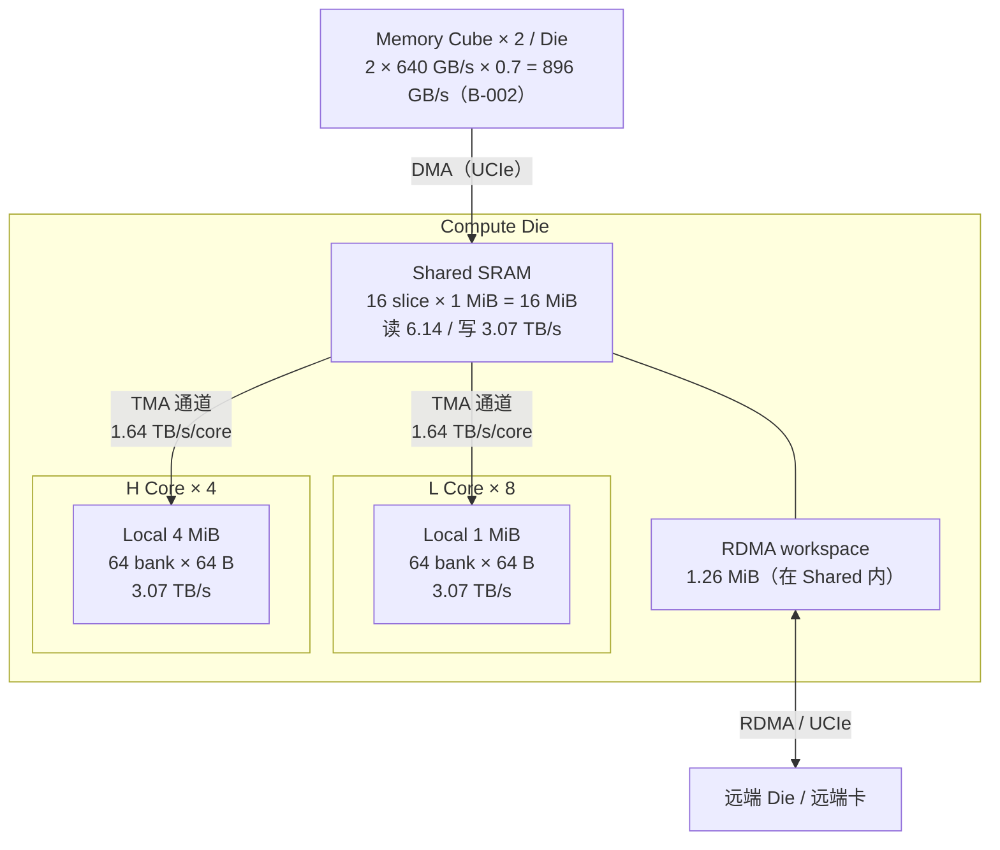
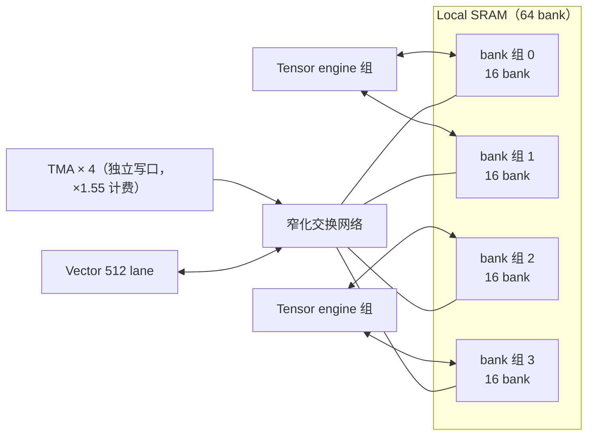
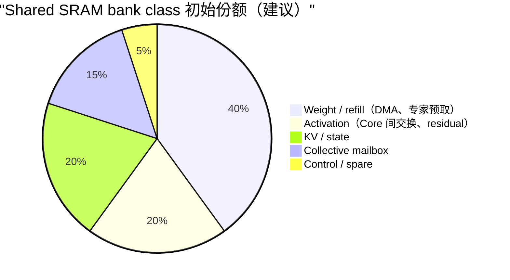
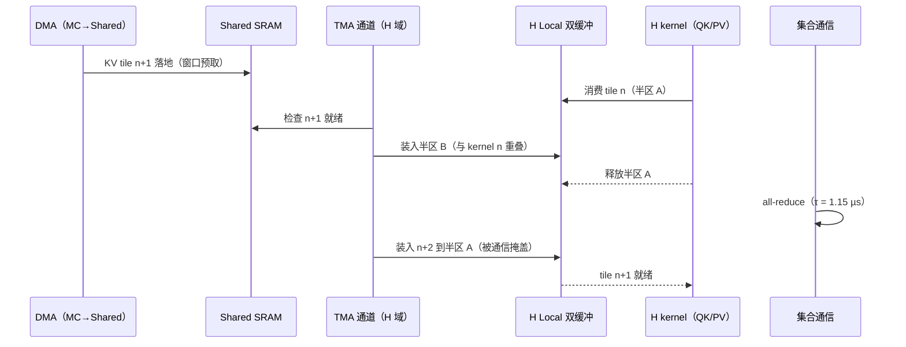
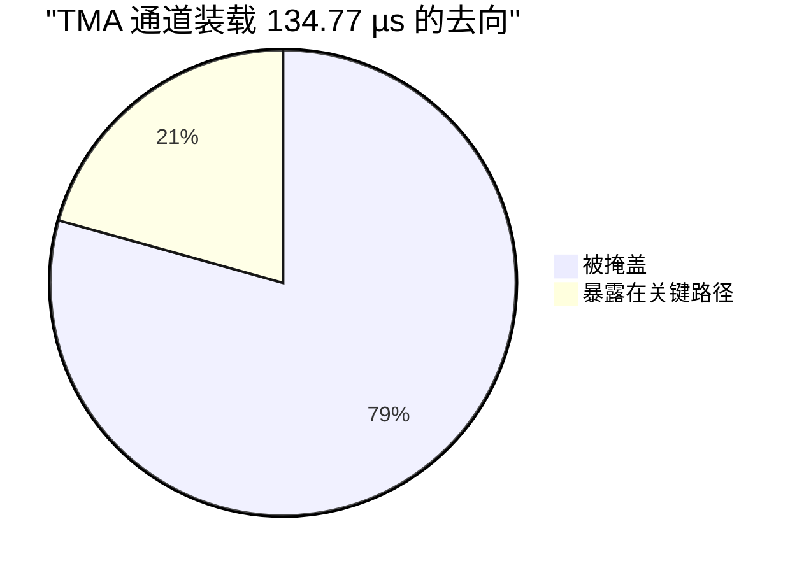
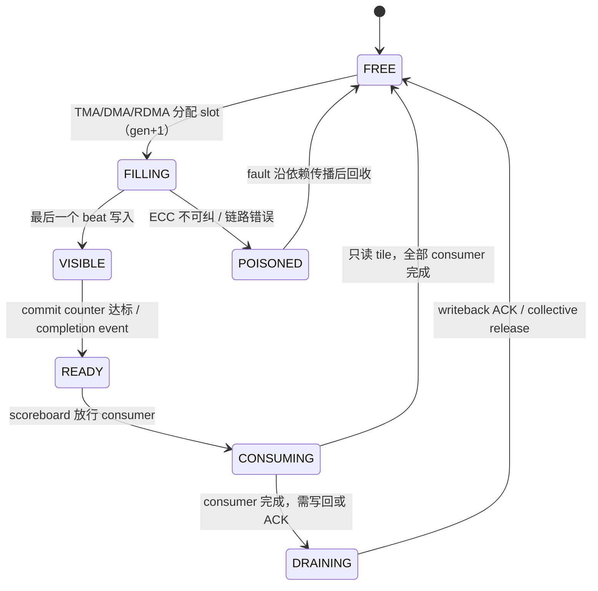
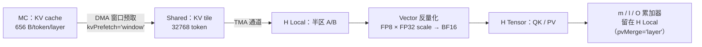
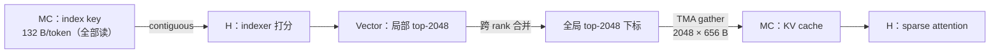

# TMA 与 SRAM 子系统设计

- 所有者：Hardware（SRAM/TMA）；共签：Software SW-02（调度）、SW-03（kernel）
- 状态：`BASELINE`（容量、带宽为模型值；bank-cycle 行为 `MODEL`，见 O-007）
- 数字口径：**唯一硬件规格 P1 的发布点**（ADR-0021），权威值在 `teams/hardware/inputs/k3_mc_baseline.json#tpsDesign.hardware`，
  文字说明见 [`21_TPS_DESIGN_BASELINE.md`](../../../docs/architecture/21_TPS_DESIGN_BASELINE.md) 第 3.3、3.4、4.4 节。

## 1. 存储层级总览



| 层级 | 容量（每 Die） | 带宽 | 设计用途 |
| --- | --- | ---: | --- |
| L Local | 8 × 1 MiB = 8 MiB | 3.07 TB/s/core | 权重 tile 双缓冲、激活、量化 scale |
| H Local | 4 × 4 MiB = 16 MiB | 3.07 TB/s/core | KV tile 双缓冲、m/l/O 累加器、state tile |
| Shared | 16 slice × 1 MiB = 16 MiB | 读 6.14 / 写 3.07 TB/s | DMA 落地、预测专家、KV、state、集合通信 workspace |
| **合计** | **40 MiB** | — | — |

整卡 8 Die 合计 320 MiB 数据 SRAM，其中 Shared 128 MiB。ECC、metadata parity、scrub 和 spare 不含在上述数据容量内。

带宽推导（1.0 GHz）：

```text
Local 读   64 bank × 64 B × 1.0 GHz × 0.75（bank 利用率）       = 3.07 TB/s/core
TMA        4 engine × 512 B/cycle × 1.0 GHz = 2.05 TB/s × 0.8   = 1.64 TB/s/core
Shared 窗口 8 Die × 16 MiB × 0.85                                = 108.80 MiB/卡（峰值预留 100.24）
```

### 1.1 占用

```mermaid
xychart-beta
  title "发布点 SRAM 占用（MiB）：容量 vs 峰值使用"
  x-axis ["L Local / core", "H Local / core", "Shared 窗口 / 卡 ÷ 10"]
  y-axis "MiB" 0 --> 12
  bar [1, 4, 10.88]
  bar [0.36, 2.74, 10.02]
```



第一组为容量（Shared 为 0.85 可用窗口），第二组为发布点峰值占用。Shared 除以 10 只为同轴显示。

- L Local 只用 36%：L 算子是权重流式 GEMV，tile 小。下一轮可以缩小 L Local，把面积让给 H 或 Shared（需 ADR-0005 变更流程）。
- H Local 用 69%：KV tile 32768 × FP8 656 B 的双缓冲加 m/l/O。改成 BF16 KV（1152 B）放不下（21 号文档第 5 节）。
- Shared 窗口用 92%：它是 DMA 预取深度和 KV 窗口预取的实际约束（21 号文档第 4.5 节）。

## 2. Local SRAM

### 2.1 bank 组织

- 64 bank × 64 B/cycle，按 Tensor engine 邻近分组；
- 每组独立 bank crossbar，再通过窄化交换网络连 TMA 与 Vector；
- 不把 64 bank 合成一条超宽全局总线。



4 组 × 16 bank 是建议的初始划分，不是冻结值（O-005、O-007）。

### 2.2 仲裁类

| 仲裁类 | 读/写 | 优先级（建议） | 说明 |
| --- | --- | --- | --- |
| Tensor operand | 读 | 1 | 关键路径 |
| Tensor 输出 / m/l/O | 写 | 2 | 累加器写回 |
| Vector | 读写 | 2 | unpack、softmax、epilogue |
| TMA fill | 写 | 3（有 watermark 时升为 1） | 独立端口 |
| TMA drain | 读 | 3 | 写回 Shared |
| ECC scrub / debug | 读写 | 4 | 仅空闲周期 |

## 3. Shared SRAM

- 16 slice/Die，每 slice 1 MiB；地址按 stripe 在 slice 间交织，slice home + bank interleave；
- 同时承担 MC refill、跨 Core tile、collective mailbox 和 writeback；
- Weight、Activation、KV/Partial、RDMA mailbox 采用 bank color 隔离。

建议初始 bank class（比例需由 trace 回标，不作为永久硬分区）：



### 3.1 端口放大计费

模型按以下系数给 Shared 端口计费（21 号文档第 3.3 节）：

| 参数 | 值 | 含义 |
| --- | ---: | --- |
| `localWriteRatio` | 1.70 | local 写与读的比 |
| `tmaDedicatedPort` | ×1.55 | TMA 独立端口的写侧放大 |
| `sharedReadScale` | 1.18 | shared 读放大 |
| `sharedReadPerWrite` | 0.18 | 每次写附带的读 |

代价：每 Die 16.15 mm²（SF4）、5.69 W，每卡 45.51 W；全部关掉 TPS 只从 1101.77 降到 1101.71。
这是下一轮可回收的面积与功耗，是否回收走 ADR-0005 变更流程。

## 4. TMA

### 4.1 基线

每 Core 4 个 TMA engine，每 engine 512 B/cycle，1.0 GHz，逻辑峰值 2.05 TB/s/core，模型按 0.8 效率取 1.64 TB/s/core。
实际上限取 Local 写口、Shared slice、NoC 和 MC 中最慢的一项，不能把 engine 数直接叠加。

TMA descriptor 最少支持：

- contiguous、2D/3D strided；
- gather/scatter（GLM/DS 的 sparse KV gather，656 B 粒度）；
- multicast 到多个 Local SRAM；
- dtype convert/dequant；
- zero/padding；
- source/destination bounds；
- completion event、dependency token；
- poison/ECC error；
- partial-ready watermark。

建议字段布局（`OPEN`，由 [`TILE_IR.md`](../../../docs/architecture/contracts/TILE_IR.md) 冻结）：

```text
 0      63 64    127 128      191 192   223 224 239 240 247 248 255
+---------+---------+-----------+-------+-------+-------+-------+
| src addr| dst addr| dim0/1/2  |stride | dtype | dep   | flags |
|  64 b   |  64 b   | 3 × 21 b  | 32 b  | cvt   | token | poison|
+---------+---------+-----------+-------+-------+-------+-------+
```

### 4.2 独立 TMA 通道（`tmaLane`）

由 DMA 取入 Shared 的输入（权重、routed expert、KV tile、线性注意力 state）从算子中拆出，
放到 L、H 两个域各一条的 TMA 通道上，按程序顺序提前发射（21 号文档第 4.4 节）。发射条件：

1. 输入已在 Shared 就绪；
2. 该域 Local 双缓冲有空闲的一半。



发布点装载共 134.77 µs，其中 106.91 µs 被集合通信或前一 kernel 掩盖，暴露 27.87 µs。
单独关掉 `tmaLane`，TPS 从 1101.77 跌到 984.20，是所有机制里影响最大的一项。



兜底规则：已装满但属于后续算子的 tile 会钉住它的输入；head 算子需要的 DMA 因此装不下时，取消最远的一次装载（`tmaCancels`，发布点 0 次）。

## 5. Buffer 生命周期

每类 tile 使用 generation-tagged slot：



以下对象不能隐式 alias：

- 正在接收的 RDMA slot；
- 未完成 Tensor/Vector 消费的 Local tile；
- 未 ACK 的 writeback；
- online softmax 的 m/l/O；
- 预测专家命中尚未确认的有效部分。

## 6. KV、index key 与 state 布局

### 6.1 FP8 KV 路径



每 token 每层 656 B 的布局（FlashMLA）：

```text
+------------------------------+---------------+------------------+
| 512 × FP8 E4M3 latent        | 4 × FP32 scale| 64 × BF16 RoPE   |
| 512 B                        | 16 B          | 128 B            |
+------------------------------+---------------+------------------+
  每 128 个 latent 元素一个 scale                      合计 656 B
```

### 6.2 GLM-5.2 / DeepSeek-V4-Pro 的 index key 与 sparse gather

- index key：FP8 128 维 + 1 个 FP32 scale = 132 B/token/layer；GLM 只在 21 个 full 层缓存，DS 在全部 61 层缓存（`ASSUMPTION`）。
- indexer 读全部已缓存 index key（流式，适合 TMA contiguous）；attention 只读 top-k 2048 个 KV（TMA gather，656 B 粒度随机读）。



### 6.3 每 rank 容量（TP32，context 1M）

context 按 TP rank 切分。KV = 层数 × 656 B × 2²⁰ token ÷ 32；index key 同理用 132 B。

| 模型 | KV 层数 | KV / rank | index key / rank | 每 token 读 KV / rank | 来源 |
| --- | ---: | ---: | ---: | ---: | --- |
| K3 | 24（softmax MLA） | 0.516 GB | — | 0.516 GB（全量） | `tpsDesign`；69 层 KDA state 另计 |
| GLM-5.2 | 78 | 1.677 GB | 0.091 GB（21 层） | top-k 2048 × 656 B × 78 层（约 0.1 GB 全局） | 推导，`ASSUMPTION` |
| DeepSeek-V4-Pro | 61 | 1.311 GB | 0.264 GB（61 层） | top-k 2048 × 656 B × 61 层（约 0.08 GB 全局） | 推导，`ASSUMPTION` |

读法：K3 每 token 要把全部 24 层 KV 读一遍（0.516 GB/rank，占 4.97 GB 的 10%）；GLM/DS 的 sparse attention 只读 top-k，
但 indexer 的 index key 仍是全量读。权重和总容量对照见 [04](04_MEMORY_SUBSYSTEM_MC.md) 第 3 节。

## 7. 端口和冲突模型

需要独立量化：

- Tensor read/write；
- Vector read/write；
- TMA fill/drain；
- collective reduce read/write；
- ECC scrub；
- debug/repair。

第 3.1 节的系数必须替换成 bank-cycle 仿真结果。验收时报告平均值、P95、P99 和最坏 bank conflict，而不是只给总 TB/s。

## 8. 冻结交付物

- SRAM macro 组合、bank/slice/row 地址图；
- 所有端口和仲裁优先级（本文第 2.2 节为初版）；
- ECC、scrub、repair 和容量折损；
- TMA descriptor 格式和队列深度（本文第 4.1 节为初版）；
- 每个算子 tile 的 buffer 表与生命周期（本文第 5 节为初版）；
- bank-cycle 模型；
- 面积、动态功耗、泄漏和时序报告。
