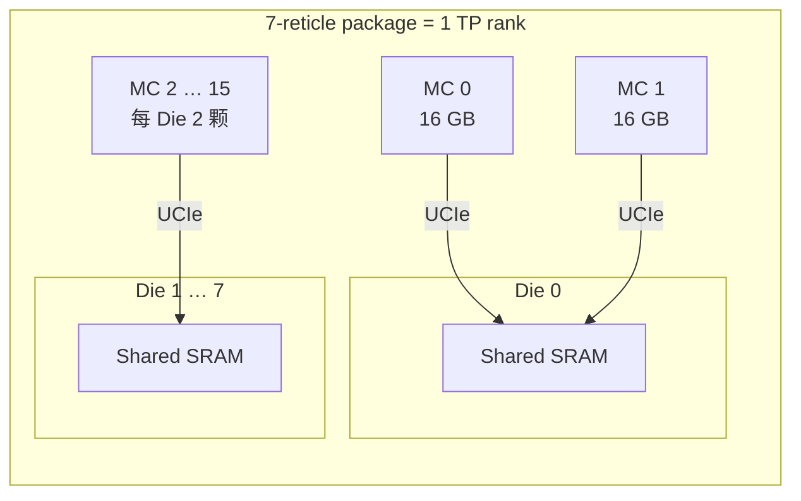
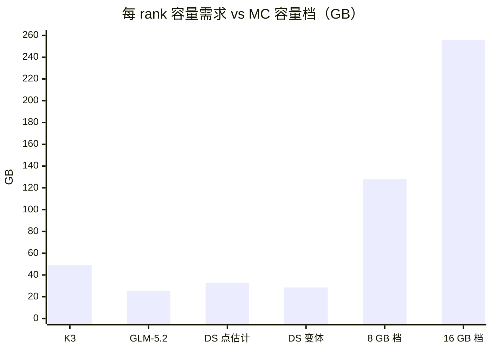
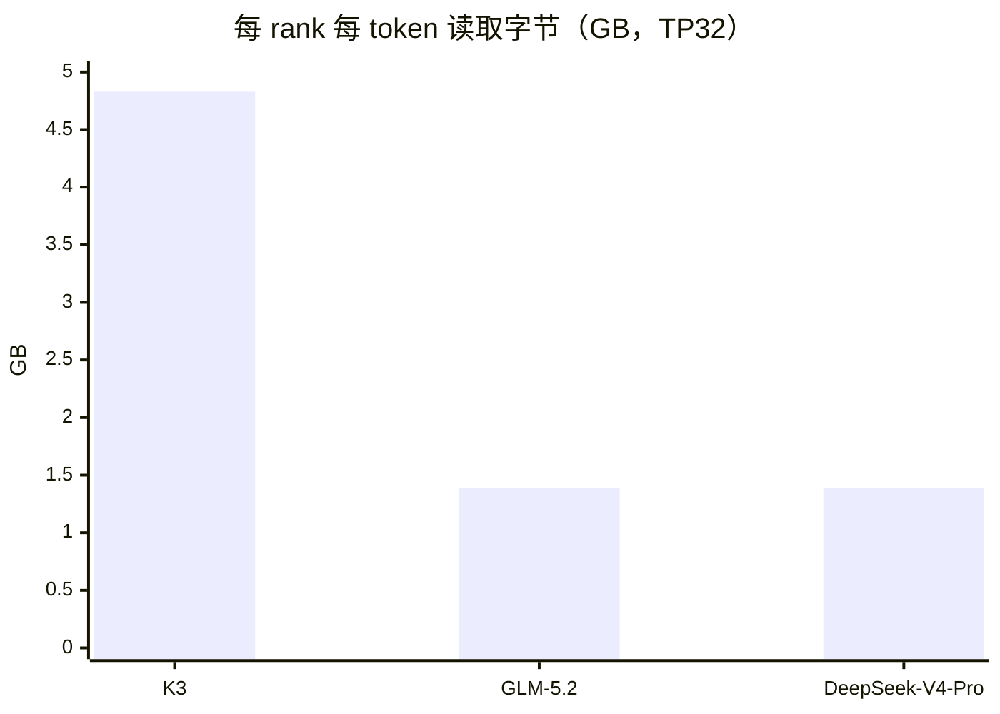
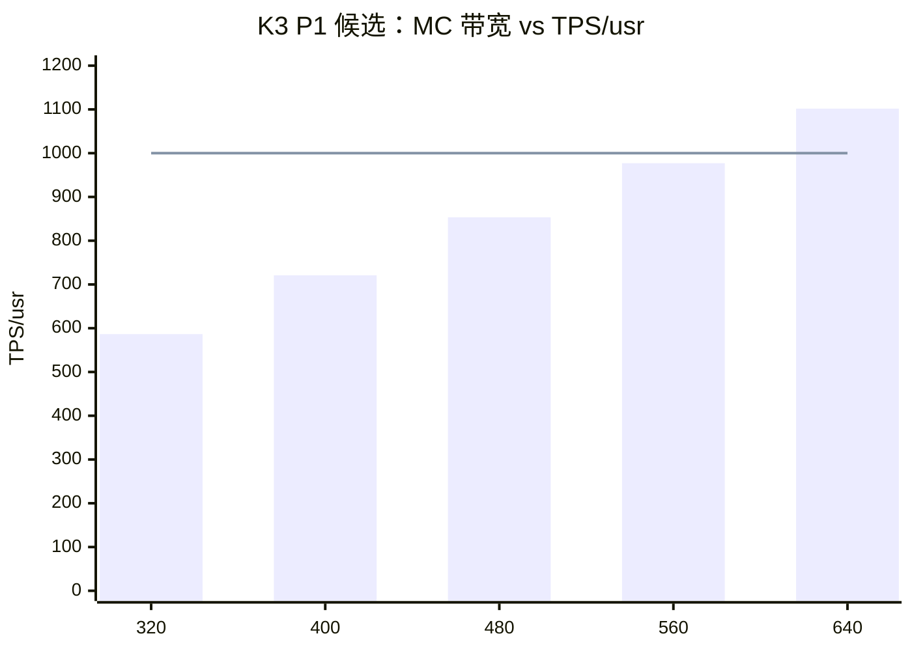
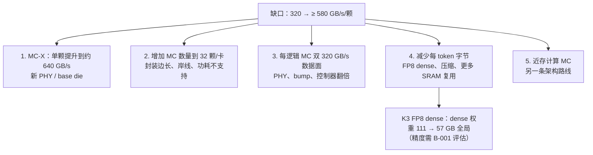
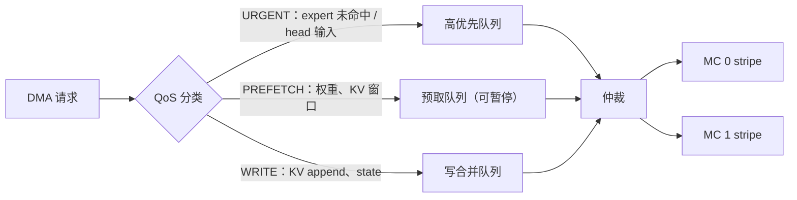

# Memory Cube 存储子系统设计

- 所有者：Hardware（MC）；共签：Model（容量需求）、Council（ADR-0019）
- 状态：MC 带宽 `BLOCKER`（B-002）；容量规划 `BASELINE`
- 数字口径：发布点在 `teams/hardware/inputs/k3_mc_baseline.json#tpsDesign`（[`21_TPS_DESIGN_BASELINE.md`](../../../docs/architecture/21_TPS_DESIGN_BASELINE.md) 第 3.4、6 节），
  容量与 package 约束在同一文件的 `package` 块；多模型字节来自 `out/workload/planning_operator_workload.json#operators`。

## 0. 7-reticle 集成存储基线

单芯片采用一个 7-reticle package，集成 16 个 MC，每个 Compute Die 本地绑定 2 个 MC。
容量优先档为 16 × 16 GB = 256 GB/package，早期原型可采用 16 × 8 GB = 128 GB/package。



| 项 | 发布点（MC640） | 参考档（MC320） |
| --- | ---: | ---: |
| MC 数量 | 16 | 16 |
| 每颗带宽 | 640 GB/s（`STRETCH`） | 320 GB/s |
| 利用率 | 0.7 | 0.7 |
| 每 Die 有效 | 2 × 640 × 0.7 = 896 GB/s | 448 GB/s |
| 每 package 原始 / 有效 | 10.24 / 7.17 TB/s | 5.12 / 3.58 TB/s |
| 容量 | 256 GB（16 GB 档；backing 需求 49.2 GB/rank） | 同左 |
| MC 功耗 | 398.72 W | 未建模 |

封装面积本身不能替代 MC 带宽闭合。

## 1. 路线选择

本轮主线是**外置 Memory Cube**：

- MC 内不假设 Tensor/GEMM 单元；
- 权重、KV 和线性 Attention state 存放在 MC；
- 计算发生在 Compute Die；
- MC 通过 UCIe 类链路向 Shared SRAM/TMA 提供 tile。

近存计算 MC 单独作为后备路线，不参与当前性能签核。

## 2. 参考器件

参考：[MemoryCube reference provenance](../../../references/README.md)。

| 项目 | 参考值 |
| --- | --- |
| Logic node | SMIC 28 HKE+ |
| Die size | 12.6×8.1 mm，约 102 mm² |
| Capacity | 8 GB(4Hi) / 16 GB(8Hi) |
| Interface | UCIe 1.1 |
| 单 UCIe | 20 Gbps×16，40 GB/s 单向 |
| 最大单向带宽 | 8 个 UCIe，320 GB/s |
| D2D distance | ≤50 mm |

## 3. 容量

### 3.1 每 rank 容量需求（TP32，context 1M）

| 模型 | 权重 / rank | KV / rank | index key / rank | 合计 / rank | 16 GB 档余量（256 GB） |
| --- | ---: | ---: | ---: | ---: | ---: |
| K3 | — | 0.516 GB | — | 49.20 GB（模型 backing，含 KDA state） | 206.8 GB |
| GLM-5.2 | 23.29 GB | 1.677 GB | 0.091 GB | 25.06 GB | 230.9 GB |
| DeepSeek-V4-Pro（点估计） | 31.23 GB | 1.311 GB | 0.264 GB | 32.81 GB | 223.2 GB |
| DeepSeek-V4-Pro（`expertHiddenFromTotal`） | 26.91 GB | 1.311 GB | 0.264 GB | 28.49 GB | 227.5 GB |

K3 的 49.20 GB 取自 `tpsDesign`（模拟器 backing）；GLM/DS 是按 manifest 的 dtype 和形状推导的 `ASSUMPTION` 值，
KV 与 index key 的算法见 [03](03_TMA_AND_SRAM.md) 第 6.3 节。



读法：

- 单请求、1M context 下，三个模型都只用 8 GB 档（128 GB）的 20–40%；
- 余量用于多请求 KV、Prefill、冗余副本、故障降容；产品容量先按 16 GB 档规划；
- 性能由带宽决定，不由容量决定（第 4 节）。

### 3.2 多请求的 KV 余量

每增加一个 1M context 请求，每 rank 需要的 KV：K3 0.516 GB、GLM 1.77 GB（含 index key）、DS 1.58 GB。
在 16 GB 档下，扣除权重后大约能容纳 K3 约 400 个、GLM 约 130 个、DS 约 140 个 1M 请求的 KV（仅容量，不含带宽）。
B=1 的 TPS/usr 目标不依赖这一点，但它决定吞吐型部署的上限。

## 4. 带宽

### 4.1 每 token 读取字节

| 模型 | 权重（dense + routed） | KV / state | index key | 集合通信 | 合计（全局） | 每 rank |
| --- | ---: | ---: | ---: | ---: | ---: | ---: |
| K3 | 111.16 + 25.83 GB | 16.51 + 0.43 GB | — | 0.57 GB | 154.50 GB | 4.83 GB |
| GLM-5.2 | 18.72 + 22.65 GB | 0.10 GB | 2.91 GB | 0.20 GB | 44.58 GB | 1.39 GB |
| DeepSeek-V4-Pro | 20.42 + 15.27 GB | 0.08 GB | 8.44 GB | 0.22 GB | 44.43 GB | 1.39 GB |

来源：`out/workload/planning_operator_workload.json#operators`（全局 byte/token，TP 前；规划口径）。
K3 的详细模型每 rank 读 4.97 GB（含预测错取 0.16 GB），DMA busy 775.30 µs。



K3 的 BF16 dense 权重（111 GB 全局）是最大的一项；换成 FP8 dense 后降到 57.3 GB（`comparisons.K3-FP8-dense`，不是 K3 的记录配置）。

### 4.2 MC 带宽档位（ADR-0019）

| 档位 GB/s/颗 | 分类 | 用途 | K3 P1 候选 TPS/usr |
| ---: | --- | --- | ---: |
| 320 | `REFERENCE` | 参考器件 KGD 规格，P1 回归的参考兼容点 | 586.46 |
| 400 | `GRID` | 规格网格候选 | 721.01 |
| 480 | `DEFAULT_SEARCH_CAP` | 1.5× 参考值，默认搜索上限 | 853.44 |
| 560 | `AGGRESSIVE` | 超过默认上限，报告必须标记 | 977.00 |
| 640 | `STRETCH/AGGRESSIVE` | P1 Final Tuning 的 Stretch 点，不是制造默认值 | 1101.77 |



机器可读定义见 `teams/hardware/inputs/k3_mc_baseline.json#bandwidthTiers`。MC 数量档位为 8、16、24、32 颗/卡；16 颗是当前规格。
TPS 几乎与 MC 带宽成正比：DMA 已接近满载（DMA busy 775.30 µs ≈ raw 775.75 µs）。

## 5. 关键阻塞：带宽差一倍

K3 要达到 1000 TPS/usr，需要每颗 MC 至少约 580 GB/s（560 档只有 977.00）；参考 MC 为 320 GB/s。可选路线：



在该问题关闭前，不能冻结 MC PHY、Compute Die 岸线或宣称 1000 TPS 达成。
GLM-5.2、DeepSeek-V4-Pro 每 rank 读取字节约为 K3 的 29%，在 MC320 下规划 TPS 也高于 1000（`out/direction/directional_tps_scorecard.json`）。

## 6. MC 控制器功能

每 Compute Die 的 MC 子系统至少包含：

- 2 个本地 MC 端口；
- 地址 interleave 和 page-home；
- read/write/atomic/flush；
- 多队列 QoS（关键取数可抢占预取，对应 `dmaPreempt`）；
- TMA 大块读与 KV/state 小写合并；
- ECC/CRC、重试、lane repair；
- link training、降速和热插拔隔离；
- telemetry：带宽、队列、重试、温度、坏页；
- NUMA miss 的远端转发接口。



## 7. 地址映射

```text
model object
 -> TP card shard
 -> local Compute Die home
 -> MC0/MC1 stripe
 -> channel
 -> bank/row
```

- 权重 tile 按连续 8 MiB 对象布局；
- KV 以 sequence/page/context-tile（32768 token）为单位；GLM/DS 的 KV 需要支持 656 B 粒度的 gather；
- index key 以连续流布局（indexer 全量读）；
- 线性 Attention state 按 layer/head 分片；
- expert 权重按实际 Tensor tile 连续布局，避免跨 row 小步长访问；
- mailbox 不放在 MC，放在 Shared SRAM。

## 8. 带宽与延迟签核

每个 MC 必须分别给出：

- 大顺序读、随机读、读写混合；
- 8 MiB weight tile；
- 32K-token KV tile；
- 656 B 粒度 sparse KV gather；
- 小尺寸 state read-modify-write；
- UCIe replay/ECC 开启后的 payload；
- 8/16 个 MC 同时工作时的供电/热降额；
- P50/P95/P99 first-byte latency。

不能只用峰值带宽乘 MC 数。目标是以真实 command mix 得到可持续带宽。

## 9. 冻结条件

- MC 厂商确认容量、payload 带宽、功耗和 PHY 宏；
- 卡级并发实测或高可信协议模型；
- Compute Die 岸线、bump 和封装走线通过；
- 参考 MC 点的 tile 仿真可重现；
- 1000 TPS 路线明确是 MC-X、更多 MC、压缩字节还是近存计算；
- 故障降容和数据重映射策略完成。
