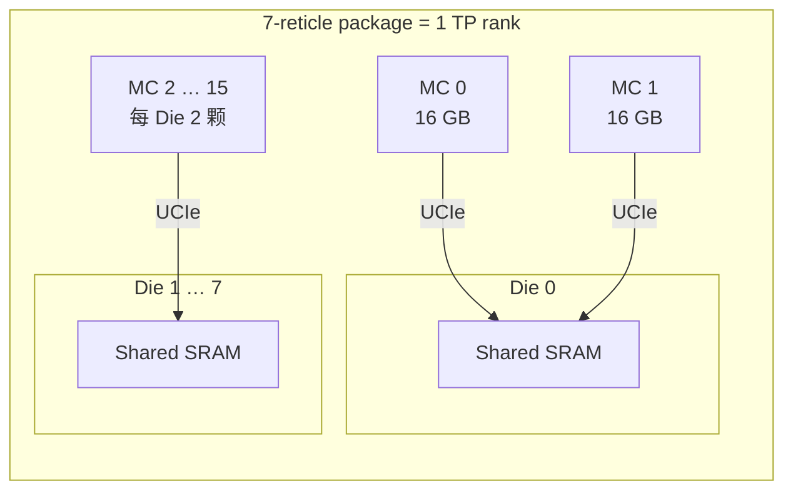
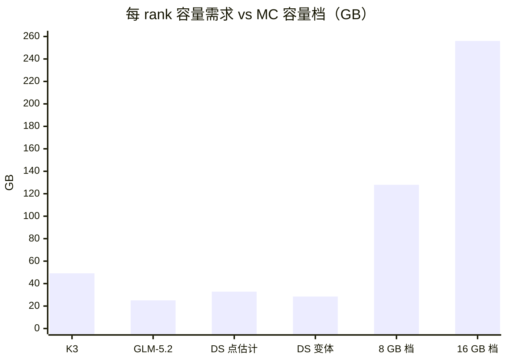
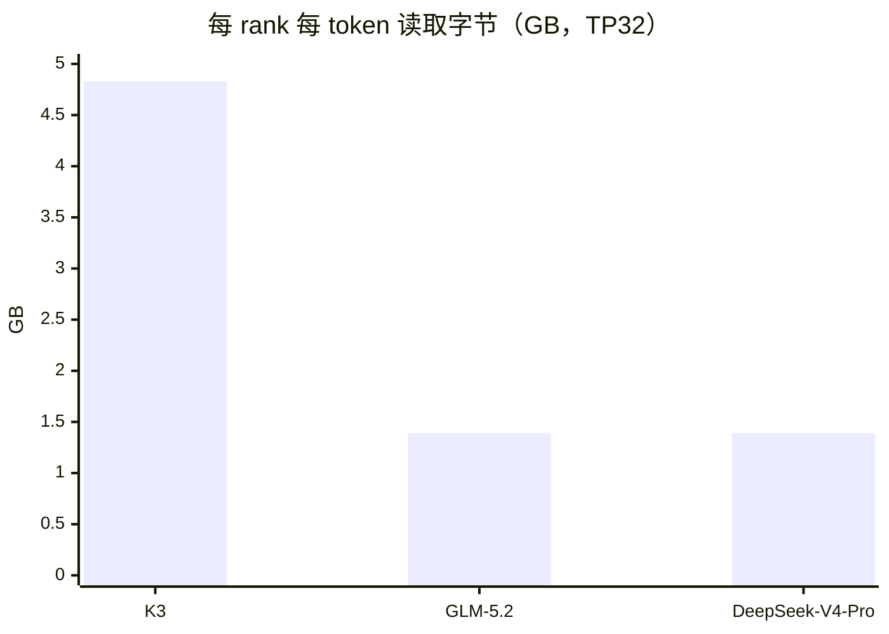
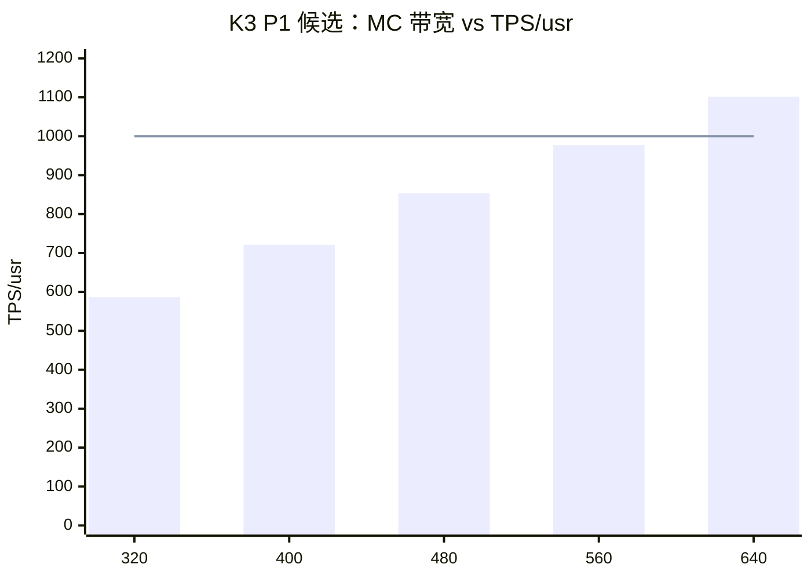
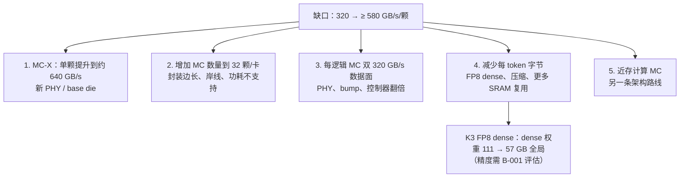
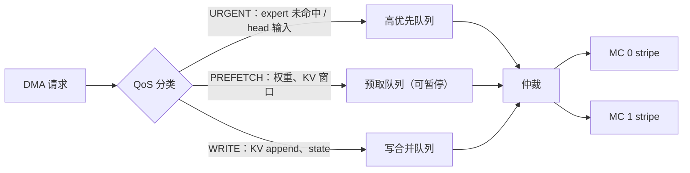

# Memory Cube 存储子系统设计

- 所有者：Hardware（MC）；共签：Model（容量需求）、Council（ADR-0019）
- 状态：MC 带宽 `BLOCKER`（B-002）；容量规划 `BASELINE`
- 数字口径：发布点在 `teams/hardware/inputs/k3_mc_baseline.json#tpsDesign`（[`21_TPS_DESIGN_BASELINE.md`](../../../docs/architecture/21_TPS_DESIGN_BASELINE.md) 第 3.4、6 节），
  容量与 package 约束在同一文件的 `package` 块；多模型字节来自 `out/workload/planning_operator_workload.json#operators`。

## 0. 7-reticle 集成存储基线

单芯片采用一个 7-reticle package，集成 16 个 MC，每个 Compute Die 本地绑定 2 个 MC。
容量优先档为 16 × 16 GB = 256 GB/package，早期原型可采用 16 × 8 GB = 128 GB/package。


```mermaid
flowchart LR
  subgraph PKG["7-reticle package = 1 TP rank"]
    direction TB
    subgraph D0["Die 0"]
      C0["Shared SRAM"]
    end
    subgraph D7["Die 1 … 7"]
      C7["Shared SRAM"]
    end
    M00["MC 0<br/>16 GB"] -->|"UCIe"| C0
    M01["MC 1<br/>16 GB"] -->|"UCIe"| C0
    M70["MC 2 … 15<br/>每 Die 2 颗"] -->|"UCIe"| C7
  end
```

| 项 | 发布点（MC640） | 参考档（MC320） |
| --- | ---: | ---: |
| MC 数量 | 16 | 16 |
| 每颗带宽 | 640 GB/s（`STRETCH`） | 320 GB/s |
| 利用率 | 0.7 | 0.7 |
| 每 Die 有效 | 2 × 640 × 0.7 = 896 GB/s | 448 GB/s |
| 每 package 原始 / 有效 | 10.24 / 7.17 TB/s | 5.12 / 3.58 TB/s |
| 容量 | 256 GB（16 GB 档；backing 需求 49.2 GB/rank） | 同左 |
| MC 功耗 | 398.72 W | 未建模 |

封装面积本身不能替代 MC 带宽闭合。

## 1. 路线选择

本轮主线是**外置 Memory Cube**：

- MC 内不假设 Tensor/GEMM 单元；
- 权重、KV 和线性 Attention state 存放在 MC；
- 计算发生在 Compute Die；
- MC 通过 UCIe 类链路向 Shared SRAM/TMA 提供 tile。

近存计算 MC 单独作为后备路线，不参与当前性能签核。

## 2. 参考器件

参考：[MemoryCube reference provenance](../../../references/README.md)。

| 项目 | 参考值 |
| --- | --- |
| Logic node | SMIC 28 HKE+ |
| Die size | 12.6×8.1 mm，约 102 mm² |
| Capacity | 8 GB(4Hi) / 16 GB(8Hi) |
| Interface | UCIe 1.1 |
| 单 UCIe | 20 Gbps×16，40 GB/s 单向 |
| 最大单向带宽 | 8 个 UCIe，320 GB/s |
| D2D distance | ≤50 mm |

## 3. 容量

### 3.1 每 rank 容量需求（TP32，context 1M）

| 模型 | 权重 / rank | KV / rank | index key / rank | 合计 / rank | 16 GB 档余量（256 GB） |
| --- | ---: | ---: | ---: | ---: | ---: |
| K3 | — | 0.516 GB | — | 49.20 GB（模型 backing，含 KDA state） | 206.8 GB |
| GLM-5.2 | 23.29 GB | 1.677 GB | 0.091 GB | 25.06 GB | 230.9 GB |
| DeepSeek-V4-Pro（点估计） | 31.23 GB | 1.311 GB | 0.264 GB | 32.81 GB | 223.2 GB |
| DeepSeek-V4-Pro（`expertHiddenFromTotal`） | 26.91 GB | 1.311 GB | 0.264 GB | 28.49 GB | 227.5 GB |

K3 的 49.20 GB 取自 `tpsDesign`（模拟器 backing）；GLM/DS 是按 manifest 的 dtype 和形状推导的 `ASSUMPTION` 值，
KV 与 index key 的算法见 [03](03_TMA_AND_SRAM.md) 第 6.3 节。


```mermaid
xychart-beta
  title "每 rank 容量需求 vs MC 容量档（GB）"
  x-axis ["K3", "GLM-5.2", "DS 点估计", "DS 变体", "8 GB 档", "16 GB 档"]
  y-axis "GB" 0 --> 260
  bar [49.20, 25.06, 32.81, 28.49, 128, 256]
```

读法：

- 单请求、1M context 下，三个模型都只用 8 GB 档（128 GB）的 20–40%；
- 余量用于多请求 KV、Prefill、冗余副本、故障降容；产品容量先按 16 GB 档规划；
- 性能由带宽决定，不由容量决定（第 4 节）。

### 3.2 多请求的 KV 余量

每增加一个 1M context 请求，每 rank 需要的 KV：K3 0.516 GB、GLM 1.77 GB（含 index key）、DS 1.58 GB。
在 16 GB 档下，扣除权重后大约能容纳 K3 约 400 个、GLM 约 130 个、DS 约 140 个 1M 请求的 KV（仅容量，不含带宽）。
B=1 的 TPS/usr 目标不依赖这一点，但它决定吞吐型部署的上限。

## 4. 带宽

### 4.1 每 token 读取字节

| 模型 | 权重（dense + routed） | KV / state | index key | 集合通信 | 合计（全局） | 每 rank |
| --- | ---: | ---: | ---: | ---: | ---: | ---: |
| K3 | 111.16 + 25.83 GB | 16.51 + 0.43 GB | — | 0.57 GB | 154.50 GB | 4.83 GB |
| GLM-5.2 | 18.72 + 22.65 GB | 0.10 GB | 2.91 GB | 0.20 GB | 44.58 GB | 1.39 GB |
| DeepSeek-V4-Pro | 20.42 + 15.27 GB | 0.08 GB | 8.44 GB | 0.22 GB | 44.43 GB | 1.39 GB |

来源：`out/workload/planning_operator_workload.json#operators`（全局 byte/token，TP 前；规划口径）。
K3 的详细模型每 rank 读 4.97 GB（含预测错取 0.16 GB），DMA busy 775.30 µs。


```mermaid
xychart-beta
  title "每 rank 每 token 读取字节（GB，TP32）"
  x-axis ["K3", "GLM-5.2", "DeepSeek-V4-Pro"]
  y-axis "GB" 0 --> 5
  bar [4.83, 1.39, 1.39]
```

K3 的 BF16 dense 权重（111 GB 全局）是最大的一项；换成 FP8 dense 后降到 57.3 GB（`comparisons.K3-FP8-dense`，不是 K3 的记录配置）。

### 4.2 MC 带宽档位（ADR-0019）

| 档位 GB/s/颗 | 分类 | 用途 | K3 P1 候选 TPS/usr |
| ---: | --- | --- | ---: |
| 320 | `REFERENCE` | 参考器件 KGD 规格，P1 回归的参考兼容点 | 586.46 |
| 400 | `GRID` | 规格网格候选 | 721.01 |
| 480 | `DEFAULT_SEARCH_CAP` | 1.5× 参考值，默认搜索上限 | 853.44 |
| 560 | `AGGRESSIVE` | 超过默认上限，报告必须标记 | 977.00 |
| 640 | `STRETCH/AGGRESSIVE` | P1 Final Tuning 的 Stretch 点，不是制造默认值 | 1101.77 |


```mermaid
xychart-beta
  title "K3 P1 候选：MC 带宽 vs TPS/usr"
  x-axis ["320", "400", "480", "560", "640"]
  y-axis "TPS/usr" 0 --> 1200
  bar [586.46, 721.01, 853.44, 977.00, 1101.77]
  line [1000, 1000, 1000, 1000, 1000]
```

机器可读定义见 `teams/hardware/inputs/k3_mc_baseline.json#bandwidthTiers`。MC 数量档位为 8、16、24、32 颗/卡；16 颗是当前规格。
TPS 几乎与 MC 带宽成正比：DMA 已接近满载（DMA busy 775.30 µs ≈ raw 775.75 µs）。

## 5. 关键阻塞：带宽差一倍

K3 要达到 1000 TPS/usr，需要每颗 MC 至少约 580 GB/s（560 档只有 977.00）；参考 MC 为 320 GB/s。可选路线：


```mermaid
flowchart TB
  GAP["缺口：320 → ≥ 580 GB/s/颗"] --> A["1. MC-X：单颗提升到约 640 GB/s<br/>新 PHY / base die"]
  GAP --> B["2. 增加 MC 数量到 32 颗/卡<br/>封装边长、岸线、功耗不支持"]
  GAP --> C["3. 每逻辑 MC 双 320 GB/s 数据面<br/>PHY、bump、控制器翻倍"]
  GAP --> D["4. 减少每 token 字节<br/>FP8 dense、压缩、更多 SRAM 复用"]
  GAP --> E["5. 近存计算 MC<br/>另一条架构路线"]
  D --> D1["K3 FP8 dense：dense 权重 111 → 57 GB 全局<br/>（精度需 B-001 评估）"]
```

在该问题关闭前，不能冻结 MC PHY、Compute Die 岸线或宣称 1000 TPS 达成。
GLM-5.2、DeepSeek-V4-Pro 每 rank 读取字节约为 K3 的 29%，在 MC320 下规划 TPS 也高于 1000（`out/direction/directional_tps_scorecard.json`）。

### 5.1 MC 设计空间与搜索（HW-04 决策）

- 所有者：HW-04 Memory-Cube；共签：HW-09（封装面积/功耗）
- 状态：`MODEL`（设计空间搜索：容量下限 + K3 详细模型回放 + 封面上限，不是 `FROZEN`；不改发布点）
- 设计空间（全部备选及其 ASSUMPTION）：`teams/hardware/inputs/memory_design_space.json`——**`UNVERIFIED`，由 agent 依仓库文档起草，待域 owner 复核**
- 搜索：`integration/detailed/memory_search.js`；`npm run memory:search` 只把最终方案写到
  `out/detailed/memory_design.json`，整个打分的候选集写到 `out/detailed/memory_candidates.json`
  （带 `candidateSetSha256`）。本节数字由 `tests/regression/test_memory_design.js` 对照新鲜搜索结果检查。

**口径**：`mcGBs` 是**每颗 MC 的裸链路带宽**；Die 侧拿到的是
`memoryCubesPerComputeDie × min(mcGBs × TECH.mcUtil, uciePortGB)`。
UCIe 端口 819.2 GB/s 封顶，所以"cube 数 × 档位"超出端口是**不可行**，不是"更贵"。
档位是链路规格，不是可持续带宽承诺——可持续值见第 8 节的签核要求。

**约束**：容量下限 49.198 GB/rank（由回放读出，`r.backingGB`，不是手写的）；
K3 回放在发布点 TPS/usr 不低于 99.9%；封装面积（8 Die + N cube）+ 预留 ≤ 5248 mm²；
卡功耗 ≤ 2800 W；路线必须与自身档位/cube 数自洽（见下）。
搜索共 400 个组合、4 个可行，设计空间 sha256 前缀见下。

**目标**：可行优先，然后制造风险档位最低，然后卡级 MC 功耗最低，然后容量余量最大。

#### 5.1.1 最终方案

| 维度 | 选项 | 参数 |
| --- | --- | --- |
| `mcGBs` | `640` | 每颗 MC 640 GB/s，`STRETCH_AGGRESSIVE` |
| `cubesPerCard` | `16` | 16 颗/卡（与当前规格一致） |
| `capacityGBPerCube` | `16` | 每 cube 16 GB → 卡级 256 GB |
| `route` | `mcX` | 单颗提升带宽（第 5 节路线 1） |
| `eccOverhead` | `0` | 不额外扣 ECC 开销 |

- K3 回放 1101.77 TPS/usr（发布值 1101.77），raw 775.75 µs。
- Die 侧 896 GB/s，卡级容量 256 GB（余量 206.8 GB），MC 功耗 398.72 W，卡功耗 2722.96 W。
- **容量不是绑定约束**：49.198 GB/rank 只需 4 颗 16 GB cube，而搜索选了 16 颗；性能由**带宽**决定，不由容量决定。
- 卡功耗 2722.96 W 比发布点 2744.88 W 低 21.92 W，因为两个域的口径不同：本域按
  `8 × Die 280.53 + MC 398.72 + 固定 80 = 2722.96 W`，**不**计入 `O.chargeSharedPortCost()` 那笔
  21.915648 W 的共享端口功耗（HW-09 计入，得 2744.88 W）。两个数相差的正好是这一项，不是模型不一致；
  也因此 2800 W 上限在本域是更松的检查，差距正是 21.915648 W。

#### 5.1.2 档位扫描（其余维度固定在最终方案）

| 档位 GB/s | 分类 | Die 侧 GB/s | MC 功耗 W | 卡功耗 W | TPS/usr | 结果 |
| ---: | --- | ---: | ---: | ---: | ---: | --- |
| 320 | `REFERENCE` | 448 | 255.36 | 2579.60 | 586.46 | `k3Tps, routeContradiction:mcX-at-reference-tier` |
| 400 | `GRID` | 560 | 291.20 | 2615.44 | 721.01 | `k3Tps` |
| 480 | `DEFAULT_SEARCH_CAP` | 672 | 327.04 | 2651.28 | 853.44 | `k3Tps` |
| 560 | `AGGRESSIVE` | 784 | 362.88 | 2687.12 | 977.00 | `k3Tps` |
| 640 | `STRETCH_AGGRESSIVE` | 896 | 398.72 | 2722.96 | 1101.77 | **选中** |

这张表就是 B-002 的量化：320→560 全部低于 1000 TPS/usr，只有 640 档达标。
`routeContradiction:mcX-at-reference-tier` 表示"选 MC-X 路线却用参考档位"这一自我矛盾——它不是价格问题，是配置不自洽。

#### 5.1.3 cube 数扫描（其余维度固定在最终方案）

| cube 数 | 卡级容量 GB | 已占用 mm² | 预留 mm² | 结果 |
| ---: | ---: | ---: | ---: | --- |
| 8 | 128 | 3660.5 | 1587.5 | `k3Tps, belowProgramGoal`（每 die 1 颗，die 侧 448 GB/s，586.46 TPS/usr） |
| 16 | 256 | 4460.5 | 787.5 | **选中** |
| 24 | 384 | 5260.5 | −12.5 | `cubesAboveReplayModel, packageArea, cardPower` |
| 32 | 512 | 6060.5 | −812.5 | `cubesAboveReplayModel, packageArea, cardPower` |

第 5 节路线 2（"增加 MC 数量到 32 颗/卡"）在这里量化：32 颗超出封装窗口 812.5 mm²，MC 功耗也使卡功耗超限。"封装不支持"不是定性判断。

cube 数会改变 die 侧带宽（每 die 的 cube 数 × 单 cube 带宽）和 MC 功耗，两者按 cube 数 / 规格 cube 数线性缩放后再进细化重放。
重放模型只描述每 die 至多 2 颗 cube，所以 24、32 颗不给 TPS/usr（`cubesAboveReplayModel`）：那是"未建模"，不是"达标"。
此前的版本没有这一缩放，8 颗卡会按 16 颗的带宽重放并报出同样的 1101.77，16 颗之所以被选中只是容量余量的排序结果；这一点已更正。
端口拓扑已确认：**每个 cube 一个 UCIe 端口**（项目 owner，2026-10-02）。端口限速因此按 cube 计，不存在共享端口的额外成本；"每 cube 限速到端口带宽"就是模型本身（`memory_search.js` 头注释同）。

#### 5.1.4 各备选的落选原因

每个选项把其余维度钉在最终方案上（`alternatives()` 的 `holdDims`），所以行的违反项指向的是**该选项本身**，不是别的维度漂过去的取值。

| 维度 | 选项 | 结果 | 该选项的组合 | Die 侧 GB/s | 容量 GB | MC 功耗 W | TPS/usr |
| --- | --- | --- | --- | ---: | ---: | ---: | ---: |
| `mcGBs` | `320` | `infeasible: k3Tps, belowProgramGoal, routeContradiction:mcX-at-reference-tier` | 320 / 16 / 16 / mcX / 0 | 448 | 256 | 255.36 | 586.46 |
| `mcGBs` | `400` | `infeasible: k3Tps, belowProgramGoal` | 400 / 16 / 16 / mcX / 0 | 560 | 256 | 291.20 | 721.01 |
| `mcGBs` | `480` | `infeasible: k3Tps, belowProgramGoal` | 480 / 16 / 16 / mcX / 0 | 672 | 256 | 327.04 | 853.44 |
| `mcGBs` | `560` | `infeasible: k3Tps, belowProgramGoal` | 560 / 16 / 16 / mcX / 0 | 784 | 256 | 362.88 | 977.00 |
| `mcGBs` | `640` | **选中** | 640 / 16 / 16 / mcX / 0 | 896 | 256 | 398.72 | 1101.77 |
| `cubesPerCard` | `8` | `infeasible: k3Tps, belowProgramGoal` | 640 / 8 / 16 / mcX / 0 | 448 | 128 | 199.36 | 586.46 |
| `cubesPerCard` | `16` | **选中** | 640 / 16 / 16 / mcX / 0 | 896 | 256 | 398.72 | 1101.77 |
| `cubesPerCard` | `24` | `infeasible: cubesAboveReplayModel, packageArea, cardPower` | 640 / 24 / 16 / mcX / 0 | 1344 | 384 | 598.08 | — |
| `cubesPerCard` | `32` | `infeasible: cubesAboveReplayModel, packageArea, cardPower` | 640 / 32 / 16 / mcX / 0 | 1792 | 512 | 797.44 | — |
| `capacityGBPerCube` | `8` | `capacity margin` | 640 / 16 / 8 / mcX / 0 | 896 | 128 | 398.72 | 1101.77 |
| `capacityGBPerCube` | `16` | **选中** | 640 / 16 / 16 / mcX / 0 | 896 | 256 | 398.72 | 1101.77 |
| `route` | `mcX` | **选中** | 640 / 16 / 16 / mcX / 0 | 896 | 256 | 398.72 | 1101.77 |
| `route` | `moreCubes` | `infeasible: routeContradiction:moreCubes-below-the-grid-max` | 640 / 16 / 16 / moreCubes / 0 | 896 | 256 | 398.72 | 1101.77 |
| `route` | `dualDataPlane` | `infeasible: routeNotScored:dualDataPlane` | 640 / 16 / 16 / dualDataPlane / 0 | 896 | 256 | 398.72 | 1101.77 |
| `route` | `fewerBytesPerToken` | `infeasible: routeNotScored:fewerBytesPerToken` | 640 / 16 / 16 / fewerBytesPerToken / 0 | 896 | 256 | 398.72 | 1101.77 |
| `route` | `nearMemoryCompute` | `infeasible: routeNotScored:nearMemoryCompute` | 640 / 16 / 16 / nearMemoryCompute / 0 | 896 | 256 | 398.72 | 1101.77 |
| `eccOverhead` | `0` | **选中** | 640 / 16 / 16 / mcX / 0 | 896 | 256 | 398.72 | 1101.77 |
| `eccOverhead` | `0.0625` | `capacity margin` | 640 / 16 / 16 / mcX / 0.0625 | 896 | 240 | 398.72 | 1101.77 |

**未被建模的路线**（`routeNotScored:*`，不是"落选"，是"没被计入价格"）：

| 路线 | 需要先建模才能打分 |
| --- | --- |
| `dualDataPlane` | a second 320 GB/s data plane per cube (doubled PHY, bumps and controllers)；the model carries one bandwidth number per cube |
| `fewerBytesPerToken` | a lower per-token byte demand (FP8 dense, compression, more SRAM reuse)；belongs to the software/compute domain and changes the replay input, not the cube |
| `nearMemoryCompute` | compute inside the cube；architectureRoute keeps it out of the baseline, and the cube area would no longer be the planning 100 mm2 |

挡住它们的原因和 `moreCubes` 不同：`moreCubes` 被算过（32 颗 → 封装不够），这三条**没被算过**。把两者都标成"落选"会让"每条排除都可追溯"变成一句无法验证的话。

## 6. MC 控制器功能

每 Compute Die 的 MC 子系统至少包含：

- 2 个本地 MC 端口；
- 地址 interleave 和 page-home；
- read/write/atomic/flush；
- 多队列 QoS（关键取数可抢占预取，对应 `dmaPreempt`）；
- TMA 大块读与 KV/state 小写合并；
- ECC/CRC、重试、lane repair；
- link training、降速和热插拔隔离；
- telemetry：带宽、队列、重试、温度、坏页；
- NUMA miss 的远端转发接口。


```mermaid
flowchart LR
  REQ["DMA 请求"] --> Q{"QoS 分类"}
  Q -->|"URGENT：expert 未命中 / head 输入"| QU["高优先队列"]
  Q -->|"PREFETCH：权重、KV 窗口"| QP["预取队列（可暂停）"]
  Q -->|"WRITE：KV append、state"| QW["写合并队列"]
  QU --> ARB["仲裁"]
  QP --> ARB
  QW --> ARB
  ARB --> MC0["MC 0 stripe"]
  ARB --> MC1["MC 1 stripe"]
```

## 7. 地址映射

```text
model object
 -> TP card shard
 -> local Compute Die home
 -> MC0/MC1 stripe
 -> channel
 -> bank/row
```

- 权重 tile 按连续 8 MiB 对象布局；
- KV 以 sequence/page/context-tile（32768 token）为单位；GLM/DS 的 KV 需要支持 656 B 粒度的 gather；
- index key 以连续流布局（indexer 全量读）；
- 线性 Attention state 按 layer/head 分片；
- expert 权重按实际 Tensor tile 连续布局，避免跨 row 小步长访问；
- mailbox 不放在 MC，放在 Shared SRAM。

## 8. 带宽与延迟签核

每个 MC 必须分别给出：

- 大顺序读、随机读、读写混合；
- 8 MiB weight tile；
- 32K-token KV tile；
- 656 B 粒度 sparse KV gather；
- 小尺寸 state read-modify-write；
- UCIe replay/ECC 开启后的 payload；
- 8/16 个 MC 同时工作时的供电/热降额；
- P50/P95/P99 first-byte latency。

不能只用峰值带宽乘 MC 数。目标是以真实 command mix 得到可持续带宽。

## 9. 冻结条件

- MC 厂商确认容量、payload 带宽、功耗和 PHY 宏；
- 卡级并发实测或高可信协议模型；
- Compute Die 岸线、bump 和封装走线通过；
- 参考 MC 点的 tile 仿真可重现；
- 1000 TPS 路线明确是 MC-X、更多 MC、压缩字节还是近存计算；
- 故障降容和数据重映射策略完成。
