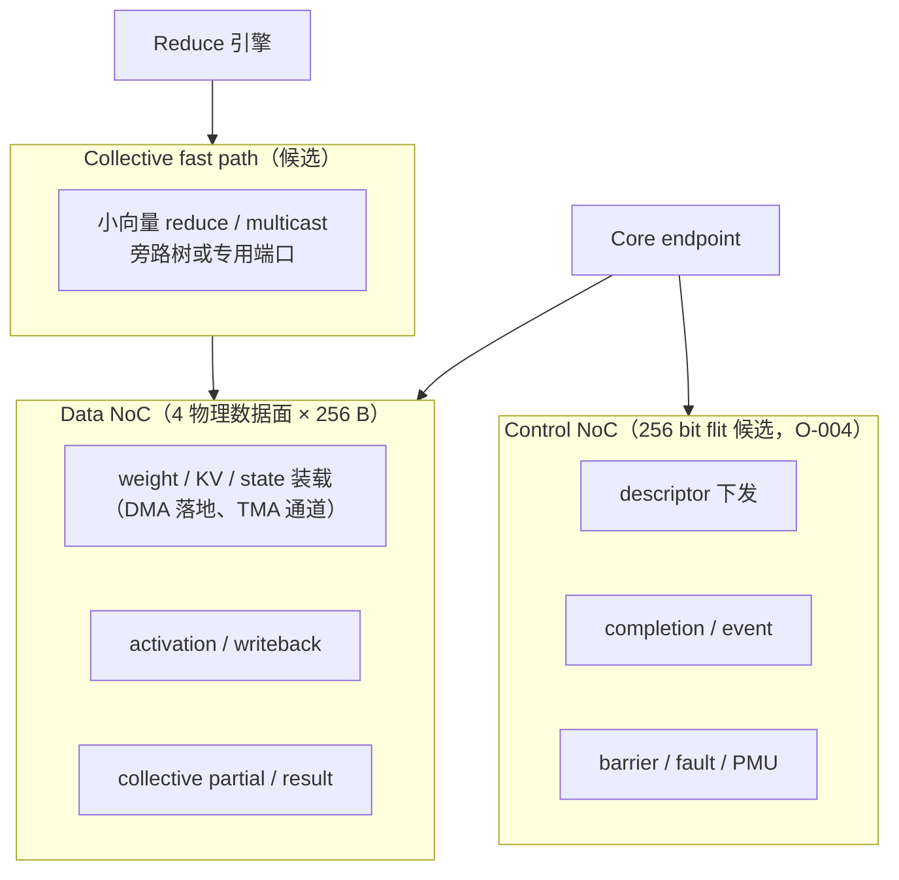
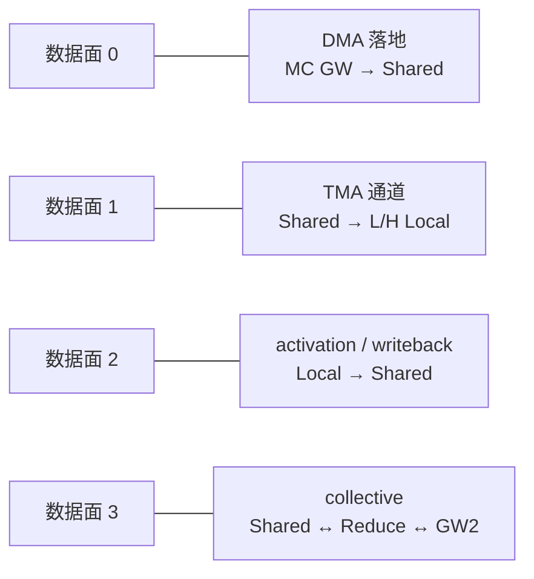
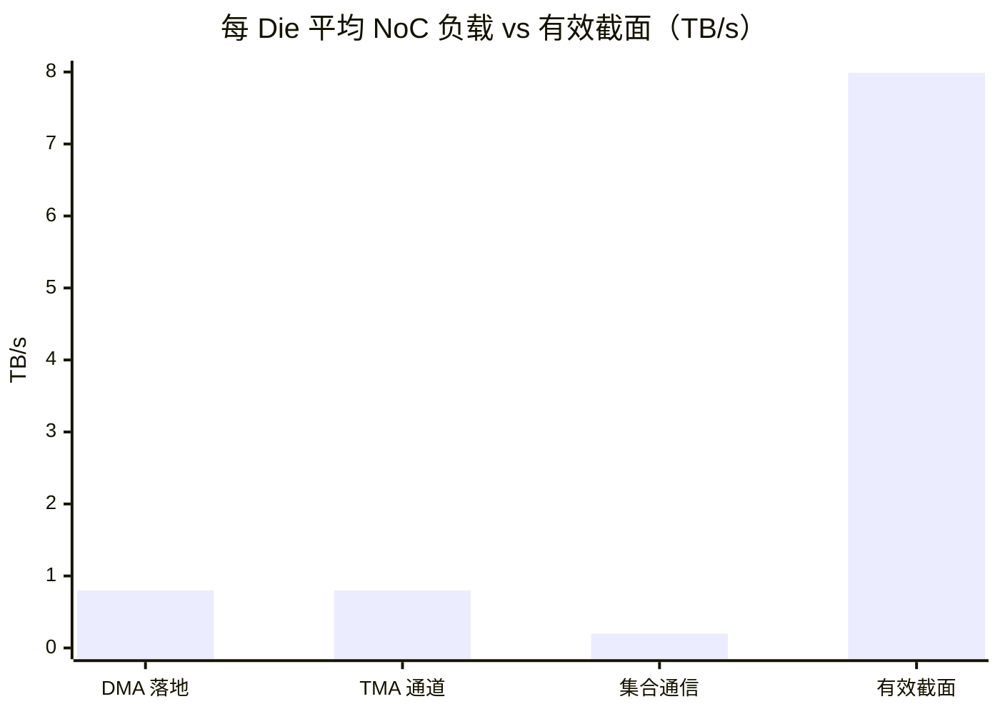
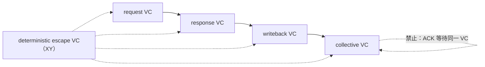

# 单 Die NoC 子系统设计

- 所有者：Hardware（NoC）；共签：Hardware SRAM/TMA、Collective
- 状态：拓扑与带宽 `MODEL`，物理实现 `OPEN`（O-003）
- 数字口径：**唯一硬件规格 P1 的发布点**（ADR-0021），权威值在 `teams/hardware/inputs/k3_mc_baseline.json#tpsDesign.hardware`，
  文字说明见 [`21_TPS_DESIGN_BASELINE.md`](../../../docs/architecture/21_TPS_DESIGN_BASELINE.md) 第 3.4 节。

## 1. 模型基线

模型公式（`integration/detailed/k3_architecture_search.js`）：

```text
meshSide = ceil( sqrt( cores + sharedSlices + 3 ) ) = ceil( sqrt(12 + 16 + 3) ) = 6
nocTB    = 2 × meshSide × nocBytes × nocLanes × f × nocUtil
         = 2 × 6 × 256 B × 4 × 1.0 GHz × 0.65                = 7.99 TB/s/Die
meshLat  = meshSide × routerCycles / f = 6 × 2 / 1.0 GHz        = 12 ns
```

| 项目 | 当前值 | 状态 |
| --- | ---: | --- |
| 拓扑 | 6×6 2D mesh（抽象） | `MODEL` |
| 活动 endpoint | 12 Core + 16 Shared slice + 3 gateway = 31 | `MODEL` |
| Link | 256 B/cycle × 4 lane / 方向（共 8192 bit） | `MODEL` |
| 频率 | 1.0 GHz（固定） | `BASELINE` |
| 分析利用率 | 0.65 | `A.TECH` |
| 有效截面 | 7.99 TB/s/Die | `MODEL` |
| 每跳时延 | 2 cycle（`routerCycles`） | `A.TECH` |
| 面积 / 功耗 | 35.92 mm²（SF4）/ 11.98 W（1.5 W per TB/s） | `MODEL` |

4 lane × 256 B 相当于每方向 8192 bit。该参数只通过了带宽模型，没有完成 floorplan、线长、repeater、功耗或 timing 证明。
“4 lane” 自然对应 4 个独立物理数据面，这也是第 4 节推荐的物理形态。

## 2. Endpoint 映射

```text
        x=0        x=1        x=2        x=3        x=4        x=5
y=0  [ MC GW0 ] [  S0   ] [  L0   ] [  L1   ] [  S1   ] [ MC GW1 ]
y=1  [  S2   ] [  H0   ] [  S3   ] [  S4   ] [  H1   ] [  S5   ]
y=2  [  L2   ] [  S6   ] [ RED   ] [ spare ] [  S7   ] [  L3   ]
y=3  [  L4   ] [  S8   ] [ spare ] [ spare ] [  S9   ] [  L5   ]
y=4  [  S10  ] [  H2   ] [  S11  ] [  S12  ] [  H3   ] [  S13  ]
y=5  [ UCIe/ ] [  S14  ] [  L6   ] [  L7   ] [  S15  ] [ spare ]
     [ RDMA  ]
      GW2
  L = L Core   H = H Core   S = Shared slice   RED = Reduce 引擎（挂在中心，spare 位可做中继）
```

布局原则（建议，`OPEN` 直到 floorplan）：

- 两个 MC gateway 放在上边两角，对应 Die 上边的两个 MC UCIe 端口；Die 间 UCIe / RDMA gateway 放在另一侧；
- 每个 H Core 四周至少有 2 个相邻 Shared slice：H 的 KV tile 是最大的 TMA 流；
- Reduce 引擎放在中心，到所有 slice 的平均跳数最小；
- 5 个 spare/router-only 位置用于中继、时钟边界和故障绕行。

## 3. 网络分层



当前性能模型只显式建模 Data NoC 和 reduce 资源，Control NoC 尚未进入时延模型。

## 4. 数据面参数

| 项目 | 当前候选 | 状态 |
| --- | --- | --- |
| 物理数据面 | 4 × 256 B（与模型的 4 lane 对应） | `MODEL` |
| Flit | 256 B，或拆成 4 × 64 B phit | `OPEN` |
| Routing | XY escape + minimal adaptive | `BASELINE` |
| Flow control | Credit based | `BASELINE` |
| Data VC | request / response / writeback / collective 四类 | `OPEN` |
| QoS | Decode 关键路径、预取 bulk、maintenance | `BASELINE` |

### 4.1 VC 与 buffer 深度（推导，`ASSUMPTION`）

credit 往返时延决定能否跑满一条链路：

```text
credit RTT ≈ 2 × (router 2 cycle + link 1 cycle) + credit 处理 2 cycle ≈ 8 cycle
每 lane 每输入端口 buffer ≥ RTT × flit = 8 × 256 B = 2 KiB（VC 共享池，每 VC 保留 1 flit）
每 router：5 端口 × 4 lane × 2 KiB = 40 KiB；36 router 合计约 1.4 MiB
```

约 1.4 MiB 的 router buffer 没有计入模型的 NoC 面积（35.92 mm²），是需要在 floorplan 回标时核对的面积风险。

### 4.2 数据面分配



按流量类映射到固定数据面，可以用物理隔离代替 VC，减少死锁分析；代价是负载不均时某一面饱和。是否采用由 cycle 模型决定。

## 5. 流量与时延预算

### 5.1 平均流量（由发布点时间账推导）

| 流量 | 每 token 每 Die | 平均带宽（÷ raw 775.75 µs） | 占 7.99 TB/s |
| --- | ---: | ---: | ---: |
| DMA 落地（MC → Shared） | 4.97 GB ÷ 8 = 0.62 GB | 0.80 TB/s | 10% |
| TMA 通道（Shared → Local） | 约同上 | 约 0.80 TB/s | 约 10% |
| 集合通信 workspace | 393 次 × 最大 1.3 MB（LSE 24 次）/ 0.28 MB | < 0.2 TB/s | < 3% |



平均负载只占约 23%，但 DMA 忙时 775.30 µs 几乎占满整个 token，峰值出现在 KV 窗口预取与 routed expert 未命中取数叠加时。
DMA 的峰值带宽取 `min(MC、NoC、远端、Shared 写)`，当前由 MC（896 GB/s/Die）决定，NoC 不是瓶颈。

### 5.2 跳数与时延

| 场景 | 跳数 | router 时延（2 cycle/跳） | 说明 |
| --- | ---: | ---: | --- |
| 模型取值 `meshLatency` | 6 | 12 ns | 每个 stage/集合通信都加一次 |
| 平均（均匀流量，6×6） | 4 | 8 ns | — |
| 最坏（XY，角到角） | 10 | 20 ns | 比模型多 8 ns |

最坏情况比模型多 8 ns；每 token 约 400 次集合通信时，即便全部命中最坏路径也只多约 3 µs，不改变结论。
TMA tile 以 wormhole 长包传输，序列化时间远大于跳数时延。

## 6. 包和事务

数据包至少包含：

- destination/source endpoint；
- traffic class/VC；
- operation：read、write、atomic-reduce、multicast、ACK；
- address/tile ID；
- byte mask、dtype/accumulation mode；
- epoch/generation；
- poison/ECC status；
- ordering tag；
- payload。

```text
header flit（候选）
+------+------+----+----+----------+--------+-------+------+--------+
| dst  | src  | TC | op | tile ID  | epoch  | order | mask | poison |
| 6 b  | 6 b  | 2 b| 4 b| 32 b     | 8 b    | 8 b   | 8 b  | 2 b    |
+------+------+----+----+----------+--------+-------+------+--------+
payload flit：256 B
```

大 TMA tile 使用长包或 wormhole stream；小 completion/flag 走 Control NoC，避免被 weight stream 阻塞。

## 7. 死锁与顺序



- 请求、响应、writeback、collective 必须有无环依赖；
- 提供 deterministic escape VC；
- mailbox commit 不能等待被同一 VC 阻塞的 ACK；
- TMA 写 Shared SRAM 后，ready flag 只能在数据可见后发出；
- fault/poison 包不得被普通流量永久饿死。

## 8. 验证流量

至少覆盖：

- 12 个 Core 同时 refill；
- H Core 的 KV tile 与 L Core 权重流同时装载；
- Attention KV multicast；
- TMA fill 与 Tensor writeback 同 bank；
- 8 Die collective gateway 注入；
- MC GW0 / GW1 不均衡；
- GLM/DS 的 sparse KV gather（656 B 随机读）；
- 单链路/单 router 故障绕行；
- P99 credit stall；
- 热点 Shared slice。

## 9. 冻结交付物

- 物理 endpoint 到 router 的映射（本文第 2 节为初版）；
- link/phit/flit/VC 明细；
- routing 和死锁证明；
- router buffer 深度（本文第 4.1 节为初算）；
- QoS/仲裁和 backpressure；
- cycle/packet-level NoC 模型；
- post-synthesis/router PPA；
- floorplan 线长和拥塞报告；
- 与 tile 仿真的流量接口。
