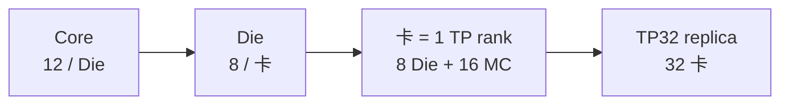
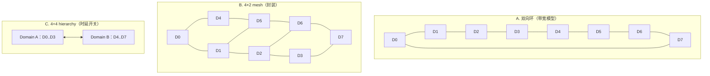
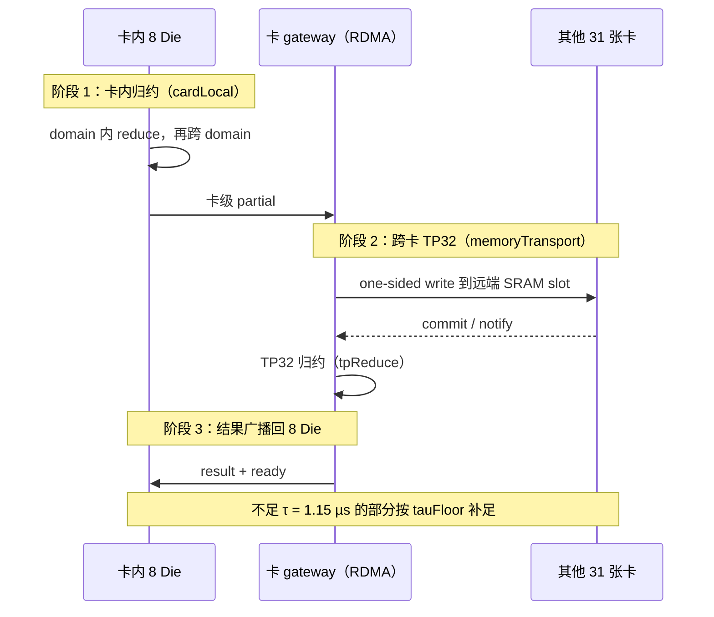
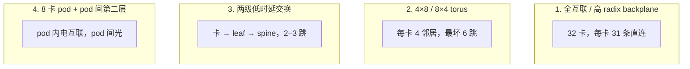
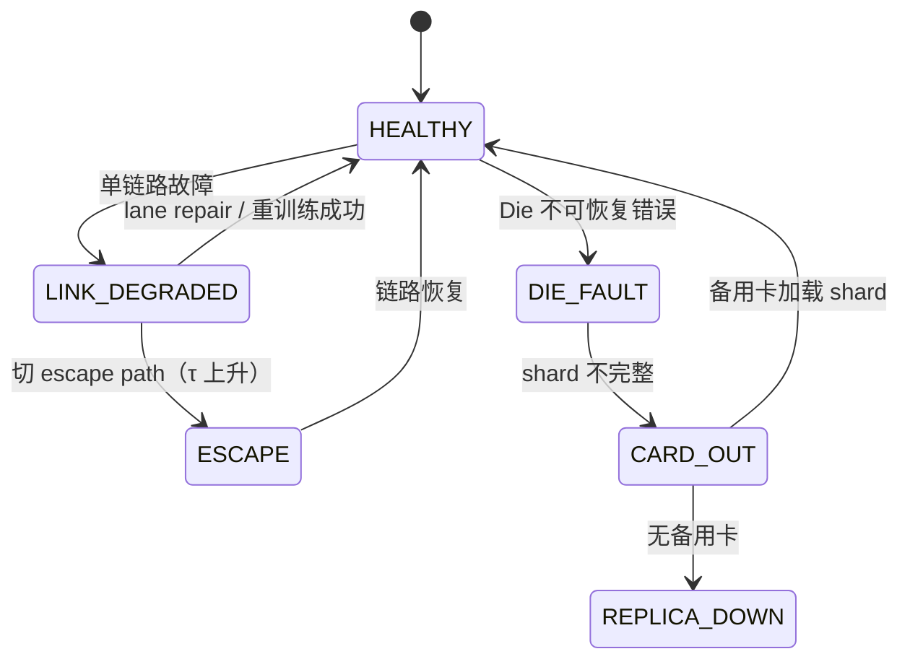

# 多 Die 扩展与 Scale-out 子系统设计

- 所有者：Hardware（多 Die / Scale-out）；共签：Software SW-05（集合通信）、Council（ADR-0016）
- 状态：卡内拓扑、跨卡拓扑均为 `BLOCKER`（B-004、B-005）；集合通信计数与 τ 口径已定（ADR-0004、ADR-0020）
- 数字口径：**当前 P1 发布点**，权威值在 `teams/hardware/inputs/k3_mc_baseline.json#tpsDesign`
  （[`21_TPS_DESIGN_BASELINE.md`](../../../docs/architecture/21_TPS_DESIGN_BASELINE.md) 第 2.2、3.4、4.2 节）。

## 1. 层级



软件看到 32 个 card rank，而不是 256 个独立 Die rank。卡内 8 Die 先完成局部归约和数据重排，再由 card rank 参加跨卡 collective。

FFN/MoE 为 TP-only（[ADR-0020](../../council/adr/ADR-0020-tp-only-ffn-moe.md)）：dense FFN、shared、routed expert 都按 TP rank 切分，
**没有 expert parallelism、没有 all-to-all**。每 token 的跨卡流量只有下面第 5 节的几类小向量集合通信。

## 2. 当前卡内拓扑冲突

现有资料出现三种描述：

- 4×2 Compute Die mesh（封装文档）；
- 8 Die 双向 ring，切面只有两条链路（性能代码的带宽口径：`dieCutGB = 2 × uciePortGB`）；
- 4+4 hierarchical direct reduce（Final Tuning 的时延开关；GAIN = 1 后已不影响时长）。



三者必须统一（ADR-0016，B-004）。

## 3. 推荐基线候选

物理上采用 **4×2 mesh + 两个四 Die reduce domain**：

```text
D0 -- D1 -- D2 -- D3        Domain A: D0..D3
 |     |     |     |
D4 -- D5 -- D6 -- D7        Domain B: D4..D7
```

- 普通远端访问按 4×2 mesh 路由；
- collective 先在各四 Die domain 内 reduce，再经 4 条竖向链路交换，结果在 domain 内广播；
- 每 Die 的两颗 MC 保持本地 home；
- 不设置单点 hub。

4×2 mesh 的切面有 4 条竖向链路，是双向环（2 条）的两倍；当前模型按环计，属于保守口径。
每 Die 需要 3–4 个 Die 端口（角 Die 2 个、边 Die 3 个），比环多 1–2 个 UCIe 端口，需在 [09](09_PACKAGE_POWER_RAS.md) 第 2 节的 shoreline 里核算。

## 4. Die 间链路

| 项 | 值 | 状态 |
| --- | ---: | --- |
| lane × 速率 | 128 × 64 Gbps | `MODEL` |
| 有效系数 | 0.8 | `A.TECH` |
| 单端口 payload | 819.20 GB/s | `MODEL` |
| 环切面 | 1638.40 GB/s | `MODEL` |
| 每跳时延 | 0.025 µs（`ucieHopUs`） | `A.TECH` |

该规格远高于本地参考 MC 的 UCIe 1.1 链路，且 lane 组合、PHY 面积和 bump 均未确认。三类链路要分开：

- MC UCIe：面向 640 GB/s/MC（Stretch）或 320 GB/s/MC（参考规格）；
- Die-to-Die UCIe：面向 mesh/collective；
- Scale-out PHY：板间/机柜内，不能直接用封装内 UCIe 数字替代。

## 5. Scale-out 当前模型

- 每卡一个 rank，payload 上限 800 GB/s/卡；
- 每 Die 16 条 112 Gbps RDMA lane，单 Die 有效 168 GB/s，8 Die 聚合后由 800 GB/s 截断；
- one-sided write 到远端 SRAM（[07](07_COLLECTIVE_RDMA.md)）；
- 集合通信按 reference-393 口径计数（ADR-0004）：每次先卡内 8 Die 阶段，再跨卡 TP32 阶段，最后按 τ = 1.15 µs 下限计费。

| 集合通信 | 次数 / token | workspace B | 协议模型均值 µs |
| --- | ---: | ---: | ---: |
| LSE merge / output reduce-scatter | 24 | 1325568 | 0.98 |
| Attention output all-reduce | 93 | 276480 | 0.77 |
| Wdown + Router all-gather | 92 | 186880 | 0.43 |
| Routed latent merge | 92 | 204800 | 0.69 |
| Wup + Shared output all-reduce | 92 | 276480 | 0.77 |
| **合计** | **393** | — | 均低于 τ，全部按 1.15 µs 计 |



每 token 集合通信计入 393 × 1.15 = 451.95 µs，其中协议模型给出的是 memoryTransport 192.37 + cardLocal 74.71 + tpReduce 1.88，
其余 183.00 µs 是 τ 下限补足（B-008）。协议参数见 [07](07_COLLECTIVE_RDMA.md) 第 3 节。

GLM-5.2、DeepSeek-V4-Pro 在同一口径下为每 token 255 次、244 次（[`teams/model/docs/deployment/`](../../model/docs/deployment/README.md)），
多一类 indexer top-k 合并（[07](07_COLLECTIVE_RDMA.md) 第 2.2 节）。

> `repo-510` 计数口径只作对照（切回得 941.74 TPS/usr，是口径差而非优化，ADR-0004）；
> FFN/MoE 为 TP-only，没有 all-to-all（ADR-0020）。

## 6. 必须决定的跨卡拓扑

候选方案：



| 方案 | 最坏跳数 | 单点故障 | 远端 SRAM write 语义 | 主要风险 |
| --- | ---: | --- | --- | --- |
| 全互联 | 1 | 无 | 直接保持 | 端口与连接器数量 |
| 4×8 torus | 6 | 无 | 需中继转发 | 跳数 × 每跳时延直接压 τ |
| 两级交换 | 2–3 | 交换芯片 | 需交换机支持 | 交换时延与功耗 |
| 8 卡 pod | 2 | pod 间链路 | 需中继 | 层间带宽 |

选择时必须同时满足：

- 远端 SRAM write 语义是否可保持；
- 最坏 hop；
- 单次小消息 P99；
- 800 GB/s/卡 端口和 SerDes 数；
- 无单点故障；
- 布线、连接器、交换芯片和光模块功耗；
- collective route 的可证明无死锁性。

**τ 预算约束**：τ 盈亏点约 1.35 µs（21 号文档第 6 节），即每次集合通信最多有 0.2 µs 的余量。
torus 每多一跳若增加约 0.1 µs，就会吃掉一半余量。跨卡拓扑选择必须给出 τ 的物理推导（B-008）。

## 7. 运行与故障语义

- TP group 使用 gang scheduling；
- 每 token/层有 collective epoch；
- 慢卡、重放和热降频会阻塞全组；
- 单 Die 故障先尝试卡内降级，若 shard 不完整则整卡退出 group；
- MC 故障按 page remap 降容；
- 链路故障必须切换 escape path；
- 超时不得静默复用旧 epoch slot。



## 8. 冻结交付物

- 卡内 8 Die 最终拓扑和每条链路规格；
- 跨卡物理拓扑、hop 表和布线；
- link/PHY/connector/optics 清单；
- 路由、拥塞、故障和 QoS 模型；
- 32 卡 collective P50/P95/P99，以及由此推导的 τ；
- 卡级端口、功耗、岸线和冷却预算；
- bring-up 和链路训练流程。
