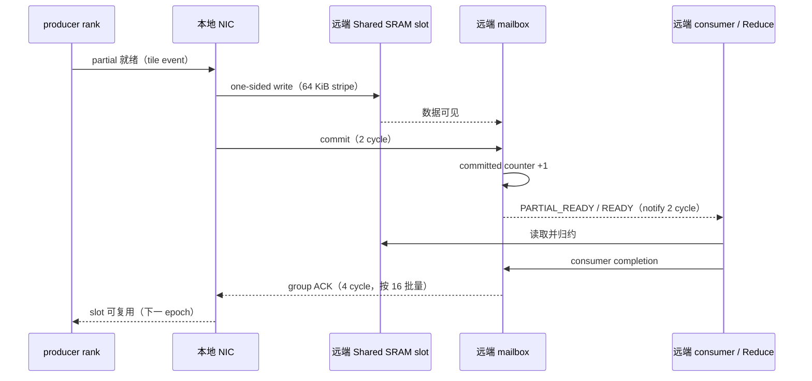
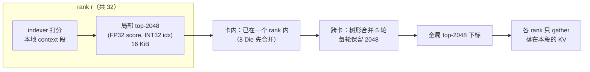
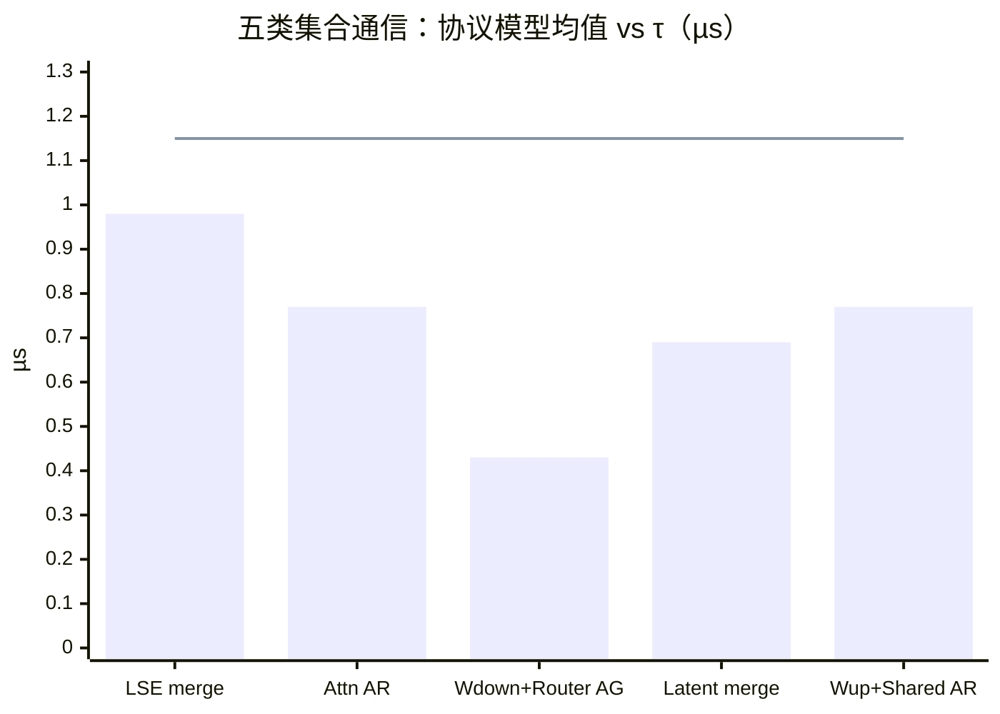
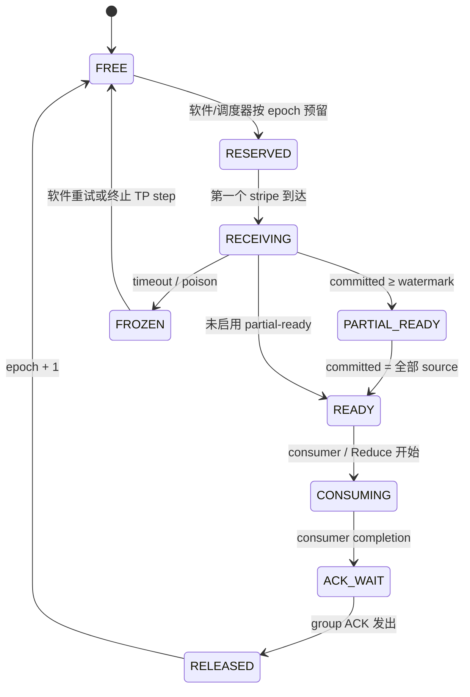

# Collective 与 RDMA-to-SRAM 子系统设计

- 所有者：Hardware（Collective/RDMA）；共签：Software SW-05（集合通信调度）
- 状态：协议语义 `BASELINE`，参数 `MODEL`，τ 的物理推导 `BLOCKER`（B-008）
- 数字口径：当前 P1 发布点（reference-393、τ = 1.15 µs 下限），见
  [`21_TPS_DESIGN_BASELINE.md`](../../../docs/architecture/21_TPS_DESIGN_BASELINE.md) 第 2.2、4.2、4.3 节；
  软件侧调度见 [`COLLECTIVE_SCHEDULE.md`](../../software/docs/COLLECTIVE_SCHEDULE.md)。

## 1. 目标

为 Decode 中大量小型同步点提供低软件开销、可验证的远端 SRAM 语义：



RDMA write 完成不等于 consumer ready；数据、commit、ACK 和 slot generation 都必须在硬件状态机中显式表达。

## 2. 支持的 collective

| 类型 | 数据 | 用途 | 模型 |
| --- | --- | --- | --- |
| all-reduce（BF16，FP32 累加） | hidden 向量 | attention 输出、FFN/MoE 输出 | 全部 |
| all-gather（BF16） | 小向量 | Wdown + Router 输出 | K3 |
| reduce-scatter / merge | latent 向量 | routed latent merge | K3 |
| LSE m/l/O merge | 每 head 的 (m, l, O) | softmax MLA / sparse attention 的跨 rank 合并 | 全部 |
| top-k merge | (score, index) 对 | indexer 候选合并 | GLM、DS |
| broadcast / multicast | 小向量 | 采样结果（计数口径下为本地算子） | 全部 |
| card-local hierarchical reduce | 同上 | 卡内 8 Die 阶段 | 全部 |

### 2.1 LSE merge

LSE 不是普通 sum。每个 rank 对自己那段 context 给出 `(m_r, l_r, O_r)`：

```text
m   = max_r m_r
l   = Σ_r exp(m_r − m) · l_r
O   = Σ_r exp(m_r − m) · O_r
out = O / l
```

合并需要 max、exp、加权和与归一化，全部在 FP32 进行。硬件 Reduce 引擎必须支持 “max 后缩放再加” 这一复合 opcode，
否则需要两轮（先 all-reduce max，再 all-reduce 缩放后的和），通信次数翻倍。

### 2.2 indexer top-k merge（GLM-5.2、DeepSeek-V4-Pro）

context 按 TP rank 切分，每个 rank 只能在自己那段 context 上给出局部 top-2048，全局 top-2048 需要跨 rank 合并：



语义要求：

- 每个候选 8 B（FP32 score + INT32 全局 token 下标），每 rank 16 KiB；
- 合并用 compare-select，保留前 2048；相同 score 按下标决定次序，保证各 rank 结果一致（确定性）；
- 树形合并 log₂32 = 5 轮，每轮消息 16 KiB；或一次 all-gather 512 KiB 后本地选择——两者由 τ 与带宽比较决定；
- 合并结果之后，每个 rank 只取落在自己 context 段内的 KV，sparse attention 的 LSE merge 再走第 2.1 节；
- GLM 的 57 个 shared indexer 层沿用上一个 full 层的结果，不做合并。

硬件需求：Reduce 引擎支持 (key, value) 对的 compare-select top-k，或由 Vector 完成（02 号文档第 5.1 节）。

### 2.3 三个模型的消息尺寸

| 模型 | hidden all-reduce 消息 | 其他消息 | 次数 / token |
| --- | ---: | --- | ---: |
| K3 | 7168 × 2 B = 14.3 KB | latent 3584 × 2 B = 7.2 KB；LSE workspace 1325568 B | 393 |
| GLM-5.2 | 6144 × 2 B = 12.3 KB | top-k 16 KiB/rank（21 层） | 255 |
| DeepSeek-V4-Pro | 7168 × 2 B = 14.3 KB | top-k 16 KiB/rank（61 层） | 244 |

所有消息都远小于一个 64 KiB stripe，时间由固定时延决定，按 τ 计费。

## 3. 当前 Final Tuning 协议参数

| 参数 | 值 | 状态 |
| --- | ---: | --- |
| stripe | 64 KiB | `MODEL` |
| one-way | 0.05 μs | `MODEL` |
| commit/notify/ACK | 2/2/4 cycles | `MODEL` |
| outstanding/NIC | 64 | `MODEL` |
| epochs | 2 | `BASELINE` |
| phase fusion | 3 | `MODEL` |
| commit/ACK batch | 16/16 | `MODEL` |
| overlap depth | 4 | `MODEL` |
| partial-ready | Attention 20%、LSE 25%、Router 18% | `MODEL`（只经 GAIN 起作用，GAIN = 1 时无效） |
| group ACK/ready counter | enabled | `BASELINE`（同上） |

这些参数只影响超过 τ 的集合通信；发布点五类集合通信的协议时间都低于 τ（0.43–0.98 µs），全部按 1.15 µs 计。



优化后模型每 token 的 phase 数、peer request 数、wire bytes、RDMA workspace 峰值（发布点 1.26 MiB）和 collective 串行时间以
`out/rdma/k3_rdma_final_tuning_results.json#/search/best`（`phases`、`requests`、`wireBytes`、`rdmaReserveMiB`、`commUs`）为准。

## 4. Mailbox 单元

每 mailbox slot 至少包含：

- epoch/generation；
- source rank bitmap；
- committed rank bitmap/counter；
- ACK bitmap/counter；
- payload address/length；
- reduce opcode/dtype；
- ready watermark；
- poison/error；
- timeout/retry state；
- consumer completion。



任何 generation 不匹配的包都必须丢弃并上报，避免 ABA。2 个 epoch 意味着第 n+2 次集合通信才能复用第 n 次的 slot。

## 5. Partial-ready 约束

Partial-ready 只有在以下条件同时成立时才可启动：

- 输入顺序和归约操作满足结合律/交换律要求；
- 尚未到达的数据有独立 slot；
- consumer 不会读取未提交范围；
- late packet 不覆盖已释放范围；
- LSE 的 m/l/O 分块语义保持正确；
- 错误/重试不会产生重复累加。

当前 20/25/18% 阈值只是经验参数。详细模型必须按到达 bitmap、tile stripe 和 consumer wavefront 推演。

## 6. 流控和可靠性

- credit 在数据可见并具备接收空间后返回；
- ACK 和数据使用不会相互死锁的 VC（05 号文档第 7 节）；
- 支持 CRC、sequence、replay；
- reduce 操作必须处理 replay 去重；
- ECC 错误产生 poison，不得继续静默累加；
- timeout 后冻结 slot，软件决定重试或终止 TP step；
- epoch wrap 需要足够位宽或全局 quiesce。

## 7. 性能签核

分别测量：

- 7.2 KB latent、12.3/14.3 KB hidden、16 KiB top-k 候选、约 1.3 MB LSE workspace；
- 1、2、4、8 个 active NIC；
- 8/16/32 ranks；
- 无拥塞、预取并发、故障重放；
- P50/P95/P99 和最大时延——P99 必须低于 τ 盈亏点约 1.35 µs；
- SRAM bank conflict；
- request/phase fusion 实际收益；
- card-local 与 scale-out 的重叠程度。

## 8. 冻结交付物

- packet/transaction 格式；
- mailbox 和 reduce 单元框图；
- epoch/commit/ACK 状态机（本文第 4 节为初版）；
- LSE 与 top-k merge 数值规范（本文第 2.1、2.2 节为初版）；
- credit、replay、timeout 和错误语义；
- RTL 级 transaction model；
- 形式验证属性；
- 与 NoC、SRAM、scale-out 的完整接口。
