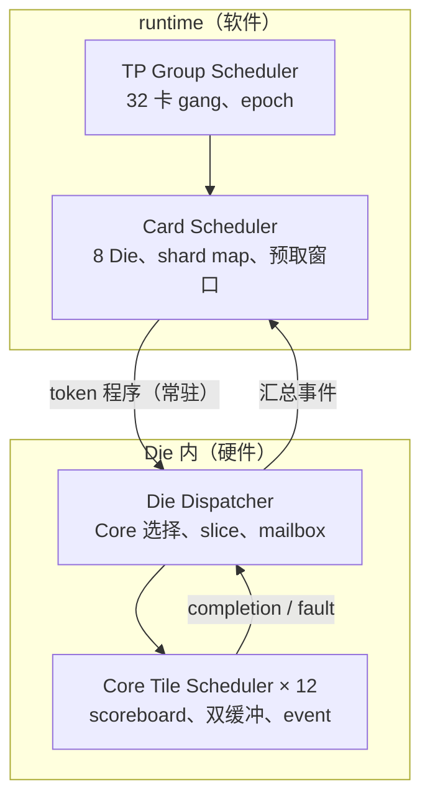
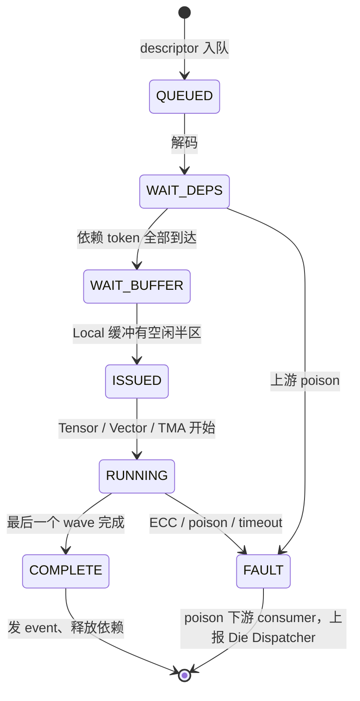
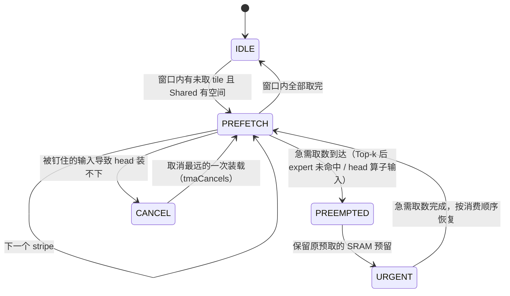
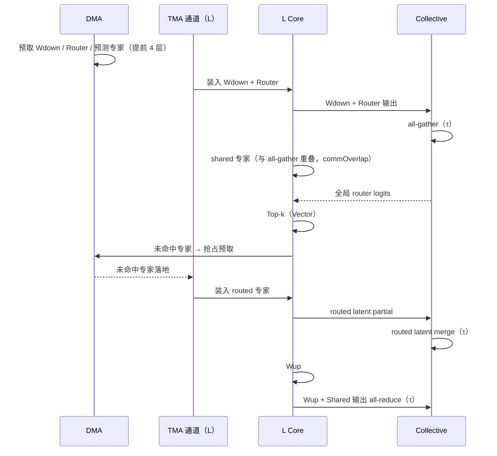
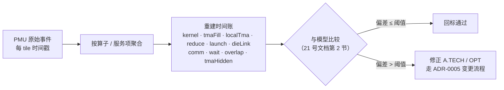

# 片上调度器与 PMU 设计

- 所有者：Hardware（调度器/PMU）；共签：Software SW-02（runtime）
- 状态：调度语义 `MODEL`（来自模拟器事件循环）；队列深度、状态机为初版 `OPEN`
- 数字口径：当前 P1 发布点依赖的调度与映射机制（TMA 通道、KV 跨层预取、DMA 抢占、launch batching）及其逐项回退见
  [`21_TPS_DESIGN_BASELINE.md`](../../../docs/architecture/21_TPS_DESIGN_BASELINE.md) 第 4、5 节。

本文是原 `docs/architecture/08_SCHEDULER_AND_SOFTWARE.md` 的硬件部分（2026-09-25 拆分）。编译器、
TP Group / Card 两级 runtime 调度和固件见
[`teams/software/docs/COMPILER_RUNTIME_AND_FIRMWARE.md`](../../software/docs/COMPILER_RUNTIME_AND_FIRMWARE.md)；
硬件调度器消费的 tile descriptor 由 [`docs/architecture/contracts/TILE_IR.md`](../../../docs/architecture/contracts/TILE_IR.md) 定义。

## 1. 调度层级中的硬件部分

### 1.1 Die Dispatcher

- 选择 L/H Core；
- 优先数据本地性；
- 控制 Shared SRAM slice；
- 分配 collective mailbox；
- 在 tile 边界迁移，不迁移正在执行的 Tensor wave。

### 1.2 Core Tile Scheduler

- 维护 Tensor、Vector、TMA dependency；
- 双缓冲/多缓冲；
- partial-ready；
- launch batching；
- scoreboard 和 event；
- fault/poison 停止后续 consumer。

## 2. 队列与深度（初版，`OPEN`）

模拟器的语义给出最小深度的下限：DMA 预取 `x.depth` = 4 层、TMA 通道每域一条、每 NIC 64 outstanding、2 个 epoch。

| 队列 | 位置 | 深度（建议） | 依据 |
| --- | --- | ---: | --- |
| Die command queue | Die Dispatcher | 256 descriptor | 一层约 20–30 个算子 × 预取 4 层，留 2 倍 |
| Core command queue | 每 Core | 32 descriptor | 双缓冲 × Tensor/Vector/TMA 三类，留余量 |
| DMA 预取队列 | Die | 4 层 × 每层 tile 数 | `x.depth` = 4（取 2–4 时 TPS 相同） |
| TMA 通道队列 | L 域、H 域各一 | 8 tile | 双缓冲空一半即发射，按程序顺序 |
| DMA 抢占栈 | Die | 4 条被暂停预取 | 发布点每 token 抢占 92 次，每层至多 1 次 |
| Collective mailbox | 每 Die | 5 类 × 2 epoch | reference-393 的五类，2 个 epoch |
| RDMA outstanding | 每 NIC | 64 | 协议参数 |
| Completion queue | Die → runtime | 64 事件 | 合并后上报 |

## 3. 状态机

### 3.1 Core Tile Scheduler：一个 tile 的生命周期

### 3.2 DMA 预取与抢占

发布点：抢占 92 次/token，`tmaCancels` 0 次，DMA wait 22.35 µs（主要是 routed expert 未命中的 20%）。

### 3.3 一个 MoE 层的硬件事件流

## 4. 动态决策与低开销要求

运行期由硬件决定的事项（编译器只给出约束，见软件文档第 3 节）：

- TMA 发起时刻；
- ready tile 的 Core 选择；
- MC/NoC credit；
- partial-ready 启动；
- DMA 抢占与恢复；
- 故障绕行和降频。

当前 launch 时间模型为每个非 COMM、未融合的算子 0.015 µs × `launchScale` 0.45，合计 **11.17 µs/token**
（`launchScale` 是未回标的假设，B-003；关掉 `launchBatching` 时 TPS 从 1101.77 降到 1088.47）。
0.45 要成立，硬件侧必须满足：

- 常规 tile command 无 host doorbell；
- descriptor 预取；
- command batch；
- completion 合并；
- 控制 NoC 不被数据包阻塞；
- 可测量每类 launch stall。

## 5. PMU

### 5.1 事件表

| 事件组 | 事件 | 粒度 | 对应时间账项 |
| --- | --- | --- | --- |
| Tensor | active / stall-operand / stall-output cycles | 每 Core | `kernel` |
| Vector | active cycles、unpack 参数数、SFU 占用 | 每 Core | `kernel`（unpack、FP8 KV 反量化） |
| TMA | bytes、busy cycles、setup 次数、stall（Shared 读 / Local 写） | 每 Core、每通道 | `tmaFill`、`localTma`、`tmaHidden` |
| Local SRAM | bank conflict、各仲裁类读写 | 每 Core | `localTma` |
| Shared SRAM | slice queue、读写 bytes、占用峰值 | 每 slice | 窗口 100.24 MiB/卡 |
| NoC | flit、credit stall、VC occupancy | 每 router | — |
| DMA / MC | bytes、busy、latency、replay、抢占次数 | 每 MC | DMA busy 775.30 µs、wait 22.35 µs |
| Collective | 次数、phase、request、协议时长、τ 补足、timeout | 每类 | `memoryTransport`、`cardLocal`、`tpReduce`、`tauFloor` |
| Mailbox | occupancy、partial-ready 提前量、generation 丢弃 | 每 slot | — |
| Launch | descriptor 数、doorbell、launch stall | 每 Die | `launch` |
| 重叠 | shared 专家与集合通信重叠时长 | 每层 | `commOverlap` |
| 物理 | Core/Die 温度、频率、功率 | 每 Die | 功耗 286.22 W |
| 时间戳 | 每 operator / tile 起止 | 每 tile | 全部 |

### 5.2 时间账重建

PMU 事件必须能重建模拟器使用的时间账：

恒等式 `raw = compute − tmaHidden + comm + wait − overlap` 的每一项都要有 PMU 事件来源。

## 6. 冻结交付物

- ISA/command queue；
- Die Dispatcher / Core Tile Scheduler 状态机（本文第 3 节为初版）；
- 队列深度（本文第 2 节为初版）；
- PMU 事件表（本文第 5 节为初版）；
- 软件 golden trace 的硬件回放测试。
