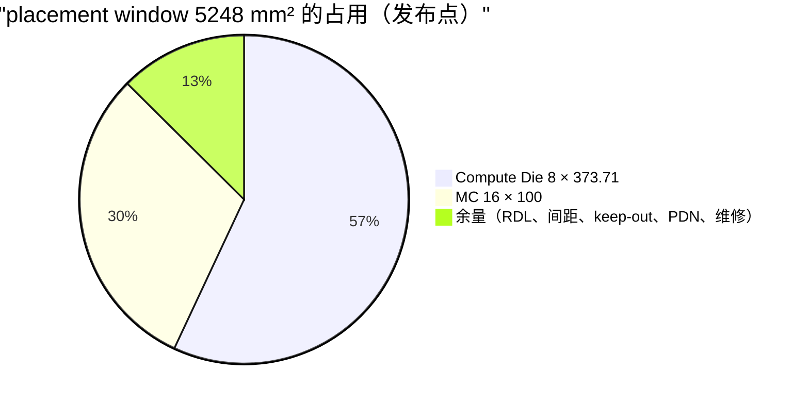
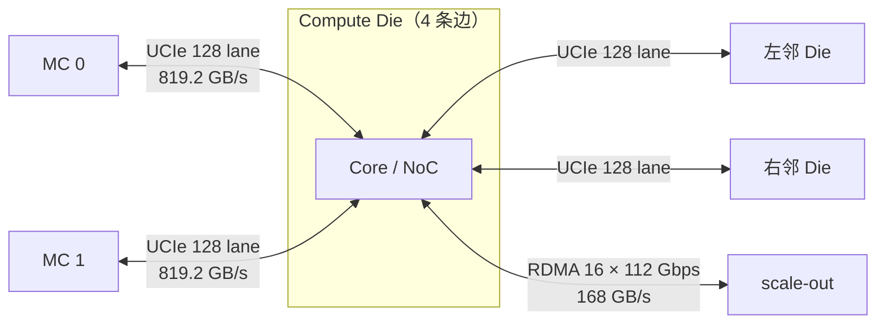
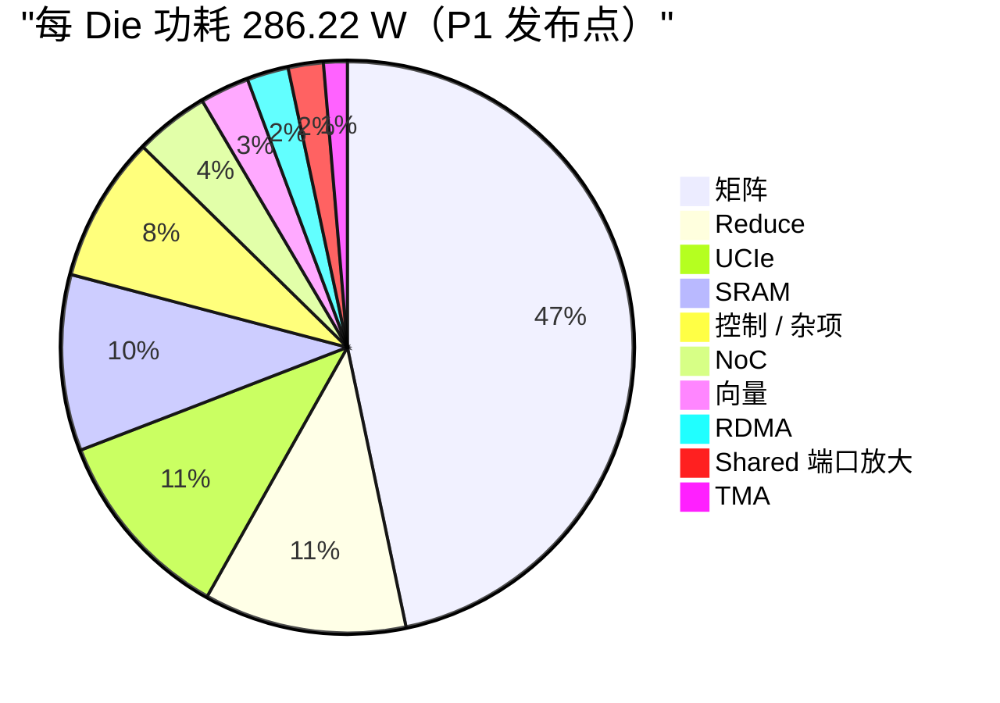
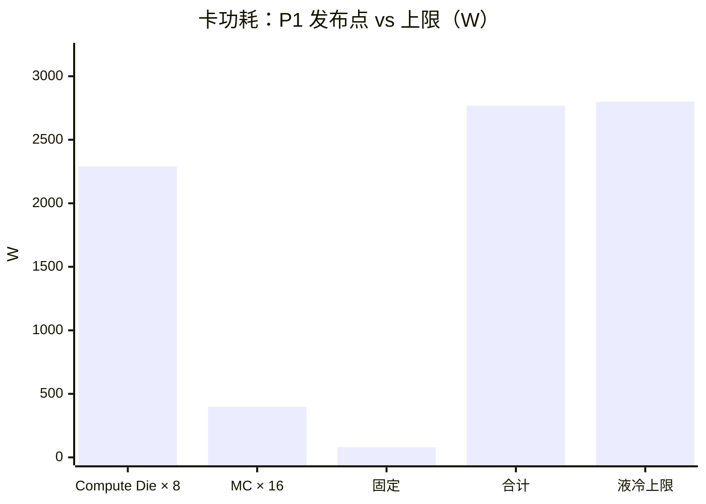
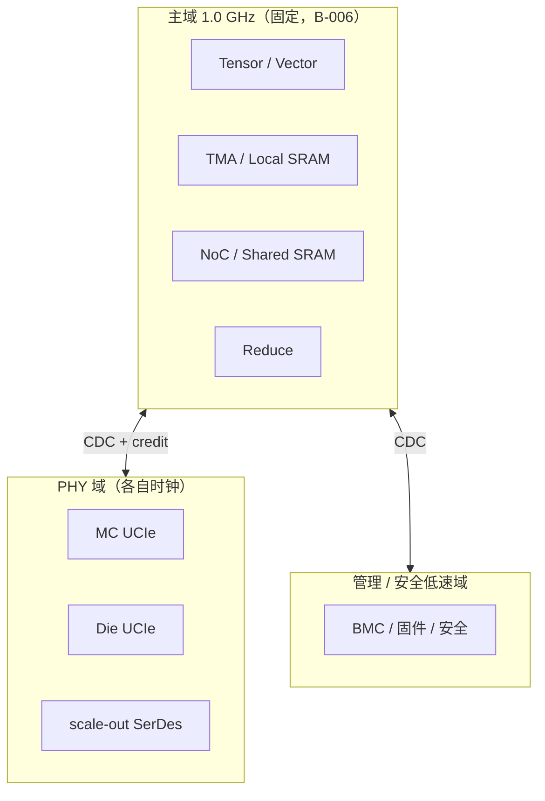
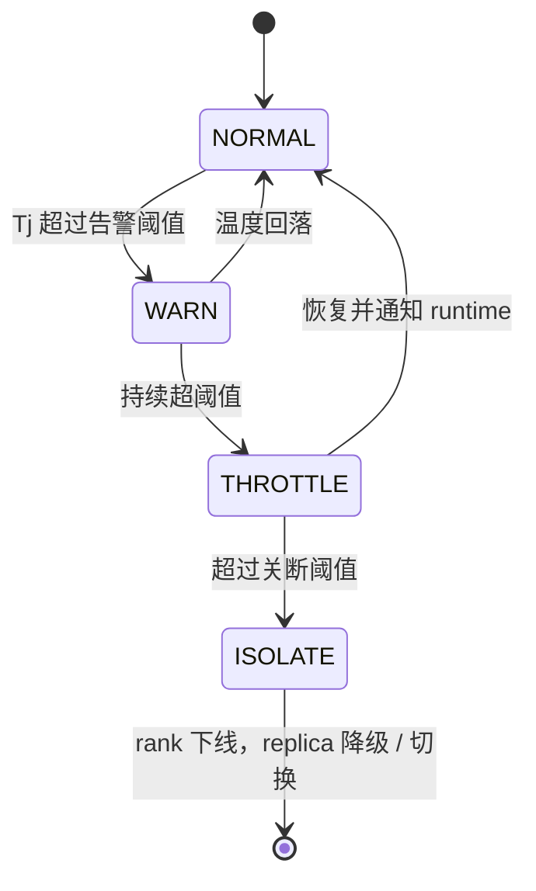
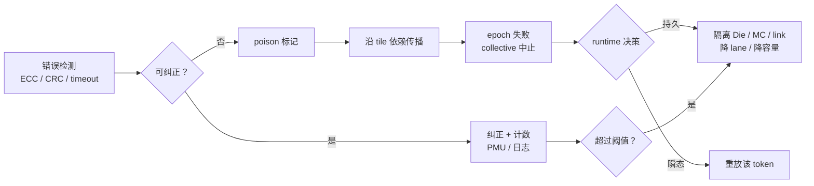

# 封装、I/O、功耗、时钟、散热与 RAS

- 所有者：Hardware（封装/电源/RAS）；共签：Council（系统预算）
- 状态：发布点数字 `MODEL`；散热 `ASSUMPTION`（O-015）
- 数字口径：唯一硬件规格 P1（ADR-0021），权威值在 `teams/hardware/inputs/k3_mc_baseline.json#tpsDesign.hardware`（[`21_TPS_DESIGN_BASELINE.md`](../../../docs/architecture/21_TPS_DESIGN_BASELINE.md) 第 3.1、3.5 节）；
  封装约束在同一文件的 `package` 块（ADR-0018）。

## 0. 规格汇总

| 项 | 当前值 |
| --- | ---: |
| Compute Die | 8 × 373.71 mm²（SF4），上限 400 |
| MC | 16 × 100 mm²（规划值） |
| 裸片面积 | 4589.71 mm² |
| Placement window | 5248 mm² |
| Die 功耗 | 286.22 W，上限 300 W（液冷） |
| 卡功耗 | 2768.47 W，上限 2800 W |
| 频率 | 1.0 GHz（固定） |
| PHY shoreline | 24.21 mm / 预算 52.95 mm |

## 1. 封装

7-reticle 理论面积按 26×33 mm/reticle 计 6006 mm²，工程 placement window 约 82×64 mm、按 5248 mm² 管理。
一个 package 对软件表现为一个 TP rank，32 个 package 组成 TP32。

```text
            ← 约 82 mm →
  +------------------------------------------------+
  | MC MC   MC MC   MC MC   MC MC                  |   ↑
  | [Die0]  [Die1]  [Die2]  [Die3]    scale-out    |   |
  |   ↕ UCIe 环 ↔     ↔       ↔       PHY 边缘      |  约 64 mm
  | [Die7]  [Die6]  [Die5]  [Die4]    host / mgmt  |   |
  | MC MC   MC MC   MC MC   MC MC                  |   ↓
  +------------------------------------------------+
   4×2 Compute Die；每 Die 本地 2 颗 MC；Die 之间为双向环（B-004 未闭合）
```



## 2. I/O 岸线与端口表

模型中每 Die 有 4 个 UCIe controller group（2 个接本地 MC，2 个接环上相邻 Die），每组 128 lane × 64 Gbps，
另有 16 条 112 Gbps RDMA lane。

| 端口类 | 对端 | 端口数 / Die | payload（P1 模型） | PHY/协议 | 状态 |
| --- | --- | ---: | ---: | --- | --- |
| MC local | 2 MC | 2 | 每 MC 640 × 0.7 = 448 GB/s；端口 819.20 GB/s 不截断 | UCIe 类 | `BLOCKER`（B-002） |
| Die fabric | 环上相邻 Die | 2 | 819.20 GB/s/端口；环切面 1638.40 GB/s | UCIe / 自定义短距 | `BLOCKER`（B-004） |
| Scale-out | 其他卡 / 交换 | 16 lane | 168 GB/s/Die；800 GB/s/卡（上限） | 电/光 SerDes | `BLOCKER`（B-005） |
| Host | CPU / root complex | 待定 | 非 Decode 关键路径 | PCIe/CXL | `OPEN` |
| Management | BMC / JTAG / I3C | 若干 | 低速 | 标准接口 | `OPEN` |



shoreline 24.21 mm 远低于 52.95 mm 预算；UCIe 仍是抽象参数，不能直接进入 bump map。

## 3. 功耗

### 3.1 Die 功耗构成（P1 发布点，286.22 W）



读法：

- 矩阵占 47%；Reduce 引擎 4096 lane 占 11%，与它 2.66 TOPS 的用途相比偏大，是下一轮优先复核的对象；
- Shared 端口放大 5.69 W 只换来 0.06 TPS（21 号文档第 3.3 节）。

### 3.2 卡功耗（P1 发布点）

```text
card = 8 × die 286.22 + MC 398.72 + 固定 80 = 2768.47 W   （上限 2800 W，余量 31.53 W）
MC   = 16 × (7 W + 640 GB/s × 0.7 × 8 bit × 5 pJ/bit)      = 398.72 W
```



余量 31.53 W，而以下项目尚未可靠计入：

- 高速 SerDes / 光模块真实功耗；
- ECC、DFT、clock tree；
- VRM 损耗；
- BMC、主机接口；
- SRAM compiler 差异；
- PVT guardband；
- 老化和漏电。

因此 640 GB/s Stretch 配置在功耗上也不能冻结。MC 降到 320 GB/s 时 MC 功耗按同一公式为 255.36 W，省约 143 W，但 TPS 降到 586.46。

## 4. 时钟与电源域



- 主域频率固定 1.0 GHz，不用 DVFS 换算力（21 号文档第 1.1 节）；DVFS 只用于热保护和故障降级；
- Core cluster clock gating、SRAM bank gating、PHY lane power gating；
- reduce/collective 独立功率计数器；
- 跨域接口必须定义 CDC、reset sequencing、credit 恢复和错误注入行为。

## 5. 散热

2.8 kW 级卡按液冷（冷板）规划（`ASSUMPTION`，O-015）。验证包括：

- Compute Die 和 MC 共面/热阻；
- 8 Die 热不均匀；
- MC 堆叠热点；
- scale-out PHY 边缘热点；
- VRM 和连接器；
- 冷板流量、压差、入口温度；
- 单泵/单回路故障；
- 热降频对 TP32 最慢 rank 的影响（TP32 以最慢 rank 为 step 完成条件）。



单 Die 降频会拖慢整个 TP32 replica，所以 THROTTLE 必须上报 runtime，由 runtime 决定继续运行还是迁移。

## 6. RAS

- SRAM SECDED、scrub、spare；
- NoC/router parity/ECC；
- MC/UCIe CRC、retry、lane repair；
- RDMA sequence/replay/poison；
- watchdog 和 collective timeout；
- 每 Die/MC/link 独立隔离；
- page remap；
- 降频、降 lane、降容量运行；
- secure boot、firmware authentication、debug lock；
- 错误日志可关联 tile/epoch/rank。



## 7. 冻结交付物

- 新版封装 floorplan；
- PHY beachfront 和 bump map；
- interposer/RDL/PCB 拓扑；
- PDN/IR-drop/SSN；
- clock/reset/power-domain；
- 热仿真与冷板需求；
- RAS 故障矩阵；
- 卡级功耗清单和降额策略；
- 封装厂、PHY/IP、MC 供应商确认。
