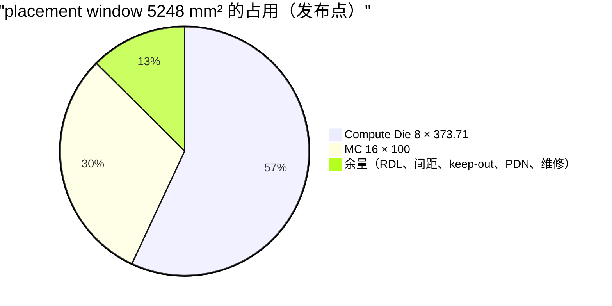
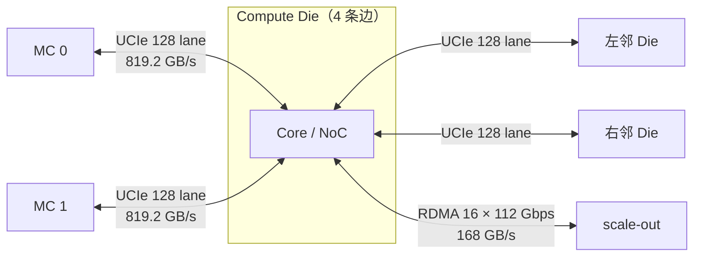
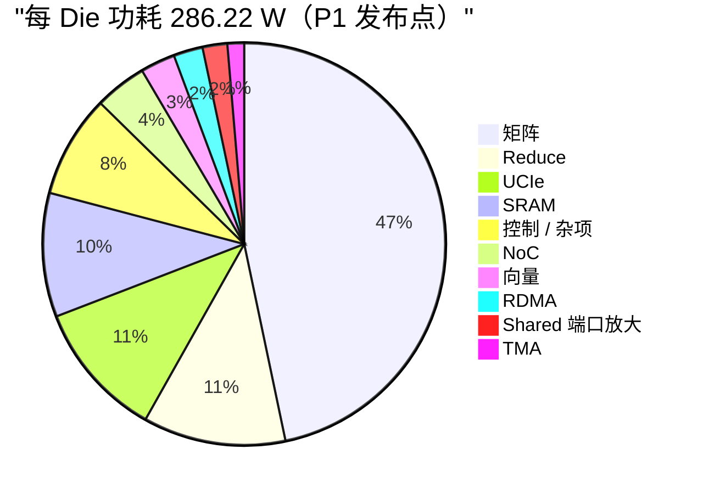
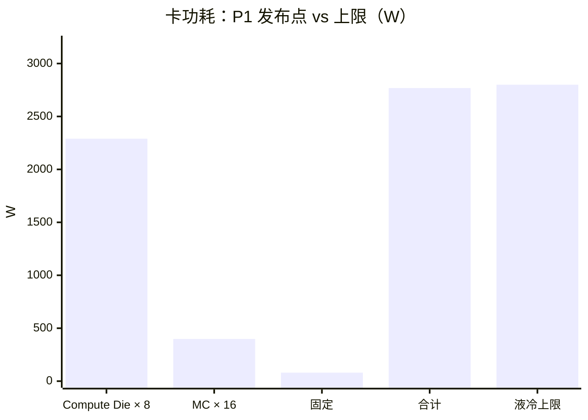
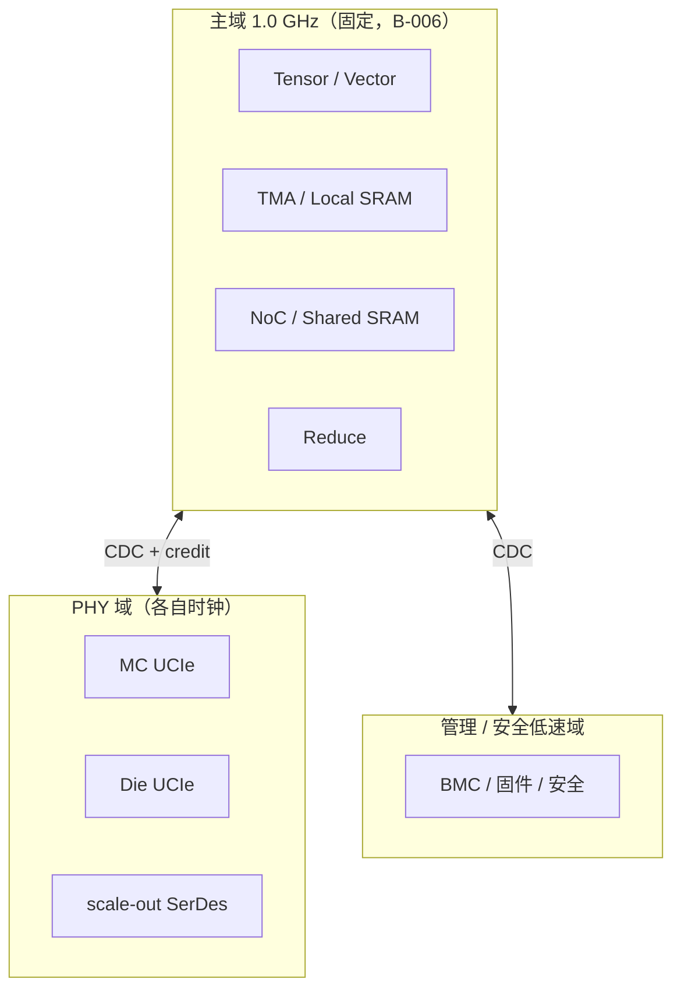
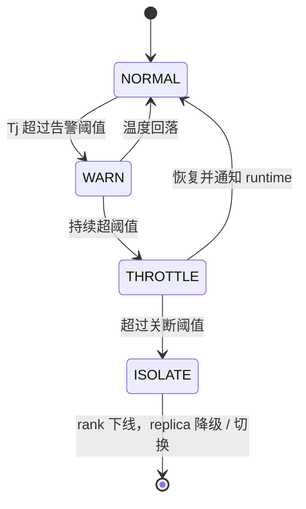
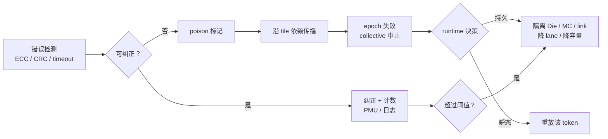

# 封装、I/O、功耗、时钟、散热与 RAS

- 所有者：Hardware（封装/电源/RAS）；共签：Council（系统预算）
- 状态：发布点数字 `MODEL`；散热 `ASSUMPTION`（O-015）
- 数字口径：唯一硬件规格 P1（ADR-0021），权威值在 `teams/hardware/inputs/k3_mc_baseline.json#tpsDesign.hardware`（[`21_TPS_DESIGN_BASELINE.md`](../../../docs/architecture/21_TPS_DESIGN_BASELINE.md) 第 3.1、3.5 节）；
  封装约束在同一文件的 `package` 块（ADR-0018）。

## 0. 规格汇总

| 项 | 当前值 |
| --- | ---: |
| Compute Die | 8 × 373.71 mm²（SF4），上限 400 |
| MC | 16 × 100 mm²（规划值） |
| 裸片面积 | 4589.71 mm² |
| Placement window | 5248 mm² |
| Die 功耗 | 286.22 W，上限 300 W（液冷） |
| 卡功耗 | 2768.47 W，上限 2800 W |
| 频率 | 1.0 GHz（固定） |
| PHY shoreline | 24.21 mm / 预算 52.95 mm |

## 1. 封装

7-reticle 理论面积按 26×33 mm/reticle 计 6006 mm²，工程 placement window 约 82×64 mm、按 5248 mm² 管理。
一个 package 对软件表现为一个 TP rank，32 个 package 组成 TP32。

```text
            ← 约 82 mm →
  +------------------------------------------------+
  | MC MC   MC MC   MC MC   MC MC                  |   ↑
  | [Die0]  [Die1]  [Die2]  [Die3]    scale-out    |   |
  |   ↕ UCIe 环 ↔     ↔       ↔       PHY 边缘      |  约 64 mm
  | [Die7]  [Die6]  [Die5]  [Die4]    host / mgmt  |   |
  | MC MC   MC MC   MC MC   MC MC                  |   ↓
  +------------------------------------------------+
   4×2 Compute Die；每 Die 本地 2 颗 MC；Die 之间为双向环（B-004 未闭合）
```


```mermaid
pie title "placement window 5248 mm² 的占用（发布点）"
  "Compute Die 8 × 373.71" : 2989.71
  "MC 16 × 100" : 1600
  "余量（RDL、间距、keep-out、PDN、维修）" : 658.29
```

## 2. I/O 岸线与端口表

模型中每 Die 有 4 个 UCIe controller group（2 个接本地 MC，2 个接环上相邻 Die），每组 128 lane × 64 Gbps，
另有 16 条 112 Gbps RDMA lane。

| 端口类 | 对端 | 端口数 / Die | payload（P1 模型） | PHY/协议 | 状态 |
| --- | --- | ---: | ---: | --- | --- |
| MC local | 2 MC | 2 | 每 MC 640 × 0.7 = 448 GB/s；端口 819.20 GB/s 不截断 | UCIe 类 | `BLOCKER`（B-002） |
| Die fabric | 环上相邻 Die | 2 | 819.20 GB/s/端口；环切面 1638.40 GB/s | UCIe / 自定义短距 | `BLOCKER`（B-004） |
| Scale-out | 其他卡 / 交换 | 16 lane | 168 GB/s/Die；800 GB/s/卡（上限） | 电/光 SerDes | `BLOCKER`（B-005） |
| Host | CPU / root complex | 待定 | 非 Decode 关键路径 | PCIe/CXL | `OPEN` |
| Management | BMC / JTAG / I3C | 若干 | 低速 | 标准接口 | `OPEN` |


```mermaid
flowchart LR
  subgraph DIE["Compute Die（4 条边）"]
    C["Core / NoC"]
  end
  MC0["MC 0"] <-->|"UCIe 128 lane<br/>819.2 GB/s"| C
  MC1["MC 1"] <-->|"UCIe 128 lane<br/>819.2 GB/s"| C
  C <-->|"UCIe 128 lane"| DL["左邻 Die"]
  C <-->|"UCIe 128 lane"| DR["右邻 Die"]
  C <-->|"RDMA 16 × 112 Gbps<br/>168 GB/s"| NET["scale-out"]
```

shoreline 24.21 mm 远低于 52.95 mm 预算；UCIe 仍是抽象参数，不能直接进入 bump map。

## 3. 封装/功耗设计空间与搜索（HW-09 决策）

- 所有者：Hardware（封装/电源/RAS）；共签：Council（系统预算）
- 状态：`MODEL`（设计空间搜索：面积守恒 + 单元限值 + K3 详细回放；不是 `FROZEN`，不改发布点）
- 设计空间（全部备选及其 ASSUMPTION）：`teams/hardware/inputs/physical_design_space.json`——**`UNVERIFIED`，由 agent 依仓库文档起草，待域 owner 复核**
- 搜索：`integration/detailed/physical_search.js`；`npm run physical:search` 只把最终方案写到
  `out/detailed/physical_design.json`，整个打分的候选集写到 `out/detailed/physical_candidates.json`
  （带 `candidateSetSha256`）。本节数字由 `tests/regression/test_physical_design.js` 对照新鲜搜索结果检查。

**面积守恒**：`已占用 + keep-out = 5248 mm²`，误差 0（设计空间的 `areaConservationTolerance`）。
`keep-out` 是**被留出的**比例（发布点 0.1254 = 658.29 / 5248），不是可用比例。
发布点代进去：`4589.712 + 658.099 = 5248`，差 0.189 mm²——发布点正好贴在窗口边上。

**口径**：Die 面积含 `A.physical()` 不带、`O.chargeSharedPortCost()` 才计的那笔共享端口放大
（357.565 + 16.149 = 373.714 mm²）；Die 功耗同理（280.530 + 5.689 = 286.219 W）。
`edgeBudget` 按端口放大**之前**的面积算（`4 × √357.565 × 0.7 = 52.946 mm`），与发布点一致。
端口面积随工艺 logic 系数缩放，端口功耗不随工艺缩放——按模型 `chargeSharedPortCost()` 的口径。

**约束**：Die 面积 ≤ 400 mm²、Die 功耗 ≤ 300 W、卡功耗 ≤ 2800 W（按所选散热口径）、
封装面积 + 预留 ≤ 5248 mm²、PHY shoreline ≤ Die 边缘预算、K3 回放在发布点 TPS/usr 不低于 99.9%。

**目标**：可行优先，然后 keep-out 前提最保守（keep-out 越小越是未经证实的乐观断言），
然后同一前提下预留最大，然后 Die 功耗余量最大，然后工艺风险最低。
搜索共 24 个组合、2 个可行。

### 3.1 最终方案

| 维度 | 选项 | 参数 |
| --- | --- | --- |
| `process` | `SF4` | logic 系数 1.277、SRAM 1.248、PHY 1（B-006，ASSUMPTION） |
| `matrixTFPerMm2` | `3.2` | 1 GHz 下每 mm² 3.2 TF（0.000625 mm²/BF16 MAC） |
| `cooling` | `liquid` | 冷板，Die 300 W / 卡 2800 W（ADR-0005） |
| `reserveFraction` | `0.1254` | keep-out 658.29 / 5248，**观测值，不是选定值** |

- Die 373.714 mm² / 286.219 W，卡 2768.473 W，裸片 4589.712 mm²，shoreline 24.213 / 52.946 mm。
  这些逐项等于 `tpsDesign.hardware` 的发布值（见 `out/detailed/physical_design.json#evaluation`）。
- 发布点在面积上只剩 **0.189 mm²** 余量；Die 功耗余量 **13.781 W**，卡功耗余量 **31.527 W**。
- 本方案就是发布点本身：搜索没有找到比它更好的可行解——但它不是"搜索确认了发布点"，
  而是"在给定的设计空间里，其它组合要么违反限值，要么靠更乐观的未证实前提取胜"。

### 3.2 工艺敏感度（其余维度固定在最终方案）

| 工艺 | Die 面积 mm² | 裸片面积 mm² | 预留 mm² | 卡功耗 W | 结果 |
| --- | ---: | ---: | ---: | ---: | --- |
| `SF4` | 373.714 | 4589.712 | 0.189 | 2768.473 | **选中** |
| `N4-ref` | 300.467 | 4003.738 | 586.163 | 2768.473 | `optionHeldOut:process=N4-ref` |

N4 参考基线下 Die 小 73.25 mm²，预留多 586 mm²，卡功耗不变（功耗系数不随工艺缩放）。
它是**被排除的敏感度**，不是候选：节点决定（ADR-0005/ADR-0021）已经关闭，把它放进来会让
"更小的面积"看起来像搜索的结论。

### 3.3 散热敏感度：液冷这个决定买到了什么

| 散热 | Die 功耗 / 上限 W | 卡功耗 / 上限 W | Die 余量 W | 结果 |
| --- | ---: | ---: | ---: | --- |
| `liquid` | 286.219 / 300 | 2768.473 / 2800 | 13.781 | **选中** |
| `air` | 286.219 / **260** | 2768.473 / **2400** | −26.219 | `diePower, cardPower, optionHeldOut:cooling=air` |

发布点在风冷下 Die 超限 26.22 W、卡超限 368.47 W。这就是 ADR-0005 那个决定买到的东西：
**不是"液冷更好"，而是"风冷下这个发布点不成立"**。
风冷同样是**被排除的敏感度**（ADR-0005 已取代），不是候选。

### 3.4 矩阵密度敏感度（其余维度固定在最终方案）

| 密度 TF/mm² | 矩阵面积 mm² | Die 面积 mm² | 预留 mm² | 结果 |
| ---: | ---: | ---: | ---: | --- |
| `1.6` | 222.354 | 484.891 | −889.228 | `packageArea, dieArea` |
| `3.2` | 111.177 | 373.714 | 0.189 | **选中** |

回到历史密度 1.6，Die 面积 484.891 mm² 同时超 Die 上限（400）和窗口：这是 B-006 那个 ASSUMPTION
的杠杆量——矩阵面积占 Die 面积约 30%，密度减半就把封装撑爆。

### 3.5 keep-out 扫描（其余维度固定在最终方案）

| keep-out | 预留 mm² | 结果 |
| ---: | ---: | --- |
| `0.1254` | 0.189 | **选中**（观测值） |
| `0.1000` | 133.488 | `keep-out premise`（更小的 keep-out 是更强的未证实断言） |
| `0.1500` | −128.912 | `packageArea` |

0.10 那一档**数值上可行**（预留 133.488 mm²），但它的前提是"vendor 能接受 10% 的 keep-out"，
而仓库里没有任何证据支持这一点。排序刻意把"前提更保守"放在"预留更大"之前，
否则搜索会系统性地选出最乐观的假设——用一个未证实的前提换来的预算，不该赢得排名。

### 3.6 各备选的落选原因

每个选项把其余维度钉在最终方案上（`alternatives()` 的 `holdDims`）。

| 维度 | 选项 | 结果 | Die 面积 mm² | 裸片 mm² | 预留 mm² | Die 功耗 W | 卡功耗 W |
| --- | --- | --- | ---: | ---: | ---: | ---: | ---: |
| `process` | `SF4` | **选中** | 373.714 | 4589.712 | 0.189 | 286.219 | 2768.473 |
| `process` | `N4-ref` | `infeasible: optionHeldOut:process=N4-ref` | 300.467 | 4003.738 | 586.163 | 286.219 | 2768.473 |
| `matrixTFPerMm2` | `1.6` | `infeasible: packageArea, dieArea` | 484.891 | 5479.129 | −889.228 | 286.219 | 2768.473 |
| `matrixTFPerMm2` | `3.2` | **选中** | 373.714 | 4589.712 | 0.189 | 286.219 | 2768.473 |
| `cooling` | `liquid` | **选中** | 373.714 | 4589.712 | 0.189 | 286.219 | 2768.473 |
| `cooling` | `air` | `infeasible: diePower, cardPower, optionHeldOut:cooling=air` | 373.714 | 4589.712 | 0.189 | 286.219 | 2768.473 |
| `reserveFraction` | `0.1254` | **选中** | 373.714 | 4589.712 | 0.189 | 286.219 | 2768.473 |
| `reserveFraction` | `0.10` | keep-out premise (a smaller keep-out is a stronger unverified claim) | 373.714 | 4589.712 | 133.488 | 286.219 | 2768.473 |
| `reserveFraction` | `0.15` | `infeasible: packageArea` | 373.714 | 4589.712 | −128.912 | 286.219 | 2768.473 |

### 3.7 不搜索、已裁定的维度

理由在 `physical_design_space.json#ruled`：Die 数（8 Die + 16 cube，ADR-0018）、
频率（固定 1.0 GHz，卡功耗已用 98.9%，且仓库没有 V/f 曲线可扫）、
近存计算（`architectureRoute` 挡在基线外）、
**散热**（carried as ASSUMPTION O-015：仓库没有 theta-JA、冷板曲线或环境温度模型，
用推导出的 Tj 去给 Die 功耗打分等于发明模型）、
**故障降容**（仓库没有逐故障的性能模型，故意排除，以免显得"已经算过"）。

## 4. 功耗

### 4.1 Die 功耗构成（P1 发布点，286.22 W）


```mermaid
pie title "每 Die 功耗 286.22 W（P1 发布点）"
  "矩阵" : 133.69
  "Reduce" : 32.77
  "UCIe" : 31.46
  "SRAM" : 28.48
  "控制 / 杂项" : 23.60
  "NoC" : 11.98
  "向量" : 7.99
  "RDMA" : 6.72
  "Shared 端口放大" : 5.69
  "TMA" : 3.84
```

读法：

- 矩阵占 47%；Reduce 引擎 4096 lane 占 11%，与它 2.66 TOPS 的用途相比偏大，是下一轮优先复核的对象；
- Shared 端口放大 5.69 W 只换来 0.06 TPS（21 号文档第 3.3 节）。

### 4.2 卡功耗（P1 发布点）

```text
card = 8 × die 286.22 + MC 398.72 + 固定 80 = 2768.47 W   （上限 2800 W，余量 31.53 W）
MC   = 16 × (7 W + 640 GB/s × 0.7 × 8 bit × 5 pJ/bit)      = 398.72 W
```


```mermaid
xychart-beta
  title "卡功耗：P1 发布点 vs 上限（W）"
  x-axis ["Compute Die × 8", "MC × 16", "固定", "合计", "液冷上限"]
  y-axis "W" 0 --> 3200
  bar [2289.76, 398.72, 80, 2768.47, 2800]
```

余量 31.53 W，而以下项目尚未可靠计入：

- 高速 SerDes / 光模块真实功耗；
- ECC、DFT、clock tree；
- VRM 损耗；
- BMC、主机接口；
- SRAM compiler 差异；
- PVT guardband；
- 老化和漏电。

因此 640 GB/s Stretch 配置在功耗上也不能冻结。MC 降到 320 GB/s 时 MC 功耗按同一公式为 255.36 W，省约 143 W，但 TPS 降到 586.46。

## 5. 时钟与电源域


```mermaid
flowchart TB
  subgraph MAIN["主域 1.0 GHz（固定，B-006）"]
    T["Tensor / Vector"]
    TM["TMA / Local SRAM"]
    N["NoC / Shared SRAM"]
    R["Reduce"]
  end
  subgraph PHY["PHY 域（各自时钟）"]
    U1["MC UCIe"]
    U2["Die UCIe"]
    SO["scale-out SerDes"]
  end
  subgraph MGMT["管理 / 安全低速域"]
    B["BMC / 固件 / 安全"]
  end
  MAIN <-->|"CDC + credit"| PHY
  MAIN <-->|"CDC"| MGMT
```

- 主域频率固定 1.0 GHz，不用 DVFS 换算力（21 号文档第 1.1 节）；DVFS 只用于热保护和故障降级；
- Core cluster clock gating、SRAM bank gating、PHY lane power gating；
- reduce/collective 独立功率计数器；
- 跨域接口必须定义 CDC、reset sequencing、credit 恢复和错误注入行为。

## 6. 散热

2.8 kW 级卡按液冷（冷板）规划（`ASSUMPTION`，O-015）。验证包括：

- Compute Die 和 MC 共面/热阻；
- 8 Die 热不均匀；
- MC 堆叠热点；
- scale-out PHY 边缘热点；
- VRM 和连接器；
- 冷板流量、压差、入口温度；
- 单泵/单回路故障；
- 热降频对 TP32 最慢 rank 的影响（TP32 以最慢 rank 为 step 完成条件）。


```mermaid
stateDiagram-v2
  [*] --> NORMAL
  NORMAL --> WARN: Tj 超过告警阈值
  WARN --> NORMAL: 温度回落
  WARN --> THROTTLE: 持续超阈值
  THROTTLE --> NORMAL: 恢复并通知 runtime
  THROTTLE --> ISOLATE: 超过关断阈值
  ISOLATE --> [*]: rank 下线，replica 降级 / 切换
```

单 Die 降频会拖慢整个 TP32 replica，所以 THROTTLE 必须上报 runtime，由 runtime 决定继续运行还是迁移。

## 7. RAS

- SRAM SECDED、scrub、spare；
- NoC/router parity/ECC；
- MC/UCIe CRC、retry、lane repair；
- RDMA sequence/replay/poison；
- watchdog 和 collective timeout；
- 每 Die/MC/link 独立隔离；
- page remap；
- 降频、降 lane、降容量运行；
- secure boot、firmware authentication、debug lock；
- 错误日志可关联 tile/epoch/rank。


```mermaid
flowchart LR
  E["错误检测<br/>ECC / CRC / timeout"] --> C{"可纠正？"}
  C -->|"是"| FIX["纠正 + 计数<br/>PMU / 日志"]
  C -->|"否"| P["poison 标记"]
  P --> PROP["沿 tile 依赖传播"]
  PROP --> EP["epoch 失败<br/>collective 中止"]
  EP --> RT{"runtime 决策"}
  RT -->|"瞬态"| RETRY["重放该 token"]
  RT -->|"持久"| ISO["隔离 Die / MC / link<br/>降 lane / 降容量"]
  FIX --> TH{"超过阈值？"}
  TH -->|"是"| ISO
```

## 8. 冻结交付物

- 新版封装 floorplan；
- PHY beachfront 和 bump map；
- interposer/RDL/PCB 拓扑；
- PDN/IR-drop/SSN；
- clock/reset/power-domain；
- 热仿真与冷板需求；
- RAS 故障矩阵；
- 卡级功耗清单和降额策略；
- 封装厂、PHY/IP、MC 供应商确认。
