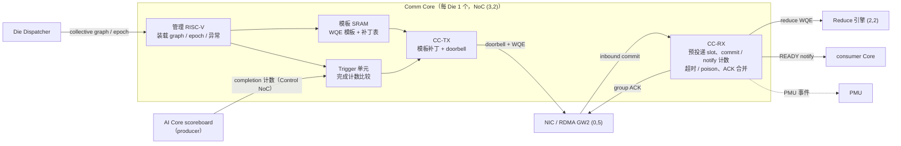

# Comm Core（专用通信核）设计

- 所有者：Hardware HW-07 Comm-Core；共签：Software SW-05（集合通信调度）、SW-01（runtime）
- 状态：结构与语义 `PROPOSED`（ADR-0022），控制路径 cycle 数 `ASSUMPTION`（O-018）；**不改发布点**
- 语义：对外提供内存语义（按地址 put/get/atomic，第 6 节），不提供 send/recv 消息语义
- 数字口径：当前 P1 发布点（1101.77 TPS/usr，raw 775.75 µs，393 次集合通信/token，τ = 1.15 µs 下限），
  控制路径预算来自 `out/detailed/comm_core_budget.json`（`npm run commcore:budget`，
  由 `tests/regression/test_comm_core_budget.js` 与本文绑定）

## 1. 目标与边界

每 token 393 次集合通信占 raw 的 53%（451.95 µs），每次都是 7–14 KB 的小消息，时间由固定时延决定。
现有设计里没有任何单元负责"谁触发一次集合通信、谁写 RDMA 描述符（WQE）、谁数入站 commit"：

- [07](07_COLLECTIVE_RDMA.md) 只定义 NIC、mailbox 和 Reduce，slot 由"软件/调度器按 epoch 预留"；
- [08](08_ON_DIE_SCHEDULER_AND_PMU.md) 的 Die Dispatcher "分配 collective mailbox"，但不下发 WQE；
- [02](02_AI_CORE.md) 让 Vector 把 partial 推给 Collective endpoint；
- 模型只收每个 peer 4 cycle 的 NIC 发射（`R.MEM.issueCycles`），COMM 算子不收 launch，Control NoC 未建模。

Comm Core 把这条控制路径收进一个专用单元，目标是：

1. 集合通信的触发、WQE 下发、接收计数和完成通知**全部在硬件里**，每次 ≤ 数十 cycle；
2. AI Core 不为通信花计算时间：producer 只写 Shared SRAM 并置完成计数；
3. 固件（RISC-V）只做装载、epoch 推进和异常处理，**不在每次集合通信的关键路径上**；
4. 为 τ 的自底向上推导（B-008）提供控制路径一项。

不在本文范围：wire/NIC 协议（07）、NoC 物理（05）、归约数值（07 第 2 节）、软件的 collective 排布（SW-05）。

## 2. Meta 参考

| 设计 | 结构 | 可借鉴之处 | 来源 |
| --- | --- | --- | --- |
| MTIA 2i PE | 每 PE 2 个 RISC-V（标量 + 向量）、Command Processor（依赖检查、调度固定功能单元）、Fabric Interface（DMA） | 控制核与数据引擎分离；circular buffer 带硬件读写指针，生产者/消费者靠指针同步 | [arXiv 2608.00325](https://arxiv.org/abs/2608.00325) |
| MTIA 300 Message Engine | 16 个 Message Engine：CPU-M（RISC-V）从 HBM 取预编译的 collective graph，展开成 WQE、评估依赖、直写 NIC Express Doorbell；NMC 近存 copy/sum（2.8 TB/s） | 预编译 collective graph；WQE 里带 wait-on-value / set-value；device-triggered collective（内存地址满足比较条件即启动，完成后写完成地址）；预投递 receive | HCCL，[arXiv 2608.00358](https://arxiv.org/abs/2608.00358)（ISCA 2026） |
| MTIA 300 实测开销 | CPU-C 派发一次 collective 2.9 µs；CPU-M 归约 4 KB 约 1.1 µs；PE 直写 doorbell 约 450 ns；推理集合通信在 PE 上 < 6 µs | 固件路径是 µs 级，训练尺度可以接受，B=1 decode 不行 | 同上 |
| Tenstorrent Tensix | 每 tile 5 个 RV32，其中 2 个专做数据搬运 | 数据搬运核与计算核分离 | 公开资料，未逐项核实 |

未核实：MTIA 2i 的 ISCA 2025 论文细节、MTIA 300 以太网 PHY 参数。以上 Meta 数字属于另一颗芯片，只作数量级参考，
不进本项目的模型常数。

直接照搬 MTIA 300 的固件路径不可行：本项目 decode 每次集合通信只有 0.17 µs 的 spec τ 余量（第 7 节），
MTIA 的固件派发比它大一个数量级。因此本设计取 MTIA 的**语义**（预编译 graph、device-triggered、wait-on-value、
预投递 receive、近存归约），但把每次集合通信的执行放进硬件。

## 3. 结构

每 Die 一个 Comm Core，放在 NoC spare 位 (3,2)：紧邻 Reduce 引擎 (2,2)，到 RDMA gateway GW2 (0,5) 6 跳
（[05](05_ON_DIE_NOC.md) 第 2 节）。

| 单元 | 职责 | MTIA 对应 |
| --- | --- | --- |
| 管理 RISC-V | 装载每个 token 程序的 collective graph 与 WQE 模板；epoch/generation 推进；timeout / poison / retry；PMU 汇总 | CPU-M 的控制部分 |
| 模板 SRAM | 每类 collective 的 WQE 模板（peer、stripe、slot 基址、reduce opcode、dtype、长度）与每次集合通信的补丁表项 | HBM 中的预编译 collective graph |
| Trigger 单元 | 监视 producer 完成计数，达到阈值即启动对应模板；不经固件、不经 AI Core | device-triggered collective / wait-on-value |
| CC-TX | 读模板、打补丁（epoch、generation、地址偏移）、按 NIC 发射速率写 WQE 并敲 doorbell | CPU-M 写 Express Doorbell |
| CC-RX | 预投递下一 epoch 的 receive slot；按 slot 数 commit；PARTIAL_READY/READY 通知；group ACK；超时冻结 slot | 预投递 receive + completion counter |
| 地址翻译表（CC-TX / CC-RX 共用） | 全局地址 → (卡, Die, region, offset)；protection key、generation 检查（第 6.2 节） | 未公开；类比 NVSHMEM 对称堆（知识，非证据） |
| 原子单元（CC-RX 内） | 远端 ATOMIC_ADD / FETCH_ADD / CAS，PUT_SIGNAL 的信号就是一次原子加 | wait-on-value / set-value 的对端 |
| Reduce 引擎（沿用 07） | 由 CC-RX 下发 reduce WQE，近 SRAM 归约 | NMC |

TX 和 RX 是两组独立的硬件状态机（接收不能排在发送后面），但只需要一个管理 RISC-V：它不在每次集合通信的路径上，
第 7.3 节的负载也只有 3.0%。

## 4. WQE 模板与触发语义

编译期（SW-05 / 编译器）把一个 token 程序的全部集合通信展开成 graph：每类集合通信一个模板，
每次集合通信一个补丁表项。运行期只打补丁，不生成 WQE。

| 字段 | 位置 | 说明 |
| --- | --- | --- |
| opcode | 模板 | PUT / PUT_SIGNAL / GET / ATOMIC_ADD / FETCH_ADD / CAS / WAIT_VALUE / SET_VALUE（第 6.1 节） |
| peer / QP | 模板 | TP32 下每 NIC 每 phase 31 个 peer |
| stripe、长度、dtype | 模板 | 与 07 第 3 节的 stripe 参数一致 |
| 远端 slot 基址 | 模板 | mailbox 区基址（全局地址）；epoch 偏移在补丁里 |
| 信号地址、信号值 | 模板 | PUT_SIGNAL 的远端 committed 计数地址和原子加值（默认 +1） |
| reduce opcode | 模板 | all-reduce / all-gather / LSE merge / latent merge |
| trigger 计数地址、阈值 | 补丁表项 | producer 完成计数的 id 和目标值（wait-on-value） |
| epoch、generation | 补丁表项 | 每次集合通信递增，与 mailbox generation 相同 |
| 本地 source 偏移 | 补丁表项 | producer 写 Shared SRAM 的位置 |
| 完成动作 | 补丁表项 | 置哪个 consumer 计数（set-value） |

WQE 与 CQE 按模型的 128 B（`R.MEM.wqeCqeBytes`）计，补丁表项 16 B（ASSUMPTION）。

触发语义：

1. producer Core 的 scoreboard 每完成一个输出 tile，经 Control NoC 给 Comm Core 的计数器 +1；
2. Trigger 单元比较计数与补丁表项的阈值，相等时把该集合通信放进 CC-TX 队列；
3. CC-TX 每 2 cycle 补丁一个 WQE，NIC 每 4 cycle 发射一个，补丁跟得上发射，只有第一个补丁暴露在路径上；
4. 最后一个 WQE 发出后，CC-TX 不等待完成，直接处理下一个触发；完成由 CC-RX 在接收端判定。

依赖由计数表达，不由固件轮询；同一 token 程序内集合通信的顺序由补丁表项顺序和计数阈值共同保证。

## 5. 接收路径与 mailbox 状态机

CC-RX 接管 07 第 4 节状态机里原来写成"软件/调度器"的转换：

| 07 状态转换 | 原描述 | 由谁完成 |
| --- | --- | --- |
| FREE → RESERVED | 软件/调度器按 epoch 预留 | CC-RX 在上一 epoch RELEASED 时预投递下一 epoch 的 slot（管理 RISC-V 只在 graph 装载时设定 slot 布局） |
| RECEIVING → PARTIAL_READY / READY | committed 计数达到 watermark / 全部 source | CC-RX 硬件计数 |
| READY → CONSUMING | consumer / Reduce 开始 | CC-RX 给 Reduce 引擎下 reduce WQE，或给 consumer Core 置计数 |
| ACK_WAIT → RELEASED | group ACK 发出 | CC-RX 按 16 批量合并 ACK |
| RECEIVING → FROZEN → FREE | timeout / poison，软件重试或终止 | CC-RX 冻结 slot 并中断管理 RISC-V；重试决策仍在固件/runtime |

入站 commit 必须由硬件计数：若由固件逐条处理，每个 slot 的 31 条 commit 每条只分到 4.2 cycle（spec τ 内）
或 20.3 cycle（raw 预算内），固件做不到。

## 6. 内存语义

Comm Core 对外是**内存语义**：发送方按全局地址直接写（或读、原子更新）远端内存，接收方不为每条消息投递 buffer、
不做队列匹配，只在 epoch 粒度预留 slot 区（第 5 节）。send/recv 这类消息语义不提供。

### 6.1 操作集

| 操作 | 语义 | 发起方 | 用途 | 是否在 decode 关键路径上 |
| --- | --- | --- | --- | --- |
| PUT | 单边写远端地址 | Comm Core（WQE） | 集合通信数据 | 是 |
| PUT_SIGNAL | PUT，数据在远端可见后对信号地址原子加 | Comm Core | 集合通信的 commit（默认方式，第 6.4 节） | 是 |
| ATOMIC_ADD / FETCH_ADD / CAS | 远端 8 B 原子，在目标 Die 的 CC-RX 执行 | Comm Core；AI Core（posted） | 计数、屏障、队列指针 | ATOMIC_ADD 是（即 commit），其余否 |
| WAIT_VALUE | 本地地址达到阈值后才发后续 WQE | Trigger 单元 | 依赖（第 4 节） | 是 |
| SET_VALUE | 写本地或远端地址 | Comm Core | 完成通知 | 是 |
| GET | 单边读远端地址到本地 Shared SRAM | Comm Core | CP 的远端 KV、远端权重预取、调试 | 否：比 PUT 多一次往返，集合通信一律推送 |
| ST / ATOMIC（AI Core 直发） | Core 对全局地址的 posted store / 原子，不等返回；Comm Core 翻译地址并合并成整包 | AI Core | runtime 控制数据、少量跨卡标志 | 否 |
| LD（AI Core 远端 load） | 阻塞读，Core 等待返回 | AI Core | 只用于调试与控制面 | 禁止：一次至少 0.124 µs，Core 停顿 |

Shared SRAM 上的归约型原子沿用 NoC 的 atomic-reduce（[05](05_ON_DIE_NOC.md) 第 6 节），MC 上的 atomic 沿用
[04](04_MEMORY_SUBSYSTEM_MC.md) 第 6 节；Comm Core 的原子单元只负责跨卡的计数器类原子。

AI Core 远端 load 的下限 = 2 × one-way（`OPT.oneWayUs`）+ 往返两段 Die 内网格，按第 7 节的跳数口径至少 0.124 µs，
还没算对端 SRAM 排队。B=1 decode 下这段时间 Core 只能空等，所以远端数据一律由对端 PUT 过来，或由 Comm Core GET 预取。

### 6.2 全局地址与保护

- 全局地址 =（卡 rank，Die，region，offset）。region 包括 Shared SRAM slot 区、计数器区、MC 窗口；各段位宽 `OPEN`。
- 各卡的 slot 区与计数器区按对称布局分配（同一偏移在每张卡上含义相同），模板只存偏移，不存每卡的物理地址。
- 地址翻译表在 graph 装载时由管理 RISC-V 写入，以 region 为粒度，带 protection key 和 generation。
- 越界、key 不符、generation 不符的包一律丢弃并上报，沿用 [07](07_COLLECTIVE_RDMA.md) 第 4 节的 ABA 规则。

### 6.3 内存序

1. **PUT_SIGNAL 的信号是 release。** 远端计数 +1 时，该 WQE 的全部数据已在远端 Shared SRAM 可见。
   - 消息分多个包时，CC-RX 按 WQE 统计已到达字节，收齐后才执行原子加，因此不依赖网络保序。
2. **WAIT_VALUE 是 acquire。** 计数达标之后发起的读取，能看到信号之前的全部数据。
3. **普通 PUT 之间不保证到达顺序**（允许多路径）。
   - 需要跨 WQE 的顺序时，用 PUT_SIGNAL，或用 FENCE（等本 QP 此前的写全部被确认）。
4. **原子操作**：对同一地址按到达顺序串行执行，对不同地址之间不保证顺序。
5. **AI Core 的 posted store**：Core 端的 FENCE 等 Comm Core 回报该 Core 此前的 store 全部被远端确认，
   语义与 scoreboard 的完成事件一致（[02](02_AI_CORE.md) 第 3 节）。
6. **generation 检查**：每次远端访问都带 generation，不符即丢弃；epoch 回绕要求与 O-010 相同。

### 6.4 信号方式对比

集合通信的 commit 有三种做法。下表对每种方式都加上 Comm Core 控制路径（0.042 µs），去掉 τ 下限回放详细模型：

| 方式 | 最慢一类协议时间 | 加控制路径 | spec τ 余量 | raw 预算内控制上限 | 自底向上通信 | wire bytes / token | WQE / token |
| --- | ---: | ---: | ---: | ---: | ---: | ---: | ---: |
| PUT_SIGNAL（信号在数据包尾部，收齐后原子加） | 0.978 µs | 1.020 µs | 0.130 µs | 0.670 µs | 285.46 µs | 17683392 | 10901 |
| 同一 QP 上单独发信号 WQE | 1.006 µs | 1.048 µs | 0.102 µs | 0.493 µs | 355.09 µs | 20532416 | 21802 |
| 写被确认后再发信号 | 1.082 µs | 1.124 µs | 0.026 µs | 0.493 µs | 355.14 µs | 17683392 | 10901 |

- 三种方式在发布点的 TPS 相同（自底向上 1104.78，保留 1.15 µs 下限 1101.77）：通信多出的约 70 µs
  都被内存链路掩盖了。
- 差别在余量上：
  - 单独发信号 WQE 让 NIC 和 Comm Core 的 WQE 数翻倍，wire bytes 多 16%；
  - 写被确认后再发信号，每条消息多一次往返，最慢一类只剩 0.026 µs 的 spec τ 余量。
  - 后两种方式的控制上限都降到 0.493 µs。
- 选择 PUT_SIGNAL。它就是协议模型发布时的假设：16 B flag 随数据包计入（`flagBytes`），commit 按 cycle 计费。

## 7. 控制路径预算

方法：每次集合通信的时延 = 控制路径（触发 + WQE 下发 + doorbell + 完成通知）+ 协议模型时间。
协议模型（`R.collective`）从第一个 WQE 到达 NIC 开始计时；控制路径以前没人收。分析把 `tauUs` 设为 0，
给每次集合通信加上控制路径，再回放详细模型，得到自底向上的时延和 TPS。控制报文按 Reduce 路由的算法收
meshSide（6）× 2 cycle = 12 cycle 一跳路径（1 GHz），比 (3,2) 到 GW2 的实际 6 跳偏保守。

### 7.1 五类集合通信的协议时间（τ 前）

| 集合通信 | 次数 / token | 协议时间 | WQE / 次 | active NIC |
| --- | ---: | ---: | ---: | ---: |
| LSE merge / output reduce-scatter | 24 | 0.98 µs | 93 | 3 |
| Attention output all-reduce | 93 | 0.77 µs | 21 | 1 |
| Wdown + Router all-gather | 92 | 0.43 µs | 31 | 1 |
| Routed latent merge | 92 | 0.69 µs | 21 | 1 |
| Wup + Shared output all-reduce | 92 | 0.77 µs | 21 | 1 |

最慢的是 LSE merge（0.98 µs），它决定 spec τ 下的控制路径余量：1.15 − 0.98 = 0.172 µs（172 cycle）。

### 7.2 三种控制方案

| 方案 | 触发 | 下发 | doorbell | 完成通知 | 控制路径 | 最慢一类时延 | 自底向上 TPS | 保留 1.15 µs 下限的 TPS |
| --- | ---: | ---: | ---: | ---: | ---: | ---: | ---: | ---: |
| Comm Core（硬件触发 + 模板） | 0.014 µs | 0.002 µs | 0.014 µs | 0.012 µs | **0.042 µs**（42 cycle） | 1.02 µs | 1104.78 | 1101.77 |
| AI Core 直写 doorbell（MTIA PE 路径量级） | 0 | 0.45 µs | 0.012 µs | 0.012 µs | 0.474 µs | 1.45 µs | 1098.42 | 1068.36 |
| 固件逐次派发（MTIA CPU-C 量级） | 0.012 µs | 2.9 µs | 0.012 µs | 0.012 µs | 2.936 µs | 3.91 µs | 459.54 | 459.54 |

- raw 预算（854.70 µs）内，每次集合通信的控制路径最多 **0.670 µs**（670 cycle）；
  三种方案的余量分别为 0.628、0.196、−2.266 µs。
- 固件派发不达标（459.54 TPS）。
- AI Core 直写 doorbell 勉强达标，但 LSE merge 超过 spec τ，且 producer Core 每 token 要花 176.85 µs 发 WQE，
  这些时间本应用于计算。
- Comm Core 只用控制预算的 6%，最慢一类仍在 spec τ 以内。

### 7.3 τ 扫描与负载

| τ | TPS/usr | raw |
| ---: | ---: | ---: |
| 1.0 µs | 1101.79 | 775.74 µs |
| 1.15 µs | 1101.77 | 775.75 µs |
| 1.35 µs | 1002.19 | 852.83 µs |
| 1.5 µs | 843.48 | 1013.30 µs |
| 2.0 µs | 703.80 | 1214.40 µs |
| 3.0 µs | 531.73 | 1607.40 µs |

τ 低于 1.15 µs 时 TPS 几乎不变：发布点被内存链路约束，集合通信缩短只是多出重叠空间。
τ 超过约 1.35 µs 后 TPS 快速下降。因此 Comm Core 的作用是**保证每次集合通信不越过盈亏点**，而不是把它压到更短。

Comm Core 负载（保守地假设一个 Die 处理全部集合通信）：每 token 10901 个 WQE，busy 23.37 µs，占 raw 的 3.0%；
一个 token 程序的模板与补丁表 29.5 KiB，SRAM 面积约 0.029 mm²。建议模板 SRAM 取 64 KiB，
留出换模型时装载下一份 graph 的双缓冲（ASSUMPTION）。

## 8. 接口

| 接口 | 对端 | 方向 | 语义 | 状态 |
| --- | --- | --- | --- | --- |
| 完成计数 | AI Core scoreboard（[02](02_AI_CORE.md) 第 3 节） | 入 | tile 完成事件 → 计数 +1；poison 传播 | `PROPOSED` |
| graph / epoch | Die Dispatcher（[08](08_ON_DIE_SCHEDULER_AND_PMU.md) 第 1.1 节） | 入 | 装载 collective graph 和模板；token 边界推进 epoch | `PROPOSED` |
| doorbell / WQE | NIC（[07](07_COLLECTIVE_RDMA.md)） | 出 | 直写 doorbell；WQE 带 generation | `PROPOSED` |
| inbound commit / ACK | NIC | 双向 | commit 计数、group ACK、timeout | `PROPOSED` |
| reduce WQE | Reduce 引擎 (2,2) | 出 | 归约 opcode、slot 地址、目标计数 | `PROPOSED` |
| posted store / atomic / FENCE | AI Core | 入 | 全局地址的 ST / ATOMIC，FENCE 完成回报（第 6.1、6.3 节）；不提供远端 LD | `PROPOSED` |
| Control NoC | [05](05_ON_DIE_NOC.md) 第 3 节 | 双向 | 触发与通知走独立 VC，不被数据包阻塞 | `OPEN`（O-004） |
| PMU | [08](08_ON_DIE_SCHEDULER_AND_PMU.md) 第 5 节 | 出 | 触发到 doorbell 时延、WQE 数、commit 计数、ACK 合并、slot 冻结 | `PROPOSED` |

## 9. 风险

- 控制路径 cycle 数（比较 2、补丁 2/WQE、doorbell 2）都是 ASSUMPTION，必须由 RTL 或周期模型回标（O-018）；
  余量对此不敏感：控制路径要涨 16 倍才用完 raw 预算。
- Control NoC 未建模（O-004）：若触发报文与数据包共用 VC，触发时延可能远超 12 cycle。
- 同一时刻只有一个集合通信在飞（模拟器约束）；若软件让多个集合通信重叠，Trigger 单元需要多队列。
- 模板需要编译期知道全部 peer 和 slot 布局；专家路由改变 all-to-all 目标时（非 K3 当前发布点）需要动态补丁。
- 分析保守地在所有方案里保留完整的完成通知跳数；MTIA 的实测开销来自另一颗芯片。
- PUT_SIGNAL 要求 NIC 支持"收齐后原子加"，或者数据与 flag 在同一包内；若选用的 NIC 只能做到"写被确认后再发信号"，
  spec τ 余量只剩 0.026 µs（第 6.4 节）。
- 内存序（第 6.3 节）需要形式验证，重点是 posted store 的 FENCE 与 generation 丢弃之间的交互。

## 10. 冻结交付物

- Comm Core 微架构框图与面积/功耗（本文第 3 节为初版）；
- WQE 模板与补丁表格式（本文第 4 节为初版）；
- 触发/完成计数语义与形式验证属性；
- CC-RX 与 07 mailbox 状态机的接口时序（本文第 5 节为初版）；
- 内存语义规范：操作集、全局地址格式、翻译与保护、内存序（本文第 6 节为初版，与 SW-05 共签）；
- 控制路径周期模型并回标 τ（O-018，B-008）；
- 固件（管理 RISC-V）的 graph 装载、epoch 与异常处理规范（与 SW-01 共签）。
