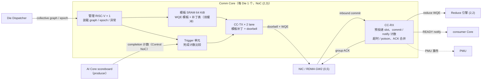

# Comm Core（专用通信核）设计

- 所有者：Hardware HW-07 Comm-Core；共签：Software SW-05（集合通信调度）、SW-01（runtime）
- 状态：结构与语义 `PROPOSED`（ADR-0022），控制路径 cycle 数与面积 `ASSUMPTION`（O-018）；**不改发布点**
- 语义：对外提供内存语义（按地址 put/get/atomic，第 6 节），不提供 send/recv 消息语义
- 数字口径：当前 P1 发布点（1101.77 TPS/usr，raw 775.75 µs，raw 预算 854.70 µs，393 次集合通信/token，τ = 1.15 µs 下限）
- 设计空间与方案产物分开存放：
  - 全部备选方案在 HW-07 的设计空间 `teams/hardware/inputs/comm_core_design_space.json`（设计空间哈希 `159124176e27`）；
  - 搜索脚本是 `integration/detailed/comm_core_search.js`，由 `npm run commcore:search` 运行；
  - `out/detailed/comm_core_design.json` 只存搜索选出的最终方案；
  - 各备选方案为什么落选，只写在本文第 7 节；
  - `tests/regression/test_comm_core_design.js` 把设计空间、产物和本文绑定在一起。

## 1. 目标与边界

每 token 393 次集合通信，共 451.95 µs，占 raw 预算（854.70 µs）的 53%，占发布点 raw（775.75 µs）的 58%。每次都是 7–14 KB 的小消息，时间由固定时延决定。
现有设计里没有任何单元负责以下三件事：谁触发一次集合通信、谁写 RDMA 描述符（WQE）、谁数入站 commit。

- [07](07_COLLECTIVE_RDMA.md) 只定义 NIC、mailbox 和 Reduce，slot 由"软件/调度器按 epoch 预留"；
- [08](08_ON_DIE_SCHEDULER_AND_PMU.md) 的 Die Dispatcher "分配 collective mailbox"，但不下发 WQE；
- [02](02_AI_CORE.md) 让 Vector 把 partial 推给 Collective endpoint；
- 模型只收每个 peer 4 cycle 的 NIC 发射（`R.MEM.issueCycles`），COMM 算子不收 launch，Control NoC 未建模。

Comm Core 把这条控制路径收进一个专用单元，目标是：

1. 集合通信的触发、WQE 下发、接收计数和完成通知**全部在硬件里**，每次 ≤ 数十 cycle；
2. AI Core 不为通信花计算时间：producer 只写 Shared SRAM 并置完成计数；
3. 固件（RISC-V）只做装载、epoch 推进和异常处理，**不在每次集合通信的关键路径上**；
4. 为 τ 的自底向上推导（B-008）提供控制路径一项。

第 1–3 条原本是设计前提。现在它们是第 7 节搜索的结果：违反这几条的方案都在搜索中落选。

以下内容不在本文范围：

- wire/NIC 协议（07）；
- NoC 物理（05）；
- 归约数值（07 第 2 节）；
- 软件的 collective 排布（SW-05）。

## 2. Meta 参考

| 设计 | 结构 | 可借鉴之处 | 来源 |
| --- | --- | --- | --- |
| MTIA 2i PE | 每 PE 有 2 个 RISC-V（标量 + 向量）、Command Processor（依赖检查、调度固定功能单元）、Fabric Interface（DMA） | 控制核与数据引擎分离；circular buffer 带硬件读写指针，生产者和消费者靠指针同步 | [arXiv 2608.00325](https://arxiv.org/abs/2608.00325) |
| MTIA 300 Message Engine | 16 个 Message Engine。CPU-M（RISC-V）从 HBM 取预编译的 collective graph，展开成 WQE、评估依赖、直写 NIC Express Doorbell；NMC 做近存 copy/sum（2.8 TB/s） | 预编译 collective graph；WQE 里带 wait-on-value / set-value；device-triggered collective（内存地址满足比较条件即启动，完成后写完成地址）；预投递 receive | HCCL，[arXiv 2608.00358](https://arxiv.org/abs/2608.00358)（ISCA 2026） |
| MTIA 300 实测开销 | CPU-C 派发一次 collective 2.9 µs；CPU-M 归约 4 KB 约 1.1 µs；PE 直写 doorbell 约 450 ns；推理集合通信在 PE 上 < 6 µs | 固件路径是 µs 级，训练尺度可以接受，B=1 decode 不行 | 同上 |
| Tenstorrent Tensix | 每 tile 5 个 RV32，其中 2 个专做数据搬运 | 数据搬运核与计算核分离 | 公开资料，未逐项核实 |

尚未核实的内容：MTIA 2i 的 ISCA 2025 论文细节、MTIA 300 以太网 PHY 参数。

以上 Meta 数字属于另一颗芯片，只作数量级参考，不进本项目的模型常数。
在设计空间里，它们只作为备选方案的出处（例如 `coreBuild`、`controlProcessor`）。

## 3. 结构（最终方案）

最终方案每 Die 一个 Comm Core，放在 NoC spare 位 (2,3)，位置由第 7 节的 `placement` 维度决定：

- 紧邻 Reduce 引擎 (2,2)，1 跳；
- 到 RDMA gateway GW2 (0,5) 4 跳；
- 到最远的 AI Core 4 跳；
- 布局见 [05](05_ON_DIE_NOC.md) 第 2 节。

| 单元 | 职责 | MTIA 对应 |
| --- | --- | --- |
| 管理 RISC-V | 装载每个 token 程序的 collective graph 与 WQE 模板；推进 epoch/generation；处理 timeout / poison / retry；汇总 PMU | CPU-M 的控制部分 |
| 模板 SRAM | 存每类 collective 的 WQE 模板（peer、stripe、slot 基址、reduce opcode、dtype、长度）与每次集合通信的补丁表项 | HBM 中的预编译 collective graph |
| Trigger 单元 | 监视 producer 完成计数，达到阈值即启动对应模板；不经固件，不经 AI Core | device-triggered collective / wait-on-value |
| CC-TX | 读模板、打补丁（epoch、generation、地址偏移），把 WQE 直接推进 NIC 队列并敲 doorbell。共 2 条 lane，3 个 active NIC 时每个 NIC 仍能每 4 cycle 拿到一个 WQE | CPU-M 写 Express Doorbell |
| CC-RX | 预投递下一 epoch 的 receive slot；按 slot 数 commit；发 PARTIAL_READY/READY 通知；合并 group ACK；超时冻结 slot | 预投递 receive + completion counter |
| 地址翻译表（CC-TX / CC-RX 共用） | 全局地址 → (卡, Die, region, offset)；protection key、generation 检查（第 6.2 节） | 未公开；类比 NVSHMEM 对称堆（知识，非证据） |
| 原子单元（CC-RX 内） | 执行远端 ATOMIC_ADD / FETCH_ADD / CAS；PUT_SIGNAL 的信号就是一次原子加 | wait-on-value / set-value 的对端 |
| Reduce 引擎（沿用 07） | 由 CC-RX 下发 reduce WQE，近 SRAM 归约 | NMC |

以下几项是规则决定的，不参与搜索（设计空间的 `ruled` 段）：

- TX 和 RX 是两组独立的硬件状态机，接收不能排在发送后面；
- 每 Die 一个实例；
- 采用内存语义；
- AI Core 不做远端 load；
- 使用对称全局地址。

## 4. WQE 模板与触发语义

编译期由 SW-05 / 编译器把一个 token 程序的全部集合通信展开成 graph：每类集合通信一个模板，
每次集合通信一个补丁表项。运行期只打补丁，不生成 WQE。

| 字段 | 位置 | 说明 |
| --- | --- | --- |
| opcode | 模板 | PUT / PUT_SIGNAL / GET / ATOMIC_ADD / FETCH_ADD / CAS / WAIT_VALUE / SET_VALUE（第 6.1 节） |
| peer / QP | 模板 | TP32 下每 NIC 每 phase 31 个 peer |
| stripe、长度、dtype | 模板 | 与 07 第 3 节的 stripe 参数一致 |
| 远端 slot 基址 | 模板 | mailbox 区基址（全局地址）；epoch 偏移在补丁里 |
| 信号地址、信号值 | 模板 | PUT_SIGNAL 的远端 committed 计数地址和原子加值（默认 +1） |
| reduce opcode | 模板 | all-reduce / all-gather / LSE merge / latent merge |
| trigger 计数地址、阈值 | 补丁表项 | producer 完成计数的 id 和目标值（wait-on-value） |
| epoch、generation | 补丁表项 | 每次集合通信递增，与 mailbox generation 相同 |
| 本地 source 偏移 | 补丁表项 | producer 写 Shared SRAM 的位置 |
| 完成动作 | 补丁表项 | 置哪个 consumer 计数（set-value） |

WQE 与 CQE 按模型的 128 B（`R.MEM.wqeCqeBytes`）计，补丁表项按 16 B 计（ASSUMPTION）。
一个 token 程序的 graph 占 29.5 KiB。设计空间要求双缓冲，以便换模型时装载下一份 graph，因此至少需要 59 KiB，搜索取 64 KiB。

触发语义：

1. producer Core 的 scoreboard 每完成一个输出 tile，就经 Control NoC 给 Comm Core 的计数器 +1；
2. Trigger 单元比较计数与补丁表项的阈值，相等时把该集合通信放进 CC-TX 队列；
3. 每条 CC-TX lane 每 2 cycle 补丁一个 WQE。
   - 2 条 lane 轮流供给 active NIC，LSE merge 的 3 个 NIC 每个仍能每 4 cycle 拿到一个 WQE；
   - NIC 每 4 cycle 发射一个，补丁跟得上发射，只有第一个补丁暴露在路径上；
   - 若只有 1 条 lane，LSE merge 每个 NIC 每 6 cycle 才拿到一个 WQE，多暴露 60 cycle（第 7.2 节 `txLanes`）。
4. 最后一个 WQE 发出后，CC-TX 不等待完成，直接处理下一个触发；完成由 CC-RX 在接收端判定。

依赖由计数表达，不由固件轮询。同一 token 程序内集合通信的顺序，由补丁表项的顺序和计数阈值共同保证。

## 5. 接收路径与 mailbox 状态机

07 第 4 节状态机里原来写成"软件/调度器"的转换，改由 CC-RX 接管：

| 07 状态转换 | 原描述 | 由谁完成 |
| --- | --- | --- |
| FREE → RESERVED | 软件/调度器按 epoch 预留 | 上一 epoch RELEASED 时，CC-RX 预投递下一 epoch 的 slot；管理 RISC-V 只在装载 graph 时设定 slot 布局 |
| RECEIVING → PARTIAL_READY / READY | committed 计数达到 watermark / 全部 source | CC-RX 硬件计数 |
| READY → CONSUMING | consumer / Reduce 开始 | CC-RX 给 Reduce 引擎下 reduce WQE，或给 consumer Core 置计数 |
| ACK_WAIT → RELEASED | 发出 group ACK | CC-RX 按 16 条批量合并 ACK |
| RECEIVING → FROZEN → FREE | timeout / poison，软件重试或终止 | CC-RX 冻结 slot 并中断管理 RISC-V；重试决策仍在固件/runtime |

入站 commit 必须由硬件计数，这也是第 7.2 节 `commitCounting` 维度的结果：

- 固件逐条计数时，最慢一类只剩 0.034 µs 的 spec τ 余量；
- 由 consumer Core 轮询时，余量只剩 0.062 µs。

## 6. 内存语义

Comm Core 对外是**内存语义**：发送方按全局地址直接写（或读、原子更新）远端内存。
接收方不为每条消息投递 buffer，也不做队列匹配，只在 epoch 粒度预留 slot 区（第 5 节）。
send/recv 这类消息语义不提供（设计空间 `ruled.dataSemantics`）。

### 6.1 操作集

| 操作 | 语义 | 发起方 | 用途 | 是否在 decode 关键路径上 |
| --- | --- | --- | --- | --- |
| PUT | 单边写远端地址 | Comm Core（WQE） | 集合通信数据 | 是 |
| PUT_SIGNAL | PUT；数据在远端可见后，对信号地址原子加 | Comm Core | 集合通信的 commit（默认方式，第 6.4 节） | 是 |
| ATOMIC_ADD / FETCH_ADD / CAS | 远端 8 B 原子，在目标 Die 的 CC-RX 执行 | Comm Core；AI Core（posted） | 计数、屏障、队列指针 | ATOMIC_ADD 是（即 commit），其余否 |
| WAIT_VALUE | 本地地址达到阈值后才发后续 WQE | Trigger 单元 | 依赖（第 4 节） | 是 |
| SET_VALUE | 写本地或远端地址 | Comm Core | 完成通知 | 是 |
| GET | 单边读远端地址到本地 Shared SRAM | Comm Core | CP 的远端 KV、远端权重预取、调试 | 否：比 PUT 多一次往返，集合通信一律推送 |
| ST / ATOMIC（AI Core 直发） | Core 对全局地址的 posted store / 原子，不等返回；Comm Core 翻译地址并合并成整包 | AI Core | runtime 控制数据、少量跨卡标志 | 否 |
| LD（AI Core 远端 load） | 阻塞读，Core 等待返回 | AI Core | 只用于调试与控制面 | 禁止：一次至少 0.124 µs，Core 停顿 |

原子操作分三处实现：

- Shared SRAM 上的归约型原子沿用 NoC 的 atomic-reduce（[05](05_ON_DIE_NOC.md) 第 6 节）；
- MC 上的 atomic 沿用 [04](04_MEMORY_SUBSYSTEM_MC.md) 第 6 节；
- Comm Core 的原子单元只负责跨卡的计数器类原子。

AI Core 远端 load 的下限 = 2 × one-way（`OPT.oneWayUs`）+ 往返两段 Die 内网格，按 meshSide 跳数计至少 0.124 µs，
这还没算对端 SRAM 排队。B=1 decode 下这段时间 Core 只能空等。
所以远端数据一律由对端 PUT 过来，或由 Comm Core 用 GET 预取。

### 6.2 全局地址与保护

- 全局地址 =（卡 rank，Die，region，offset）。region 包括 Shared SRAM slot 区、计数器区、MC 窗口；各段位宽 `OPEN`。
- 各卡的 slot 区与计数器区按对称布局分配，同一偏移在每张卡上含义相同；模板只存偏移，不存每卡的物理地址。
- 地址翻译表在装载 graph 时由管理 RISC-V 写入，以 region 为粒度，带 protection key 和 generation。
- 越界、key 不符、generation 不符的包一律丢弃并上报，沿用 [07](07_COLLECTIVE_RDMA.md) 第 4 节的 ABA 规则。

### 6.3 内存序

1. **PUT_SIGNAL 的信号是 release。** 远端计数 +1 时，该 WQE 的全部数据已在远端 Shared SRAM 可见。
   - 消息分多个包时，CC-RX 按 WQE 统计已到达字节，收齐后才执行原子加，因此不依赖网络保序。
2. **WAIT_VALUE 是 acquire。** 计数达标之后发起的读取，能看到信号之前的全部数据。
3. **普通 PUT 之间不保证到达顺序**（允许多路径）。
   - 需要跨 WQE 的顺序时，用 PUT_SIGNAL，或用 FENCE（等本 QP 此前的写全部被确认）。
4. **原子操作**：对同一地址按到达顺序串行执行，不同地址之间不保证顺序。
5. **AI Core 的 posted store**：Core 端的 FENCE 等 Comm Core 回报"该 Core 此前的 store 全部被远端确认"，
   语义与 scoreboard 的完成事件一致（[02](02_AI_CORE.md) 第 3 节）。
6. **generation 检查**：每次远端访问都带 generation，不符即丢弃；epoch 回绕要求与 O-010 相同。

### 6.4 信号方式

集合通信的 commit 有三种做法，对应设计空间的 `signal` 维度。它们的时延与余量对比见第 7.2 节，下表只列流量：

| 方式 | wire bytes / token | WQE / token |
| --- | ---: | ---: |
| `putWithSignal` | 17683392 | 10901 |
| `separateSignal` | 20532416 | 21802 |
| `writeThenSignal` | 17683392 | 10901 |

- `putWithSignal`：信号在数据包尾部，收齐后原子加。它就是协议模型发布时的假设：16 B flag 随数据包计入（`flagBytes`），commit 按 cycle 计费。
- `separateSignal`：同一 QP 上单独发信号 WQE。NIC 和 Comm Core 的 WQE 数翻倍，wire bytes 多 16%。
- `writeThenSignal`：写被确认后再发信号，每条消息多一次往返。
- 三种方式在发布点的 TPS 相同：通信多出的时间都被内存链路掩盖了。
- 差别在 spec τ 余量上，搜索选 `putWithSignal`。

## 7. 设计空间与搜索

### 7.1 方法

**每次集合通信的时延。** 按类计算：时延 = 控制路径 + 协议模型时间。

- 控制路径 = 触发 + graph 读取 + WQE 下发 + doorbell + 完成；
- 协议模型（`R.collective`）从第一个 WQE 到达 NIC 开始计时，控制路径以前没人收费；
- 控制报文按 [05](05_ON_DIE_NOC.md) 第 2 节布局的曼哈顿跳数计，每跳 `routerCycles`（2 cycle，1 GHz）。

**完成一项包括三段：**

1. 入站 commit：GW2 → Comm Core；
2. reduce WQE：Comm Core → Reduce，all-gather 没有这一段；
3. READY 通知：Comm Core → 最远的 Core。

**可行的约束。** 三条都满足才算可行：

- 每类集合通信时延 ≤ L1 合同 `B-TAU` 的上限（1.15 µs，即 spec τ；搜索从 `out/requirements/budget_frontier.json` 读取，不再读本地 `OPT.tauUs`；违规名 `aboveContractTau`），这样发布点不变。TPS 不随 τ 上升，所以 raw 也自动在预算内；
- 本地存 graph 时，双缓冲放得下；
- Comm Core 每 token 忙碌时间 ≤ raw 的 50%。

**排序准则。** 可行的方案依次比较以下三项：

1. AI Core 每 token 花在通信控制上的时间，越少越好；
2. 最慢一类的 spec τ 余量，越大越好，给 O-018 回标留余量；
3. 面积，越小越好。

**搜索规模。** 10 个维度共 216000 个组合，其中 45900 个有效，6607 个可行。
无效组合有两类：

- 违反某个选项的 `requires`，例如 `coreBuild` 只能配 `coreStore`；
- 某维度对该方案不适用，例如控制处理器派发时 TX lane 数无意义。这类组合固定为一个值，避免重复计数。

最终方案：

| 维度 | 选择 |
| --- | --- |
| placement | `spare23` |
| trigger | `counterCompare` |
| wqeGeneration | `templatePatch` |
| txLanes | `2` |
| doorbell | `directPush` |
| commitCounting | `hwCounters` |
| signal | `putWithSignal` |
| graphStore | `localSram` |
| localSramKiB | `64` |
| managementCores | `1` |

最终方案下五类集合通信的控制路径如下（步骤单位 cycle，依次为触发 / graph 读取 / 下发 / doorbell / 完成）：

| 集合通信 | 次数 / token | 协议时间（τ 前） | 步骤 cycle | 控制路径 | 时延 | spec τ 余量 |
| --- | ---: | ---: | ---: | ---: | ---: | ---: |
| LSE merge / output reduce-scatter | 24 | 0.978 µs | 10 / 0 / 2 / 10 / 20 | 0.042 µs | 1.020 µs | 0.130 µs |
| Attention output all-reduce | 93 | 0.769 µs | 10 / 0 / 2 / 10 / 20 | 0.042 µs | 0.811 µs | 0.339 µs |
| Wdown + Router all-gather | 92 | 0.431 µs | 10 / 0 / 2 / 10 / 18 | 0.040 µs | 0.471 µs | 0.679 µs |
| Routed latent merge | 92 | 0.691 µs | 10 / 0 / 2 / 10 / 20 | 0.042 µs | 0.733 µs | 0.417 µs |
| Wup + Shared output all-reduce | 92 | 0.769 µs | 10 / 0 / 2 / 10 / 20 | 0.042 µs | 0.811 µs | 0.339 µs |

- **最慢一类是 LSE merge。** 时延 1.020 µs，spec τ 余量 0.130 µs。
- **发布点不变。** 保留 1.15 µs 下限时仍为 1101.77 TPS；去掉下限、自底向上回放为 1104.78 TPS。
- **raw 预算留有余量。** 每次集合通信的控制路径最多可到 0.670 µs 而 raw 不超预算，控制路径要涨约 16 倍才会用完。
- **面积。** 共 0.104 mm²（N4 参考工艺，ASSUMPTION），其中模板 SRAM 0.062 mm²、管理 RISC-V 0.03 mm²。

### 7.2 各维度的备选方案

每一行是"限定该选项后的最优组合"：其余维度重新搜索，不是只换这一项。
TPS 一列是保留 1.15 µs 下限的回放结果。
"落选原因"是它输给最终方案的第一个排序准则。

**placement**：Comm Core 放在哪里

| 选项 | 最慢一类时延 | spec τ 余量 | AI Core 时间 / token | 面积 | TPS | 落选原因 |
| --- | ---: | ---: | ---: | ---: | ---: | --- |
| `spare32` | 1.028 µs | 0.122 µs | 0.00 µs | 0.104 mm² | 1101.77 | 余量：到 GW2 多 2 跳 |
| `spare23` | 1.020 µs | 0.130 µs | 0.00 µs | 0.104 mm² | 1101.77 | **选中**：到 Core、GW2 各 4 跳，紧邻 Reduce |
| `spare33` | 1.026 µs | 0.124 µs | 0.00 µs | 0.104 mm² | 1101.77 | 余量 |
| `spare55` | 1.050 µs | 0.100 µs | 0.00 µs | 0.104 mm² | 1101.77 | 余量：角落，到最远 Core 8 跳 |
| `gateway` | 1.028 µs | 0.122 µs | 0.00 µs | 0.104 mm² | 1101.77 | 余量：doorbell 省 4 跳，触发与通知各多 4 跳 |

**trigger**：谁启动一次集合通信

| 选项 | 最慢一类时延 | spec τ 余量 | AI Core 时间 / token | 面积 | TPS | 落选原因 |
| --- | ---: | ---: | ---: | ---: | ---: | --- |
| `counterCompare` | 1.020 µs | 0.130 µs | 0.00 µs | 0.104 mm² | 1101.77 | **选中** |
| `coreStore` | 1.019 µs | 0.131 µs | 1.57 µs | 0.103 mm² | 1101.77 | AI Core 时间：快 1 cycle，但每次集合通信占 producer 4 cycle |
| `firmwarePoll` | 1.050 µs | 0.100 µs | 0.00 µs | 0.132 mm² | 1101.77 | 余量：固件轮询在关键路径上 |
| `dieDispatcher` | 1.042 µs | 0.108 µs | 0.00 µs | 0.102 mm² | 1101.77 | 余量：多经 Die Dispatcher 一程 |

**wqeGeneration**：谁生成 WQE（MTIA 的两种固件/PE 路径在这里）

| 选项 | 最慢一类时延 | spec τ 余量 | AI Core 时间 / token | 面积 | TPS | 落选原因 |
| --- | ---: | ---: | ---: | ---: | ---: | --- |
| `templatePatch` | 1.020 µs | 0.130 µs | 0.00 µs | 0.104 mm² | 1101.77 | **选中** |
| `descriptorExpand` | 1.022 µs | 0.128 µs | 0.00 µs | 0.081 mm² | 1101.77 | 余量：首个 WQE 多 2 cycle；面积省 0.023 mm²，是最接近的备选 |
| `firmwareBuild` | 2.990 µs | −1.840 µs | 0.00 µs | 0.068 mm² | 983.01 | 不可行：超 spec τ，且 Comm Core 忙碌超限 |
| `coreBuild` | 1.466 µs | −0.316 µs | 176.85 µs | 0.036 mm² | 1062.69 | 不可行：超 spec τ（MTIA PE 直写 doorbell 量级），producer 每 token 花 176.85 µs |
| `controlProcessor` | 3.940 µs | −2.790 µs | 0.00 µs | 0.036 mm² | 457.25 | 不可行：超 spec τ（MTIA CPU-C 派发量级） |

**txLanes**：WQE 补丁 lane 数

| 选项 | 最慢一类时延 | spec τ 余量 | AI Core 时间 / token | 面积 | TPS | 落选原因 |
| --- | ---: | ---: | ---: | ---: | ---: | --- |
| `1` | 1.048 µs | 0.102 µs | 0.00 µs | 0.102 mm² | 1101.77 | 余量：3 个 NIC 共用一条 lane，LSE merge 多暴露 60 cycle |
| `2` | 1.020 µs | 0.130 µs | 0.00 µs | 0.104 mm² | 1101.77 | **选中** |
| `3` | 1.020 µs | 0.130 µs | 0.00 µs | 0.106 mm² | 1101.77 | 面积 |
| `4` | 1.020 µs | 0.130 µs | 0.00 µs | 0.108 mm² | 1101.77 | 面积 |

**doorbell**：WQE 怎样到达 NIC

| 选项 | 最慢一类时延 | spec τ 余量 | AI Core 时间 / token | 面积 | TPS | 落选原因 |
| --- | ---: | ---: | ---: | ---: | ---: | --- |
| `directPush` | 1.020 µs | 0.130 µs | 0.00 µs | 0.104 mm² | 1101.77 | **选中** |
| `ringFetch` | 1.032 µs | 0.118 µs | 0.00 µs | 0.101 mm² | 1101.77 | 余量：NIC 回读首个 WQE 多一次往返 |

**commitCounting**：谁数入站 commit

| 选项 | 最慢一类时延 | spec τ 余量 | AI Core 时间 / token | 面积 | TPS | 落选原因 |
| --- | ---: | ---: | ---: | ---: | ---: | --- |
| `hwCounters` | 1.020 µs | 0.130 µs | 0.00 µs | 0.104 mm² | 1101.77 | **选中** |
| `firmwareCount` | 1.116 µs | 0.034 µs | 0.00 µs | 0.129 mm² | 1101.77 | 余量：每条 commit 10 cycle，跟不上 NIC 的 4 cycle |
| `consumerPoll` | 1.088 µs | 0.062 µs | 0.00 µs | 0.101 mm² | 1101.77 | 余量：轮询周期与往返都在路径上 |

**signal**：commit 信号怎样到达远端计数（第 6.4 节）

| 选项 | 最慢一类时延 | spec τ 余量 | AI Core 时间 / token | 面积 | TPS | 落选原因 |
| --- | ---: | ---: | ---: | ---: | ---: | --- |
| `putWithSignal` | 1.020 µs | 0.130 µs | 0.00 µs | 0.104 mm² | 1101.77 | **选中** |
| `separateSignal` | 1.048 µs | 0.102 µs | 0.00 µs | 0.102 mm² | 1101.77 | 余量：NIC 发射翻倍（此时 1 条 lane 已够） |
| `writeThenSignal` | 1.124 µs | 0.026 µs | 0.00 µs | 0.104 mm² | 1101.77 | 余量：每条消息多一次往返 |

**graphStore**：collective graph 存在哪里

| 选项 | 最慢一类时延 | spec τ 余量 | AI Core 时间 / token | 面积 | TPS | 落选原因 |
| --- | ---: | ---: | ---: | ---: | ---: | --- |
| `localSram` | 1.020 µs | 0.130 µs | 0.00 µs | 0.104 mm² | 1101.77 | **选中** |
| `sharedSram` | 1.028 µs | 0.122 µs | 0.00 µs | 0.042 mm² | 1101.77 | 余量：每次集合通信多一次 Shared slice 往返；面积省 0.062 mm² |
| `mc` | 1.170 µs | −0.020 µs | 0.00 µs | 0.042 mm² | 1101.77 | 不可行：超 spec τ（MTIA 从 HBM 取 graph 的做法） |

**localSramKiB**：本地 graph SRAM 容量

| 选项 | 最慢一类时延 | spec τ 余量 | AI Core 时间 / token | 面积 | TPS | 落选原因 |
| --- | ---: | ---: | ---: | ---: | ---: | --- |
| `0` | 1.028 µs | 0.122 µs | 0.00 µs | 0.042 mm² | 1101.77 | 余量：graph 放 Shared SRAM |
| `16` | 1.020 µs | 0.130 µs | 0.00 µs | 0.057 mm² | 1101.77 | 不可行：放不下双缓冲 |
| `32` | 1.022 µs | 0.128 µs | 0.00 µs | 0.081 mm² | 1101.77 | 余量：只放得下 `descriptorExpand` 的 graph |
| `64` | 1.020 µs | 0.130 µs | 0.00 µs | 0.104 mm² | 1101.77 | **选中** |
| `128` | 1.020 µs | 0.130 µs | 0.00 µs | 0.166 mm² | 1101.77 | 面积 |

**managementCores**：管理 RISC-V 数量

| 选项 | 最慢一类时延 | spec τ 余量 | AI Core 时间 / token | 面积 | TPS | 落选原因 |
| --- | ---: | ---: | ---: | ---: | ---: | --- |
| `1` | 1.020 µs | 0.130 µs | 0.00 µs | 0.104 mm² | 1101.77 | **选中**：固件不在关键路径上，一个就够 |
| `2` | 1.020 µs | 0.130 µs | 0.00 µs | 0.134 mm² | 1101.77 | 面积 |

### 7.3 结论的稳健性

决定性的差距分三类：

- **余量差距很小。** 最接近的备选是 `descriptorExpand`（余量少 2 ns、面积省 0.023 mm²）和 `sharedSram`（余量少 8 ns、面积省 0.062 mm²）。它们输在"余量优先于面积"这条准则上。
  - 如果 O-018 回标后控制路径 cycle 数有富余，或者面积比余量更紧，应当重新搜索这两项；
  - 重新搜索只需改设计空间文件，本文与产物由测试一起重绑。
- **AI Core 时间与固件路径差距大。** `coreBuild`、`controlProcessor`、`firmwareBuild` 在任何组合下都超 spec τ，它们对 cycle 假设不敏感。
- **`counterCompare` 对 `coreStore` 只差 1 cycle 的余量。** 选前者是因为 AI Core 时间排在第一位。

### 7.4 τ 扫描与负载

| τ | TPS/usr | raw |
| ---: | ---: | ---: |
| 1.0 µs | 1101.79 | 775.74 µs |
| 1.15 µs | 1101.77 | 775.75 µs |
| 1.35 µs | 1002.19 | 852.83 µs |
| 1.5 µs | 843.48 | 1013.30 µs |
| 2.0 µs | 703.80 | 1214.40 µs |
| 3.0 µs | 531.73 | 1607.40 µs |

τ 低于 1.15 µs 时 TPS 几乎不变：发布点被内存链路约束，集合通信缩短只是多出重叠空间。
τ 超过约 1.35 µs 后 TPS 快速下降。
因此 Comm Core 的作用是**保证每次集合通信不越过盈亏点**，而不是把它压到更短。

Comm Core 负载按保守口径计，假设一个 Die 处理全部集合通信：

- 每 token 10901 个 WQE；
- busy 12.47 µs，占 raw 的 1.6%；
- graph 29.5 KiB，按双缓冲放进 64 KiB 模板 SRAM。

## 8. 接口

| 接口 | 对端 | 方向 | 语义 | 状态 |
| --- | --- | --- | --- | --- |
| 完成计数 | AI Core scoreboard（[02](02_AI_CORE.md) 第 3 节） | 入 | tile 完成事件 → 计数 +1；poison 传播 | `PROPOSED` |
| graph / epoch | Die Dispatcher（[08](08_ON_DIE_SCHEDULER_AND_PMU.md) 第 1.1 节） | 入 | 装载 collective graph 和模板；token 边界推进 epoch | `PROPOSED` |
| doorbell / WQE | NIC（[07](07_COLLECTIVE_RDMA.md)） | 出 | WQE 随 doorbell 直推 NIC 队列；WQE 带 generation | `PROPOSED` |
| inbound commit / ACK | NIC | 双向 | commit 计数、group ACK、timeout | `PROPOSED` |
| reduce WQE | Reduce 引擎 (2,2) | 出 | 归约 opcode、slot 地址、目标计数 | `PROPOSED` |
| posted store / atomic / FENCE | AI Core | 入 | 全局地址的 ST / ATOMIC，FENCE 完成回报（第 6.1、6.3 节）；不提供远端 LD | `PROPOSED` |
| Control NoC | [05](05_ON_DIE_NOC.md) 第 3 节 | 双向 | 触发与通知走独立 VC，不被数据包阻塞 | `OPEN`（O-004） |
| PMU | [08](08_ON_DIE_SCHEDULER_AND_PMU.md) 第 5 节 | 出 | 触发到 doorbell 时延、WQE 数、commit 计数、ACK 合并、slot 冻结 | `PROPOSED` |

## 9. 风险

- **cycle 数与面积未回标。** 设计空间里的 cycle 数和面积都是 ASSUMPTION，必须由 RTL 或周期模型回标（O-018）。
  - 最终方案余量对此不敏感：控制路径要涨约 16 倍才用完 raw 预算。
  - 第 7.3 节列出的两个近似备选会受影响。
- **Control NoC 未建模（O-004）。** 若触发报文与数据包共用 VC，每跳可能远超 2 cycle。
- **同一时刻只有一个集合通信在飞**（模拟器约束）。若软件让多个集合通信重叠，Trigger 单元需要多队列。
- **模板依赖编译期信息。** 模板需要编译期知道全部 peer 和 slot 布局；专家路由改变 all-to-all 目标时（非 K3 当前发布点），需要动态补丁。
- **MTIA 数字只是出处。** MTIA 的实测开销来自另一颗芯片，只用作备选方案的出处。
- **NIC 能力。** PUT_SIGNAL 要求 NIC 支持"收齐后原子加"，或者数据与 flag 在同一包内。
  若选用的 NIC 只能做到"写被确认后再发信号"，spec τ 余量只剩 0.026 µs（第 7.2 节）。
- **内存序需要形式验证**（第 6.3 节），重点是 posted store 的 FENCE 与 generation 丢弃之间的交互。

## 10. 冻结交付物

- Comm Core 微架构框图与面积/功耗（本文第 3 节为初版）；
- WQE 模板与补丁表格式（本文第 4 节为初版）；
- 触发/完成计数语义与形式验证属性；
- CC-RX 与 07 mailbox 状态机的接口时序（本文第 5 节为初版）；
- 内存语义规范：操作集、全局地址格式、翻译与保护、内存序（本文第 6 节为初版，与 SW-05 共签）；
- 控制路径周期模型，并回标设计空间的 cycle 数与 τ（O-018，B-008）；回标后重新搜索；
- 固件（管理 RISC-V）的 graph 装载、epoch 与异常处理规范（与 SW-01 共签）。
