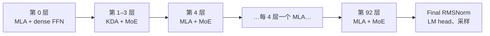

# K3 部署设计方案

- 所有者：Model 团队（MODEL-01 manifest、MODEL-03 场景）；集合通信与映射机制由 Software 团队共签
- 状态：`UNVERIFIED_PLANNING_MANIFEST`。形状是仓库工程 preset，未经厂商确认
- 形状来源：`teams/model/src/design_engine.js#MODEL_PRESETS.kimiK3`；manifest 条目 `formal_model_manifests.json#/models/0`
- 发布点的完整映射与逐项回退：[`docs/architecture/21_TPS_DESIGN_BASELINE.md`](../../../../docs/architecture/21_TPS_DESIGN_BASELINE.md) 第 4、5 节

## 1. 模型形状（摘要）

| 项 | 值 |
|---|---|
| 总参数 / 激活参数 | 2.78T / 104.2B（计算器口径） |
| 层数 | 93；第 0、4、…、92 层（24 层）为 softmax MLA，其余 69 层为 KDA 线性注意力 |
| MoE | 第 1–92 层（92 层）；896 routed expert，每 token 激活 16 个，2 个 shared expert；expert 输入为 3584 维 latent |
| hidden / vocab | 7168 / 163840 |
| MLA | 96 head，qk head dim 192，v head dim 128，KV latent 512，RoPE 64 |
| 线性注意力 state | 128 × 128 每 head |

## 2. 并行与切分

- TP32、PP1、B=1、decode，context 1M；TP8/TP16 用例见 `multi_model_tp_matrix.json`（`K3-TP{8,16,32}-DECODE-1M`）。
- 权重、KV/state、expert 全部按 TP rank 切分；FFN/MoE 为 TP-only（ADR-0020），无 expert dispatch。
- context 按 TP rank 切分；softmax 层的注意力在各 rank 上局部计算，再用 LSE（m/l/O）合并（ADR-0015）。
- 集合通信分层执行（`sharding.collective = hierarchical`）：Die 内、卡内（8 Die）、跨卡。

## 3. 精度（dtypePolicy）

| 部分 | dtype | 字节/参数 |
|---|---|---|
| attention 与 dense 投影、shared expert、router、LM head | BF16 | 2 |
| routed expert | MXFP4（每 32 权重一个 8-bit scale） | 0.53125 |
| KV cache | FlashMLA FP8，656 B/token/layer | — |
| KDA state | BF16 | — |
| 激活 / 累加 | BF16 / FP32 | — |

K3 的 dense 权重是 BF16，而 GLM-5.2 和 DeepSeek-V4-Pro 是 FP8。为对比，工作负载中另存了一个
`K3-FP8-dense` 比较模型（`planning_operator_workload.json#/comparisons`），它不是 K3 的配置记录，也不参与排名。

## 4. KV 与 state 布局

- 只有 24 个 softmax 层有 KV cache：每 token 每层 656 B（512 FP8 E4M3 latent + 4 个 FP32 scale + 64 维 BF16 RoPE）；
  BF16 布局为 1152 B。latent 在 kernel 内反量化，精度影响未评估（B-001、O-013）。
- 69 个 KDA 层每层保存固定大小的线性注意力 state（BF16），与 context 长度无关。
- 注意力采用吸收式 MLA：QK 在 512+64 维上计算，PV 在 512 维 latent 上计算。

### 4.1 每 rank 容量（TP32，context 1M，单请求）

| 项 | 每 rank |
|---|---:|
| KV（24 层 × 32768 token × 656 B） | 0.516 GB |
| KDA state（69 层） | 约 0.014 GB |
| 合计（模型 backing，含权重与 state） | 49.20 GB |
| 卡容量（16 MC × 16 GB 档） | 256 GB |

来源：[`04_MEMORY_SUBSYSTEM_MC.md`](../../../hardware/docs/04_MEMORY_SUBSYSTEM_MC.md) 第 3 节（49.20 GB 取自 `tpsDesign` 的模拟器 backing）；
KDA state 为 `planning_operator_workload.json` 中 `kda_state` 字节 ÷ 32 的推导值。
每 token 读取的字节账见 [OPERATOR_LEDGER.md](OPERATOR_LEDGER.md)。

## 5. 集合通信

- 计数口径 `reference-393`（ADR-0004，B-007 已接受）：每 token 393 次集合通信。
  `Q / new-KV all-gather`（24 次）和采样广播（1 次）作为本地算子留在 DAG 中；shared 输出归约并入
  `Wup + Shared output all-reduce`。
- 每次按 τ = 1.15 µs 下限计费；消息为 BF16 hidden 向量。
- 计算与通信重叠只用于 shared expert（`commOverlap`），其余集合通信都在依赖主链上。

## 6. 执行机制

persistent decode、独立 TMA 通道、KV 跨层预取、DMA 抢占、PV 按层合并、softmax/逐元素融合、launch batching，
见 21 号文档第 4 节；软件实现方式见 [`teams/software/docs/`](../../../software/docs/)。

## 7. 未闭合项

- 形状来自工程 preset，缺少厂商 config；manifest 的 blocker 为 “Vendor/config verification not supplied”。
- FP8 KV 的精度影响未评估。
- 专家预测命中率 0.8 是 ASSUMPTION（21 号文档第 4.5 节）。
