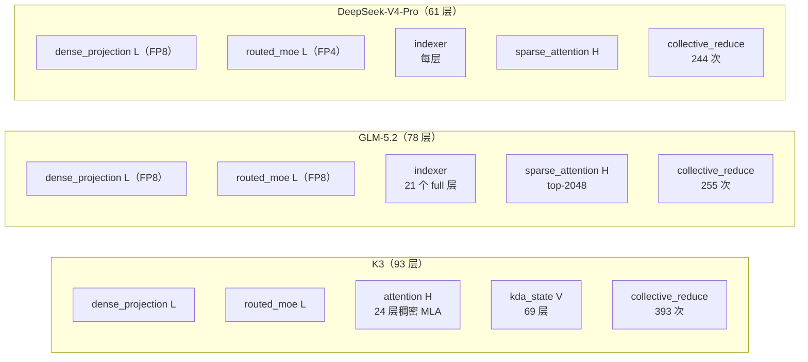
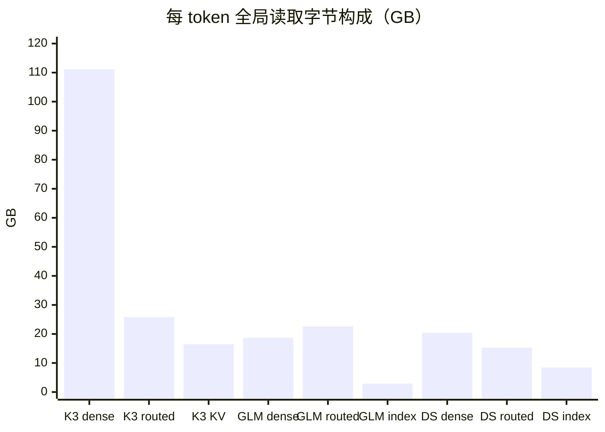
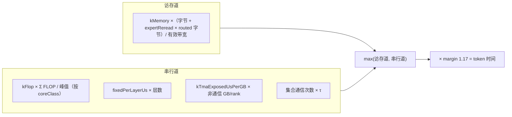
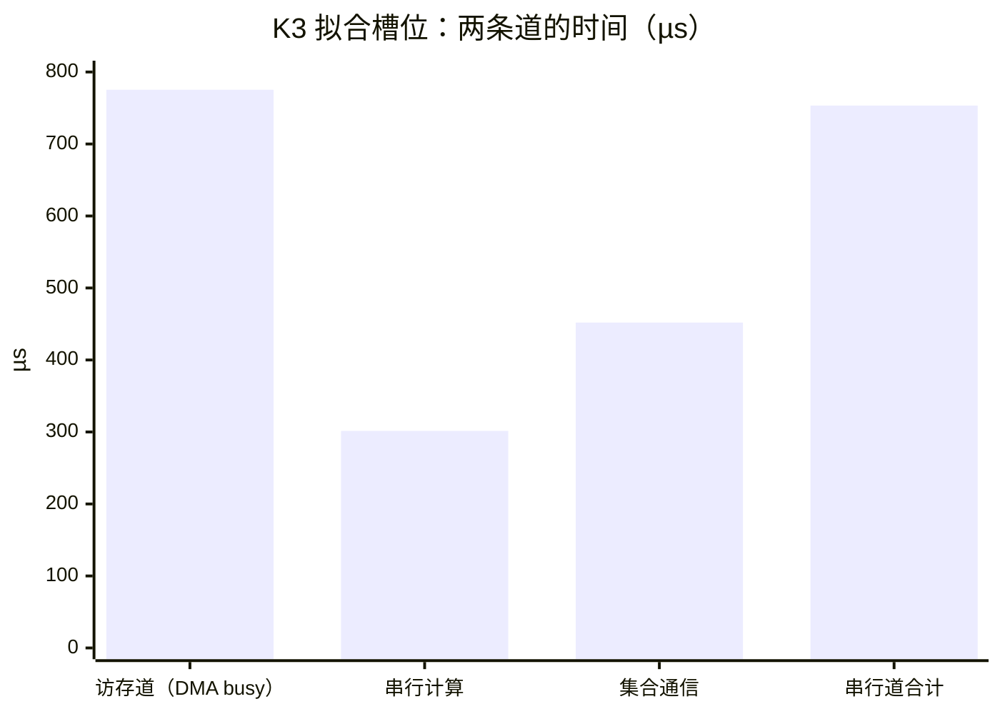

# 规划算子账（Operator Ledger）

| | |
|---|---|
| Owner | MODEL-02 Workload / Operator Ledger |
| 共签 | MODEL-01 Manifest、SW-03 Kernel（K3 对账）、MODEL-06 KPI（token-time 系数） |
| 状态 | K3 `SHAPE_DERIVED_FROM_ENGINEERING_PRESET`；GLM-5.2 `SHAPE_DERIVED_FROM_CONFIG`；DeepSeek-V4-Pro `SHAPE_DERIVED_WITH_ASSUMPTIONS` |
| 生成 | `integration/pipelines/generate_planning_operator_workload.js` → `out/workload/planning_operator_workload.json`（`npm run model:planning`） |
| 推导代码 | K3：`teams/model/src/design_engine.js#MODEL_PRESETS.kimiK3`；GLM/DS：[`workload_derivation.js`](../../src/workload_derivation.js) |

本文说明规划算子账的格式、每行的推导口径、与 K3 详细模型的对账，以及用它计算规划 token 时间的系数。
算子账只用于方向性比较（D-Gate），**不是**逐算子映射；K3 的逐算子映射见
[`KERNEL_SPEC.md`](../../../software/docs/KERNEL_SPEC.md)，GLM/DS 的 lowering 见
[`MULTI_MODEL_LOWERING.md`](../../../software/docs/MULTI_MODEL_LOWERING.md)。本文不抄写 TPS 数值。

## 1. 格式

```text
operators[modelId] = [
  [operatorId, coreClass, globalFlops, globalBytes, bytesClass],
  ...
]
单位：每 token、context 1M、TP 切分前的全局量（FLOP、byte）
```

| 字段 | 取值 | 用途 |
| --- | --- | --- |
| `operatorId` | `dense_projection`、`routed_moe`、`attention` / `sparse_attention`、`indexer`、`kda_state`、`collective_reduce` | 瓶颈算子（`boundingOperatorId`） |
| `coreClass` | `L`、`H`、`V`、`INDEXER`、`REDUCE` | 选择峰值：`INDEXER` 按 H 峰值、`REDUCE` 按向量峰值（`teams/hardware/src/resource_profiles.js#peakByCore`） |
| `globalFlops` | 2 × 参数 × 激活（矩阵）或注意力公式 | 串行道 |
| `globalBytes` | 参数 × 字节/参数，或 token × 字节/token | 访存道；每 rank = ÷ TP |
| `bytesClass` | `weight`、`expert`、`kv_state`、`index`、`collective` | `expert` 类额外乘专家重读系数 |

同一文件还有：`collectivesPerToken`、`layers`、`dtypePolicy`、`variants`（DeepSeek 的另一种形状解法）、
`comparisons`（K3-FP8-dense，不参与排名）、`calibration`、`limitations`。

## 2. 三个模型的行



| 行 | K3 GFLOP / GB | GLM-5.2 GFLOP / GB | DeepSeek-V4-Pro GFLOP / GB | 推导 |
| --- | --- | --- | --- | --- |
| dense_projection | 111.16 / 111.16 | 35.30 / 18.72 | 38.66 / 20.42 | attention、indexer 权重、dense FFN、shared expert、router、LM head；embedding 是查表，不计 |
| routed_moe | 97.24 / 25.83 | 45.30 / 22.65 | 57.49 / 15.27 | 激活专家参数 × 字节/参数（K3 MXFP4 0.53125、GLM FP8 1、DS FP4 0.53125） |
| attention / sparse_attention | 5257.04 / 16.51 | 22.25 / 0.105 | 34.80 / 0.082 | K3：24 × 2 × 1M × 96 × (576 + 512)；GLM/DS：层数 × 2 × 2048 × heads × (576 + 512)；字节 × 656 B/token/层 |
| indexer | — | 180.39 / 2.91 | 1047.97 / 8.44 | full 层数 × 1M × heads × 128 × 2；字节 × 132 B/token |
| kda_state | 0.76 / 0.43 | — | — | 69 层 × state 128 × 128 × heads |
| collective_reduce | 0.28 / 0.57 | 0.10 / 0.20 | 0.11 / 0.22 | 次数 × 2 × hidden × 2 B × 32（每 rank ring 消息 × TP32）；FLOP = 字节 / 2 |
| **合计** | **5466.5 / 154.50** | **283.3 / 44.58** | **1179.0 / 44.44** | |



读法：

- K3 的字节由 BF16 dense 权重主导（72%）；GLM/DS 的 dense 是 FP8，三类字节更平均；
- 两个稀疏注意力模型的 KV 字节几乎为零（只读 2048 个），但 index key 要全量扫描；
- K3-FP8-dense 比较行把 dense 降到 57.34 GB，只作对照（[`PRECISION_POLICY.md`](../../../software/docs/PRECISION_POLICY.md) 第 2.3 节）。

### 2.1 DeepSeek-V4-Pro 的两种形状解法

| 解法 | expert hidden | routed_moe GB | dense_projection GB | 字段 |
| --- | ---: | ---: | ---: | --- |
| 点估计（由 49B 激活反解） | 约 3841 | 15.27 | 20.42 | `operators.DeepSeek-V4-Pro` |
| 变体（由 1.6T 总参反解） | 约 3300 | 13.12 | 19.74 | `variants.DeepSeek-V4-Pro.expertHiddenFromTotal` |

两者用同一套公式，scorecard 以区间报告（部署方案 [`DeepSeek-V4-Pro.md`](DeepSeek-V4-Pro.md) 第 6 节）。

## 3. 与 K3 详细模型的对账

`provenance.K3.reconciliation` 把 K3 行与详细模型 `mapped(best.x).plan`（每 rank × 32）对比：

| 项 | 规划推导 | 详细模型 | 比值 |
| --- | ---: | ---: | ---: |
| 全局 FLOP / token | 5466.20 G | 5486.42 G | 0.996 |
| 全局读字节 / token | 153.93 GB | 158.88 GB | 0.969 |
| 读字节 + 专家重读 5.17 GB | 159.10 GB | 158.88 GB | 1.001 |

差额几乎全是专家预测失误造成的重读（命中率 0.8 的 ASSUMPTION），这就是 token-time 公式中 `expertReread` 的来源。

## 4. 规划 token 时间



系数只在一个槽位上拟合：K3 详细模型的 P1 发布点（TP32 / P1 / MC640），定义见 `calibration.definition`。

| 系数 | 值 | 定义 |
| --- | ---: | --- |
| `expertReread` | 0.20 | 错误预测字节 / 预测字节 |
| `kMemory` | 1.1178 | DMA busy /（字节 + 重读 × expert 字节）的规划访存时间 |
| `kFlop` | 1.1529 | （kernel + reduce + dieLink）/ 规划计算时间 |
| `fixedPerLayerUs` | 0.2987 | （localTma + launch − 通信重叠）/ 层数 |
| `kTmaExposedUsPerGB` | 5.793 | （tmaFill − tmaHidden）/ 每 rank 非通信 GB |
| τ | 1.15 µs | 与详细模型相同，不缩放；敏感性列 1.5 / 2.0 µs |



拟合槽位上访存道略长，是绑定道。**样本外核对**：同一套系数回放 MC320（不拟合），规划 / 详细 = 0.94
（`calibration.validation.planningOverDetailed`），即规划值偏保守约 6%。

## 5. 局限（`limitations`）

| # | 局限 | 影响 |
| --- | --- | --- |
| 1 | K3 行来自工程 preset，未经厂商确认 | 全部 K3 行 |
| 2 | DeepSeek-V4-Pro 行建立在 DeepSeek-V3/V3.2 维度的 ASSUMPTION 上；49B 激活与 1.6T 总参在这些假设下互相矛盾 | 用区间报告 |
| 3 | GLM-5.2 的 KV/index key 字节和每层集合通信次数是 ASSUMPTION | kv_state、index、collective 行 |
| 4 | FFN/MoE 为 TP-only（部署决定），没有 all-to-all 行 | 三个模型 |
| 5 | token-time 系数只在 K3 上拟合，用于 GLM/DS 是外推；`kFlop` 用于 `INDEXER` 核类尤其是外推 | GLM/DS 的规划时间 |
| 6 | dense 权重 dtype 因模型而异（K3 BF16，GLM/DS FP8） | 跨模型比较时看 K3-FP8-dense 对照 |
| 7 | 集合通信 FLOP 是规划估计（每个传输元素一次累加） | collective 行 |
| 8 | router 按 TP 切分计字节，但集合通信次数中没有 router gather（MULTI_MODEL_LOWERING 第 5 节缺口 1） | GLM/DS |

## 6. 变更规则

改 manifest 或推导代码后运行 `npm run model:planning` 与 `npm test`；新增算子行时同步更新
`teams/hardware/src/resource_profiles.js#peakByCore`（若引入新 `coreClass`）和本文第 2 节。
