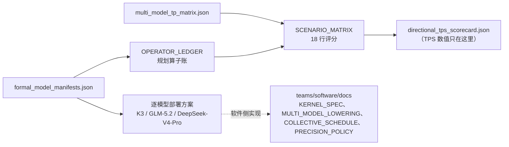

# 模型部署设计方案

每个模型一份部署方案，说明该模型在本平台上如何切分、用什么精度、KV/state 如何布局、每 token 做多少次集合通信。
方案只描述**部署布局**；模型形状本身由 manifest 定义，性能数字由流水线生成。

| 模型 | 方案 | 形状来源 | 状态 |
|---|---|---|---|
| K3 | [K3.md](K3.md) | `teams/model/src/design_engine.js#MODEL_PRESETS.kimiK3`（工程 preset） | `UNVERIFIED_PLANNING_MANIFEST` |
| GLM-5.2 | [GLM-5.2.md](GLM-5.2.md) | 公开 HF `config.json` + 部署 ASSUMPTION 字段 | `SHAPE_DERIVED_FROM_CONFIG` |
| DeepSeek-V4-Pro | [DeepSeek-V4-Pro.md](DeepSeek-V4-Pro.md) | 公开报告字段 + DeepSeek-V3/V3.2 维度 ASSUMPTION | `SHAPE_DERIVED_WITH_ASSUMPTIONS` |

跨模型文档：

| 文档 | 内容 |
|---|---|
| [OPERATOR_LEDGER.md](OPERATOR_LEDGER.md) | 规划算子账：行格式、三个模型的 FLOP/字节、与 K3 详细模型的对账、token-time 系数与局限 |
| [SCENARIO_MATRIX.md](SCENARIO_MATRIX.md) | 场景矩阵：3 模型 × TP8/16/32 × MC320/640（单一硬件规格 P1）、评分流程、选择政策、D-Gate |
| [model_manifest_qualification_20260922.md](../model_manifest_qualification_20260922.md) | manifest 资格评审报告（2026-09-22） |

## 与机器可读来源的关系

- 部署字段的唯一来源是 [`teams/model/inputs/formal_model_manifests.json`](../../inputs/formal_model_manifests.json)
  （GLM-5.2、DeepSeek-V4-Pro 的 `shape.assumptions`；K3 的 `dtype` / `stateConfig`）。本目录的文字方案逐条对应这些字段，
  两者冲突时以 manifest 为准，并修正文档。
- TP8/TP16/TP32 用例定义在 [`teams/model/inputs/multi_model_tp_matrix.json`](../../inputs/multi_model_tp_matrix.json)。
- 推导代码：[`teams/model/src/workload_derivation.js`](../../src/workload_derivation.js)；生成的每 token 算子账在
  `out/workload/planning_operator_workload.json`，规划 TPS/usr 在 `out/direction/directional_tps_scorecard.json`
  和 `out/governance/direction_feedback.json`。文档不抄写 TPS 数值，以免过期。

## 三个模型共同的部署决定

| 项 | 决定 | 依据 |
|---|---|---|
| 批量 / 上下文 | B = 1，context = 1M token，decode | [ADR-0009](../../../council/adr/ADR-0009-target-metric.md) |
| 并行方式 | TP（TP8 / TP16 / TP32 用例，设计点 TP32），PP = 1 | `multi_model_tp_matrix.json` |
| FFN / MoE | TP-only：dense FFN、shared、routed expert 都按 TP rank 切分；无 EP、无 all-to-all；每层 FFN/MoE 输出一次 TP all-reduce | [ADR-0020](../../../council/adr/ADR-0020-tp-only-ffn-moe.md) |
| 集合通信计数 | 每次按 τ 下限计费；计数口径见各模型方案 | [ADR-0004](../../../council/adr/ADR-0004-collective-tau-basis-and-count-basis.md) |
| KV cache | FlashMLA FP8：每 token 每层 656 B（512 FP8 latent + 4 FP32 scale + 64 BF16 RoPE） | K3 由详细模型确定；另两个模型为 ASSUMPTION |
| MTP / speculative decode | 不计入 TPS/usr | [ADR-0006](../../../council/adr/ADR-0006-planning-token-time-and-blocked-glm.md)、[ADR-0007](../../../council/adr/ADR-0007-glm-5.2-config-derived-workload.md) |

## 变更规则

- 改动部署字段：先改 manifest，再改本目录文档，运行 `npm run model:planning` 与 `npm test`。
- 改动跨团队部署决定（并行方式、KV 布局、dtype 政策）：同时新增 ADR，并在方案中引用。
