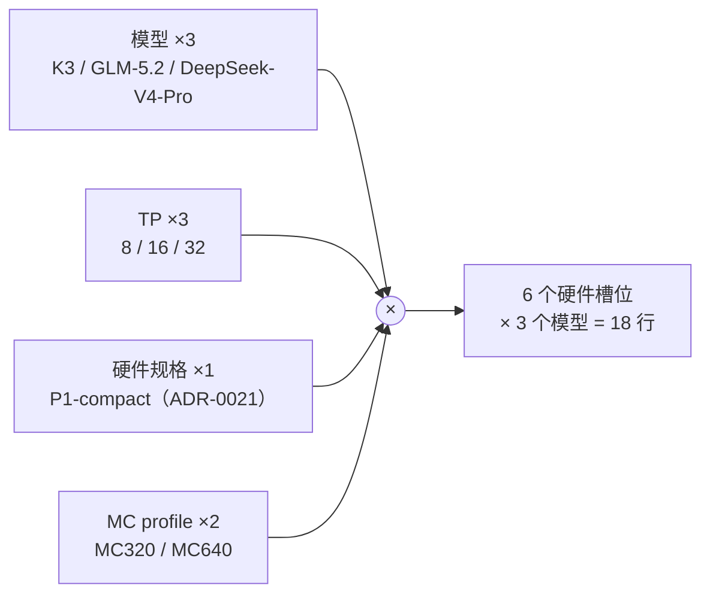
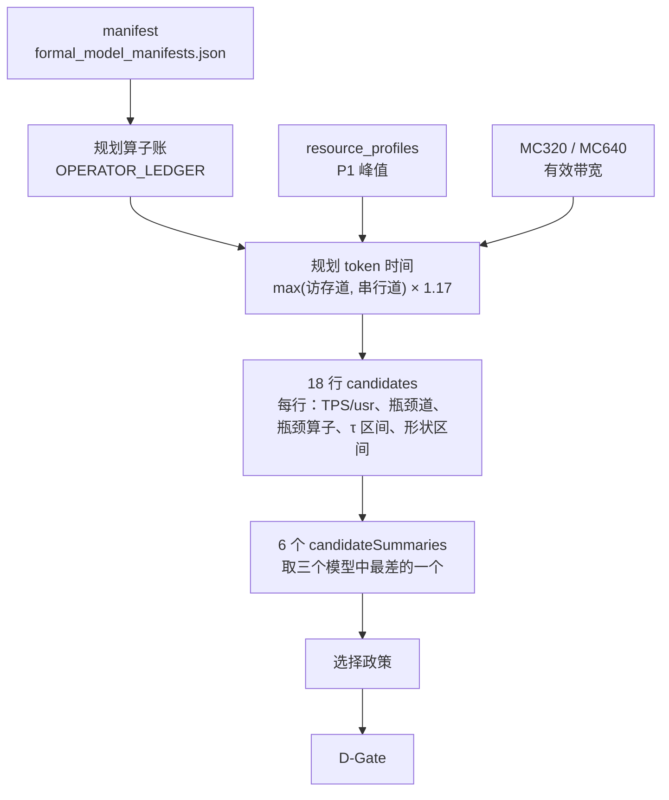
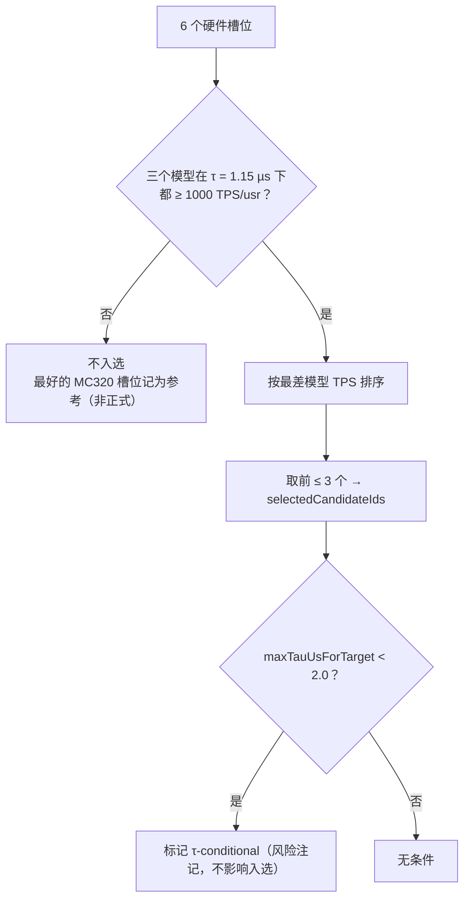

# 场景矩阵（Scenario Matrix）

| | |
|---|---|
| Owner | MODEL-03 Scenario/Test |
| 共签 | MODEL-06 KPI/Acceptance、ARCH（D-Gate）、VV（Gate 独立验证） |
| 用例定义 | [`teams/model/inputs/multi_model_tp_matrix.json`](../../inputs/multi_model_tp_matrix.json)（`TEST_CASE_BASELINE`） |
| 评分输出 | `out/direction/directional_tps_scorecard.json`（`candidates`、`candidateSummaries`、`selectedCandidateIds`、`dGate`）；由 `integration/pipelines/stage_a.js` 生成 |
| 选择政策 | [ADR-0008](../../../council/adr/ADR-0008-split-token-time-calibration.md)；Gate 计算在 `integration/governance/evaluate_gates.js` |

本文说明规划阶段评估哪些场景、怎样从场景里选候选、以及 D-Gate 检查什么。**TPS 数值以 scorecard 为准，本文不抄写。**

## 1. 维度



| 维度 | 取值 | 固定条件 |
| --- | --- | --- |
| 模型 | K3、GLM-5.2、DeepSeek-V4-Pro（DS 另有形状变体，作区间） | B = 1，context 1M，decode，PP1 |
| TP | 8、16、32（一张卡 = 一个 TP rank） | 每卡 8 Compute Die、16 MC、256 GB、scale-out 800 GB/s |
| 硬件规格 | 只有 P1-compact：8 L + 4 H（5 × 48×128）/Die，与发布点相同（ADR-0021） | 1.0 GHz；峰值来自 `teams/hardware/src/resource_profiles.js` |
| MC profile | MC320（5.12 TB/s 原始，× 0.7 = 3.584 TB/s 有效/卡）：制造基线；MC640（10.24 TB/s，× 0.7 = 7.168 TB/s）：stretch，非量产默认 | 有效率 0.7 是 ASSUMPTION |
| τ | 点估计 1.15 µs；风险列 1.5 / 2.0 µs | B-008 关闭前 TP32 槽位须同时看区间 |
| seed | 11、23、47、89、131 | 事件模型阶段使用；规划阶段是确定性公式 |

## 2. 用例（9 个模型 × TP 组合）

| 用例 | 特征 | 期望 |
| --- | --- | --- |
| `K3-TP{8,16,32}-DECODE-1M` | linear_attention、moe、lse_m_l_o、persistent_decode | 无 expert dispatch、无 index cache、无 MTP 分支、有 LSE merge |
| `GLM-5.2-TP{8,16,32}-DECODE-1M` | sparse_moe、index_share_attention、multi_token_prediction、agentic_decode | 无 expert dispatch、有 index cache、MTP 分支与回滚（不计入 TPS/usr） |
| `DeepSeek-V4-Pro-TP{8,16,32}-DECODE-1M` | sparse_moe、deepseek_sparse_attention、indexer、multi_token_prediction | 同上；384 expert、每 token 6 个 |

所有用例的 FFN/MoE 都是 TP-only（`expertDispatch: false`，ADR-0020），集合通信分层执行（`sharding.collective = hierarchical`）。

## 3. 评分流程



token 时间公式与系数见 [`OPERATOR_LEDGER.md`](OPERATOR_LEDGER.md) 第 4 节。每个硬件槽位的汇总字段：

| 字段 | 含义 |
| --- | --- |
| `minTpsPerUser` / `worstModel` | 三个模型中最差的 TPS/usr 与模型 |
| `minTpsPerUserAtMaxTau` | τ = 2.0 µs 下的最差值 |
| `minTpsPerUserLowerShape` | DeepSeek 取较差形状解法时的最差值 |
| `maxTauUsForTarget` | 三个模型都达到 1000 TPS/usr 时 τ 的最大允许值；`null` 表示任何 τ 都达不到 |
| `meetsArchitectureGate` | 最差模型是否 ≥ 1050（架构门） |
| `geomeanTpsPerUser` | 三个模型的几何平均（参考，不参与选择） |

## 4. 选择政策



- 入选看的是**目标 1000 TPS/usr**，不是架构门 1050；架构门只作为字段报告。
- τ 区间是风险注记，不是入选依据；只用点估计 1.15 µs 决定入选。
- MC320 是制造基线，但在规划公式下 MC320 槽位全部达不到目标；最好的一个作为 `referenceCandidates` 记录（`MC320_REFERENCE_NOT_FORMAL`）。
- 当前入选的是 `P1-compact-MC640-TP32`（`selectedCandidateIds`），最差模型是 K3；参考槽位是 `P1-compact-MC320-TP32`。

```text
6 个硬件槽位的入选状态（scorecard 当前结果；数值见 candidateSummaries）

             TP8        TP16       TP32
MC320        ·          ·          ◇ 参考（非正式）
MC640        ·          ·          ● 入选（τ ≤ maxTauUsForTarget）

● 入选   ◇ MC320 最佳参考   · 未达目标（最差模型均为 K3）
```

入选槽位的 `maxTauUsForTarget` 低于 2.0 µs，因此是 τ-conditional：τ 的物理推导（B-008）关闭前，
入选结论依赖 τ 不超过该值。

## 5. D-Gate（方向门）

`dGate.scope = PLANNING_COMPARISON_ONLY_NOT_ARCHITECTURE_FREEZE`：通过 D-Gate 只说明方向可比较，不冻结架构。

| 检查项 | 含义 |
| --- | --- |
| `areaConservation` | 8 × Die 面积 + 16 × MC 面积 ≤ placement window（`k3_mc_baseline.json#package`） |
| `threeModelRowsAccounted` / `threeModelComparable` | 三个模型都有行且可比较；`blockedModels` 为空 |
| `bottleneckClassification` | 每行都给出瓶颈道与瓶颈算子 |
| `sensitivitySweep` | 在拟合槽位上完成 5 维敏感性扫描（带宽、计算容量、计算、字节、网络） |
| `candidateCountLe3` | 入选 ≤ 3 个 |
| `formalSelectionRecorded` / `selectionResolvable` / `selectionMeetsTarget` | 入选已记录、可复现、达到目标 |
| `registerConsistent` | scorecard 与 register 一致 |

结果写在 `out/governance/gate_status.json`，由 V&V 独立计算；本团队不写 decision 字面量。

## 6. 下一步

| # | 动作 | 责任 |
| --- | --- | --- |
| 1 | 对入选槽位跑正式 Stage B 事件模型（带 seed） | MODEL-03 + SW-06 |
| 2 | 用 shared manifest、事件 trace 和 provenance 关闭 Q-Gate | VV |
| 3 | 增加 B > 1、prefill、MTP 接受率场景（当前均未纳入） | MODEL-03 + MODEL-04 |
| 4 | GLM/DS 的 token-time 系数需要各自的详细模型回标（当前外推自 K3） | MODEL-06 |
