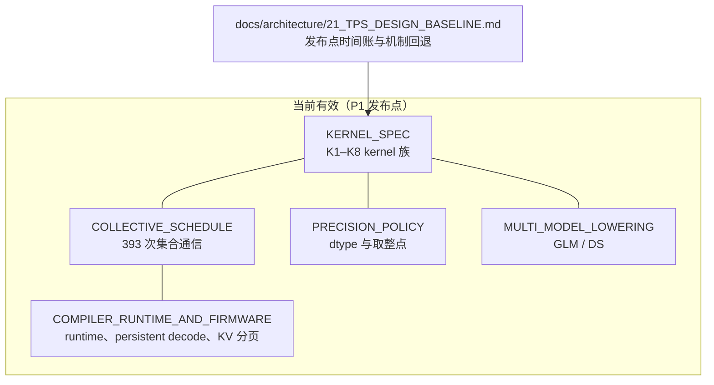

# Software Team

## Mission
负责模型部署、编译器/运行时映射和优化策略，把模型算子和硬件规格转成可执行 schedule，并量化软件收益及其代价。

## Agents

| Agent | 职责 | 输入 | 输出 | 关键约束 |
|---|---|---|---|---|
| SW-01 Deployment/Runtime | serving、batch=1 decode、KV/state、host/device control | model manifest、HW ABI | deployment spec、runtime state machine | 不改变硬件规格；记录 launch/firmware overhead |
| SW-02 Compiler/Graph | graph lowering、layout、sharding、TP/CP mapping（FFN/MoE 为 TP-only） | operator DAG、HW ISA/Tile IR | compiler lowering、schedule IR | 每次变换可追踪、可回放 |
| SW-03 Kernel Optimization | GEMM/attention/MoE/indexer/vector kernel mapping | shapes、dtype、AI Core spec | kernel catalog、cycle assumptions | dequant、padding、sparsity 单独记账 |
| SW-04 Fusion | 常见融合算子：QKV、RoPE+attention、RMSNorm+linear、MoE gate+dispatch、dequant+GEMM、MLP chain | operator DAG、memory ledger | fusion candidates、合法性和收益 | 记录 alias、精度、workspace、fallback |
| SW-05 Collective/Comm-Compute | all-reduce、reduce-scatter、all-gather、LSE merge、indexer top-k merge 与计算的 overlap（TP-only，无 all-to-all，ADR-0020） | NoC/MC topology、collective bytes、kernel timing | overlap schedule、packet/kernel dependency | overlap 不能重复计算；通信资源独立 |
| SW-06 Scheduler/Serving | persistent decode、prefetch、double buffer、MTP、queue/QoS | kernel/collective/memory events | critical path、runtime policy | MTP acceptance/rollback；P50/P95/P99 |
| SW-07 Software KPI/Profiler | profiling schema、software gain budget、regression | traces、baseline、model scenarios | measured/estimated gain、profiling report | estimate 与 measured 分开；不可把收益写成 peak |

## 设计文档

| 文档 | Owner | 内容 | Evidence class |
|---|---|---|---|
| [`KERNEL_SPEC.md`](docs/KERNEL_SPEC.md) | SW-03（SW-04 共签） | 发布点 2347 个非通信算子归成 8 个 kernel 族：单元、shape、限制因素、时长、contract 必填字段 | `MODEL` |
| [`COLLECTIVE_SCHEDULE.md`](docs/COLLECTIVE_SCHEDULE.md) | SW-05 | 393 次集合通信的构成、与 repo-510 的对账、层内位置、依赖与重叠、Wup + Shared 融合的合法性、分层执行、τ 敏感性；GLM/DS 的集合通信 | `MODEL`；τ `BLOCKER`（B-008） |
| [`PRECISION_POLICY.md`](docs/PRECISION_POLICY.md) | SW-03 + MODEL-06 | 三个模型的 dtype 表、FP8 KV / MXFP4 格式、取整点、集合通信精度、确定性、精度验收 | `MODEL`（精度未评估） |
| [`MULTI_MODEL_LOWERING.md`](docs/MULTI_MODEL_LOWERING.md) | SW-03 | GLM-5.2 / DeepSeek-V4-Pro 到 kernel 族的映射、新增 indexer / top-k / 稀疏 gather kernel、负载均衡与 router 切分缺口 | `PLANNING_ESTIMATE` |
| [`COMPILER_RUNTIME_AND_FIRMWARE.md`](docs/COMPILER_RUNTIME_AND_FIRMWARE.md) | SW-01 / SW-02 / SW-06 | 软件层级、runtime 调度、launch 账、persistent decode 状态机、KV 分页与多请求（提案） | `BASELINE` / 提案 |

## Directory

| Path | Content |
|---|---|
| `docs/` | 上表全部设计文档 |
| `contract.json` | 对外 execution contract 的静态部分；合成到 `out/contracts/software_execution_contract.json` |

## Review and handoff
SW-01/02 定义部署路径，SW-03/04/05 形成优化候选，SW-06 合并成 schedule，SW-07 做收益和回归。结果交给 `ARCH-02/03` 和 `VV-*`。
