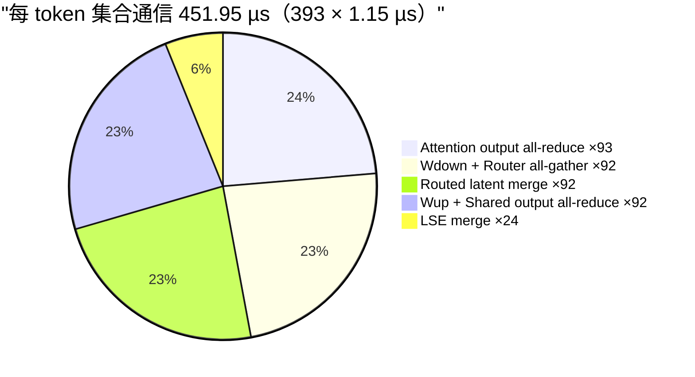
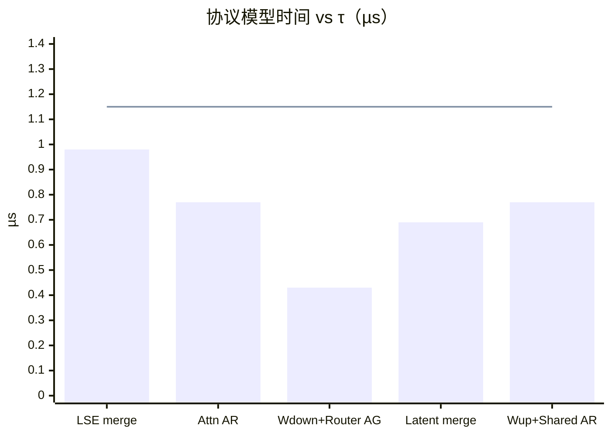
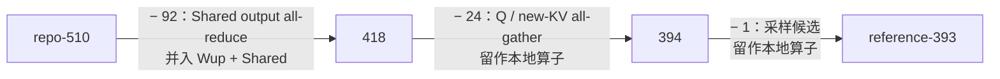
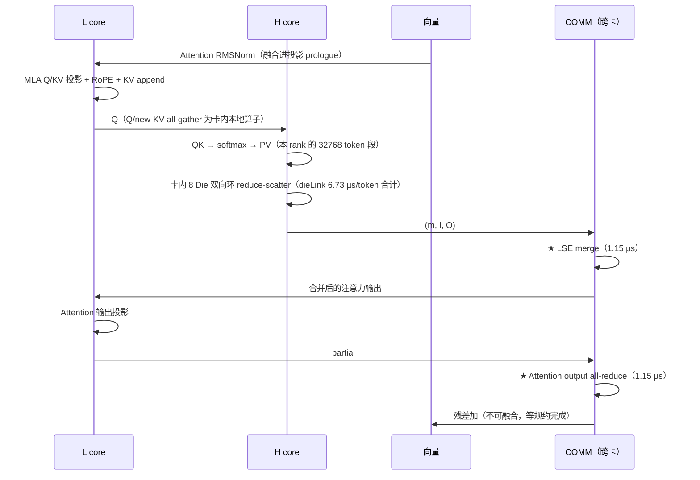
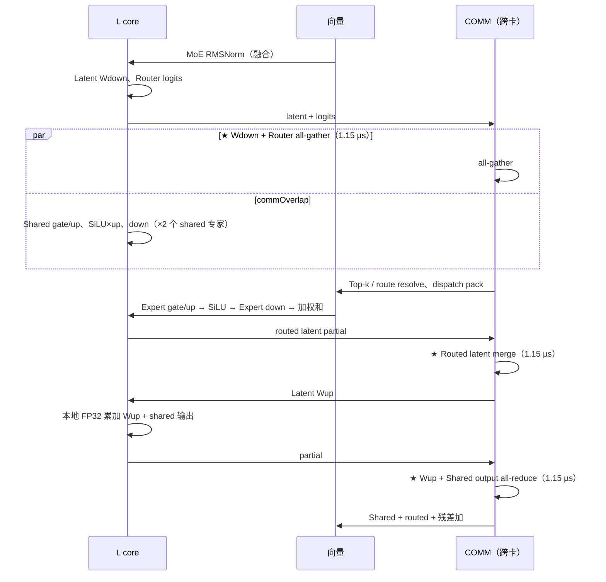
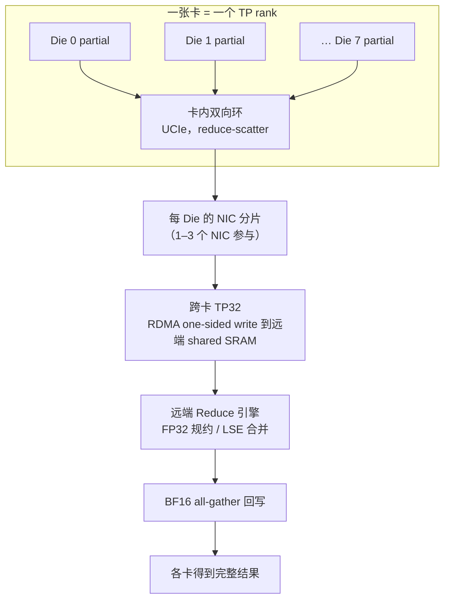
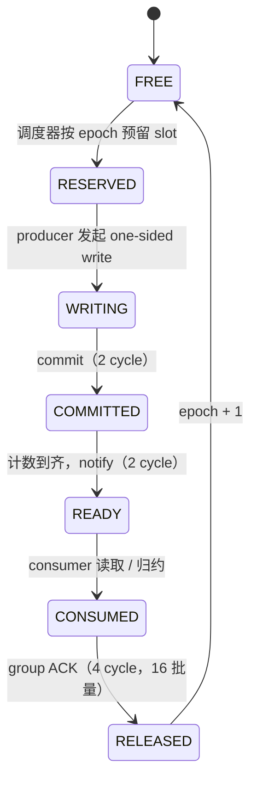
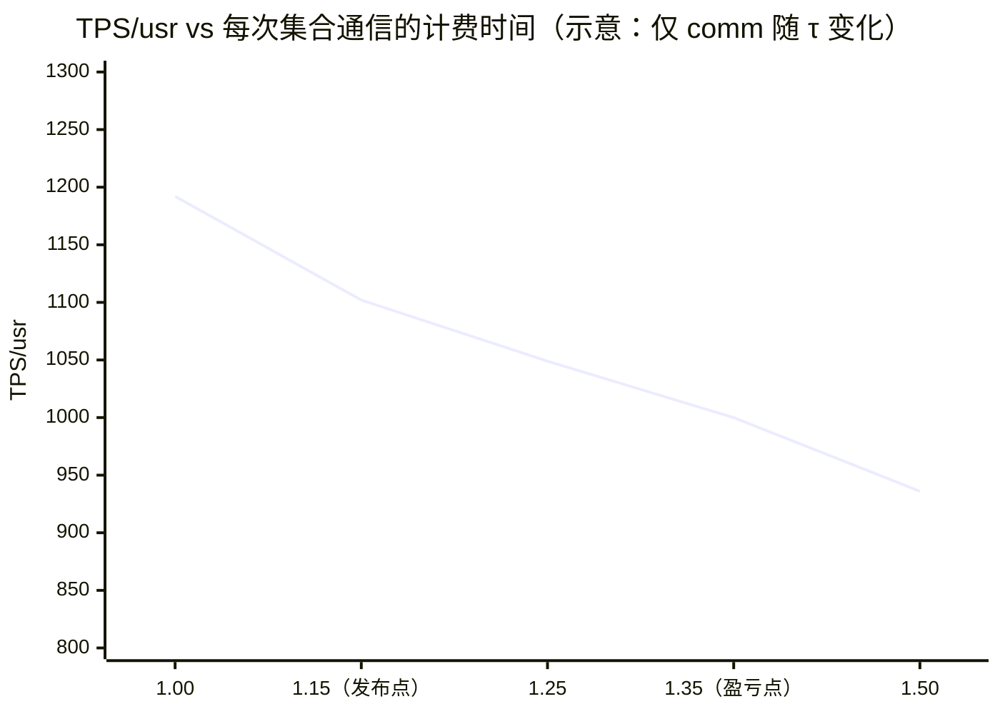
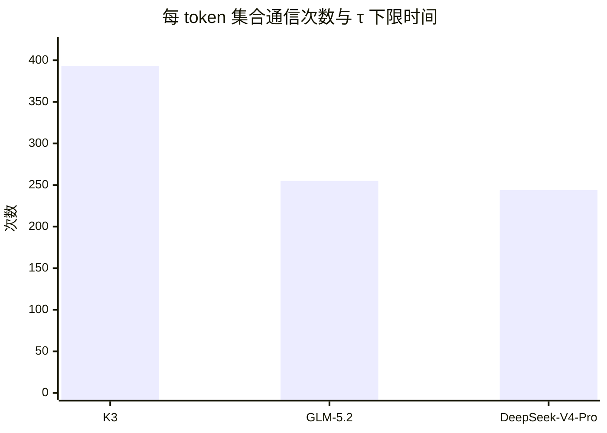
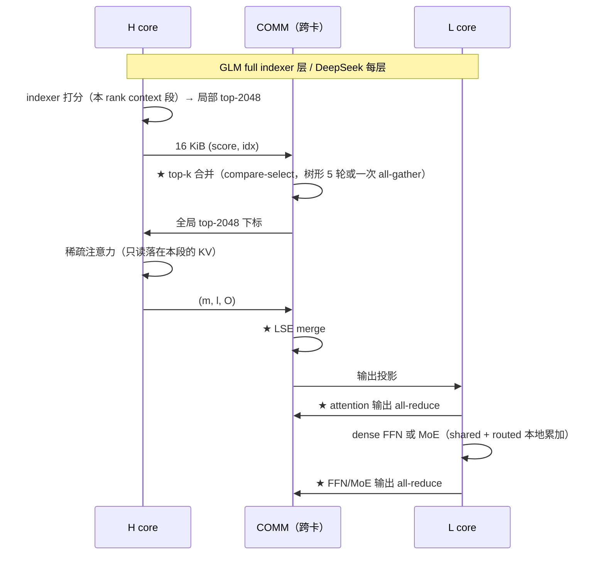

# 集合通信调度（P1 发布点）

| | |
|---|---|
| Owner | SW-05 Collective/Comm-Compute Overlap |
| 共签 | HW Collective/RDMA（[`07_COLLECTIVE_RDMA.md`](../../hardware/docs/07_COLLECTIVE_RDMA.md)）、SW-06 Scheduler |
| Evidence class | `MODEL`；τ 的物理推导为 `BLOCKER`（B-008） |
| 载荷条件 | K3，B=1，context 1M，TP32，PP1，8 Die/卡（一张卡 = 一个 TP rank），P1 发布点 1101.77 TPS/usr |
| 权威来源 | 次数与计费：[`21_TPS_DESIGN_BASELINE.md`](../../../docs/architecture/21_TPS_DESIGN_BASELINE.md) 第 2.2、4.2、4.3 节；口径：[ADR-0004](../../council/adr/ADR-0004-collective-tau-basis-and-count-basis.md)；FFN/MoE 并行方式：[ADR-0020](../../council/adr/ADR-0020-tp-only-ffn-moe.md) |

本文说明每 token 393 次集合通信是什么、排在 DAG 的哪里、怎样计费、哪些能与计算重叠，以及 GLM-5.2 / DeepSeek-V4-Pro 的对应安排。
硬件协议语义（mailbox、commit/ACK、epoch）见 07 号文档，本文只描述软件侧如何使用。

## 0. 结论



1. **通信时间 = 次数 × τ。** 五类集合通信的协议模型时间都低于 τ（0.43–0.98 µs），全部按 τ = 1.15 µs 下限计费，
   所以 comm = 393 × 1.15 = 451.95 µs，占 raw 775.75 µs 的 58%。
2. **B=1 下每次集合通信都在依赖主链上。** 唯一的重叠是 shared 专家与 `Wdown + Router all-gather` 并行（`commOverlap`，26.27 µs）。
3. **次数是口径，不是优化。** reference-393 相对 repo-510 少的 117 次是计数对齐（ADR-0004）；回退到 repo-510 为 941.74 TPS/usr。
4. **τ 是最大的单一风险。** τ 升到约 1.35 µs（每次余量 0.201 µs）TPS/usr 就跌破 1000（21 号文档第 6 节）。

## 1. 393 次的构成

| 集合通信 | 次数 | 出现位置 | 协议 kind | 协议模型均值 µs | 计入 µs | workspace B |
| --- | ---: | --- | --- | ---: | ---: | ---: |
| LSE merge / output reduce-scatter | 24 | 每个 softmax MLA 层（0、4、…、92） | LSE reduce-scatter | 0.98 | 27.60 | 1325568 |
| Attention output all-reduce | 93 | 每层 | FP32 reduce-scatter + BF16 all-gather | 0.77 | 106.95 | 276480 |
| Wdown + Router all-gather | 92 | 每个 MoE 层（1–92） | all-gather | 0.43 | 105.80 | 186880 |
| Routed latent merge | 92 | 每个 MoE 层 | FP32 reduce-scatter + BF16 all-gather | 0.69 | 105.80 | 204800 |
| Wup + Shared output all-reduce | 92 | 每个 MoE 层 | FP32 reduce-scatter + BF16 all-gather | 0.77 | 105.80 | 276480 |
| **合计** | **393** | | | | **451.95** | |

```text
393 = 93（attention 输出）+ 24（LSE）+ 92 × 3（MoE：all-gather、latent merge、Wup+Shared）
    = 每 MoE 层 4 次 × 92 + 第 0 层 1 次 + 24 次 LSE
```

workspace 取 21 号文档第 2.2 节；RDMA workspace 峰值 1.26 MiB（2 个 epoch 轮换，见第 4 节）。



### 1.1 与 repo-510 的差额



被移出的 25 次仍作为本地算子留在 DAG 中（同样的字节与依赖边，不走网络）。本节就是计数对账的依据
（`sync_baseline_spec.js` 写入 `k3_mc_baseline.json#/collectiveCount/reconciliation`），口径决定见 ADR-0004。

## 2. 在一层中的位置

### 2.1 softmax MLA 层（第 0、4、…、92 层）的注意力部分



线性注意力层（69 层）没有 LSE merge：KDA state 更新在本 rank 内完成，只有 attention output all-reduce。

### 2.2 MoE 部分（第 1–92 层）



依赖关系决定了除 shared 专家外没有可重叠的计算：

| 集合通信 | 前驱 | 后继 | 能否与计算重叠 |
| --- | --- | --- | --- |
| LSE merge | PV + 卡内规约 | Attention 输出投影 | 否：输出投影需要完整注意力输出 |
| Attention output AR | 输出投影 | 残差加 → MoE RMSNorm | 否：RMSNorm 需要完整 hidden（第 2.3 节） |
| Wdown + Router AG | Wdown、Router | Top-k | **是**：shared 专家只依赖 h_norm |
| Routed latent merge | 专家加权和 | Latent Wup | 否：Wup 需要规约后的 latent |
| Wup + Shared AR | Wup + shared 本地累加 | 残差加 | 否：shared 已提前算完，无剩余独立计算 |

重叠量上限是 shared 专家的计算时间（26.27 µs/token）。关掉 `commOverlap` 后 1073.24 TPS/usr。

### 2.3 Wup + Shared 融合的合法性与前提

`Wup + Shared output all-reduce` 是把 routed 的 Wup 输出与 shared 专家输出先在本地 FP32 相加，再规约一次。它成立的三条判据：

1. Wup 规约与 shared 输出规约之间没有 norm，只有 shared 专家的线性算子和逐元素 SiLU。
2. shared 支路不消费 routed 支路的输出：两者都从 `MoE RMSNorm` 的输出 h_norm 分叉。
3. 两次规约同形：payload 都是一个 BF16 hidden 向量，同一 TP32 组、同一 H 维切分；融合后 payload 不变。

实现前提（任一不满足就退回两次独立 all-reduce，没有正确性风险）：

- 编译器能把 Wup 规约推迟到 shared 子图之后，routed partial 作为 live value 跨过 shared 的权重流；
- routed 与 shared 两个 partial 的 H 维切分和 layout 相同，可以直接逐元素相加；
- routed partial 的 buffer 不被 shared 的输出 tile 复用（在 buffer 生命周期契约中登记）；
- 判据 2 是从算子图语义推断的，需要 K3 厂商拓扑确认。

被否决的相邻方案：

| 方案 | 判定 | 理由 |
|---|---|---|
| 把 `Wdown + Router all-gather` 并进 `Attention output all-reduce` | 非法 | 中间隔着残差加和 `MoE RMSNorm`，RMSNorm 需要已规约的完整 hidden |
| 删掉 `Routed latent merge` | 不能计价 | 专家输出是 F 维 partial sum，必须在 Latent Wup 前规约；只能换成 reduce-scatter，模型里没有这个原语 |

## 3. 分层执行

一张卡是一个 TP rank；卡内 8 Die 共同承担这个 rank 的计算。集合通信按 “Die 内 → 卡内 → 跨卡” 的固定层次执行
（`sharding.collective = hierarchical`；确定性要求见 [`PRECISION_POLICY.md`](PRECISION_POLICY.md) 第 5 节）。



- 卡内阶段的时间计入算子本身（PV 的 dieLink 6.73 µs、reduce 14.23 µs），不计入 comm 的 393 次。
- 跨卡阶段每次按 τ 计费。`dieDirectReduce`、`groupAck`、`readyCounter`、`dieGroupReduce`、`hierarchicalReduce`、
  `remoteDirectReduce` 这些开关只经 GAIN 起作用，GAIN = 1，对时长没有贡献（21 号文档第 4.2 节）。

## 4. 与硬件协议的接口



软件侧的义务：

| 义务 | 说明 |
| --- | --- |
| slot 预留 | 编译期为每次集合通信分配 mailbox slot 与 workspace 偏移；2 个 epoch 轮换，第 n+2 次才复用第 n 次的 slot |
| 顺序 | 同一 TP 组的集合通信按程序顺序发射；规约顺序按 rank 编号固定 |
| 依赖 | consumer 只在 READY 后读取；RDMA write 完成不等于 READY（07 号文档第 1 节） |
| 失败 | generation 不匹配的包丢弃并上报；超时由 runtime 按 [`COMPILER_RUNTIME_AND_FIRMWARE.md`](COMPILER_RUNTIME_AND_FIRMWARE.md) 的错误处理重放本 token |

## 5. 敏感性



曲线按 `TPS = 1e6 / ((775.75 + 393 × (τ − 1.15)) × 1.17)` 推导，只让 comm 随 τ 变化、其余项固定，
与 21 号文档第 6 节的盈亏点 1.35 µs 一致；其他点是推导值，不是模拟器输出。

| 杠杆 | 状态 |
| --- | --- |
| 降低 τ（PHY、协议、拓扑） | 物理推导未做（B-004、B-005、B-008）；属硬件 |
| 减少次数：复制换归约 | 关闭。复制省一次归约（≈ τ），代价是每卡每层多读 (TP−1)/TP 的权重：Wup 49.8 MB、Wdown + Router 62.2 MB，盈亏带宽约 43 / 54 TB/s/卡，发布点有效 DMA 带宽 6.41 TB/s/卡，差 7–8×（推导值） |
| 减少次数：把 LSE merge 与 attention 输出 all-reduce 合并 | 不合法：中间隔着输出投影 |
| 增加重叠 | 除 shared 专家外无独立计算；B>1 时可让不同请求的计算与通信交错（未建模） |

## 6. GLM-5.2 与 DeepSeek-V4-Pro

两个模型都是 TP-only（ADR-0020），没有 latent Wdown/Wup，所以 MoE 部分只有一次输出 all-reduce；
稀疏注意力多了一次 indexer top-k 合并。次数是 ASSUMPTION（部署方案第 5 节）。

| 模型 | 每层组成 | 次数 / token |
| --- | --- | ---: |
| K3 | MoE 层 4 次（attention 输出、all-gather、latent merge、Wup+Shared）+ 24 次 LSE | 393 |
| GLM-5.2 | full indexer 层 4 次（top-k 合并、LSE、attention 输出、FFN/MoE 输出）× 21；shared indexer 层 3 次 × 57 | 255 |
| DeepSeek-V4-Pro | 每层 4 次 × 61 | 244 |



按 τ = 1.15 µs：K3 451.95 µs、GLM-5.2 293.25 µs、DeepSeek-V4-Pro 280.60 µs（推导值）。



GLM 的 57 个 shared indexer 层沿用上一个 full 层的 top-k，不做合并。top-k 合并的语义见 07 号文档第 2.2 节；
kernel 侧 lowering 见 [`MULTI_MODEL_LOWERING.md`](MULTI_MODEL_LOWERING.md)。

## 7. 缺口

| # | 缺口 | 责任 |
| --- | --- | --- |
| 1 | τ = 1.15 µs 是下限口径，无链路/协议推导（B-008） | HW Collective + SW-05 |
| 2 | TP32 跨卡拓扑未定义（B-005），卡内拓扑口径冲突（B-004） | HW |
| 3 | top-k 合并的树形 vs all-gather 选择未量化 | SW-05 |
| 4 | 无集合通信 trace（contract 的 `schedule trace` 字段） | SW-06 |
| 5 | B>1 下的请求间交错未建模 | SW-05 + SW-06 |
