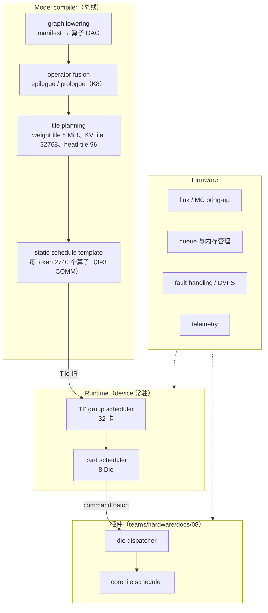
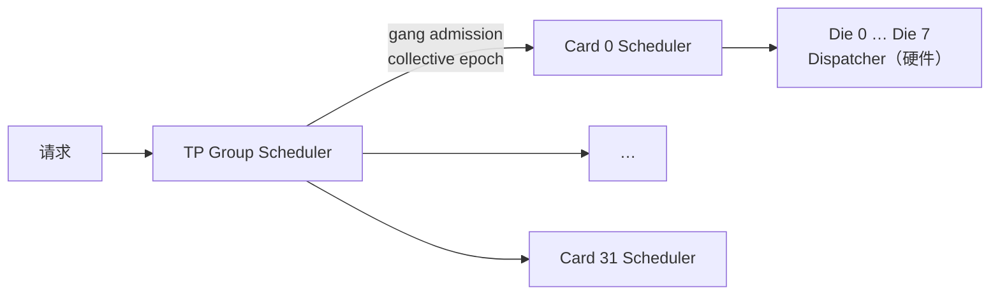
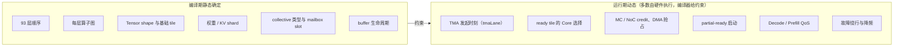
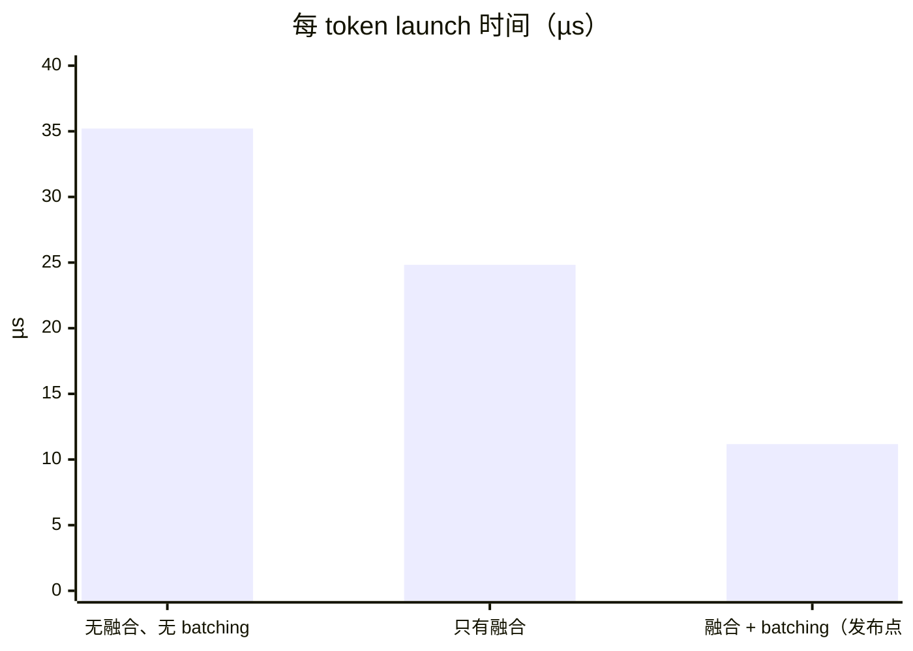
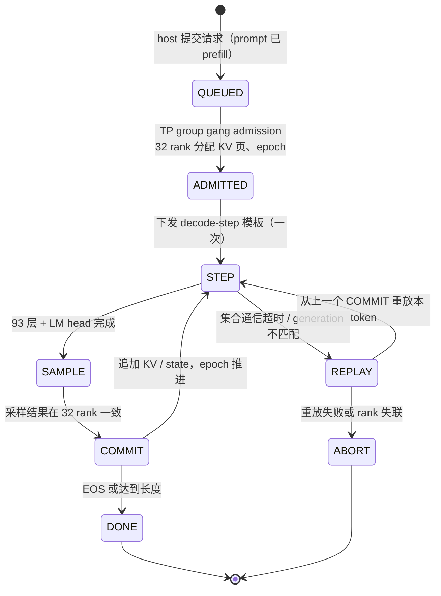
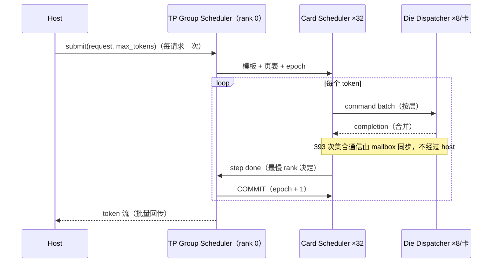
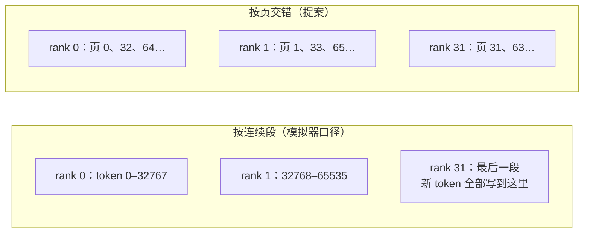
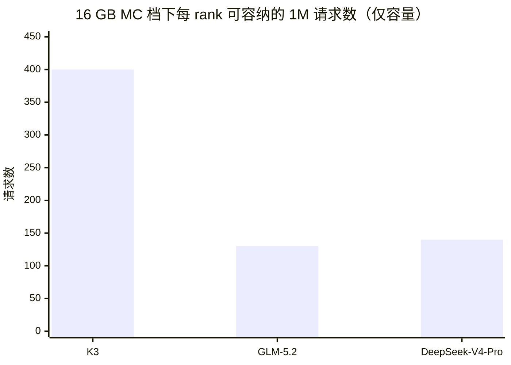

# 编译器、Runtime 与固件设计

> 当前发布点依赖的调度与映射机制（TMA 通道、KV 跨层预取、DMA 抢占、PV 按层合并、softmax/逐元素融合、
> FP8 KV、launch batching）及其逐项回退见 [`docs/architecture/21_TPS_DESIGN_BASELINE.md`](../../../docs/architecture/21_TPS_DESIGN_BASELINE.md) 第 4、5 节。
> kernel 族见 [`KERNEL_SPEC.md`](KERNEL_SPEC.md)，集合通信调度见 [`COLLECTIVE_SCHEDULE.md`](COLLECTIVE_SCHEDULE.md)。

本文是原 `docs/architecture/08_SCHEDULER_AND_SOFTWARE.md` 的软件部分（2026-09-25 拆分）。四级调度中
Die Dispatcher、Core Tile Scheduler 和 PMU 属于硬件，见
[`teams/hardware/docs/08_ON_DIE_SCHEDULER_AND_PMU.md`](../../hardware/docs/08_ON_DIE_SCHEDULER_AND_PMU.md)；
两者之间的 Tile IR 是跨团队契约，见 [`docs/architecture/contracts/TILE_IR.md`](../../../docs/architecture/contracts/TILE_IR.md)。

状态：第 1–3 节为 `BASELINE` 设计意图；第 4 节 launch 数字为 `MODEL`；第 5、6 节（persistent decode 状态机、KV 分页）
是**设计提案**，未进入模拟器，模拟器只假设每 rank 恰好持有 32768 个 token 的连续 KV。

## 1. 软件层级



编译器输出 Tile IR（[`TILE_IR.md`](../../../docs/architecture/contracts/TILE_IR.md)）。性能模型不得继续只靠
算子名称匹配优化。

## 2. Runtime 调度层级



### 2.1 TP Group Scheduler

- 32 卡 gang admission；
- 检查所有 rank 的 queue、MC、温度和 fabric credit；
- 分配 collective epoch；
- 以最慢 rank 完成一个 token step；
- 超时/故障触发 group abort 或降级。

### 2.2 Card Scheduler

- 8 Die 分工；
- 本地 MC home 与 NUMA；
- card-local collective；
- Decode/Prefill QoS；
- 每 Die 功率和温度均衡。

Card Scheduler 以 command batch 形式向 Die Dispatcher 下发 tile；Die 内的 Core 选择和 tile 级依赖由硬件完成。

## 3. 静态与动态划分



TP-only（ADR-0020）下没有 expert token packing 或 all-to-all dispatch；routed expert 的选择在运行期由 Top-k 决定，
只影响读哪些权重（专家预测命中率 0.8 是 ASSUMPTION，21 号文档第 4.5 节）。

## 4. 低开销要求与 launch 账

1000 TPS 下 host 不应逐 kernel 介入。host 每个请求或多个 token 下发高层命令，device 持久执行完整 decode-step schedule
（persistent decode，第 5 节）。

```text
非通信算子           2347 / token
− epilogue 融合        692
= launch 次数        1655 / token
× launchUs 0.015 µs × launchScale 0.45（ASSUMPTION，B-003）
= 11.17 µs / token
```



（前两项按 2347 × 0.015 与 1655 × 0.015 推导；`launchBatching` 单独回退后 1088.47 TPS/usr，21 号文档第 5 节。）

软件侧冻结目标：

- 常规 tile command 无 host doorbell；
- command batch；
- completion 合并；
- 可测量每类 launch stall。

硬件侧对应要求（descriptor 预取、控制 NoC 隔离、completion 合并的硬件支持）见
[`teams/hardware/docs/08_ON_DIE_SCHEDULER_AND_PMU.md`](../../hardware/docs/08_ON_DIE_SCHEDULER_AND_PMU.md) 第 3 节。

## 5. Persistent decode（设计提案）

### 5.1 请求状态机



- **COMMIT 是唯一的可见点。** 新 token 的 KV append 与 KDA state 更新在 COMMIT 前写入影子页；重放时丢弃影子页即可回到上一个一致状态。
- **一次下发、多步执行。** 模板（Tile IR + descriptor）在 ADMITTED 时下发并常驻 device；每个 token 只更新位置、页表指针和 epoch。

### 5.2 一个 token step 的时序



## 6. KV 分页与多请求（设计提案）

### 6.1 每 rank 的 KV 布局

模拟器按每 rank 连续 32768 个 token 计（1M / TP32）。实际 decode 中 context 会增长，需要分页：

```text
每 rank、每请求、每 softmax 层（K3，FP8 FlashMLA 656 B/token）
┌─────────┬─────────┬─────────┬─────┬─────────┐
│ page 0  │ page 1  │ page 2  │ ... │ page 127│   建议页 = 256 token × 656 B = 164 KiB
└─────────┴─────────┴─────────┴─────┴─────────┘   128 页 × 164 KiB = 21.5 MB = 一个 KV tile
页表：request → layer → [MC 地址 × 128]；24 层共 3072 项
```

| 项 | K3 | GLM-5.2 | DeepSeek-V4-Pro |
| --- | --- | --- | --- |
| 每 rank 每请求 KV（1M） | 0.516 GB | 1.677 GB | 1.311 GB |
| index key | — | 0.091 GB | 0.264 GB |
| 每 rank 容量需求合计（单请求） | 49.20 GB | 25.06 GB | 32.81 GB（点估计） |

数字取自 [`04_MEMORY_SUBSYSTEM_MC.md`](../../hardware/docs/04_MEMORY_SUBSYSTEM_MC.md) 第 3 节。

### 6.2 token 到 rank 的分配



| 方案 | 优点 | 代价 |
| --- | --- | --- |
| 连续段 | 与模拟器一致；QK/PV 每 rank 读一个连续 tile | 新 token 集中写一个 rank；稀疏注意力的 top-k 集中在最近段时负载不均（[`MULTI_MODEL_LOWERING.md`](MULTI_MODEL_LOWERING.md) 第 3.3 节） |
| 按页交错 | append 与稀疏 top-k 天然分散到 32 个 rank | 页表更长；KV tile 由 128 个不连续页组成，需要 TMA gather descriptor |

两种方案的 K3 稠密 MLA 读字节相同；建议 K3 先用连续段，GLM/DS 用交错，决定前需要在模拟器里评估 descriptor 开销。

### 6.3 多请求



取自 04 号文档第 3.2 节。B=1 的 TPS/usr 不依赖这一点；B>1 时每个请求的 KV 各读一遍、权重共享，
计算与通信可以跨请求交错（[`COLLECTIVE_SCHEDULE.md`](COLLECTIVE_SCHEDULE.md) 第 7 节缺口 5）。

## 7. 冻结交付物

| 交付物 | 状态 |
| --- | --- |
| TP Group / Card 两级调度状态机 | 第 5.1 节初版 |
| 内存分配、KV 页表与 epoch 管理 | 第 6 节提案 |
| 编译器 mapping 规则 | kernel 族见 KERNEL_SPEC；多模型见 MULTI_MODEL_LOWERING |
| 固件 bring-up、fault、DVFS | 未开始 |
| 软件 golden trace（供硬件回放测试使用） | 未开始（contract 的 `schedule trace` blocker） |

Tile IR 与 binary descriptor 的冻结见 [`TILE_IR.md`](../../../docs/architecture/contracts/TILE_IR.md)。
