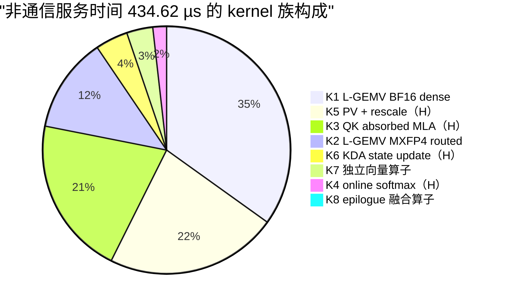
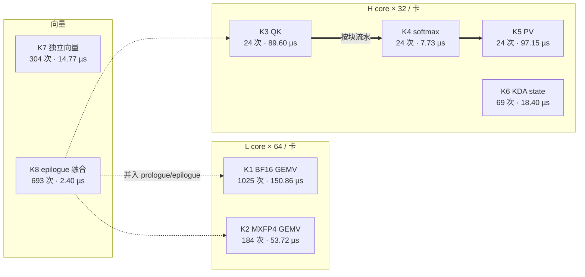
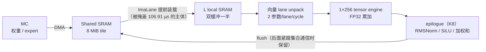
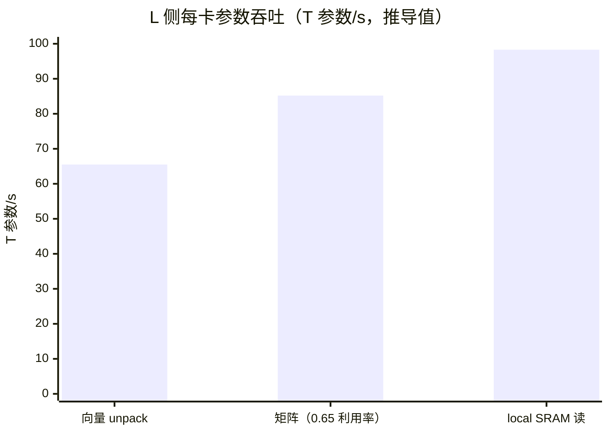
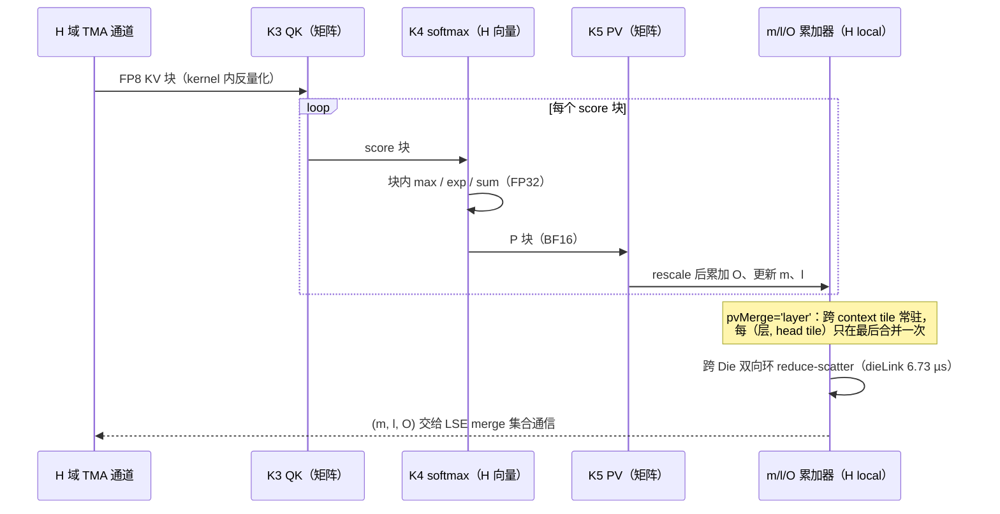
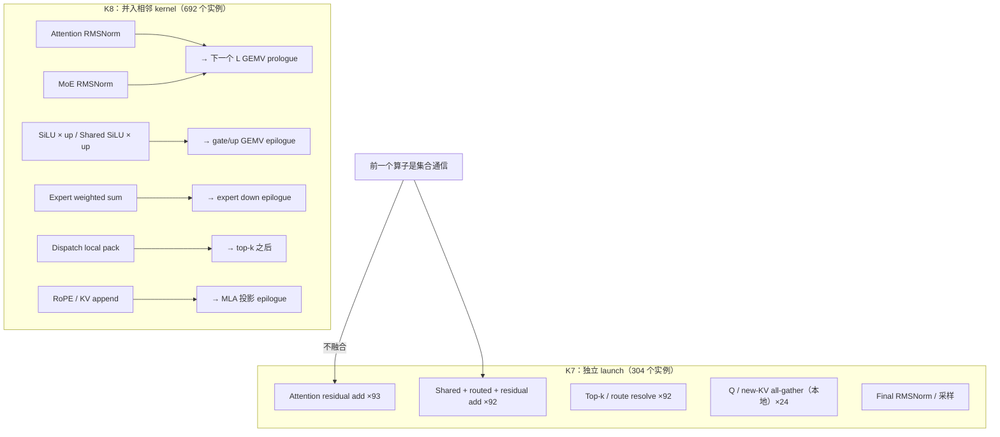

# K3 Kernel 规格（P1 发布点）

| | |
|---|---|
| Owner | SW-03 Kernel Optimization |
| 共签 | SW-04 Fusion（融合边界）、HW AI Core（[`02_AI_CORE.md`](../../hardware/docs/02_AI_CORE.md)） |
| Evidence class | `MODEL`（逐算子时长来自 `A.mappedPlan`，未经 kernel 实测或 RTL 回标，B-003） |
| 载荷条件 | K3，B=1，context 1M，TP32，PP1，8 Die/卡，P1 发布点 1101.77 TPS/usr |
| 数据来源 | `F.mapped(best.x).plan.ops`（`integration/detailed/k3_rdma_final_tuning_model.js`），`best.x` 取自 `out/rdma/k3_rdma_final_tuning_results.json#search.best.x` |
| 上游 | 时间账与机制回退见 [`21_TPS_DESIGN_BASELINE.md`](../../../docs/architecture/21_TPS_DESIGN_BASELINE.md) 第 2、4、5 节；精度口径见 [`PRECISION_POLICY.md`](PRECISION_POLICY.md) |

本文把发布点的 2347 个非通信算子实例（每 token）归成 8 个 kernel 族，给出每族的单元、shape、限制因素、时长和
contract 要求的必填字段（[`../contract.json`](../contract.json) 的 `requiredFields`）。集合通信的 393 次见
[`COLLECTIVE_SCHEDULE.md`](COLLECTIVE_SCHEDULE.md)。

## 0. 结论



1. **L 侧 GEMV 在模型中是向量 unpack 受限，不是矩阵受限。** B=1 下所有 L 侧权重算子的限制因素都是 `unpack`
   （第 2.2 节）。这决定了 L 侧 kernel 的优化方向是 “减少进入向量 lane 的参数”，不是 “提高矩阵利用率”。
2. **H 侧三件套（QK / softmax / PV）占 kernel 本体的 69%**（155.41 / 224.84 µs），其中 QK 与 softmax 已按块流水
   （`softmaxFusion`），PV 的 m/l/O 按层合并（`pvMerge='layer'`）。
3. **每 token 1655 次 launch**（2347 个算子减去 692 个 epilogue 融合算子），合 11.17 µs（第 7 节）。
4. 服务时间 ≠ 关键路径：`tmaFill` 134.77 µs 中 106.91 µs 被 TMA 通道掩盖，shared 专家 26.27 µs 与集合通信重叠。

## 1. Kernel 族目录

服务时间是每 token 该族全部实例 `duration` 之和；kernel 列只含 kernel 本体（不含 tmaFill、localTma、launch 等）。

| ID | Kernel 族 | 单元 | 覆盖的算子（实例数/token） | 服务 µs | kernel µs | 模型限制因素 | 权重/数据 dtype |
| --- | --- | --- | --- | ---: | ---: | --- | --- |
| K1 | L-GEMV BF16 dense | L | MLA Q/KV 投影 48、线性注意力投影 138、attention 输出投影 186、Latent Wdown 92、Router logits 92、Latent Wup 92、Shared gate/up 184、Shared down 184、LM head 9（共 1025） | 150.86 | 30.48 | `unpack` | BF16 权重，BF16 激活，FP32 累加 |
| K2 | L-GEMV MXFP4 routed | L | Expert gate/up 92、Expert down 92（共 184） | 53.72 | 26.66 | `unpack` | MXFP4 权重（32 权重/8-bit scale），BF16 激活 |
| K3 | QK（吸收式 MLA） | H | 24 | 89.60 | 78.27 | `matrix/vector` | FP8 KV（kernel 内反量化）× BF16 Q |
| K4 | Online softmax | H 向量 | 24 | 7.73 | 7.57 | `matrix/vector` | FP32 |
| K5 | PV + rescale | H | 24 | 97.15 | 69.57 | `matrix/vector`（另有 reduce 14.23、dieLink 6.73） | FP8 KV × BF16 P，FP32 m/l/O |
| K6 | KDA recurrent state update | H | 69 | 18.40 | 10.94 | `matrix/vector` | BF16 state，FP32 累加 |
| K7 | 独立向量算子 | V | 两类残差加 185、Top-k 92、Q/new-KV all-gather（本地）24、Final RMSNorm、采样、采样候选（共 304） | 14.77 | ≈0.2 | 访存/launch | BF16 |
| K8 | epilogue 融合算子 | 宿主 kernel 的向量单元 | Attention/MoE RMSNorm、RoPE、KV append、SiLU×up、Shared SiLU×up、dispatch pack、专家加权和（共 693，其中 692 融合） | 2.40 | 1.19 | 访存 | BF16 / FP32 |
| **合计** | | | **2347** | **434.62** | **224.84** | | |



## 2. K1 / K2：L 侧 GEMV

### 2.1 Shape 与切分

B=1 decode 下 L 侧全部是 GEMV（M = 1）。权重按 TP32 切分后再在卡内 8 Die × 8 L core 上分块：

| 项 | 值 | 来源 |
| --- | --- | --- |
| tensor engine | 每 L core 8 个 1×256 | 21 号文档第 3.2 节 |
| 权重 tile | 8 MiB（`x.weightTileMiB`）；大于 tile 的投影拆成多个实例（例如线性注意力投影 “weight tile 1/2”） | `best.x` |
| L local SRAM | 1 MiB/core，双缓冲，发布点占用 0.36 MiB | 21 号文档第 3.3 节 |
| 激活 | BF16 hidden 7168 或 latent 3584 | K3 形状 |
| routed expert 行数 | B × 16 / TP；B=1 时 fill 仍为 1（L 阵列只有 1 行） | `mappedPlan()` |



### 2.2 为什么是 unpack 受限

`mappedPlan()` 对每个算子取 `kernel = max(alu, localRead, localWrite, unpack) × layoutImbalance(1.15)`，其中

```text
unpack = 权重参数数 / (N_L × vectorLanes × unpackParamsPerLaneCycle × f)
       = 参数数 / (64 × 512 × 2 × 1 GHz)      = 参数数 / 65.5 T参数/s（每卡）
alu    = 2 × 参数数 / (L 峰值 × matrixUtil)
       = 2 × 参数数 / (262.1 TF × 0.65)        = 参数数 / 85.2 T参数/s（每卡）
```

每卡 unpack 吞吐 65.5 T 参数/s 低于矩阵等效的 85.2 T 参数/s，所以 L 侧全部 1209 个权重算子的限制因素都是 `unpack`。



local SRAM 读按 196.6 TB/s/卡、BF16 每参数 2 B 折算为 98.3 T 参数/s，也不是瓶颈。

对 kernel 设计的含义：

- 模型对 BF16 dense 权重也按同一速率计 unpack（`TECH.unpackParamsPerLaneCycle = 2`）。**BF16 权重是否必须经过向量 lane
  （格式转换 / 重排）是 kernel 设计要回答的问题**；如果 BF16 可以直通矩阵单元，K1 会变成矩阵受限，kernel 本体下降约 23%
  （65.5 / 85.2，推导值，未计入任何预算）。
- MXFP4（K2）必须 unpack，这一项是真实成本；提高每 lane 每 cycle 的 unpack 参数数是 HW AI Core 的需求（02 号文档）。
- 两项都属于 `A.TECH` 的固定假设，按 21 号文档第 8 节的变更流程修改。

### 2.3 融合

| 融合 | 状态 | 说明 |
| --- | --- | --- |
| RMSNorm + 投影（prologue） | 已实现（`epilogueFusion`） | Attention/MoE RMSNorm 并入下一个 GEMV，不单独装载、写回、launch |
| SiLU × up（epilogue） | 已实现 | 并入 gate/up GEMV |
| 专家加权和、dispatch pack | 已实现 | 并入 expert down / top-k 之后的 kernel |
| QKV 融合 | 模型内已是一个算子（`MLA Q/KV projections`） | 拆成 2 个 weight tile 实例 |
| Wdown + Router 共用激活 | 两个 GEMV 读同一个 h_norm，输出合并为一次 all-gather（DAG 结构） | `OPT.wupRouterFusion` 只通过 GAIN 起作用，GAIN = 1，对时长无贡献 |
| 残差加 | **不融合** | 紧跟集合通信，必须等规约完成 |

## 3. K3–K5：H 侧 MLA 三件套

### 3.1 Tiling

| 项 | 值 |
| --- | --- |
| H tensor engine | 每 H core 5 个 48×128，BF16 |
| head tile | 96（K3 全部 96 head 一次） |
| KV tile | 32768 token；1M / TP32 = 32768，所以每 rank 每层恰好一个 KV tile |
| KV 每层每 rank | 32768 × 656 B = 21495808 B（FP8 FlashMLA 布局） |
| H local SRAM | 4 MiB/core，发布点占用 2.74 MiB；BF16 KV 放不下（21 号文档第 5 节） |
| QK 维度 | 512 latent + 64 RoPE；PV 维度 512 |

### 3.2 流水



- **softmaxFusion**：softmax 只暴露一个块，或超出 QK 本体的部分；FP8 反量化的向量时间从可掩盖预算中扣除。
  单独回退后 1033.22 TPS/usr。
- **pvMerge**：`'tile'` 时每个 KV tile 都合并一次；发布点 `'layer'`。单独回退后 1082.21。
- **FP8 KV**：QK 与 PV 都在 kernel 内反量化 latent（与权重 unpack 同速率），精度见 PRECISION_POLICY。

### 3.3 K6：KDA recurrent state update

69 个线性注意力层每层一次，state 128 × 128 每 head，BF16 存储、FP32 累加。state 与 context 长度无关，
按层随权重一起预取（`kvPrefetch='window'` 同样覆盖 state）。

## 4. K7 / K8：向量算子与 epilogue 融合



K7 的服务时间几乎全是 `localTma`（装载 / flush）和 launch；向量本体约 0.2 µs。残差加不能融合的原因是它们头接集合通信，
结果要等规约完成。Top-k 是 MoE 关键路径上的串行点（92 × 约 0.047 µs）。

`epilogueFusion` 单独回退后 1077.23 TPS/usr。

## 5. contract 必填字段

`teams/software/contract.json#requiredFields` 要求每个优化/kernel 给出以下字段。当前状态：

| 字段 | K1/K2 | K3–K5 | K6 | K7/K8 |
| --- | --- | --- | --- | --- |
| applicable models/operators | K3 全部 L 侧权重算子；GLM/DS 见 [`MULTI_MODEL_LOWERING.md`](MULTI_MODEL_LOWERING.md) | K3 24 个 MLA 层 | K3 69 个 KDA 层 | K3 全部 |
| shape/dtype legality | 第 2.1 节 | 第 3.1 节；BF16 KV 不合法（H local 放不下） | 第 3.3 节 | 融合只在前一个算子不是集合通信时合法 |
| workspace/alias | local 双缓冲；y_routed partial 跨 shared 专家存活（B-007） | m/l/O 累加器常驻 H local | state 常驻 shared | epilogue 原地 |
| precision impact | MXFP4 已是模型 dtype | FP8 KV 未评估（B-001、O-013） | 无变化 | 无变化 |
| fallback | 无融合的独立算子 | `pvMerge='tile'`、`softmaxFusion=false`、`kvCache='bf16'`（需 KV tile 16384） | — | `epilogueFusion=false` |
| launch count | 1209 | 72 | 69 | 305（K8 仅 1 次） |
| resource occupancy | L local 0.36 MiB/core | H local 2.74 MiB/core | — | — |
| measured or estimated gain | 估计（`MODEL`） | 估计（逐项回退见 21 号文档第 5 节） | 估计 | 估计 |
| schedule trace | **缺**：无 kernel trace | **缺** | **缺** | **缺** |

## 6. Launch

```text
非通信算子         2347
− epilogue 融合      692
= launch 次数      1655 / token
× launchUs 0.015 µs × launchScale 0.45 = 11.17 µs / token
```

`launchScale 0.45` 是未回标的假设（B-003）。`launchBatching` 单独回退后 1088.47 TPS/usr。
runtime 侧的持久化执行见 [`COMPILER_RUNTIME_AND_FIRMWARE.md`](COMPILER_RUNTIME_AND_FIRMWARE.md) 第 4 节。

## 7. 证据缺口与下一步

| # | 缺口 | 影响 | 责任 |
| --- | --- | --- | --- |
| 1 | 无任何 kernel 的 cycle 级实测或 RTL 性能模型 | 全部 kernel 时长为 `MODEL` | SW-03 + HW AI Core |
| 2 | BF16 权重是否需要经过向量 unpack（第 2.2 节） | K1 kernel 本体可能高估约 23% | SW-03 |
| 3 | `matrixUtil 0.65`、`vectorUtil 0.35`、`layoutImbalance 1.15` 是固定假设 | 所有 kernel | SW-03 提供 kernel 证据后按变更流程修改 |
| 4 | FP8 KV 精度 | K3–K5 的合法性 | MODEL-06 + SW-03（PRECISION_POLICY） |
| 5 | Top-k kernel 的串行延迟（每层约 0.047 µs）未单独建模向量 compare-select | MoE 关键路径 | SW-03 |
| 6 | 生成 schedule trace（contract 的 `schedule trace` 字段） | contract blocker | SW-06 |

## 8. 复现

仓库根目录执行：

```js
const F=require('./integration/detailed/k3_rdma_final_tuning_model.js');
const best=require('./out/rdma/k3_rdma_final_tuning_results.json').search.best.x;
const agg={};
for(const o of F.mapped(best).plan.ops){if(o.unit==='COMM')continue;
  const a=agg[o.name]||(agg[o.name]={n:0,us:0,lim:o.mapping.limiter,fused:0});
  a.n++;a.us+=o.duration;if(o.mapping.fused)a.fused++;}
console.table(agg);
```
