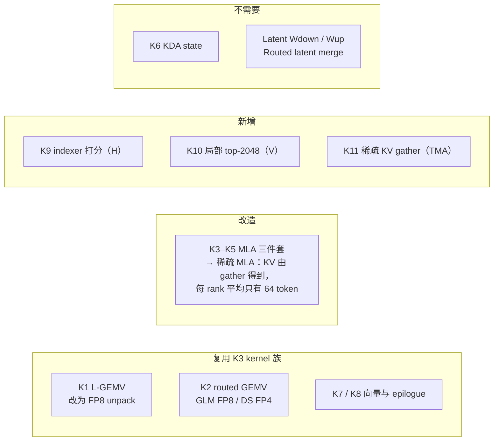
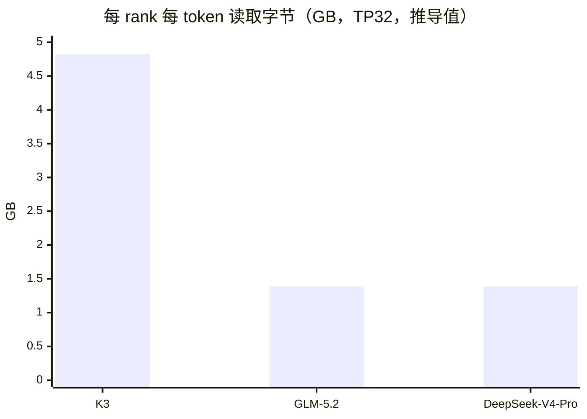
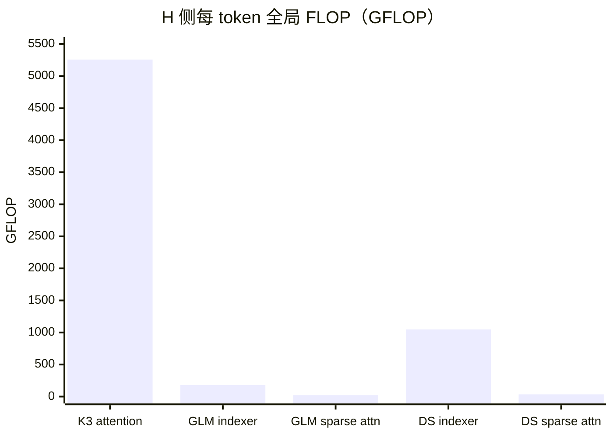
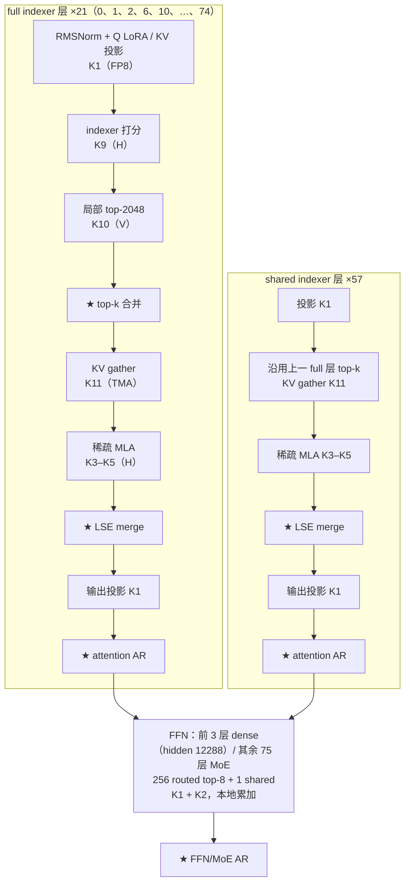
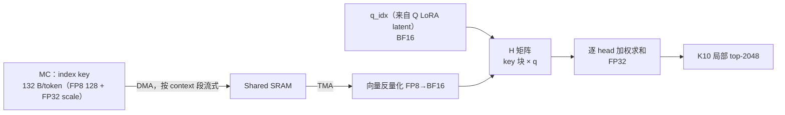
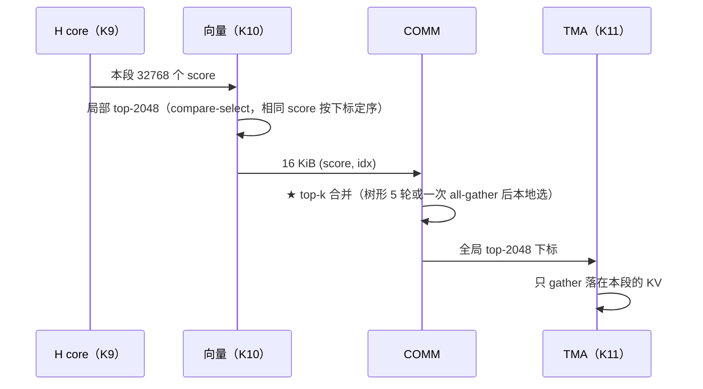
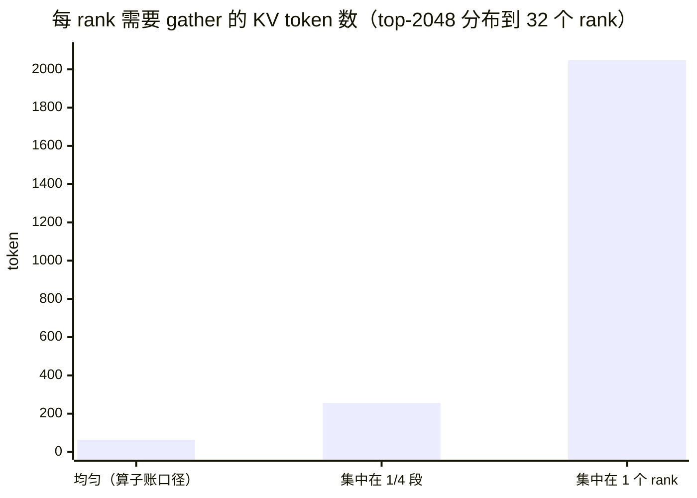

# GLM-5.2 / DeepSeek-V4-Pro 的 Kernel Lowering

| | |
|---|---|
| Owner | SW-03 Kernel Optimization |
| 共签 | SW-01 Model Lowering、SW-05 Collective、MODEL-01 Manifest |
| Evidence class | `PLANNING_ESTIMATE` / ASSUMPTION：两个模型都只有规划算子账（5 行/模型），**没有逐算子映射计划和模拟器回放** |
| 载荷条件 | B=1，context 1M，TP32（设计点），PP1，TP-only FFN/MoE（[ADR-0020](../../council/adr/ADR-0020-tp-only-ffn-moe.md)） |
| 权威来源 | 形状：`teams/model/inputs/formal_model_manifests.json`；推导：`teams/model/src/workload_derivation.js`；算子账：`out/workload/planning_operator_workload.json#/operators`；部署方案：[`GLM-5.2.md`](../../model/docs/deployment/GLM-5.2.md)、[`DeepSeek-V4-Pro.md`](../../model/docs/deployment/DeepSeek-V4-Pro.md) |
| 相关 | K3 的 kernel 族定义：[`KERNEL_SPEC.md`](KERNEL_SPEC.md)；精度：[`PRECISION_POLICY.md`](PRECISION_POLICY.md)；集合通信：[`COLLECTIVE_SCHEDULE.md`](COLLECTIVE_SCHEDULE.md) 第 6 节 |

本文说明两个非 K3 模型如何落到同一套 L/H/V/COMM 单元上：哪些算子复用 K3 的 kernel 族，哪些需要新 kernel，
以及 lowering 暴露出的未决问题。文中字节与 FLOP 是规划推导值，不抄写 TPS。

## 0. 结论

1. **长上下文成本从 KV 转到 index key。** 两个模型的 attention 只读 top-2048 个 KV，但 indexer 要扫全部 1M 个 index key。
   DeepSeek-V4-Pro 的 indexer 每 token 1047.97 GFLOP，是 K3 attention（5257.04 GFLOP）的 20%；GLM-5.2 只有 21 层有 indexer，180.39 GFLOP。
2. **L 侧仍是字节受限。** 两个模型的 dense 权重是 FP8，每 rank 每 token 读 0.58–0.64 GB，是 K3（3.47 GB，BF16）的约 1/6。
   按 K3 的 unpack 规则，FP8 与 MXFP4 一样要过向量 lane。
3. **稀疏注意力的负载均衡是新风险。** 全局 top-2048 按 context 段分布到 32 个 rank，平均每 rank 64 个 token；
   若集中在最近的 token，最坏一个 rank 承担全部 2048 个（32×）。当前算子账按平均摊，没有建模这一点。
4. **router 的切分方式与集合通信计数不一致**（第 5 节缺口 1）：字节账按切分计 router，集合通信计数里却没有 router 的 gather。

## 1. 每 token 的工作量

`planning_operator_workload.json#/operators` 的行格式为 `[operatorId, coreClass, globalFLOP, globalBytes, bytesClass]`，
是 TP 切分前的全局量。下表另给出 ÷32 的每 rank 字节（推导值）。

| 算子类 | 单元 | K3 GFLOP / GB | GLM-5.2 GFLOP / GB | DeepSeek-V4-Pro GFLOP / GB |
| --- | --- | --- | --- | --- |
| dense_projection | L | 111.16 / 111.16 | 35.30 / 18.72 | 38.66 / 20.42 |
| routed_moe | L | 97.24 / 25.83 | 45.30 / 22.65 | 57.49 / 15.27 |
| attention / sparse_attention | H | 5257.04 / 16.51 | 22.25 / 0.105 | 34.80 / 0.082 |
| indexer | H（`INDEXER` 按 H 峰值计） | — | 180.39 / 2.91 | 1047.97 / 8.44 |
| kda_state | V | 0.76 / 0.43 | — | — |
| collective_reduce | REDUCE | 0.28 / 0.57 | 0.10 / 0.20 | 0.11 / 0.22 |
| **合计** | | **5466.5 / 154.50** | **283.3 / 44.58** | **1179.0 / 44.44** |
| **每 rank 字节** | | **4.83 GB** | **1.39 GB** | **1.39 GB** |

DeepSeek-V4-Pro 的 routed 字节与 expert hidden 的解法有关（点估计 3841 / 变体 3300，部署方案第 6 节），
变体下 routed_moe 为 13.12 GB（`variants.DeepSeek-V4-Pro.expertHiddenFromTotal`）。

## 2. 层结构与 kernel 映射

### 2.1 GLM-5.2（78 层）

### 2.2 DeepSeek-V4-Pro（61 层）

每层都有 indexer（64 head × 128 维），结构同 GLM 的 full indexer 层；前 3 层 dense FFN（hidden 18432），其余 58 层 MoE
（384 routed top-6 + 1 shared）。routed 权重 FP4（与 MXFP4 同字节，ASSUMPTION）。

### 2.3 kernel 族映射表

| K3 kernel 族 | GLM-5.2 | DeepSeek-V4-Pro | 变化 |
| --- | --- | --- | --- |
| K1 L-GEMV dense | FP8 投影、dense FFN、shared expert；router / LM head 仍 BF16 | 同左 | 反量化从 BF16 “格式转换” 变为 FP8 + 128×128 block scale；按 K3 规则同样计 unpack |
| K2 routed GEMV | FP8，8 个 expert | FP4，6 个 expert | 输入是 hidden 而不是 latent；每 rank 切片宽度 = expert hidden / 32 |
| K3–K5 MLA 三件套 | 稀疏 MLA，64 head，latent 512 + RoPE 64，v head 256 | 128 head，v head 128 | KV 不再是连续 32768 token tile，而是 gather 后的变长小块 |
| K6 KDA | — | — | 不需要 |
| K7 / K8 | 同 K3 | 同 K3 | Top-k 改为 top-8 / top-6 |
| **K9 indexer 打分** | 32 head × 128，21 层 | 64 head × 128，61 层 | 新增：FP8 index key 反量化 × q，H 矩阵 |
| **K10 局部 top-2048** | 21 层 | 61 层 | 新增：向量 compare-select，输出 (FP32 score, INT32 idx) |
| **K11 稀疏 KV gather** | 78 层 | 61 层 | 新增：非连续 TMA descriptor（13 号文档第 3.2 节的硬件需求） |

## 3. 新 kernel 的设计要点

### 3.1 K9 indexer 打分

- 每 rank 扫本段 32768 个 key：DeepSeek 每层 32768 × 132 B = 4.33 MB，61 层 264 MB/token（与第 1 节每 rank 0.264 GB 一致）。
- index key 与 KV 分开计费、分开 buffer class（13 号文档第 4 节）。
- 算子账里 `INDEXER` 按 H 峰值计时（`teams/hardware/src/resource_profiles.js#peakByCore.INDEXER = H`）；
  时间系数 kFlop 只在 K3 上拟合，用于 INDEXER 是外推（`calibration` 的说明）。

### 3.2 K10 + top-k 合并

确定性规则见 [`PRECISION_POLICY.md`](PRECISION_POLICY.md) 第 5 节；合并语义见
[`07_COLLECTIVE_RDMA.md`](../../hardware/docs/07_COLLECTIVE_RDMA.md) 第 2.2 节。

### 3.3 K11 + 稀疏 MLA 的负载均衡

稀疏 MLA 在每个 rank 上只处理落在本段的 token，再用 LSE merge 合并。关键路径由最忙的 rank 决定：

- 均匀分布时每 rank 64 token，H 侧工作量可以忽略；
- 最近 token 往往得分高，top-k 集中在最后一个 context 段时，一个 rank 处理全部 2048 个；
- 缓解办法（未建模）：context 按 token 交错而不是按连续段分配给 rank，使 top-k 天然分散；代价是 KV append 与
  index key 的写入也要按交错布局。

## 4. L 侧：窄 expert 切片

TP-only 把每个 expert 按 rank 切开（ADR-0020）。每 rank 的切片宽度：

| 模型 | expert hidden | 每 rank 宽度（÷32） | 每 rank 每 expert 参数 |
| --- | ---: | ---: | ---: |
| K3（对照；latent 3584 输入） | 3072 | 96 | 3 × 3584 × 96 = 1.03 M |
| GLM-5.2 | 2048 | 64 | 3 × 6144 × 64 = 1.18 M |
| DeepSeek-V4-Pro | 3841（点估计） | 约 120 | 3 × 7168 × 120 ≈ 2.58 M |

- gate/up 的输出只有 64 / 120 列，小于 1×256 tensor engine 的宽度；要把 K 维（hidden）铺到 engine 上才不浪费阵列。
  K3 的模型里 L 侧是 unpack 受限，所以切片宽度不影响时长；**若 BF16/FP8 可直通矩阵（KERNEL_SPEC 第 2.2 节），宽度会变成问题**。
- 每 rank 每层要读 8 个（GLM）或 6 个（DS）小切片，每个只有 1–3 MB，DMA 描述符数量比 K3 多；需要按 expert 打包预取。

## 5. 缺口

| # | 缺口 | 影响 | 责任 |
| --- | --- | --- | --- |
| 1 | router 切分：字节账按切分计 router（`H × routedExperts` 只算一份），但每层集合通信里没有 router 的 gather。若改为每 rank 复制 router，每 rank 每层多读 GLM 3.1 MB / DS 5.5 MB（每 token 多约 0.24 / 0.32 GB，相当于每 rank 字节的 +17% / +23%）；若保持切分，每 MoE 层多 1 次集合通信 | 字节或次数二选一，当前两边都没计 | MODEL-01 + SW-05 |
| 2 | 两个模型没有逐算子映射计划，无法给出 KERNEL_SPEC 那样的逐族时长 | 全部为 `PLANNING_ESTIMATE` | SW-03 + SW-06 |
| 3 | 稀疏 MLA 的负载不均衡（第 3.3 节） | 关键路径可能远高于算子账 | SW-03 + SW-05 |
| 4 | indexer 的 kFlop 外推 | indexer 时长 | MODEL-06 |
| 5 | top-k 合并的实现（树形 vs all-gather） | 每 token 21 / 61 次集合通信的时长 | SW-05 |
| 6 | 窄 expert 切片的矩阵映射（第 4 节） | 仅在 unpack 不受限时生效 | SW-03 + HW AI Core |
| 7 | MTP 分支、accept/reject 与回滚（13 号文档第 3.2 节） | 不计入 TPS/usr，但 runtime 需支持 | SW-06 |
