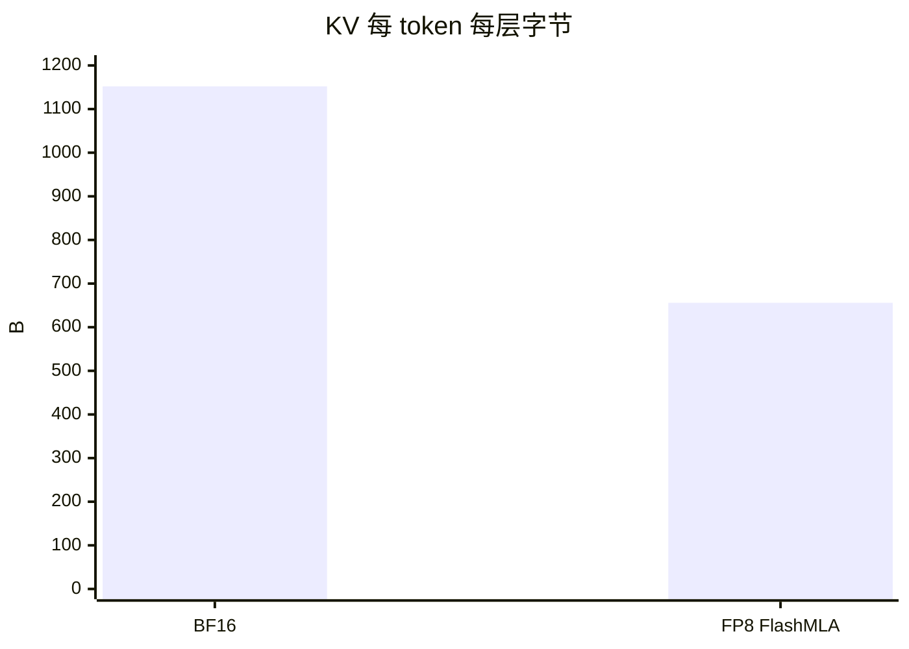
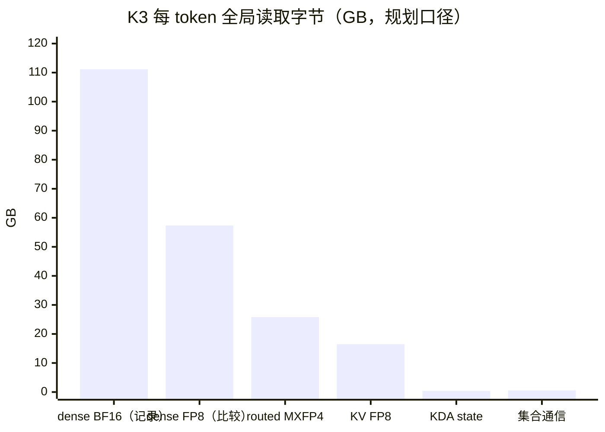
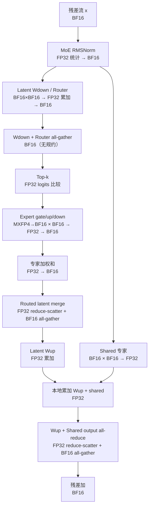
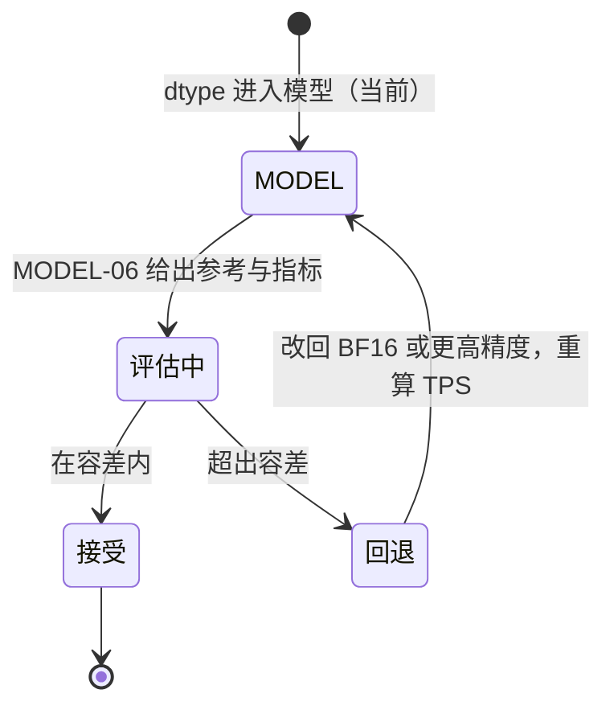

# 精度策略（Precision Policy）

| | |
|---|---|
| Owner | SW-03 Kernel（数值实现）、MODEL-06 Model KPI/Acceptance（精度验收） |
| 共签 | SW-05 Collective（规约精度）、HW AI Core（[`02_AI_CORE.md`](../../hardware/docs/02_AI_CORE.md) 的 dtype 数据通路） |
| 状态 | `MODEL`：dtype 口径已进入模型，**精度影响未评估**（B-001、O-012、O-013、O-014） |
| 权威来源 | K3：`teams/model/src/design_engine.js#MODEL_PRESETS.kimiK3.dtype`、`OPT.kvCache`；GLM-5.2 / DeepSeek-V4-Pro：`teams/model/inputs/formal_model_manifests.json`；汇总：`out/workload/planning_operator_workload.json#dtypePolicy` |

本文规定三个模型在本平台上每类张量的存储 dtype、计算 dtype、累加 dtype 和取整点。部署方案中的 dtype 表
（[`teams/model/docs/deployment/`](../../model/docs/deployment/README.md)）是本文的模型侧摘要；两者冲突时以 manifest 为准。

## 0. 总则


1. **矩阵计算一律 BF16，累加一律 FP32。** 低精度只用于存储（权重、KV、index key），在 kernel 内反量化。
2. **每个取整点都要登记。** 新增融合或改变集合通信时，必须说明取整点是增加还是减少（第 4 节）。
3. **存储 dtype 的改变是模型格式变更，不是软件优化。** 它改变 MC 字节，必须走 manifest + ADR，
   且在精度验收（第 6 节）通过前只能标 `MODEL`。

## 1. 三个模型的 dtype 表

| 张量 | K3 | GLM-5.2 | DeepSeek-V4-Pro |
| --- | --- | --- | --- |
| attention / dense 投影 | BF16 | FP8 E4M3，128×128 block scale | FP8（ASSUMPTION） |
| shared expert | BF16 | FP8 | FP8（ASSUMPTION） |
| routed expert | MXFP4（32 权重共享 8-bit scale，0.53125 B/参数） | FP8 | FP4，同 MXFP4 字节（ASSUMPTION） |
| router、LM head | BF16 | BF16 | BF16（与 GLM 对齐，ASSUMPTION） |
| indexer 权重 | — | FP8 | FP8（ASSUMPTION） |
| KV cache | FP8 FlashMLA，656 B/token/层 | 同左（ASSUMPTION） | 同左（ASSUMPTION） |
| index key | — | FP8 128 维 + FP32 scale，132 B/token（21 个 full 层） | 同左，每层（ASSUMPTION） |
| 线性注意力 state | BF16 | — | — |
| 激活 | BF16 | BF16 | BF16 |
| 累加 / softmax / LSE | FP32 | FP32 | FP32 |

GLM-5.2 的 dtype 来自公开 `GLM-5.2-FP8` 的 `quantization_config`；DeepSeek-V4-Pro 全部为 ASSUMPTION。
128×128 FP32 block scale 在字节账里忽略（约 0.02%）。

## 2. 存储格式

### 2.1 FP8 KV（FlashMLA 布局）

```text
每 token 每层 656 B
┌──────────────────────────────── 512 B ────────────────────────────────┬── 16 B ──┬──── 128 B ────┐
│ latent 512 维 FP8 E4M3                                                 │ 4 × FP32 │ RoPE 64 维    │
│ （每 128 维一组，共 4 组）                                              │ scale    │ BF16（不量化）│
└────────────────────────────────────────────────────────────────────────┴──────────┴───────────────┘
BF16 布局：512 × 2 + 64 × 2 = 1152 B
```



- 每 rank 每层 32768 token × 656 B = 21.5 MB，正好是一个 KV tile（[`KERNEL_SPEC.md`](KERNEL_SPEC.md) 第 3.1 节）。
- BF16 布局在 KV tile 32768 下放不进 H local SRAM；KV tile 16384 时 BF16 可行，1027.08 TPS/usr（21 号文档第 6 节）。
- RoPE 部分保持 BF16：位置编码对量化误差敏感，FlashMLA 的做法。

### 2.2 MXFP4 routed expert

```text
32 个权重 × 4 bit = 16 B  +  1 × 8-bit 共享 scale = 17 B   →   0.53125 B/参数
```

在 L core 向量 lane 上 unpack 为 BF16 后进入矩阵（KERNEL_SPEC 第 2.2 节）。

### 2.3 FP8 权重（GLM-5.2 / DeepSeek-V4-Pro）

128×128 block 共享一个 FP32 scale。反量化与 MXFP4 走同一条向量 unpack 通路；block scale 的装载随权重 tile。

K3 的 dense 权重是 BF16。若 K3 的 dense 也改成 FP8，全局 dense 字节从 111.16 GB 降到 57.34 GB
（`comparisons.K3-FP8-dense`）——**这是一个模型格式问题（O-012），不是 K3 的记录配置，也不计入任何收益**。



## 3. 以 K3 MoE 层为例的数值通路



## 4. 集合通信的精度

| 集合通信 | 协议 kind（`R.collective`） | 规约 dtype | 分发 dtype | 取整点 |
| --- | --- | --- | --- | --- |
| Attention output all-reduce | FP32 reduce-scatter + BF16 all-gather | FP32 | BF16 | 1 次（all-gather 前） |
| Wup + Shared output all-reduce | 同上 | FP32 | BF16 | 1 次（融合前是 2 次，见下） |
| Routed latent merge | 同上 | FP32 | BF16 | 1 次 |
| Wdown + Router all-gather | all-gather | 无规约 | BF16 | 0 |
| LSE merge / output reduce-scatter | LSE reduce-scatter | FP32 max / exp / 加权和 / 归一化 | FP32 → BF16 | 1 次（归一化后） |
| indexer top-k merge（GLM/DS） | compare-select | FP32 score + INT32 下标 | — | 0；相同 score 按下标定序，保证确定性 |

- FP32 reduce-scatter 让传输字节变成 payload 的 2 倍（`transportBytes = 2 × payload`），这是精度换字节的显式代价；
  由于每次消息远小于一个 stripe，时间按 τ 计，这一代价在发布点不影响 TPS。
- 合并 `Wup` 与 `Shared output` 两次 all-reduce 后少一次 BF16 取整：原来是两次 “规约→BF16”再相加，
  现在是 FP32 本地相加后规约一次（[`COLLECTIVE_SCHEDULE.md`](COLLECTIVE_SCHEDULE.md) 第 2.3 节）。
- LSE 不是普通求和，Reduce 引擎必须支持 “max 后缩放再加” 的复合操作
  （[`07_COLLECTIVE_RDMA.md`](../../hardware/docs/07_COLLECTIVE_RDMA.md) 第 2.1 节）。

## 5. 确定性

| 项 | 要求 |
| --- | --- |
| TP 规约顺序 | 固定环 / 树顺序，按 rank 编号；不允许按到达顺序累加 |
| 卡内 8 Die 规约 | 固定层次（Die 内 → 卡内 → 跨卡） |
| top-k 平局 | 相同 score 按全局 token 下标决定次序 |
| 采样 | 固定 seed；分布式采样候选的合并顺序固定 |

同一输入在同一 TP 配置下必须逐位可重现；跨 TP 配置（TP8/16/32）只要求在第 6 节的容差内一致。

## 6. 精度验收（待定）



| 项 | 参考 | 需要的对比 | 状态 |
| --- | --- | --- | --- |
| FP8 KV（三个模型） | BF16 KV | 长上下文（1M）检索与生成质量 | 未评估（B-001、O-013） |
| MXFP4 / FP4 routed expert | 模型发布格式 | K3 已是发布格式；DS 为 ASSUMPTION | DS 待确认 |
| FP8 dense（GLM 已是发布格式） | — | K3 若改 FP8 dense 需完整评估 | 未启动（O-012） |
| LM head 精度与分片 | BF16 | 采样分布一致性 | 未评估（O-014） |

具体指标和容差由 MODEL-06 定义；在它们给出之前，本文所有低精度格式都只是 `MODEL` 口径，不是可发布配置。
