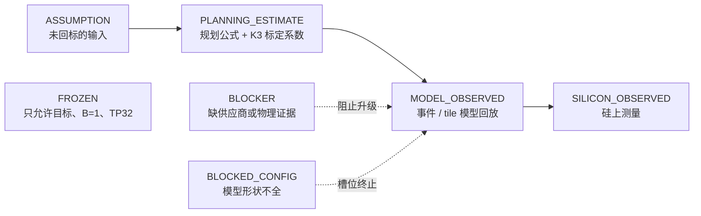
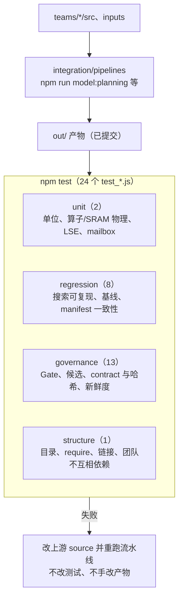
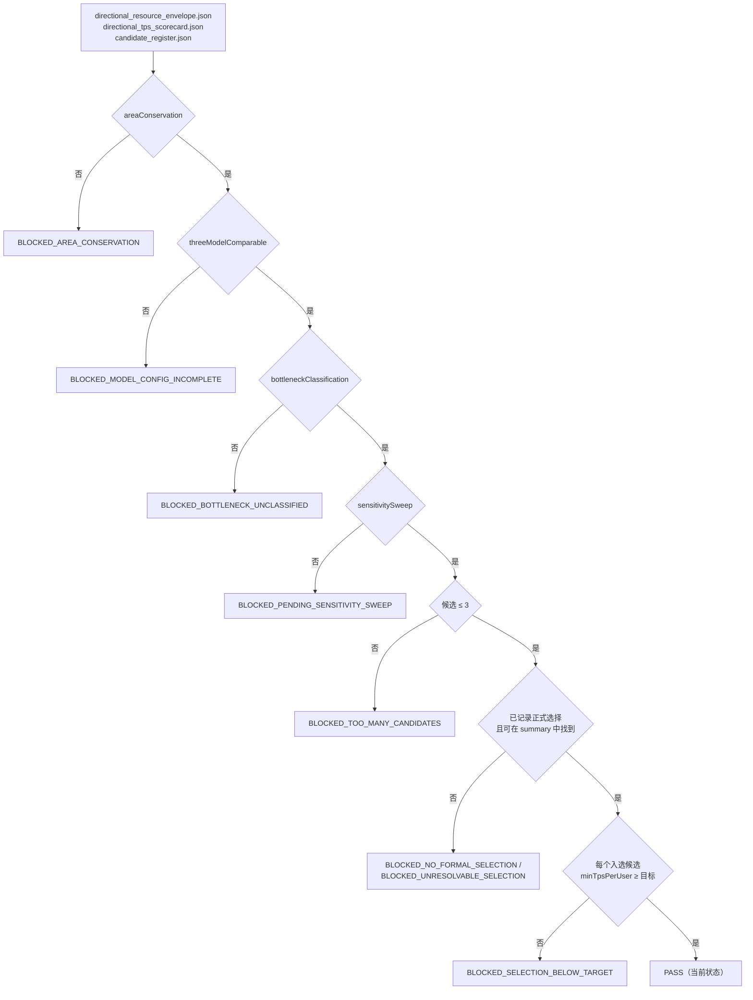
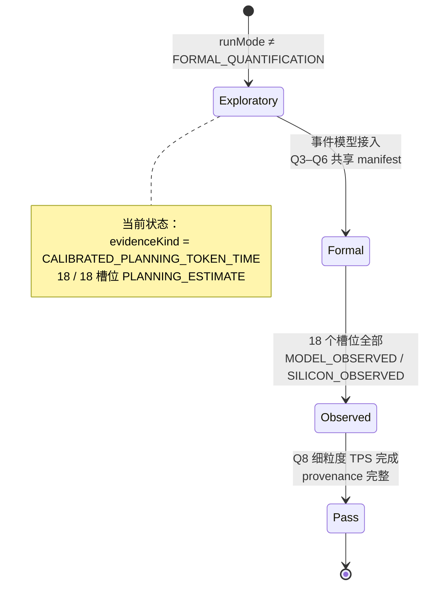
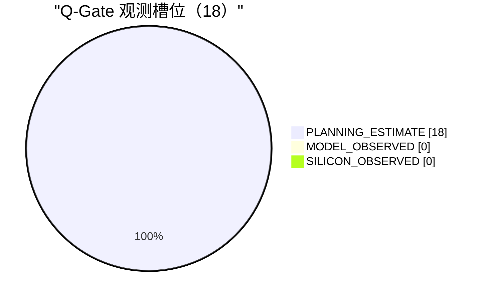
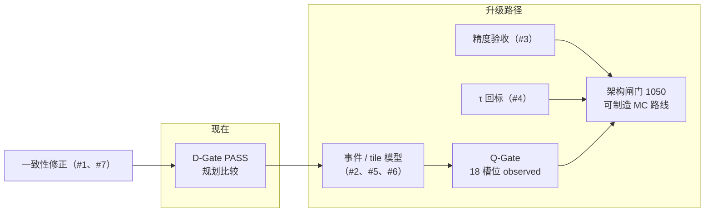

# V&V 计划

- 所有者：V&V（独立于 Hardware / Software / Model）
- 状态：描述现有测试与 Gate 的实际行为；第 5 节是待补的验证项
- 代码：[`tests/`](../../../tests/README.md)、`integration/governance/evaluate_gates.js`；结果在 `out/governance/gate_status.json`

本文回答三个问题：每类结论要什么证据才能用，哪些测试守着哪些不变量，两个 Gate 分别怎样判定、现在卡在哪里。

## 0. 结论

1. D-Gate（方向比较）已通过：8 项检查全部成立。它只说明规划比较可信，**不等于架构冻结**，范围标记为 `PLANNING_COMPARISON_ONLY_NOT_ARCHITECTURE_FREEZE`。
2. Q-Gate（定量）未通过：18 个观测槽位全是 `PLANNING_ESTIMATE`，没有一个 `MODEL_OBSERVED` / `SILICON_OBSERVED`；Q3–Q6 共享 manifest 和 Q8 细粒度 TPS 未完成。
3. 架构闸门（1050 TPS/usr，可制造 MC 路线，详细 tile 模型）也未通过（doc 21 第 7 节）。发布点的 1101.77 是 `MODEL` 等级，计算过程见 `docs/architecture/00_CURRENT_STATE.md` 第 3 节。
4. V&V 只能阻止 Gate，不能改被测团队的输入。修复只能从上游改：source → 流水线 → `out/` 产物。

## 1. 证据等级

| 等级 | 含义 | 能用来做什么 | 不能用来做什么 |
|---|---|---|---|
| `ASSUMPTION` | 没有回标的输入值（如 launchScale 0.45、预测命中率 0.8） | 进入模型，必须带敏感度 | 当作结论引用 |
| `PLANNING_ESTIMATE` | 规划链路算出的数（`teams/model/docs/deployment/OPERATOR_LEDGER.md`） | 候选之间比较、D-Gate | 当作发布点或 Q-Gate 证据 |
| `MODEL` / `BASELINE` | 详细模型推导的发布点（doc 21） | 设计基线、单元规格 | 标成 `FROZEN`（ADR-0003） |
| `MODEL_OBSERVED` | 事件 / tile 模型回放，带 runId、manifestHash、source | Q-Gate 槽位 | — |
| `SILICON_OBSERVED` | 硅上测量 | Q-Gate 槽位、回标系数 | — |
| `BLOCKER` | 依赖外部证据（B-002 MC 带宽、B-008 τ 等） | 阻止升级 | 被下游当成已知 |
| `BLOCKED_CONFIG` | 模型字段不全，槽位无法计算 | 算作“已计入”，不算“可比” | — |

agent 字段的 `confidence` 另用 E0–E3（`teams/council/docs/18_AGENT_CATALOG_AND_INTERACTION_PROTOCOL.md`），与上表并行：E 表示字段来源的可信度，上表表示结论的证据类型。

规则：

- 估计和测量分开存放，任何产物都不能把 `PLANNING_ESTIMATE` 的数字写进 observed 字段。
- 升级证据等级只能靠新的产物，不能靠改标签。

## 2. 测试分组

| 组 | 守的不变量 | 代表测试 |
|---|---|---|
| unit | 单位换算、算子与 SRAM 模拟物理、LSE 合并语义、mailbox 生命周期 | `test_directional_units.js`、`test_k3_operator_sram_sim.js` |
| regression | 存储的 `inputHash` 与当前 source 一致；设计基线、TPS 基线、K3 manifest、多模型 profile 与 TP 矩阵、详细 sizing 守恒 | `test_tps_design_baseline.js`、`test_k3_manifest_consistency.js`、`test_detailed_sizing_conservation.js` |
| governance | Gate 判定、候选选择、跨团队 contract 与哈希、集成新鲜度、dashboard、Stage A/B 运行、组织文档 | `test_architecture_gate_governance.js`、`test_cross_team_contracts.js`、`test_integration_freshness.js` |
| structure | 必需目录存在、本地 `require` 与 markdown 链接可解析、`teams/*` 不依赖其他团队、`integration/`、`out/` | `test_project_structure.js` |

### 2.1 守恒检查

| 守恒量 | 两端 | 位置 |
|---|---|---|
| 面积 | 各单元面积之和 = 封装包络 | D-Gate `areaConservation` |
| 算子字节 / FLOP | 规划算子账 ↔ K3 详细模型（比值 0.996 / 1.001） | OPERATOR_LEDGER 第 3 节、regression |
| 集合通信次数 | 393 = 各类计数之和；GLM 255、DS 244 | `COLLECTIVE_SCHEDULE.md`、`sync_baseline_spec.js` |
| 时间账 | doc 21 的发布点时间账与流水线产物一致 | `test_tps_design_baseline.js` |
| 输入哈希 | 产物里的 `inputHash` = 当前 source 的哈希 | regression、`test_integration_freshness.js` |

## 3. D-Gate

- 判定的第一个失败项就是根因，后面的选择类检查是连带失败。
- `selectionMeetsTarget` 用每个候选在所有可比模型上的**最小** TPS，一个模型差很多不能被其他模型平均掉（ADR-0008）。
- `candidate_register.json` 的 `decisionState` 由判定结果派生，不是判定输入；验证器另报 `registerConsistent`，检查两者是否一致。
- 场景矩阵和选择政策见 [`SCENARIO_MATRIX.md`](../../model/docs/deployment/SCENARIO_MATRIX.md)。

## 4. Q-Gate

槽位是 3 模型 × TP8/16/32 × MC320/640 = 18 个，每个槽位必须唯一。

| 检查 | 当前 | 缺什么 |
|---|---|---|
| D-Gate 通过 | ✔ | — |
| manifest 无 `BLOCKED` | ✔ | — |
| TP8/16/32 规划可执行 | ✔ | — |
| 唯一硬件规格，资源取自 spec 文件（`singleHardwareSpec`） | ✔ | — |
| MC320/MC640 分离 | ✔ | — |
| provenance（commit、manifestHash、≥ 3 个输入哈希） | ✔ | — |
| 18 个槽位唯一覆盖 | ✔ | — |
| `runMode = FORMAL_QUANTIFICATION` | ✘（exploratory） | 正式运行模式 |
| `evidenceKind = VALIDATED_EVENT_TIMING` | ✘（`CALIBRATED_PLANNING_TOKEN_TIME`） | 事件 / tile 时序模型 |
| observed 槽位 = 18 | ✘（0） | 每个槽位的事件回放或硅上测量 |
| Q3–Q6 共享 manifest | ✘ | roofline 与回放用同一份 manifest |
| Q8 细粒度 TPS | ✘ | 逐算子的 TPS 分解 |

## 5. 待补验证项

| # | 项 | 为什么 | 建议的检查 | 依赖 |
|---|---|---|---|---|
| 1 | router 切分与集合通信计数一致 | GLM/DS 的 router 字节按切分计入，但计数里没有 router gather（O-017） | 每个 MoE 层：router 切分 ⇒ 计数含一次 gather；router 复制 ⇒ 字节按复制计 | Model / SW-05 |
| 2 | 稀疏注意力负载不均 | top-2048 按 context 切分，最坏一个 rank 拿全部 2048 个（O-017） | 规划链路报告最坏 rank 的时间，而不只是平均 | SW-03 |
| 3 | 精度验收 | FP8 KV、MXFP4 expert、BF16 集合通信都没有评估（`PRECISION_POLICY.md`） | 逐层误差与端到端质量指标，有阈值 | MODEL-06 |
| 4 | τ 物理推导 | 1.15 µs 没有推导（B-008）；τ 到 1.35 µs 时发布点刚好 1000 | τ 由拓扑 / PHY 方案给出后回标，重算发布点 | B-004 / B-005 |
| 5 | launchScale 与预测命中率 | 0.45 与 0.8 都是假设（B-003） | runtime trace 回标 | SW-01 / SW-06 |
| 6 | P50/P95/P99 | 当前只有均值 token 时间 | 事件模型给出分布 | SW-06 |
| 7 | 标定外推 | token-time 系数只在 K3 上拟合，MC320 样本外 0.94（O-016） | GLM/DS 各取一个详细点做样本外核对 | Model |

## 6. 工作纪律

- 失败时改上游 source，重跑流水线（`integration/pipelines/README.md`），再跑 `npm test`；不改测试、不手改 `out/` 产物。
- 新文档里的每个链接都要可解析（structure 测试会检查）。
- 新增证据等级或 Gate 检查项时，同时更新本文、`evaluate_gates.js` 和 governance 测试。
